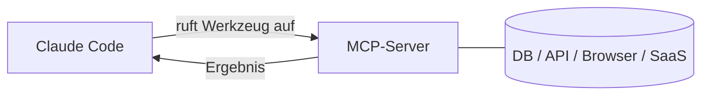

<LevelBadge level="advanced" />

<VerifyNote lastVerified="2026-06-23" source="https://code.claude.com/docs/en/mcp">
Die `claude mcp`-Befehle, die Konfigurations-Scopes und die Transports entwickeln sich weiter — überprüfe sie in der offiziellen Claude-Code-MCP-Dokumentation und auf modelcontextprotocol.io.
</VerifyNote>

Das **Model Context Protocol (MCP)** ist ein offener Standard, um KI mit externen Werkzeugen und Daten zu verbinden. Ein **MCP-Server** stellt Fähigkeiten bereit (eine Datenbank abfragen, einen GitHub-PR öffnen, einen Browser steuern); Claude Code verbindet sich mit ihm und kann **diese Werkzeuge** während einer Session **aufrufen**. So erweiterst du Claude über dein Dateisystem und deine Shell hinaus.

## Die Grobstruktur



Du deklarierst Server, die Claude nutzen darf; jeder Server veröffentlicht einen Satz von Werkzeugen mit Schemata; Claude wählt sie aus und ruft sie auf wie jedes andere Werkzeug.

## Transports

- **stdio** — ein lokaler Prozess, den Claude startet (großartig für lokale Werkzeuge/CLIs).
- **Remote (HTTP/SSE)** — ein gehosteter Server, oft mit OAuth.

## Server konfigurieren

Der schnellste Weg ist der `claude mcp add`-Befehl — er schreibt die Konfiguration für dich:

```bash
# A local stdio server (everything after -- is the launch command)
claude mcp add github -- npx -y @modelcontextprotocol/server-github

# A remote HTTP server, shared with everyone on the project
claude mcp add --transport http --scope project linear https://mcp.linear.app/mcp
```

Unter der Haube ist das nur JSON. Ein auf **project** begrenzter Server landet in einer `.mcp.json` im Wurzelverzeichnis des Repos — checke sie ein, und dein ganzes Team bekommt dieselben Werkzeuge:

```json
{
  "mcpServers": {
    "github": { "command": "npx", "args": ["-y", "@modelcontextprotocol/server-github"] }
  }
}
```

**Der Scope entscheidet, wer den Server sieht:**

| Scope | Liegt in | Verwende ihn für |
|---|---|---|
| `local` (Standard) | deinen Benutzereinstellungen, nur dieses Projekt | persönliche Experimente, Geheimnisse |
| `project` | `.mcp.json` im Repo (eingecheckt) | Werkzeuge, die das ganze Team teilen soll |
| `user` | deinen Benutzereinstellungen, alle Projekte | Server, die du überall haben möchtest |

Führe `claude mcp list` aus, um zu sehen, was verbunden ist, und `/mcp` innerhalb einer Session, um Werkzeuge zu inspizieren und dich bei Remote-Servern zu authentifizieren. Siehe [MCP-Konfiguration & Server-Gerüste](/docs/templates/mcp-config) für sofort kopierbare Starter.

## Praxisbeispiel: gib Claude deine Datenbank

Angenommen, du möchtest, dass Claude Fragen gegen ein lokales Postgres beantwortet, statt dass du Abfrageergebnisse einfügst. Füge den Server hinzu (project-Scope, damit Teamkollegen ihn erben):

```bash
claude mcp add --scope project db -- npx -y @modelcontextprotocol/server-postgres "postgresql://localhost/app"
```

Jetzt kannst du in einer Session fragen: *"Wie viele Benutzer haben sich letzte Woche registriert? Prüfe die DB."* Claude ruft das `query`-Werkzeug des Servers auf, bekommt Zeilen zurück und antwortet — keine Kopier-Einfüge-Schleife. Da es auf project begrenzt ist, bekommt ein Teamkollege, der das Repo pullt, dieselbe Fähigkeit, sobald er Claude Code öffnet. Halte die Verbindungszeichenfolge schreibgeschützt, wenn du nur Lesezugriff möchtest.

## Vertrauen & Sicherheit

:::warning Behandle MCP-Server wie das Installieren von Software
Ein MCP-Server führt Code aus und kann Daten lesen und Aktionen ausführen. Verbinde nur Server, denen du vertraust, gib ihnen die **geringsten** benötigten **Rechte** und denke daran, dass jeder externe Inhalt, den sie zurückgeben, [Prompt-Injection](/docs/security/prompt-injection) tragen kann. Prüfe Server von Dritten zuerst — siehe [Code von Dritten prüfen](/docs/security/reviewing-third-party-code).
:::

## MCP auch in den Apps

MCP treibt auch **Connectors** in den Claude-Apps an — derselbe Standard, andere Oberfläche. Siehe [Connectors (MCP) in den Apps](/docs/claude-app/connectors) und, für die API, [MCP & Verbindung zu Werkzeugen](/docs/api/mcp).

## Häufige Fehler

- **Falscher Scope.** Ein im `local`-Scope hinzugefügter Server erscheint nicht für Teamkollegen; einer, den du nur für dich wolltest, sollte nicht im `project`-Scope eingecheckt werden. Wähle bewusst.
- **Zu viele Server, zu viele Werkzeuge.** Jeder verbundene Server fügt seine Werkzeug-Schemata zum Kontext hinzu. Verbinde, was die Aufgabe braucht, nicht deinen ganzen Katalog.
- **Überprivilegierte Verbindungen.** Gib einem Datenbankserver eine schreibgeschützte Rolle, es sei denn, Claude muss wirklich schreiben. MCP macht Fähigkeiten real — grenze sie ein.
- **Das Injection-Risiko vergessen.** Alles, was ein Server zurückgibt (eine Webseite, ein Issue-Text, eine Zeile), ist nicht vertrauenswürdiger Text, der [Prompt-Injection](/docs/security/prompt-injection) tragen kann. Verdrahte keinen mächtigen, schreibfähigen Server neben einem nicht vertrauenswürdigen, lesefähigen, ohne es zu durchdenken.

## Weiter

- [Baue & verdrahte deinen ersten MCP-Server (Walkthrough)](/docs/walkthroughs/first-mcp-server)
- [MCP-Konfiguration & Server-Gerüste](/docs/templates/mcp-config)
- [Agenten & Werkzeuge absichern](/docs/security/securing-agents)
