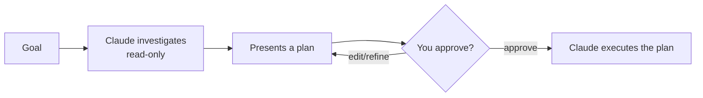

<LevelBadge level="beginner" />

<VerifyNote lastVerified="2026-06-20" source="https://code.claude.com/docs/en">
Wie du den Plan-Modus betrittst (Shortcut/Flag), kann sich zwischen Releases ändern — prüfe die offizielle Claude-Code-Dokumentation.
</VerifyNote>

Der **Plan-Modus** macht Claude Code **schreibgeschützt**: Es kann deine Codebasis erkunden, Suchen ausführen und schlussfolgern — aber es wird **keine Dateien bearbeiten und keine zustandsverändernden Befehle ausführen**. Stattdessen erstellt es einen Plan und wartet auf deine Freigabe.

## Warum es der sicherste Einstieg ist

Bei allem Großen, Riskanten oder Unbekannten willst du sehen, *was* Claude vorhat, bevor es dein Repo anfasst. Der Plan-Modus trennt **Denken** vom **Handeln**:

Du erwischst falsche Annahmen, *bevor* sie zu falschem Code werden.

## Wann du ihn verwendest

- **Immer** bei großen oder dateiübergreifenden Änderungen, Migrationen oder Refactorings.
- Wenn du in einer Codebasis arbeitest, die du noch nicht vollständig kennst.
- Wenn du einen prüfbaren Plan willst, den du mit einem Teammitglied teilst.

Bei winzigen, offensichtlichen Änderungen kannst du ihn überspringen — aber im Zweifel plane zuerst.

## Wie es in der Praxis funktioniert

1. Betritt den Plan-Modus und nenne dein Ziel.
2. Claude liest relevante Dateien und stellt Verständnisfragen.
3. Es liefert einen Schritt-für-Schritt-Plan: zu ändernde Dateien, den Ansatz und wie zu verifizieren ist.
4. Du gibst frei (oder verfeinerst). Erst dann wechselt es dazu, Änderungen vorzunehmen.

:::tip Kombiniere es mit CLAUDE.md
Eine gute [CLAUDE.md](/docs/claude-code/claude-md) macht Pläne schärfer — Claude plant bereits mit deinen Konventionen und Leitplanken im Kopf.
:::

## Plan-Modus vs. Berechtigungen

Sie lösen verschiedene Probleme und arbeiten zusammen:

- **Plan-Modus** = "untersuchen und vorschlagen, noch nicht handeln." (Diese Seite.)
- **[Berechtigungen](/docs/claude-code/permissions)** = sobald gehandelt wird, *welche* Aktionen ohne Nachfrage erlaubt sind.

## Weiter

- [Berechtigungen & Berechtigungsmodi](/docs/claude-code/permissions)
- [Kontextverwaltung](/docs/claude-code/context-management) — lange Sessions effektiv halten
- [Walkthrough: Claude Code für ein echtes Repo anpassen](/docs/walkthroughs/customize-claude-code)
