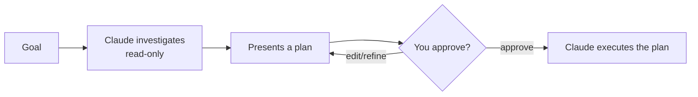

<LevelBadge level="beginner" />

<Callout type="objectives" items={["Erklären, was der Plan-Modus tut und warum er schreibgeschützt ist", "Entscheiden, wann du zuerst planst und wann du es überspringen kannst", "Die Schleife aus Untersuchen, Vorschlagen, Genehmigen und Ausführen durchgehen", "Plan-Modus und Berechtigungen auseinanderhalten und gemeinsam nutzen"]} />

<VerifyNote lastVerified="2026-06-20" source="https://code.claude.com/docs/en">
Wie du in den Plan-Modus wechselst (Shortcut/Flag), kann sich zwischen Releases ändern — prüfe die offizielle Claude Code-Dokumentation.
</VerifyNote>

## Die große Idee

Stell dir vor, du gibst einem Handwerker deine Hausschlüssel — gegenüber dem, ihn erst durchgehen und aufschreiben zu lassen, *was* er ändern würde. Der Plan-Modus ist der Rundgang.

Der **Plan-Modus** macht Claude Code **schreibgeschützt**: Es kann deine Codebasis erkunden, Suchen ausführen und überlegen — aber es wird **keine Dateien bearbeiten oder zustandsverändernde Befehle ausführen**. Stattdessen erstellt es einen Plan und wartet auf deine Genehmigung.

<Callout type="tip" items={["Schreibgeschützt heißt, Claude DENKT, aber HANDELT nicht — keine Dateibearbeitungen, keine zustandsverändernden Befehle, bis du grünes Licht gibst."]} />

## Warum es der sicherste Weg zum Start ist

Für alles Große, Riskante oder Unbekannte willst du sehen, *was* Claude vorhat, bevor es dein Repo anfasst. Der Plan-Modus trennt **Denken** vom **Tun**:

Der Gewinn: Du fängst falsche Annahmen ab, *bevor* sie zu falschem Code werden.

## Wann du ihn nutzt

<Callout type="tip" items={["IMMER für große oder mehrdateiige Änderungen, Migrationen oder Refactorings", "Wenn du in einer Codebasis arbeitest, die du noch nicht vollständig kennst", "Wenn du einen prüfbaren Plan willst, um ihn mit einem Teammitglied zu teilen"]} />

Für winzige, offensichtliche Änderungen kannst du ihn überspringen — aber im Zweifel plane zuerst.

## Wie es in der Praxis funktioniert

Folge der Schleife. Jeder Schritt verdient den nächsten — Claude wechselt erst zum Bearbeiten, *nachdem* du genehmigst.

<Steps items={[{title: "In den Plan-Modus wechseln und dein Ziel nennen", body: "Wechsle in den schreibgeschützten Modus, dann beschreibe, was du erreichen willst."}, {title: "Claude untersucht", body: "Es liest die relevanten Dateien und stellt klärende Fragen."}, {title: "Claude liefert einen Schritt-für-Schritt-Plan", body: "Zu ändernde Dateien, den Ansatz und wie das Ergebnis zu prüfen ist."}, {title: "Du genehmigst oder verfeinerst", body: "Erst nach der Genehmigung wechselt Claude zum Vornehmen von Änderungen."}]} />

### Probier es selbst

Kopier dies in eine echte Planungssitzung und sieh die Schleife ablaufen:

<PromptCard title="Eine Planungssitzung anstoßen">{`I want to migrate our auth from sessions to JWT. Stay in Plan Mode: investigate the current setup, ask anything you need, then propose a step-by-step plan with files to change and how to verify — don't edit anything yet.`}</PromptCard>

:::tip Kombiniere ihn mit CLAUDE.md
Eine gute [CLAUDE.md](/docs/claude-code/claude-md) macht Pläne schärfer — Claude plant mit deinen Konventionen und Leitplanken bereits im Sinn.
:::

## Plan-Modus vs. Berechtigungen

Eine klassische Verwechslung. Sie lösen unterschiedliche Probleme und arbeiten zusammen:

- **Plan-Modus** = „untersuchen und vorschlagen, noch nicht handeln." (Diese Seite.)
- **[Berechtigungen](/docs/claude-code/permissions)** = sobald gehandelt wird, *welche* Aktionen ohne Nachfrage erlaubt sind.

Denk daran als **ob jetzt gehandelt wird** (Plan-Modus) gegenüber **welche Aktionen erlaubt sind, sobald gehandelt wird** (Berechtigungen).

<Flashcards cards={[{front: "In welchen Zustand versetzt der Plan-Modus Claude Code?", back: "Schreibgeschützt — es kann erkunden, suchen und überlegen, aber wird keine Dateien bearbeiten oder zustandsverändernde Befehle ausführen, bis du genehmigst."}, {front: "Was ist die Plan-Modus-Schleife?", back: "Untersuchen (schreibgeschützt) → einen Plan präsentieren → du genehmigst oder verfeinerst → Claude führt aus."}, {front: "Wann solltest du zum Plan-Modus greifen?", back: "Standardmäßig für große, riskante oder unbekannte Arbeit (mehrdateiige Änderungen, Migrationen, Refactorings, unbekannte Codebasen). Überspring nur winzige, offensichtliche Änderungen."}, {front: "Plan-Modus vs. Berechtigungen?", back: "Der Plan-Modus regelt, OB jetzt gehandelt wird; Berechtigungen regeln, WELCHE Aktionen erlaubt sind, sobald gehandelt wird."}]} />

<Callout type="takeaways" items={["Der Plan-Modus ist schreibgeschützt: Claude erkundet und schlägt vor, bearbeitet aber nie und führt nie zustandsverändernde Befehle aus, bis du genehmigst", "Nutze ihn standardmäßig für große, riskante oder unbekannte Arbeit; überspring nur winzige offensichtliche Änderungen", "Die Schleife ist untersuchen, vorschlagen, genehmigen/verfeinern, ausführen", "Der Plan-Modus regelt, OB jetzt gehandelt wird; Berechtigungen regeln, WELCHE Aktionen erlaubt sind, sobald gehandelt wird"]} />

<Quiz title="Teste dich selbst" questions={[{q: "Was kann Claude Code im Plan-Modus tun?", options: ["Dateien bearbeiten und jeden Befehl ausführen", "Erkunden, suchen und überlegen — aber keine Dateien bearbeiten oder zustandsverändernde Befehle ausführen", "Nur Fragen beantworten, ganz ohne Dateizugriff"], answer: 1, explain: "Der Plan-Modus ist schreibgeschützt: Claude kann die Codebasis erkunden, Suchen ausführen und überlegen, aber es wird keine Dateien bearbeiten oder zustandsverändernde Befehle ausführen."}, {q: "Wann solltest du zum Plan-Modus greifen?", options: ["Nur für einzeilige Tippfehler-Korrekturen", "Für große oder mehrdateiige Änderungen, Migrationen, Refactorings oder unbekannte Codebasen", "Niemals — er bremst dich nur aus"], answer: 1, explain: "Nutze ihn immer für große oder mehrdateiige Änderungen, Migrationen oder Refactorings und wenn du in einer Codebasis arbeitest, die du noch nicht vollständig kennst. Winzige offensichtliche Änderungen können ihn überspringen."}, {q: "Was ist die korrekte Reihenfolge der Plan-Modus-Schleife?", options: ["Ausführen, dann untersuchen, dann genehmigen", "Untersuchen (schreibgeschützt), einen Plan präsentieren, du genehmigst oder verfeinerst, dann führt Claude aus", "Zuerst genehmigen, dann untersucht und bearbeitet Claude"], answer: 1, explain: "Claude untersucht schreibgeschützt, präsentiert einen Plan, du genehmigst oder verfeinerst, und erst dann wechselt es zur Ausführung des Plans."}, {q: "Wie unterscheiden sich Plan-Modus und Berechtigungen?", options: ["Sie sind zwei Namen für dasselbe Feature", "Plan-Modus = untersuchen und vorschlagen, noch nicht handeln; Berechtigungen = sobald gehandelt wird, welche Aktionen ohne Nachfrage erlaubt sind", "Berechtigungen entscheiden, ob geplant wird; der Plan-Modus entscheidet, welche Dateien bearbeitet werden"], answer: 1, explain: "Der Plan-Modus trennt Denken vom Tun. Berechtigungen steuern, welche Aktionen ohne Nachfrage erlaubt sind, sobald Claude handelt. Sie arbeiten zusammen."}]} />

## Weiter

- [Berechtigungen & Berechtigungsmodi](/docs/claude-code/permissions)
- [Kontextverwaltung](/docs/claude-code/context-management) — lange Sitzungen effektiv halten
- [Walkthrough: Claude Code für ein echtes Repo anpassen](/docs/walkthroughs/customize-claude-code)
