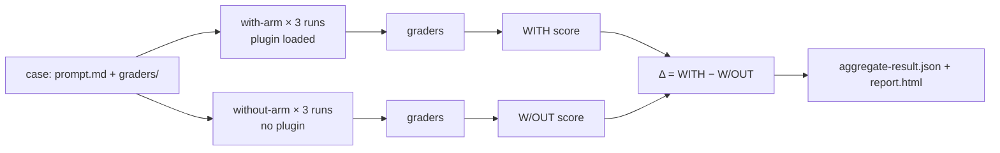

<LevelBadge level="advanced" />

<VerifyNote lastVerified="2026-09-14" source="https://code.claude.com/docs/en/plugin-evals">
`claude plugin eval` erschien mit Claude Code **v2.1.269 (11. September 2026)** und ist als junges Feature dokumentiert: das Case-Schema ist `1.1`, das JSON-Ergebnis ist `schemaVersion: 1`, und Anthropic kann den Befehl serverseitig abschalten („plugin eval is currently unavailable"). Die Defaults, Flags und Grader-Semantik unten stammen von der offiziellen Seite zum angegebenen Datum; prüfe sie erneut, bevor du ein hartes CI-Gate darauf aufbaust.
</VerifyNote>

<Callout type="objectives" items={[
  "Verstehen, was ein Plugin-Eval misst, das `claude plugin validate` und ein manueller Test nicht messen können: *feuert* der Skill, und schlägt er ein Modell ohne Plugin",
  "Die drei Zahlen in jedem Ergebnis lesen — WITH, W/OUT und Δ — und wissen, warum manche Grader bewusst aus dem Score ausgeschlossen werden",
  "Unter den sechs Grader-Typen (vier kostenlos, zwei Judge-basiert) wählen und Rubriken schreiben, die ein stabiles Signal liefern",
  "Die MCP-Server eines Plugins mocken, damit eine Suite reproduzierbar ist und nie den echten Dienst berührt",
  "Ein CI-Gate mit gepinnten Modellen, einer Kostenobergrenze und dem Exit-Code-Vertrag verdrahten"
]} />

Bisher hatte ein Plugin-Autor zwei Werkzeuge: `claude plugin validate`, das prüft, ob Manifeste und Frontmatter parsen, und die eigenen Augen. Keines davon beantwortet die Frage, die entscheidet, ob ein Plugin die Installation wert ist: **Wenn ein Nutzer eine natürliche Anfrage eintippt, wählt Claude den Skill, und ist das Ergebnis besser als das, was Claude ohnehin getan hätte?** `claude plugin eval` beantwortet genau das. Es führt jeden Case in einer Wegwerf-Session aus, in der nur dein Plugin geladen ist, führt ihn noch einmal ganz ohne Plugin aus, bewertet beides und meldet die Differenz.

Diese Seite richtet sich an Leute, die bereits ein funktionierendes [Plugin](/docs/claude-code/plugins-marketplaces) oder einen [Skill](/docs/claude-code/skills) haben. Wenn du nur das Konzept kennen musst, lies die ersten beiden Abschnitte und das Quiz.

## Das mentale Modell: zwei Arme und ein Delta

Jeder Case ist ein **Prompt** plus ein oder mehrere **Grader**. Ein Grader ist eine Bestanden/Nicht-bestanden-Prüfung dessen, was Claude produziert hat. Für jeden Case führt Claude Code aus:

- den **With-Arm**: eine frische Headless-Session, in der nur dein Plugin geladen ist, der Prompt gesendet wird, Claude arbeiten darf, bis es fertig ist oder das Turn-/Zeitlimit erreicht, und dann die Grader angewendet werden;
- den **Without-Arm**: derselbe Prompt, dieselbe Anzahl Läufe, kein Plugin.

Jeder Arm führt den Case **standardmäßig dreimal** aus, denn ein einzelner Lauf eines nicht-deterministischen Agenten sagt dir fast nichts. Der Score eines Laufs ist der Anteil der bestandenen Grader (gewichtet, falls du Gewichte setzt). Der Score des Cases ist der Mittelwert über die Läufe. Du bekommst:

| Spalte | Bedeutung |
|---|---|
| `WITH` | Mittlerer Score mit geladenem Plugin |
| `W/OUT` | Mittlerer Score ohne Plugin |
| `Δ` | `WITH − W/OUT` — was das Plugin tatsächlich beigetragen hat |

Der nicht offensichtliche Teil: **Ein hoher `WITH`-Score allein beweist nichts.** Wenn ein Case in beiden Armen 1.0 erreicht, hat Claude ihn ohne dich gelöst, und dein Plugin ist für diesen Prompt Ballast. Das Δ ist die Zahl, die die Existenz eines Plugins rechtfertigt. Anthropics eigene Docs nennen den häufigsten ersten Befund: ein Δ nahe null *bei* einem fehlschlagenden Skill-fired-Grader, was bedeutet, dass Claude deinen Skill bei natürlicher Formulierung nie gewählt hat. Das ist ein `description`-Problem in `SKILL.md`, kein Code-Problem, und keine Menge manueller Tests, bei denen du den Skill beim Namen aufrufst, hätte es entdeckt.



### Warum manche Grader aus dem Score ausgeschlossen werden

Eine Prüfung wie „das `Skill`-Tool wurde aufgerufen" kann im Without-Arm nie bestehen. Würde sie zählen, zöge sie `W/OUT` Richtung null und bliese Δ gratis auf. Deshalb **schließt Claude Code in einem Zwei-Arm-Lauf aus dem Score aus, in beiden Armen**, jeden `tool_used`-Grader, dessen `tool` `Skill` ist, plus alles, was du mit `arm: with-only` markierst. Sie erscheinen weiterhin im Report als Bestanden/Nicht-bestanden-Indikatoren (der Report kennzeichnet sie als „plugin-fired indicator"), und das JSON markiert sie mit `scored: false`. Daraus folgen zwei Randregeln:

- Wenn *jeder* Grader eines Cases ausgeschlossen würde, werden sie stattdessen normal bewertet, sonst bliebe nichts zu bewerten übrig.
- `arm: both` zwingt einen Grader, in beiden Armen zu zählen. Das willst du für eine „darf den Skill **nicht** aufrufen"-Prüfung auf einem Köder-Prompt, geschrieben als `tool_used` mit `min: 0` und `max: 0`.

Eine Konsequenz, die man sich merken sollte: Dieselbe Suite kann unter `--ablation none` (ein Arm, nichts ausgeschlossen) einen **anderen absoluten Score** melden als im standardmäßigen Zwei-Arm-Modus. Vergleiche Gleiches mit Gleichem, wenn du Trends aufzeichnest.

## Anatomie eines Cases

Eine Suite liegt in `evals/` innerhalb des Plugins (oder einem anderen Verzeichnis, das du benennst). Jeder Case ist ein Ordner mit einer `prompt.md`, einer `case.yaml` oder beidem, plus einem Ordner `graders/` mit einer Markdown-Datei pro Grader.

```text
my-plugin/
├── .claude-plugin/plugin.json
├── skills/...
└── evals/
    ├── drafts-commit-message/
    │   ├── prompt.md            # frontmatter: run limits; body: the user's request
    │   └── graders/
    │       ├── criteria.md      # type: llm — rubric in the body
    │       └── skill-fired.md   # type: tool_used, tool: Skill
    ├── ignores-unrelated-request/
    │   └── ...
    ├── mocks/                   # optional suite-wide MCP mocks
    └── results/                 # written by each run — add to .gitignore
```

Der Prompt-Body wird **genau wie geschrieben** an Claude gesendet. Zwei Dinge erwischen Erstautoren:

- Jeder Lauf startet in einem **leeren Arbeitsverzeichnis** mit einem Wegwerf-Home, ohne Nutzereinstellungen, ohne `CLAUDE.md`, ohne persönliche MCP-Server, ohne andere Plugins und nur mit einer Allowlist von Umgebungsvariablen (Grundlegendes wie `PATH`, Provider-Auth, die meisten `ANTHROPIC_*`/`CLAUDE_CODE_*` und alles, was `EVAL_*` heißt). Wenn die Aufgabe Dateien braucht, lege sie in den Prompt, scaffolde sie oder liefere sie im Plugin mit.
- `@path`-Erwähnungen im Prompt werden **nicht** zu Anhängen expandiert. Gewähre `Read` in `allowed_tools`, wenn Claude eine Datei öffnen muss.

Die wichtigsten Frontmatter-Felder von `prompt.md`:

| Feld | Default | Hinweis |
|---|---|---|
| `runs` | 3 | 1 bis 50 pro Arm; `--runs` überschreibt |
| `max_turns` | 10 | Bis zu 200. Das Erreichen wird als Laufefehler protokolliert und senkt meist den Score, also sei großzügig |
| `timeout_seconds` | 300 | Bis zu 3600 pro Lauf |
| `allowed_tools` | `[]` | Read-only-Tools werden allein durch Auflisten gewährt; alles andere braucht eine CLI-Freigabe |
| `model` | Session-Default | `--model` überschreibt; in CI pinnen |
| `env` | `{}` | Keys müssen auf `EVAL_[A-Z0-9_]*` passen, sonst schlägt der Lauf fehl |
| `plugins` | nächstes umschließendes Plugin | Setze `["../.."]`, wenn die Auto-Erkennung dein Plugin verfehlt |

`case.yaml` trägt dieselben Felder (Ausführungsfelder unter `execution:`) plus die drei, die auf andere Dateien verweisen: `context.scaffold_script` (ein Bash-Skript, das den Workspace vorbereitet, nur mit `--scaffold` ausgeführt), `context.history_file` (ein `.jsonl`-Transkript zum Fortsetzen, sodass dein Prompt der nächste Turn wird) und `context.add_dirs` (Fixture-Verzeichnisse, die Claude lesen darf).

## Die sechs Grader-Typen

Vier werden aus Transkript und Dateien berechnet und kosten nichts. Zwei rufen ein Judge-Modell auf und erhöhen die Rechnung.

| Typ | Kostenlos? | Besteht, wenn |
|---|---|---|
| `regex` | ja | Ein JavaScript-Regex im Ziel gefunden wird (standardmäßig `last_message`, oder `trace`, `files`, eine bestimmte Datei oder `mock_calls`). `match: not_contains` für Abwesenheit, `match: "count:N"` für eine exakte Anzahl. Groß-/Kleinschreibung-Unabhängigkeit gehört in `flags: i`; inline `(?i)` wird nicht unterstützt |
| `tool_used` | ja | Die Anzahl der Aufrufe von `tool`, deren JSON-kodierter Input auf `input_match` passt, zwischen `min` (Default 1) und `max` (unbegrenzt) liegt. `min: 0, max: 0` behauptet, dass ein Tool nie aufgerufen wurde |
| `tool_order` | ja | Beide Tools aufgerufen wurden und der erste `before`-Treffer dem ersten `after`-Treffer vorausgeht |
| `file_exists` | ja | Eine Datei, die **Claude erstellt hat**, auf den `path`-Glob passt (oder keine, mit `exists: false`). Dateien, die ein Scaffold erstellt oder Claude nur bearbeitet hat, zählen nicht |
| `llm` | nein | Ein Judge-Modell in mindestens **zwei von drei Stimmen** mit PASS für deine Rubrik stimmt |
| `baseline` | nein | Ein Judge feststellt, dass der Lauf die Kriterien mindestens so gut erfüllt wie ein Referenz-Transkript, das du als `baseline_file` gespeichert hast |

Es gibt **keine Custom-Code-Grader**. Wenn du prüfen musst, ob ein Build oder Test bestanden hat, lass den Prompt Claude anweisen, ihn auszuführen und das Ergebnis in eine Datei zu schreiben, bewerte diese Datei mit `regex` und stelle mit einem `tool_used`-Grader, dessen `input_match` den Befehl nennt, sicher, dass er lief.

Der Skill-fired-Grader, den fast jeder Case will, sieht so aus (ersetze den Skill-Namen; das Muster passt auch auf die Namespace-Form `plugin:skill`):

<PromptCard title="graders/skill-fired.md — ist mein Skill wirklich gelaufen?">{`---
type: tool_used
tool: Skill
input_match: '"skill"\\s*:\\s*"(?:[\\w-]+:)?your-skill-name"'
---`}</PromptCard>

Und die Judge-Rubrik daneben, geschrieben als konkrete PASS/FAIL-Bedingungen statt Adjektive:

<PromptCard title="graders/criteria.md — eine Rubrik, die ein stabiles Urteil liefert">{`---
type: llm
weight: 2
---

PASS if the reply is a single conventional-commit subject line under 72 characters,
starts with "refactor:", and mentions both the rename (getUser -> fetchUser) and the
number of call sites updated.
FAIL if the reply contains more than one candidate message, asks a clarifying
question, or omits the rename.`}</PromptCard>

### Gewohnheiten, die Scores stabil halten

Das sind die Praktiken, die die offiziellen Docs empfehlen, und sie decken sich mit dem, was jeder, der LLM-as-Judge-Pipelines betrieben hat, auf die harte Tour lernt:

- **Bewerte lange Ausgaben mit `regex` über die Datei, nicht mit einem `llm`-Judge.** Die Varianz des Judges wächst mit der Länge dessen, was er liest. Behalte `llm`-Grader für kurze Abschlussnachrichten.
- **Ein Grader auf dem Ergebnis, einer auf dem Weg.** Ein `regex`-/`llm`-/`file_exists`-Grader sagt dir, dass die Antwort richtig war; ein `tool_used`-/`tool_order`-Grader sagt dir, dass *dein Plugin* sie erzeugt hat. Du brauchst beides, um Δ zu interpretieren.
- **Verdächtige den Judge vor dem Plugin, wenn Δ negativ ist, der Skill aber gefeuert hat.** Der Standard-Judge ist ein kleines, schnelles Modell; er kann eine korrekte Antwort durchfallen lassen, weil sie anders formatiert ist als die Rubrik. Führe erneut mit `--judge-model sonnet` aus und ziehe die Rubrik so fest, dass die Formatierung nicht entscheidet.
- **Iteriere an einem Case mit einem Arm**, dann bestätige mit drei Läufen: `--case <name> --runs 1 --ablation none`. Mit einem Arm zeigt die Tabelle `SCORE` und `PASS%` statt `WITH`/`W/OUT`/`Δ`.

## Mocke die MCP-Server

Wenn die Skills deines Plugins MCP-Tools aufrufen, startet ein Lauf **nie die echten Server, es sei denn, du verlangst es**. Stattdessen registriert Claude Code unter dem Namen jedes Servers einen Stellvertreter und beantwortet Tool-Aufrufe aus Markdown-Dateien: `evals/mocks/<server>/<tool>.md` für die ganze Suite, oder der eigene `mocks/`-Ordner eines Cases, um pro Case zu überschreiben. Der Dateibody ist das Tool-Ergebnis, mit `{{input.<field>}}`-Substitutionen und `{{file:fixtures/...}}`-Einfügungen. Ein Tool ohne Mock-Datei ist für Claude schlicht nicht verfügbar.

<PromptCard title="evals/mocks/tracker/create_issue.md — ein Mock, der auch den Input prüft">{`---
expect:
  title: string
  priority: [low, medium, high]
---

Created issue #4821: {{input.title}}`}</PromptCard>

Der `expect:`-Block macht aus einem Mock eine Assertion: Ein Aufruf, der ihn verletzt, **bricht den Lauf mit Score 0 ab** und protokolliert Server, Tool und Grund. Richte einen Grader auf `target: mock_calls`, um zu bewerten, was das Plugin vom Server verlangt hat. Für Server, deren Antworten vom Gesprächsverlauf abhängen, lässt `type: agent` ein kleines Modell den Server spielen; saubere Läufe speichern dessen Antworten unter `results/<timestamp>/mock-recordings/`, und sobald du eine Aufzeichnung nach `mocks/.replay/<server>/` kopierst, spielen spätere Läufe sie ohne Modellaufruf ab. Committe `.replay/`, damit CI deterministisch ist. `_tools.json` (eine gespeicherte `tools/list`-Antwort) gibt gemockten Tools ihre echten Beschreibungen und Schemas statt eines permissiven Platzhalters.

Um stattdessen echte Server zu erreichen: `--allow-real-servers` startet die ohne Mocks; `--mocks off` ignoriert Mocks komplett. In beiden Fällen laufen diese Prozesse **als du, außerhalb der Sandbox**, und ihre Tools brauchen weiterhin eine explizite Freigabe wie `--allow-tools "mcp__plugin_my-plugin_github__*"`.

## Ausführen

<Steps items={[
  {title: "Die Suite generieren", body: "Führe im Plugin-Root `claude plugin eval init` aus. Es öffnet eine interaktive Session, in der Claude das Plugin liest, fragt, wie ein gutes Ergebnis aussieht, Prompts vorschlägt, die es auslösen sollten und die es nicht auslösen sollten, Grader entwirft, sie einmal pilotiert und pro Prompt ein Case-Verzeichnis schreibt. `claude plugin eval init --bare <name>` schreibt stattdessen eine leere Vorlage (die einzige Form, die ohne Terminal funktioniert, z. B. in CI)."},
  {title: "Die ganze Suite ausführen", body: "`claude plugin eval .` führt jeden Case aus, beide Arme, je drei Läufe. Der erste Lauf fragt `Trust this plugin directory?`; innerhalb eines Git-Repos vertraut ein Ja dem gesamten Repository, auch für interaktive Sessions. Pro Lauf wird eine Fortschrittszeile mit dem Urteil jedes Graders ausgegeben; eine Zusammenfassungstabelle und ein `Report:`-Pfad folgen."},
  {title: "Nur gewähren, was Cases brauchen", body: "Läufe halten nie an, um nach Berechtigungen zu fragen. Eingebaute Tools, die eine Freigabe brauchen, die du nicht gegeben hast (`Bash`, `Write`, `Edit`, `WebFetch`, `WebSearch`), werden komplett aus der Session entfernt. Gewähre sie für den gesamten Lauf: `--allow-tools Write Edit \"Bash(npm test *)\"`. Jede Bash-Freigabe läuft unter der OS-Level-Sandbox von Claude Code; auf einer Maschine ohne Sandbox-Backend (natives Windows) wird der Lauf verweigert, statt ungeschützt zu laufen."},
  {title: "Den Report lesen", body: "`report.html` ist eine einzelne, in sich geschlossene Datei ohne externe Anfragen. Oben: eine Urteilszeile (Plugin-Effekt in Punkten gegenüber der Baseline, Cases verbessert/unverändert/verschlechtert) und fünf Kacheln (Suite-Score, Ablations-Δ, Baseline-Score, bestandene Cases, perfekte Läufe). Jede Case-Karte zeigt Δ und einen Score-Balken mit einer Markierung am Schwellenwert; ein negatives Δ bekommt einen roten linken Rand. Fehlgeschlagene Grader kommen vorab ausgeklappt mit den Stimmen des Judges und dem Auszug, den er gesehen hat."},
  {title: "Entscheiden, wohin der Report geht", body: "Mit einem claude.ai-Abonnement angemeldet und aktivierten Artifacts wird der Report zusätzlich als privates Artifact veröffentlicht und eine `Published:`-URL ausgegeben; `--no-publish` behält ihn lokal. API-Key-Auth veröffentlicht nie. Ein Lauf, der aus einer Claude-Code-Session heraus gestartet wird, bleibt lokal, es sei denn, du fügst `--publish-report` hinzu."}
]} />

Der Befehl für die ganze Suite mit den Flags, nach denen du tatsächlich greifen wirst:

<PromptCard title="Die Suite mit einem stärkeren Judge und einer Kostenobergrenze ausführen">{`claude plugin eval . \\
  --judge-model sonnet \\
  --max-cost-usd 10 \\
  --allow-tools Read Write "Bash(npm test *)" \\
  -j 4`}</PromptCard>

Anmerkungen zu den Flags: `-j`/`--concurrency` geht von 1 bis 8 und verkürzt nur die Wanduhrzeit, weil alle Läufe das Rate-Limit deines Accounts teilen. `--max-cost-usd` ist eine Obergrenze für die **Listenpreis-Schätzung**, geprüft bevor jeder Lauf startet; bereits laufende Läufe werden beendet, sodass die Ausgaben um diese Läufe überschießen können, und alles, was nicht gestartet wurde, lässt den Befehl mit Exit 2 und `partial: true` enden. Setze das Ziel (`.`) **vor** `--tag`, `--allow-tools` und `--json`: jedes davon nimmt eine Liste oder einen optionalen Wert und würde ein nachfolgendes Ziel verschlucken (der Fehler „`--json` output path must end in `.json`" ist genau dieser Fehler).

## Was es kostet

Jeder Lauf und jede Judge-Stimme ist ein echter Modellaufruf auf deinem Account, angerechnet auf die Nutzung deines Plans oder deine API-Rechnung. Die grobe Arithmetik: `cases × runs` Agenten-Läufe für den With-Arm, dasselbe noch einmal für den Without-Arm, plus **drei kurze Judge-Aufrufe pro `llm`- oder `baseline`-Grader pro Lauf**. Der einzelne Case des offiziellen Walkthroughs mit zwei Gradern (ein `llm`, ein `tool_used`) lief sechs Agenten-Läufe in 74 Sekunden bei einer Listenpreis-Schätzung von etwa 0,41 $. Drei Hebel halten eine Suite bezahlbar:

- `--ablation none` halbiert die Agenten-Läufe, wenn du an Gradern iterierst und Δ nicht brauchst.
- Nur kostenlose Grader (`regex`, `tool_used`, `tool_order`, `file_exists`) für die Suite bei jedem Commit; Judge-Grader für die nächtliche.
- Ein Nutzungs- oder Rate-Limit-Fehler mitten in der Suite lässt jeden späteren Lauf **mit diesem Fehler enden und meist mit Score 0, und die Suite wird nicht als `partial` markiert**, sodass ein gedrosselter Lauf genau wie eine Regression aussehen kann. Prüfe die `NOTES`-Spalte oder `cases[].arms.with[].error`, bevor du einem plötzlichen Einbruch glaubst.

## Mach es zum CI-Gate

<PromptCard title="CI-Job — gepinnte Modelle, lokaler Report, Exit-Code steuert den Build">{`claude plugin eval . \\
  --trust-plugin \\
  --json results.json \\
  --threshold 0.8 \\
  --model claude-sonnet-5 \\
  --judge-model claude-haiku-4-5 \\
  --no-publish \\
  --max-cost-usd 20`}</PromptCard>

Warum jedes Flag da ist:

- `--trust-plugin` bestätigt die Trust-Entscheidung des ersten Laufs. Ohne es wird ein nicht-interaktiver Job mit Exit 1 verweigert (oder hängt am Prompt, wenn der Runner ein TTY zuweist). Übergib es nur für Plugins, deren Code und Suite du auf deiner eigenen Maschine ausführen würdest.
- `--model` und `--judge-model` sind **gepinnt**, damit ein Modell-Rollout nie mit einer Plugin-Regression verwechselt wird. Das ist wichtiger, als es klingt: Der getestete Agent nutzt standardmäßig `ANTHROPIC_MODEL` oder den aktuellen Default von Claude Code, der sich mit Releases ändert.
- `--threshold 0.8`, weil der Default **1.0** ist, was den Befehl mit Exit 1 enden lässt, sobald irgendein Case weniger als perfekt ist. Eine 1.0-Latte auf einem Drei-Lauf-Mittelwert eines nicht-deterministischen Agenten ist ein flackerndes Gate.
- `--json results.json` schreibt das versionierte Ergebnisdokument (`schemaVersion: 1`, camelCase, neue Felder ohne Umbenennungen hinzugefügt) und unterdrückt die Fortschrittsausgabe.

Der Exit-Code-Vertrag:

| Exit | Bedeutung |
|---|---|
| 0 | Jeder Case auf oder über dem Schwellenwert und jede Case-Datei geladen |
| 1 | Ein Case unter dem Schwellenwert, eine Case-Datei konnte nicht geladen werden, keine Cases gefunden, ein Lauf konnte nicht starten, nicht vertrauenswürdiges Verzeichnis ohne `--trust-plugin` oder eine ungültige Option |
| 2 | Teillauf: Kostenobergrenze erreicht oder Credential beim oder vor dem ersten Lauf abgelehnt. `results.json` wird trotzdem mit `partial: true` geschrieben |
| 130 / 143 | Unterbrochen / beendet (z. B. CI-Timeout). Teilergebnisse werden geschrieben |

Probleme beim Schreiben oder Veröffentlichen des Reports ändern den Exit-Code **nie**. Beim Aufzeichnen von Trends lass Dokumente mit `partial: true` und Läufe mit `skippedPaidGraders` weg, da ihre Scores nicht vergleichbar sind.

Felder, die ein Gating-Skript aus dem JSON liest: `aggregates.overallScore`, `aggregates.casesPassed` / `casesTotal`, `aggregates.meanDelta` und pro Case `cases[].aggregates.score` und `.delta` (weggelassen, wenn die Arme nicht vergleichbar sind). Ein Lauf mit einem nicht-null `cases[].arms.with[].error` (z. B. `timed out after 300s`) wird trotzdem nach dem bewertet, was er produziert hat, ein Fehler impliziert also nicht Score 0; ein `aborted`-Lauf (das `expect:` eines Mocks hat gefeuert) erhält Score 0, wobei `error` `null` bleibt.

## Was ein Lauf erreichen kann und was nicht

Lies das, bevor du ein Plugin evaluierst, das du nicht geschrieben hast. `claude plugin eval` auf ein Verzeichnis zu richten ist dieselbe Trust-Entscheidung wie `claude --plugin-dir`: Die Skills **und Hooks** des Plugins werden auf deiner Maschine als du geladen und ausgeführt. Die Isolation begrenzt, was der *getestete Agent* tun kann; sie ist keine Grenze gegenüber dem eigenen Code des Plugins, und eine bestandene Suite sagt nichts darüber aus, ob das Plugin sicher ist.

- **Isolierter Agent.** Jeder Lauf bekommt ein Wegwerf-Home, -Arbeitsverzeichnis und eine Wegwerf-Claude-Code-Konfiguration, läuft als `claude -p`-Kindprozess, kann das Eval-Verzeichnis nicht lesen (sieht also nie die Prompts oder Grader des Cases oder seiner Geschwister) und hat das Artifact-Tool abgeschaltet.
- **Verwaltete Einstellungen gelten weiterhin.** Einschränkungen, die ein Administrator auf die Maschine ausgerollt hat, gelten innerhalb eines Laufs, sodass Ergebnisse auf einem verwalteten Laptop von einem nicht verwalteten CI-Runner abweichen können.
- **Opt-in-Notausgänge.** Das `scaffold_script` eines Cases läuft als du, außerhalb der Sandbox, und nur mit `--scaffold`. Echte MCP-Server nur mit `--allow-real-servers` oder `--mocks off`. Die `allowed_tools` eines Cases oder das eigene `allowed-tools`-Frontmatter eines Skills können diese Grenzen nie erweitern.
- **Netzwerk.** Shell-Befehle, die du gewährst, folgen den Netzwerkregeln der Sandbox; eine `WebFetch(domain:…)`-Freigabe erreicht diese Domain direkt; die Hooks des Plugins und jeder echte MCP-Server, den du startest, können jeden Host erreichen.

Für ein Drittanbieter-Plugin, das Hooks mitliefert oder seine echten Server braucht, behandle die Scores als unverbindlich, es sei denn, du hast die Suite in einem Container oder auf einem CI-Runner ausgeführt. Siehe [Drittanbieter-Code prüfen](/docs/security/reviewing-third-party-code) für die umfassendere Checkliste.

## Kurzreferenz: die Fallstricke

- Das Standard-`target` für `regex` ist `last_message`. Wenn du `trace` anvisierst, ist es JSON pro Zeile, Anführungszeichen erscheinen also als `\"` und Zeilenumbrüche sind escaped.
- `files` ist eine **Liste von Pfaden**, die Claude erstellt hat, nicht deren Inhalt. Um Inhalte zu bewerten, nutze `{ source: file, path: <path> }` als `target`/`focus`. Ein `llm`-Judge sieht PNG/JPEG/GIF/WebP als Bilder und verweigert andere Binärdateien (`.pptx`, PDF).
- Ein `llm`-Judge, der `trace` liest, sieht nur die **ersten 12 und letzten 12 Nachrichten**.
- `file_exists` sieht nur Dateien, die während des Laufs erstellt wurden. Eine gescaffoldete oder nur bearbeitete Datei ist dafür unsichtbar; bewerte ihren Inhalt oder nutze `tool_used` auf `Edit`.
- Unbekannte Keys im `prompt.md`-Frontmatter sind ein Fehler, und `env`-Keys müssen `EVAL_*` sein.
- Ein installiertes Plugin per Name zu evaluieren (`name@marketplace`) schreibt Ergebnisse unter `./evals/results/` in deinem aktuellen Verzeichnis und überspringt den Trust-Prompt.
- Das Plugin-Eval-Case-Format ist **getrennt** von der `evals/evals.json`-Datei, die das skill-creator-Plugin für Skill-Evals nutzt.

<Flashcards cards={[
  {front: "With-Arm / Without-Arm", back: "Die zwei Lauf-Sets eines Cases: nur mit deinem Plugin geladen und ganz ohne Plugin. Δ ist With-Arm-Score minus Without-Arm-Score."},
  {front: "Warum wird `tool_used: Skill` nicht bewertet?", back: "Es kann ohne das Plugin nie bestehen, also würde das Zählen W/OUT auf null ziehen und Δ aufblähen. Es wird in beiden Armen ausgeschlossen und als Plugin-fired-Indikator angezeigt."},
  {front: "Standard-Schwellenwert", back: "1.0 — jeder Case unter perfekt lässt den Befehl mit Exit 1 enden. Setze `--threshold` in CI auf deine echte Latte."},
  {front: "Judge-Abstimmungsregel", back: "Ein `llm`-Grader besteht, wenn der Judge in mindestens zwei von drei Stimmen mit PASS stimmt; ein `baseline`-Grader vergleicht mit einem gespeicherten Referenz-Transkript."},
  {front: "Exit-Code 2", back: "Teillauf: die --max-cost-usd-Obergrenze wurde erreicht oder das Credential abgelehnt. results.json wird trotzdem mit partial: true geschrieben."},
  {front: "Mock-`expect:`-Block", back: "Input-Wächter für ein gemocktes MCP-Tool. Ein verletzender Aufruf bricht den Lauf mit Score 0 ab und protokolliert Server, Tool und Grund."},
  {front: "EVAL_*-Variablen", back: "Die einzigen benutzerdefinierten Umgebungsvariablen, die einen Lauf erreichen. Alles andere aus deiner Shell wird zurückgehalten, bis auf eine kleine Allowlist."}
]} />

<Quiz title="Teste dich selbst" questions={[
  {q: "Ein Case erreicht 1.00 WITH und 1.00 W/OUT. Was sagt dir das?", options: ["Das Plugin funktioniert perfekt", "Claude löst diesen Prompt ohne das Plugin, das Plugin trägt hier also nichts bei", "Die Grader sind kaputt", "Das Judge-Modell ist zu schwach"], answer: 1, explain: "Δ ist null. Ein hoher With-Arm-Score allein beweist nie, dass das Plugin geholfen hat; nur die Differenz zwischen den Armen tut das."},
  {q: "Dein CI-Job führt `claude plugin eval . --json results.json` ohne weitere Flags aus und endet mit Exit 1, obwohl jeder Case 0.9 erreicht hat. Warum?", options: ["JSON-Modus endet immer mit Exit 1", "Der Standard-Schwellenwert --threshold ist 1.0, also ist 0.9 ein Fehlschlag", "Dem Plugin-Verzeichnis wurde vertraut", "--json deaktiviert die Bewertung"], answer: 1, explain: "Der Standard-Schwellenwert ist perfekt (1.0). Übergib --threshold 0.8 oder was auch immer deine Latte ist. Übergib in CI außerdem --trust-plugin, sonst endet auch die Prüfung auf nicht vertrauenswürdiges Verzeichnis mit Exit 1."},
  {q: "Welche Grader-Typen kosten beim Ausführen nichts extra?", options: ["llm und baseline", "regex, tool_used, tool_order, file_exists", "Nur regex", "Alle sechs sind kostenlos"], answer: 1, explain: "Vier Grader werden aus Transkript und Dateien berechnet. llm und baseline fügen je drei kurze Judge-Aufrufe pro Lauf hinzu."},
  {q: "Δ ist negativ, aber der Skill-fired-Grader hat in jedem With-Arm-Lauf bestanden. Was soll man laut offizieller Empfehlung zuerst prüfen?", options: ["Das Plugin löschen", "max_turns erhöhen", "Den Judge: erneut mit --judge-model sonnet ausführen und die Rubrik so festziehen, dass die Formatierung nicht entscheidet", "Mehr Cases hinzufügen"], answer: 2, explain: "Ein kleiner Judge kann eine korrekte Antwort durchfallen lassen, weil sie anders formatiert ist als die Rubrik. Verdächtige den Judge vor dem Plugin."},
  {q: "Ein gemocktes MCP-Tool eines Laufs erhält einen Aufruf, dessen Input den `expect:`-Block des Mocks verletzt. Was passiert?", options: ["Der Aufruf gibt einen Fehlerstring zurück und der Lauf geht weiter", "Der Lauf bricht mit Score 0 ab und der Grund wird protokolliert", "Der Grader wird übersprungen", "Der echte Server wird als Fallback gestartet"], answer: 1, explain: "expect: ist eine Assertion. Ein verletzender Aufruf bricht den Lauf ab, erhält Score 0 und erscheint als `aborted` mit Server, Tool und Grund im JSON."},
  {q: "Worauf hat der getestete Agent während eines Laufs Zugriff?", options: ["Deine ~/.claude-Einstellungen und CLAUDE.md", "Deine persönlichen MCP-Server", "Den Prompt und die Grader des Cases", "Read-only-Tools, die in den allowed_tools des Cases aufgeführt sind, plus was du mit --allow-tools gewährt hast"], answer: 3, explain: "Läufe sind isoliert: Wegwerf-Home und -Konfiguration, keine persönlichen Einstellungen, keine anderen Plugins, und das Eval-Verzeichnis ist vor dem Agenten verborgen."}
]} />

## Quellen und weiterführende Literatur

- [Test plugins with evals](https://code.claude.com/docs/en/plugin-evals) — die offizielle Referenz, auf der diese Seite aufbaut: Case-Format, Grader-Tabelle, Optionen, Exit-Codes, Isolation
- [Plugins-Referenz: `plugin eval` und `experimental.evals`](https://code.claude.com/docs/en/plugins-reference#plugin-eval)
- [Claude-Code-Changelog, v2.1.269 (11. Sept. 2026)](https://code.claude.com/docs/en/changelog) — der Release-Eintrag
- [Skills: Frontmatter und wie die `description` das Auslösen entscheidet](https://code.claude.com/docs/en/skills)
- [Sandboxing](https://code.claude.com/docs/en/sandboxing) — die OS-Level-Sandbox, die angewendet wird, wenn du einem Lauf Bash gewährst
- [Headless-Modus](https://code.claude.com/docs/en/headless) — der `claude -p`-Kindprozess, auf dem jeder Lauf aufbaut

## Weiter

- [Plugins und Marketplaces](/docs/claude-code/plugins-marketplaces) — paketiere, was du gerade getestet hast, und veröffentliche es, sobald die Suite grün ist
- [Skills](/docs/claude-code/skills) — das `description`-Feld ist das, was ein fehlschlagender Skill-fired-Grader dir zu reparieren aufträgt
- [Drittanbieter-Code prüfen](/docs/security/reviewing-third-party-code) — bevor du das Plugin (und die Hooks) von jemand anderem auf deiner Maschine durch ein Eval jagst
