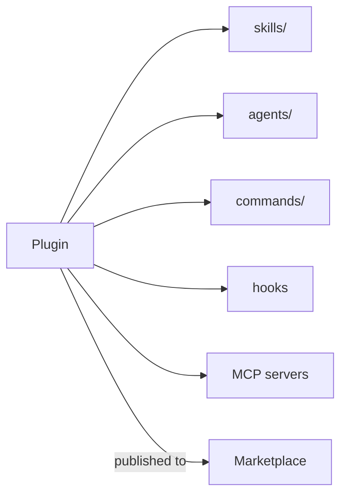

<LevelBadge level="advanced" />

<VerifyNote lastVerified="2026-06-20" source="https://docs.anthropic.com/en/docs/claude-code">
Plugin-Struktur und Marketplace-Mechanik entwickeln sich schnell weiter — überprüfe Details in der offiziellen Claude-Code-Dokumentation.
</VerifyNote>

Ein **Plugin** bündelt mehrere Anpassungen — [Skills](/docs/claude-code/skills), [Subagenten](/docs/claude-code/subagents), [Slash-Befehle](/docs/claude-code/slash-commands), [Hooks](/docs/claude-code/hooks) und [MCP-Server](/docs/claude-code/mcp) — in eine einzige, versionierte, installierbare Einheit. Ein **Marketplace** ist ein Katalog von Plugins, die Menschen entdecken und installieren können.

## Warum Plugins wichtig sind

- **Liefere ein Team-Toolkit in einem Schritt.** Statt jeden zu bitten, fünf Dateien zu kopieren, veröffentlichst du ein Plugin; Teammitglieder installieren es und erhalten dieselben Befehle, Hooks, Agenten und MCP-Verbindungen.
- **Versionierung.** Aktualisiere das Plugin, alle ziehen die neue Version.
- **Verteilung.** Ein Marketplace macht dein Toolkit (oder das anderer) auffindbar.

## Was typischerweise enthalten ist

Ein Plugin ist ein strukturierter Ordner (ein Manifest plus die mitgelieferten Bausteine). Mindestens kann es nur Skills enthalten; höchstens den vollständigen Satz von oben. Halte jedes Plugin **kohärent** — ein Plugin für "Team-Konventionen", ein Plugin für ein "Python-Toolkit" — statt einer Wundertüte.

## Vertrauen, bevor du installierst

:::warning Plugins können ausführbaren Code mitliefern
Hooks und MCP-Server in einem Plugin laufen mit deinen Rechten. Installiere aus Quellen, denen du vertraust, und prüfe zuerst, was ein Plugin tut — siehe [Code von Dritten prüfen](/docs/security/reviewing-third-party-code).
:::

## Ein Weg, dein Setup zu skalieren

Die natürliche Entwicklung: eine `CLAUDE.md` → ein paar [Skills](/docs/claude-code/skills) und [Befehle](/docs/claude-code/slash-commands) → bündle sie in ein Plugin → veröffentliche es in einem Marketplace für dein Team oder die Community. Dieser letzte Schritt ist Teil davon, wie AILmanac dem Ökosystem beim Wachsen helfen möchte.

## Weiter

- [Skills](/docs/claude-code/skills) · [Subagenten](/docs/claude-code/subagents) · [MCP](/docs/claude-code/mcp)
- [Code von Dritten prüfen](/docs/security/reviewing-third-party-code)
- AILmanacs [Skill-Pakete](/docs/templates/skills)
