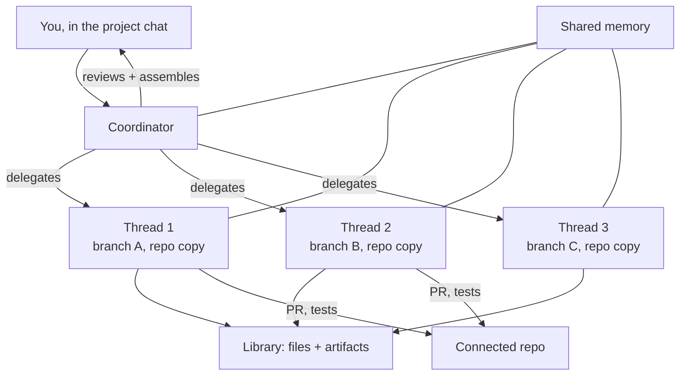

<LevelBadge level="advanced" />

<VerifyNote lastVerified="2026-09-23" source="https://claude.com/blog/projects-redesigned">
Die neu gestalteten Projects sind in der **Beta** und werden stufenweise ausgerollt. Zulassung, Plan-Abdeckung und die Koordinator-/Thread-Steuerungen bewegen sich noch, und es gibt bislang keine Referenzseite in der Claude-Code-Dokumentation — der Ankündigungspost ist die maßgebliche Quelle. Prüfe, was dein Konto tatsächlich hat, bevor du darum herum entwirfst.
</VerifyNote>

Am **17. September 2026** hat Anthropic Projects neu gebaut. Das alte Project war ein *Ordner*: Dateien, Anweisungen und ein Stapel Chats, die sich alles davon teilten. Das neue Project ist ein *Organigramm* — "Threads, die die Arbeit tun, und ein Koordinator, der sie lenkt."

Das ist eine größere Änderung, als es klingt. Ein Project ist nicht länger ein Ort, an dem du Kontext ablegst; es ist etwas, das **in deinem Auftrag Arbeit ausführt**. Du beschreibst ein Ergebnis im Haupt-Projektchat, und Claude schneidet es zu, teilt es auf, delegiert es an parallele Threads, prüft, was zurückkommt, und setzt das Ergebnis zusammen.

<Callout type="objectives" items={[
  "Was ein Thread tatsächlich ist — und warum 'eine Claude-Code-Cloud-Session auf eigenem Branch' der Schlüsselsatz ist",
  "Wie sich der Koordinator von einem Subagenten-Orchestrator unterscheidet und wann welches das richtige Werkzeug ist",
  "Die vier Wege, Arbeit heute in Claude Code parallel auszuführen, und wie du zwischen ihnen wählst",
  "Warum Projects Nutzungslimits schneller verbrennen und die zwei Modell-/Effort-Regler, die das steuern",
  "Die Zulassungsregel, die erklärt, warum dein Konto die Neugestaltung vielleicht noch nicht sieht"
]} />

## Die Architektur in einem Diagramm

Drei Teile sind wichtig, und sie werden leicht verwechselt:

- **Der Koordinator** ist der Haupt-Projektchat. Anthropics Rahmung ist das Briefen eines Stabschefs: Du sagst, was du brauchst, und er routet die Arbeit an neue oder bestehende Threads.
- **Ein Thread** ist kein leichtgewichtiger Worker. "Unter der Haube ist jeder Thread eine Claude-Code-Cloud-Session, die auf ihrem eigenen Branch und ihrer eigenen Kopie des Repos arbeitet." Es ist eine vollwertige Session mit eigenem Kontextfenster, eigenen Tools und eigener Fähigkeit, **Subagenten, Loops und Workflows** zu starten, wenn eine Aufgabe groß genug dafür ist.
- **Gemeinsames Gedächtnis und die Bibliothek** sind das, was den Fan-out vor Fragmentierung bewahrt. Jeder Thread schöpft aus demselben Gedächtnis-Pool, und die Bibliothek "sammelt die Dateien, die du hinzufügst, und die von Claude erzeugten Artefakte", sodass Ergebnisse findbar bleiben statt in einer geschlossenen Session zu sterben.

Ist ein Repository verbunden, öffnen Threads selbstständig Pull Requests und lassen Tests laufen. Du kannst von überall zusehen und steuern, auch von deinem Handy.

## Der Satz, der alles andere bestimmt

> Jeder Thread ist eine Claude-Code-Cloud-Session, die auf ihrem eigenen Branch und ihrer eigenen Kopie des Repos arbeitet.

Lies das als drei separate Zusagen:

1. **Eigene Session** → eigenes Kontextfenster. Threads teilen sich kein Kontextbudget, wie Subagenten innerhalb einer Session es tun. Fan-out frisst nicht mehr das Fenster des Elternteils.
2. **Eigener Branch** → Threads können sich nicht gegenseitig die Dateien überschreiben. Isolation wird von git erzwungen, nicht von Prompt-Disziplin. Der Preis ist, dass die Integration zur Merge-Zeit wandert.
3. **Eigene Kopie des Repos** → ein Thread kann Tests laufen lassen, Abhängigkeiten installieren und Dinge kaputt machen, ohne deine Maschine oder deine anderen Threads zu berühren.

Dieser dritte Punkt ist auch die aktuelle Obergrenze: Threads laufen ausschließlich in der Cloud. Anthropic sagt, die Ausführung "auf deiner Maschine neben deinen lokalen Tools und deinem Code und hinter deinem Netzwerk kommt sehr bald" — bis das landet, bleibt alles, was einen lokalen Dienst, einen nur per VPN erreichbaren Host oder eine unveröffentlichte Abhängigkeit braucht, außerhalb von Projects.

## Zwischen vier Arten von Parallelität wählen

Claude Code bietet jetzt vier Wege, mehr als eine Sache gleichzeitig zu tun. Sie sind nicht austauschbar, und den falschen zu wählen ist hier der häufigste Fehler.

| Mechanismus | Wer orchestriert | Isolation | Kontext | Am besten für |
|---|---|---|---|---|
| [Subagenten](/docs/claude-code/subagents) | Dein Haupt-Agent, innerhalb einer Session | Derselbe Arbeitsbaum | Teilen die Limits der Session; [begrenzt auf 20 gleichzeitig, Tiefe 3](/docs/claude-code/subagent-fleet-limits) | Fan-out beim Lesen und Recherchieren innerhalb einer einzelnen Aufgabe |
| [Worktrees](/docs/claude-code/worktrees) | Du, von Hand | Separater Branch + Verzeichnis, lokal | Separate Sessions, die du selbst startest | Lokale parallele Arbeit, die du beobachten und kontrollieren willst |
| [Inter-Session-Messaging](/docs/claude-code/inter-session-messaging) | Du, indem du Sessions namentlich ansprichst | Was jede Session bereits hat | Unabhängig | Das Koordinieren von Sessions, die schon laufen |
| **Projekt-Threads** | **Claude, vom Koordinator aus** | **Separater Branch + Repo-Kopie, in der Cloud** | **Unabhängig pro Thread** | **Lange Aufträge, die du zugeschnitten, aufgeteilt und für dich zusammengesetzt haben willst** |

Die ehrliche Heuristik:

- Wenn die Arbeit in eine Session passt und überwiegend Lesen ist, nutze **Subagenten** — sie brauchen kein Setup und sind die günstigsten.
- Wenn du jeden Schritt auf deiner eigenen Maschine überwachen willst, nutze **Worktrees**.
- Wenn die Aufteilung für dich offensichtlich ist und du sie lieber selbst entscheidest, nutze Worktrees oder Messaging. Projects bringen genau dann Wert, wenn **die Zerlegung der schwierige Teil ist**.
- Wenn der Auftrag groß ist, die Aufteilung nicht offensichtlich ist und du lieber vom Handy nachschauen willst, statt ein Terminal zu bemuttern, nutze **Projects**.

## Eines einrichten

<Steps items={[
  {title: "Wähle ein Ziel und ein Repo", body: "Du wählst vorab das Ergebnis und das relevante Repository oder den relevanten Kontext. Der Koordinator nutzt beides, um die erste Arbeitsscheibe vorzuschlagen, also produziert ein vages Ziel eine vage Delegation."},
  {title: "Konfiguriere die Umgebung", body: "Setze Cloud-Umgebung, Konnektoren, Plugins und Anweisungen. Diese werden von jedem Thread geerbt, den der Koordinator startet — das ist die eine Stelle, an der sich ein Fehler über den gesamten Fan-out vervielfacht."},
  {title: "Wähle Modelle und Effort — zweimal", body: "Koordinator-Chat und Worker-Threads haben separate Modell- und Effort-Einstellungen. Das ist der wichtigste Kostenhebel; siehe unten."},
  {title: "Beschreibe das Ergebnis, nicht die Schritte", body: "Briefe den Koordinator wie einen Stabschef. Das Liefergegenstand und die Randbedingungen zu benennen erlaubt ihm, zuzuschneiden und aufzuteilen; die Schritte zu benennen macht ihn zu einer teuren Art, eine Checkliste abzuarbeiten, die du schon geschrieben hast."},
  {title: "Stimme den Check-in-Takt ab", body: "Du kannst einstellen, wie oft Claude sich bei dir meldet und wie bereitwillig er neue Threads startet. Dreh die Check-ins hoch, solange du noch kalibrierst, wie er deine Arbeit zerlegt."},
  {title: "Prüfe beim Merge, nicht beim Tastendruck", body: "Threads öffnen Pull Requests und lassen Tests laufen. Deine Prüffläche ist das PR-Set, das der Koordinator zusammenstellt — dort werden isolierte Branches zu einer Änderung."}
]} />

## Das Kostenmodell, klar gesagt

Anthropic ist dabei direkt: "Projects können Nutzungslimits schneller erreichen." Der Grund folgt aus der Architektur — jeder Thread ist eine vollwertige Claude-Code-Cloud-Session, also sind fünf Threads ungefähr fünf Sessions Verbrauch, die gleichzeitig laufen, nicht eine Session, die fünffach aufgeteilt wird.

Es gibt zwei Regler, und sie sind die ganze Kostengeschichte:

<Callout type="tip" items={[
  "Koordinator-Modell/-Effort — er schneidet zu, prüft und setzt zusammen. Er liest viel und schreibt wenig, profitiert also von leistungsfähigem Reasoning.",
  "Thread-Modell/-Effort — dieses wird mit der Anzahl der Threads multipliziert. Eine Stufe herunter ist hier die kostenwirksamste Änderung, die du machen kannst.",
  "Die Nutzung pro Projekt ist separat sichtbar, du kannst also sehen, was ein Projekt kostet, ohne es aus deinem globalen Limit zu erraten."
]} />

Das daraus folgende Muster: **halte den Koordinator scharf, mache die Worker verhältnismäßig.** Mechanische Arbeit — Tests schreiben, Migrationen, Doku-Durchläufe — an Threads mit niedrigerer Effort-Stufe zu delegieren, während der Koordinator auf einer höheren prüft, gibt dir den größten Teil der Qualität zu einem Bruchteil der multiplizierten Ausgaben. Es ist dieselbe Ökonomie wie beim [Routen von Subagenten auf günstigere Modelle](/docs/claude-code/subagent-fleet-limits), eine Schicht höher angewandt.

## Warum du es vielleicht nicht hast

Das Beta-Gate ist ungewöhnlich spezifisch, und es lässt Leute stolpern, die eine einfache prozentuale Ausrollung annehmen. Beim Start ging der Zugang an:

> ausgewählte Claude-Pro- und -Max-Abonnenten, die Cloud-Sessions in Claude Code nutzen und keine bestehenden Projects im Web oder auf dem Desktop haben

Drei Bedingungen, alle erforderlich:

| Bedingung | Warum sie beißt |
|---|---|
| Pro- oder Max-Plan | Team und Enterprise kommen später, nach dem Consumer-Rollout |
| Nutzt bereits Cloud-Sessions in Claude Code | Rein lokale Nutzer sind nicht in der ersten Welle, wie intensiv sie es auch nutzen |
| **Keine bestehenden Projects im Web oder auf dem Desktop** | Die überraschende: ein *früher, intensiver* Nutzer der alten Projects zu sein hat dich beim Start aktiv disqualifiziert |

Diese dritte Regel ist die Falle. Langjährige Projects-Nutzer sind die unwahrscheinlichsten, die Neugestaltung gesehen zu haben, weil der Migrationspfad für bestehende Projekte noch nicht ausgeliefert war. Bestehende Projekte funktionieren während des Rollouts weiter. Pro- und Max-Nutzer ohne Zugang können sich auf eine Warteliste setzen; Anthropic sagte, der Zugang werde sich "im Laufe der kommenden Woche" auf mehr Claude-Code-Nutzer in diesen Plänen ausweiten, dann auf das restliche Claude und auf Team und Enterprise.

## Häufige Fehler

- **Den Koordinator als Prompt-Box behandeln.** Er ist ein Delegierer. Gib ihm ein Ergebnis und Randbedingungen; wenn du ihm eine geordnete Liste von Schritten übergibst, zahlst du Orchestrierungs-Overhead für etwas, das eine einzelne Session besser macht.
- **Annehmen, dass Threads deinen lokalen Zustand teilen.** Sie halten eine Cloud-Kopie des Repos. Uncommittete lokale Änderungen, lokale Env-Dateien und Dienste auf `localhost` sind dort nicht.
- **Vergessen, dass Isolation Konflikte aufschiebt statt sie zu beseitigen.** Branch-pro-Thread garantiert, dass Threads sich *während des Laufens* nicht gegenseitig überschreiben. Es garantiert nicht, dass drei PRs, die dasselbe Modul berühren, sauber mergen. Schneide Threads nach Modulgrenzen zu, wo du kannst.
- **Den Thread-Effort auf derselben Stufe wie den Koordinator lassen.** Diese Einstellung wird mit der Thread-Anzahl multipliziert. Es ist der schnellste Weg, mitten im Auftrag an ein Limit zu stoßen.
- **Es für Arbeit nutzen, die deine Maschine braucht.** Abhängigkeiten von lokalem Netzwerk oder lokalen Tools gehören in [Worktrees](/docs/claude-code/worktrees), bis lokale Threads ausgeliefert werden.

## Was das signalisiert

Projects ist die erste Stelle, an der Anthropic *die Zerlegung selbst* zum Produkt gemacht hat. Subagenten lassen ein Modell innerhalb einer von dir definierten Aufgabe ausfächern. Ein Project bittet das Modell, die Aufgaben zu definieren. Die Steuerungen, die Anthropic offenlegt — Check-in-Häufigkeit, wie eifrig es neue Threads öffnet, separater Effort für Koordinator und Worker — sind alle Regler dafür, **wie viel Autonomie du delegierst**, was ein nützliches Signal dafür ist, wohin Agentenprodukte generell steuern. Siehe [der Verifikations-Engpass](/docs/frontiers/the-verification-bottleneck) dafür, warum Prüfen, nicht Erzeugen, die Beschränkung ist, in die dieses Design läuft.

<Quiz questions={[
  {
    q: "Was ist ein Projekt-Thread technisch?",
    options: [
      "Ein Subagent, der innerhalb der Session des Koordinators läuft",
      "Eine vollwertige Claude-Code-Cloud-Session auf eigenem Branch und eigener Kopie des Repos",
      "Eine Hintergrundaufgabe, die das Kontextfenster des Koordinators mitnutzt",
      "Eine eingereihte Message-Batches-Anfrage"
    ],
    answer: 1,
    explain: "Anthropics Formulierung ist exakt: jeder Thread ist eine Claude-Code-Cloud-Session, die auf ihrem eigenen Branch und ihrer eigenen Kopie des Repos arbeitet. Deshalb haben Threads unabhängigen Kontext und können eigene Pull Requests öffnen — und deshalb verbrauchen sie Nutzung wie separate Sessions."
  },
  {
    q: "Warum erreichen Projects Nutzungslimits schneller als eine einzelne Session?",
    options: [
      "Der Koordinator läuft immer mit maximalem Effort",
      "Cloud-Sessions werden mit einem Aufpreis abgerechnet",
      "Jeder Thread ist eine vollwertige Session, also laufen mehrere gleichzeitig statt sich ein Budget zu teilen",
      "Gemeinsames Gedächtnis wird mit jeder Anfrage erneut gesendet"
    ],
    answer: 2,
    explain: "Threads sind vollwertige Sessions, die parallel laufen, also multipliziert sich der Verbrauch mit der Thread-Anzahl. Der Hebel ist Thread-Modell/-Effort, das multipliziert wird — es herunterzustufen, während der Koordinator leistungsfähig bleibt, ist die kostenwirksamste Änderung."
  },
  {
    q: "Welche Bedingung hat beim Start ein Konto von der Beta AUSGESCHLOSSEN?",
    options: [
      "Auf dem Max-Plan statt auf Pro zu sein",
      "Bestehende Projects im Web oder auf dem Desktop zu haben",
      "Nie Subagenten genutzt zu haben",
      "Claude Code nur über die IDE-Erweiterung zu nutzen"
    ],
    answer: 1,
    explain: "Die Beta ging an ausgewählte Pro- und Max-Abonnenten, die Cloud-Sessions in Claude Code nutzen und keine bestehenden Projects im Web oder auf dem Desktop haben. Intensive Nutzer der alten Projects waren daher die unwahrscheinlichsten, die Neugestaltung zuerst zu sehen, weil der Migrationspfad nicht ausgeliefert war."
  }
]} />

<Callout type="takeaways" items={[
  "Ein Project ist jetzt eine Orchestrierungsschicht, kein Ordner: ein Koordinator schneidet zu und delegiert, Threads führen aus.",
  "Ein Thread ist eine vollwertige Cloud-Session auf eigenem Branch und eigener Repo-Kopie — unabhängiger Kontext, eigene PRs, eigener Verbrauch.",
  "Greife zu Projects, wenn die Zerlegung der schwierige Teil ist; greife zu Subagenten oder Worktrees, wenn du die Aufteilung schon kennst.",
  "Thread-Effort wird mit der Thread-Anzahl multipliziert; Koordinator-Effort nicht. Stimme sie separat ab.",
  "Threads sind heute nur in der Cloud, also bleibt alles, was lokale Tools oder ein privates Netzwerk braucht, vorerst in Worktrees."
]} />

## Weiter

- [Subagenten](/docs/claude-code/subagents) — das In-Session-Fan-out-Primitiv, eine Ebene unter den Threads
- [Subagent Fleet Limits](/docs/claude-code/subagent-fleet-limits) — die Concurrency-Obergrenzen und das Kosten-Routing, die innerhalb jedes Threads gelten
- [Worktrees](/docs/claude-code/worktrees) — die lokale Alternative, bei der du orchestrierst, solange Cloud-only eine Einschränkung ist

## Quellen & weiterführende Literatur

- [Projects redesigned: from folder to conversation — Anthropic](https://claude.com/blog/projects-redesigned) — die Ankündigung und derzeit die maßgebliche Beschreibung von Koordinator, Threads, gemeinsamem Gedächtnis, Bibliothek, Beta-Zulassung und der Cloud-only-Einschränkung
- [Claude-Code-Dokumentation](https://code.claude.com/docs/en/overview) — Referenzdokumentation zu den umgebenden Claude-Code-Features; eine Projects-Referenzseite war zum Zeitpunkt des Schreibens nicht ausgeliefert
