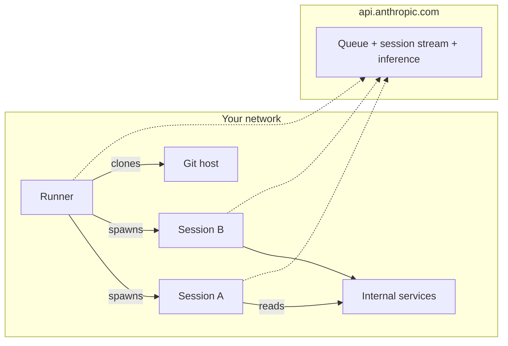

<LevelBadge level="advanced" />

<Callout type="objectives" items={[
  "Verstehen, was eine selbst-gehostete Umgebung wirklich ist — drei bewegliche Teile (Umgebung, Runner, Sitzung), die fast genau wie ein selbst-gehosteter CI-Runner aussehen",
  "Die Netzwerkform sehen: 100 % ausgehendes HTTPS, null eingehendes von Anthropic, Anthropics Steuerungsebene bleibt gehostet, Ausführung wandert auf deine Maschinen",
  "Wissen, wann du dazu greifst (internes Netzwerkzugriff, Custom-Tooling, Compliance) und wann die zwei einfacheren Antworten, die die meisten Teams zuerst nutzen sollten",
  "Deinen ersten Runner mit claude self-hosted-runner in vier Befehlen aufsetzen, ohne das Umgebungsgeheimnis in die Shell-Historie zu leaken",
  "Das Ein-Benutzer-Runner-Lock verstehen — warum es existiert, was --drain-grace-sec und --retire-at bewirken, und wie es deine minimale Flottengröße bestimmt",
  "Die sechs Fallen ausliefern, die jede erste Produktionsflotte erwischen (Secret-Rotation, ZDR-Blocker, Modell-Routing-Blocker, --base-dir Standard, Uhrenabweichung, Spot-Instance-Eviction)",
]} />

<VerifyNote lastVerified="2026-08-07" source="https://code.claude.com/docs/en/self-hosted-environments">
Öffentliche Beta ausgeliefert am **7. August 2026** in [Claude Code v2.1.224](https://code.claude.com/docs/en/changelog) auf Team- und Enterprise-Plänen. Das Subkommando `claude self-hosted-runner` existiert auf früheren Versionen nicht — es startet stillschweigend eine normale Claude-Sitzung mit den Wörtern als Prompt. Namen, Flags und der Aktivierungspfad können sich vor GA ändern; gleiche mit der offiziellen [Self-Hosted-Environments-Seite](https://code.claude.com/docs/en/self-hosted-environments) und ihrem [Schnellstart](https://code.claude.com/docs/en/self-hosted-environments-quickstart) ab, bevor du dagegen baust.
</VerifyNote>

Am 7. August 2026 lieferte Anthropic eine Funktion aus, die die letzte echte Lücke zwischen Claude Code und der Art schließt, wie regulierte Organisationen tatsächlich Infrastruktur betreiben: **selbst-gehostete Umgebungen**. Jede Cloud-Sitzung — die, die du von claude.ai, den Mobile- und Desktop-Apps, [geplanten Cowork-Routinen](/docs/claude-app/cowork-scheduled-tasks) oder `claude --cloud` startest — kann jetzt in deinem eigenen Netzwerk laufen, auf Maschinen, die du bereitstellst und mit Images versiehst, auf Team- und Enterprise-Plänen. Orchestrierung und der Modellaufruf bleiben auf Anthropics Seite; der ausgecheckte Code, die Tool-Ausführungen und der Netzwerkzugriff auf deine internen Dienste leben vollständig auf deinen Maschinen.

Wenn du je eine GitHub-Actions-Self-Hosted-Runner-Flotte betrieben hast, ist die Form genau vertraut. Du wirst schneller produktiv, wenn du dieses Mental Model mitbringst.

## Die Ein-Absatz-Version

Du definierst eine **Umgebung** in den Admin-Einstellungen von claude.ai — ein benanntes Ziel. Du kopierst ihr **Umgebungsgeheimnis** einmal (365 Tage Lebensdauer; die UI nennt es einen "Umgebungsschlüssel"). Du installierst Claude Code v2.1.224+ auf einem Linux- oder macOS-Host, legst das Geheimnis in eine Datei und führst `claude self-hosted-runner --environment-secret-file /etc/claude/environment-secret --base-dir /workspace` aus. Dieser Prozess pollt `api.anthropic.com` ausgehend nach Arbeit, holt Sitzungen aus der Queue deiner Umgebung, klont das Repo, das der Entwickler ausgewählt hat, und spawnt einen Kind-`claude`-Prozess, um jede Sitzung auszuführen. Sitzungszustand, Git-Checkouts und alles, was die Tools anfassen, bleiben auf deinem Host; nur das Transkript für die Inferenz verlässt ihn, über ausgehendes HTTPS. Nichts eingehend von Anthropic. Einfaches Mental Model, eine operative Überraschung: ein Runner sperrt sich auf den ersten Benutzer, der auf ihm landet, und bedient nur diesen Benutzer, bis er drainiert.

## Wo das im Vergleich zu den zwei einfacheren Antworten steht

Bevor du eine Flotte baust, sei ehrlich, ob du wirklich eine brauchst. Zwei angrenzende Produkte decken die meisten "Ich will Claude woanders als auf meinem Laptop"-Fälle ab, ohne dass du Infrastruktur betreiben musst.

| Option | Wo Ausführung passiert | Was du selbst betreibst | Wähle es, wenn |
| :--- | :--- | :--- | :--- |
| Anthropic-gehostete Cloud (Standard) | Anthropics Infra | Nichts | Du hast keinen Compliance- oder Netzwerkgrund, die Ausführung zu verlagern. Das ist die richtige Antwort für die meisten Teams. |
| [Remote Control](https://code.claude.com/docs/en/remote-control) | Deine eigene ständig eingeschaltete Maschine | Diese eine Maschine | Du willst eine Workstation vom Handy oder einem anderen Laptop steuern. Verfügbar auf Pro, Max, Team und Enterprise. |
| **Selbst-gehostete Umgebungen** | Deine Flotte von Runnern | Runner-Image, Orchestrierung, Egress, Git-Credentials | Du brauchst Sitzungsausführung in deinem Netzwerk — interne Registrierungen, private Endpunkte, air-gapped Code oder Compliance sagt "Checkouts bleiben auf unserer Infra". Nur Team und Enterprise. |

Wenn eine Sitzung, die von einem Terminal oder einer IDE gestartet wurde, den Laptop des Entwicklers ohnehin nie verlässt, gilt nichts davon für diese Sitzung — der Umgebungspicker erscheint nur für Cloud-Sitzungen.

## Architektur: Umgebung, Runner, Sitzung

Drei Substantive; sie bilden sich sauber auf ihre GitHub-Actions-Äquivalente ab.

<Steps items={[
  {title: "Umgebung (~ Runner-Gruppe)", body: "Eine benannte Gruppe deiner Runner, erstellt auf der Admin-Seite Cloud-Umgebungen in claude.ai. Sitzungen werden an eine Umgebung geroutet, nicht an einen bestimmten Runner. In API-Feldern und Metriken erscheint sie als pool, und die ID ist ein String wie ccpool_..."},
  {title: "Runner (~ Self-Hosted-Runner)", body: "Ein langlaufender Prozess auf deinem Host, gestartet mit claude self-hosted-runner. Er registriert sich bei der Umgebung mit dem Umgebungsgeheimnis, erhält ein Runner-Token und pollt die Queue nach Arbeit. Ein Binary, kein Daemon-Dienst zu installieren — der Runner IST das Standard-claude-CLI in einem anderen Modus."},
  {title: "Sitzung (~ Workflow-Run)", body: "Eine Claude-Code-Aufgabe, die ein Entwickler gestartet hat, von claude.ai, der Mobile-/Desktop-App, einer geplanten Cowork-Routine oder claude --cloud. Jede Sitzung läuft als Kind-claude-Prozess, den der Runner spawnt, mit ihrem eigenen Event-Stream zurück zu Anthropic."},
]} />

Jede Verbindung ist ausgehend aus deinem Netzwerk. Anthropic verbindet sich nie hinein. Der Runner und jede Sitzung öffnen jeweils ihre eigene ausgehende HTTPS zu `api.anthropic.com` für Queue-Polling, Sitzungs-Streaming und Modell-Inferenz; der Runner oder die Sitzung öffnet Git-Verbindungen zu deinem Git-Host (öffentlich über HTTPS/SSH oder intern direkt, da du in diesem Netzwerk bist).

## Verfügbarkeit und die Blocker, die die meisten Orgs treffen

Sechs Zeilen zum Lesen, bevor du einen Rollout planst. Jede ist ein hartes "Nein", kein Workaround.

- **Pläne**: Team und Enterprise, öffentliche Beta. **Selbst-gehostete Umgebungen zulassen** muss von einem Owner oder Admin auf der [Admin-Seite Cloud-Umgebungen](https://claude.ai/admin-settings/cloud-environments) aktiviert werden; der Button **Neu** ist bis dahin verborgen. Erfordert, dass [Claude Code im Web](https://code.claude.com/docs/en/claude-code-on-the-web) für die Organisation aktiviert ist.
- **Zero Data Retention**: nicht verfügbar für Organisationen mit aktiviertem ZDR. Wenn deine Organisation ZDR braucht, sind selbst-gehostete Umgebungen nichts für dich.
- **Modell-Routing**: Inferenz geht an die Anthropic-API auf `api.anthropic.com`. Du **kannst** sie **nicht** durch Amazon Bedrock, Google Cloud, Microsoft Foundry oder ein [LLM-Gateway](https://code.claude.com/docs/en/llm-gateway) innerhalb einer selbst-gehosteten Umgebung leiten — die Sitzung authentifiziert sich mit einem von Anthropic ausgestellten, sitzungsbezogenen OAuth-Token. Verlagere die Ausführung, behalte die Inferenz.
- **Repositories**: Sitzungs-Checkouts sind zurzeit GitHub. Wenn deine Quelle der Wahrheit GitLab, Bitbucket oder etwas Selbst-Gehostetes ohne GitHub-federated auth ist, warte.
- **Oberflächen, die noch nicht routbar sind**: [Claude Tag](https://claude.com/docs/claude-tag/overview), Claude Security und Code-Review-Sitzungen routen noch nicht zu selbst-gehosteten Umgebungen. Regulärer Chat, Claude Code im Web, Mobile-/Desktop-App, geplante Routinen und `claude --cloud` schon.
- **Runner-OS**: Linux- oder macOS-Host oder -Container. Windows wird als Runner-Host nicht unterstützt — führ es stattdessen in einem Linux-Container aus. Entwickler-Workstations sind nicht betroffen (sie hosten den Runner nie).

## Schnellstart: dein erster Runner in vier Befehlen

Das geführte Setup (`claude self-hosted-runner setup`) führt eine Maschine, auf der du dich mit `claude auth login` unter einem Owner-/Admin-Konto angemeldet hast, interaktiv durch den ganzen Ablauf und legt am Ende ein `./runner-setup/CHEAT-SHEET.md` ab. Auf einem headless Host, wo ein interaktives Setup nicht möglich ist, mach es manuell mit diesen vier Befehlen.

<Steps items={[
  {title: "Erstelle die Umgebung in claude.ai und kopiere das Geheimnis", body: "Admin-Seite Cloud-Umgebungen → Neu unter Selbst-gehostete Umgebungen → benennen → Umgebungsschlüssel kopieren. Das Geheimnis wird EINMAL angezeigt. Läuft 365 Tage nach Erstellung ab. Die ccpool_... ID ist später abrufbar; das Geheimnis nicht."},
  {title: "Lege das Geheimnis in einer Datei ab, aus der Shell-Historie heraus", body: "Der Subshell + umask Trick liest von stdin, sodass das Geheimnis nie in ~/.bash_history oder ~/.zsh_history landet. Ctrl-D nach Einfügen + Enter."},
  {title: "Erstelle ein Base-Verzeichnis, in das der Runner-Benutzer schreiben kann", body: "Der Runner setzt --base-dir standardmäßig auf /workspace. Wenn dieses Verzeichnis nicht existiert (oder der Runner nicht root ist), triffst du beim ersten Claim auf einen Fehler. Setze das explizit."},
  {title: "Starte den Runner und beobachte, wie er sich registriert", body: "Der Prozess pollt die Queue im Vordergrund. Neustart bei Exit ist dein Job — siehe die Flottenrezepte unten."},
]} />

<PromptCard title="1. Prüfe, ob Claude Code neu genug ist">{`claude self-hosted-runner --help`}</PromptCard>

Gibt den Nutzungstext des Runners mit Flags wie `--environment-secret-file` auf v2.1.224+ aus. Auf älteren Versionen gibt es den allgemeinen `claude --help` aus — erst mit `claude update` upgraden oder aus dem [`latest`-Kanal](https://code.claude.com/docs/en/setup) neu installieren.

<PromptCard title="2. Umgebungsgeheimnis ablegen, ohne es zu leaken">{`sudo mkdir -p /etc/claude
sudo bash -c '(umask 077 && cat > /etc/claude/environment-secret)'
# paste secret, press Enter, then Ctrl-D`}</PromptCard>

<PromptCard title="3. Ein beschreibbares Base-Verzeichnis erstellen">{`sudo mkdir -p /workspace && sudo chown $USER /workspace`}</PromptCard>

<PromptCard title="4. Den Runner starten">{`claude self-hosted-runner \\
  --environment-secret-file /etc/claude/environment-secret \\
  --base-dir /workspace`}</PromptCard>

Innerhalb weniger Sekunden schaltet der Status der Umgebung auf der Admin-Seite von **Keine Runner deployed** auf **Gesund** um. Starte eine Sitzung von `claude.ai/code`, wähle deine Umgebung im Picker und beobachte, wie der Runner `Picked up session <session-id>` mit einer Aktiv/Kapazitäts-Zählung loggt.

Ein Follow-up von einer anderen Maschine senden, auf der du eingeloggt bist:

<PromptCard title="Ein Follow-up an eine laufende Cloud-Sitzung senden">{`claude -p "add a test for the empty-list case" --cloud <session-id>`}</PromptCard>

Die `<session-id>` ist die nackte `session_...` oder `cse_...` ID oder die `claude.ai/code`-URL der Sitzung. Bestätigt mit `Sent to cloud session.` plus einem View-Link.

## Der Runner-Lebenszyklus: das Ein-Benutzer-Lock

Das ist die Überraschung, die die meisten Operatoren zuerst treffen. Es ist eine bewusste Isolationsentscheidung, und sie treibt alles an der Flottengröße.

- Die erste Sitzung, die ein Runner aufnimmt, **sperrt den Runner auf das Konto dieses Benutzers**. Ab dann holt der Runner nur die eingereihte Arbeit dieses Benutzers, bis zu `--capacity` gleichzeitigen Sitzungen.
- Was nach Ende dieser Sitzungen passiert, hängt von `--drain-grace-sec` ab:
  - **Standard `0`**: Runner beendet sich, sobald aktive Sitzungen fertig sind; dein Orchestrator (Kubernetes, Compose, systemd + `Restart=always`) startet einen frischen auf sauberer Platte, der *jeden* Benutzer bedienen kann.
  - **Positiver Wert**: Runner pollt die Queue des gesperrten Kontos für diese Sekunden weiter, bevor er sich beendet. Nutze das nur, wenn die zurück-zu-zurück Sitzungen eines einzigen Power-Users dominieren.
- Die **minimale Flottengröße** ist daher die Anzahl der Benutzer, von denen du erwartest, dass sie gleichzeitig aktiv arbeiten — eine langlaufende Sitzung auf einem Runner blockiert jeden anderen Benutzer von diesem Runner, bis er drainiert.
- Der Sitzungs-Lease wird jeden ~Zyklus gepollt; **60 Sekunden** ohne Poll und die Steuerungsebene reiht die Sitzung an einen anderen Runner neu ein. Runner-Heartbeat und Lease-Refresh sind derselbe Call.
- Für Hosts, die zu einer Wanduhrzeit ohne Signal zerstört werden (Spot-Instances, Sandbox-Lebenszeit-Caps), übergib `--retire-at <epoch-seconds>` ein paar Minuten vor dem Kill. Der Runner hört auf, neue Arbeit anzunehmen, gibt jede aktive Sitzung frei (sodass die nächste Nachricht des Benutzers auf einem frischen Runner aufgenommen wird) und beendet sich mit Exit 0. Ohne `--retire-at` sieht ein signal-loser Kill wie ein Crash aus und die Sitzung wird aus einem Lost-Worker-Zustand neu eingereiht.
- SIGTERM löst standardmäßig ein sanftes Drainen aus (kein Flag). Ein Turn, der den Kill-Grace überdauert, ist trotzdem verloren; dimensioniere dafür.

<Flashcards title="Vokabular des Runner-Lebenszyklus" cards={[
  {front: "Ein-Benutzer-Lock", back: "Die erste Sitzung, die ein Runner beansprucht, sperrt den Runner auf das Konto dieses Benutzers, bis er drainiert. Minimale Flottengröße = Anzahl der gleichzeitig aktiven Benutzer."},
  {front: "--drain-grace-sec", back: "Sekunden, die ein Runner die Queue des gesperrten Benutzers weiter pollt, nachdem seine aktiven Sitzungen fertig sind. Standard 0 (sofort beenden)."},
  {front: "--capacity", back: "Gleichzeitige Sitzungen pro Runner, alle für den gesperrten Benutzer bedient."},
  {front: "--retire-at <epoch>", back: "Fordere den Runner auf, keine Arbeit mehr anzunehmen und aktive Sitzungen vor einem signal-losen Kill (Spot-Instance, Sandbox-Timeout) freizugeben. Verhindert Lost-Worker-Zustand."},
  {front: "--base-dir", back: "Wo der Runner Repositories auscheckt. Standard /workspace; muss existieren und beschreibbar sein, oder führe den Runner als root aus."},
  {front: "--environment-secret-file", back: "Pfad zur Datei mit dem ccpool-Geheimnis. Das Umgebungsgeheimnis läuft 365 Tage nach Erstellung ab; rotiere vorher."},
  {front: "ccpool_ ID", back: "Öffentliche Umgebungskennung (a.k.a. pool_id in APIs und Metriken). Kein Geheimnis; verwende sie in der aud-Prüfung beim Verifizieren von Sitzungstokens."},
]} />

## Netzwerk und was tatsächlich den Perimeter überquert

Der Punkt des Selbst-Hostings ist die Kontrolle darüber, was hinausgeht. Deshalb lohnt es sich, präzise zu sein, was das ist.

**Bleibt auf deiner Infra** — Repository-Checkouts, Build-Artefakte, Geheimnisse, die dein Tooling liest, und alle Dateien, die Sitzungen erstellen oder ändern. Sitzungs-zu-internem-Dienst-Aufrufe (Datenbanken, Registrierungen, private HTTP-Endpunkte) verlassen dein Netzwerk nie.

**Verlässt deine Infra** — das Gespräch selbst (Prompts, Modellantworten, Tool-Ergebnisse) geht an `api.anthropic.com` für Inferenz, und Anthropic speichert das Sitzungstranskript, damit eine Sitzung von einer anderen Oberfläche aus aufgenommen werden kann. Runner-Heartbeats und Queue-Polls sind ausgehendes HTTPS an denselben Host. Optional: Git-Clones können durch Anthropics [Git-Proxy](https://code.claude.com/docs/en/self-hosted-environments-deploy#use-the-anthropic-git-proxy) getunnelt werden, wenn dein interner Git-Host vom Runner aus nicht direkt erreichbar ist.

**Passiert nie** — Anthropic öffnet keine eingehenden Verbindungen zu deinem Netzwerk. Es gibt keinen Port freizugeben, kein Ingress zu firewallen.

Proxy-Unterstützung: der Runner und der optionale Autoscaling-Orchestrator respektieren `HTTPS_PROXY` / `NO_PROXY` und die mTLS-Variablen aus [Netzwerkkonfiguration](https://code.claude.com/docs/en/network-config). Sitzungen erben sie. Der Proxy im Pfad **darf server-sent-event-Antworten nicht buffern** — Sitzungs-Streaming bricht sonst.

## Produktions-Checkliste: was ins Runner-Image eingebacken werden soll

Der Runner ist ein Binary. Alles andere, was Sitzungen produktiv macht, lebt im Image oder einem Wrapper-Skript.

- **Pinne die Claude-Code-Version.** Der `latest`-Kanal bekommt Releases am Tag, an dem sie ausgeliefert werden; der `stable`-Kanal, Homebrew-Cask und apt/dnf/apk-Stable-Repos hinken ~eine Woche hinterher. Folge [Installieren einer bestimmten Version](https://code.claude.com/docs/en/setup#install-a-specific-version) und pinne.
- **Git ≥ 2.24** auf PATH. Neueres Git wird für einige [Git konfigurieren](https://code.claude.com/docs/en/self-hosted-environments-deploy#configure-git)-Optionen benötigt; jede angegebene Untergrenze ist auf dieser Seite.
- **Vor-Installiere deine Build-Tools** — Compiler, Sprach-Runtimes, Paketmanager, interne CLIs. Das sind 80 % des "Warum wir selbst hosten"-Werts: jede Sitzung startet bereit zum Bauen, kein `apt install` mitten im Turn.
- **Stelle Git-Credentials bereit** im Runner-Image oder über einen Wrapper. Optionen umfassen pro-Sitzung geprägte Credentials — siehe [Git konfigurieren](https://code.claude.com/docs/en/self-hosted-environments-deploy#configure-git).
- **Restart-on-Exit-Orchestrierung** (Kubernetes Deployment, `systemd` mit `Restart=always`, Compose mit `restart: always`). Der Runner beendet sich per Design, wenn aktive Sitzungen fertig sind; ohne einen Restarter wird deine Umgebung kalt.
- **Uhrensynchronisation (NTP oder Äquivalent).** Authentifizierung schlägt fehl, wenn die Uhr mehr als 5 Minuten abweicht — eine stille Ursache für `poll auth failed`-Schleifen.
- **Autoscaling**: für sprunghafte Nachfrage deploy den [Autoscaling-Orchestrator](https://code.claude.com/docs/en/self-hosted-environments-configuration#on-demand-runners), einen zweiten Prozess, den du hostest und der on-demand-Runner startet, während Sitzungen sich einreihen.

## Testen und Identität

Zwei angrenzende Oberflächen, die am Tag lohnend sind, an dem du über einen Ein-Host-Smoke-Test hinausgehst:

- **CI-Smoke-Test** — [End-to-End testen](https://code.claude.com/docs/en/self-hosted-environments-testing) dispatched eine Sitzung an deine Umgebung aus CI (`--environment ccpool_...`) und liest Claudes Antworten, und gibt dir ein Image-Promotion-Gate.
- **Sitzungs-Identität verifizieren** — [Sitzungs-Identitätsverifizierung](https://code.claude.com/docs/en/self-hosted-environments-identity) lässt deine internen Dienste das Sitzungstoken vor Gewähren des Zugriffs validieren, mit der `ccpool_...` ID als `aud`-Prüfung. Das ist das Stück, das interne APIs wissen lässt "diese Anfrage kam von einer Sitzung in unserer Umgebung, nicht von einem zufälligen Mitarbeiter-Laptop."

## Die sechs Fallen, die jede erste Flotte erwischen

Nicht ausgedacht — jede steht entweder im Kleingedruckten der Dokumentation oder ist eine natürliche Konsequenz des Designs. Spar dir eine Woche.

1. **Guided-Setup-Versionsfalle.** Auf Claude Code &lt; v2.1.224 fehlt `claude self-hosted-runner setup` nicht — es startet eine normale Claude-Sitzung mit den wörtlichen Wörtern als Prompt. Führe zuerst die `--help`-Prüfung aus; wenn du den allgemeinen `claude --help` siehst, upgrade.
2. **Umgebungsgeheimnis wird nur einmal gezeigt.** Der Wert, den du bei Erstellung kopierst, ist unwiederbringlich. Speichere ihn in deinem Secrets-Manager im selben Moment, in dem du ihn kopierst, bevor du den Wizard schließt. Wenn du ihn verlierst, erstelle ein neues Geheimnis über den Tab **Konfiguration** der Umgebung, rolle es zu deinen Runnern und widerrufe das alte danach — alte Runner, die auf widerrufene Geheimnisse treffen, scheitern bei ihrem nächsten Poll mit `poll auth failed`.
3. **`--base-dir` Standard-Falle.** Wenn du `--base-dir` nicht übergibst und den Runner nicht als root ausführst, existiert `/workspace` nicht und ist nicht beschreibbar — der Runner registriert sich einwandfrei, dann Fehler beim ersten Claim. Übergib bei Nicht-root-Läufen immer einen expliziten `--base-dir` und mache `chown`.
4. **Das Ein-Benutzer-Lock, nochmal.** Ein Team von 20 aktiven Ingenieuren braucht mindestens 20 Runner, nicht 20 × Sitzungskapazität. Unter-provisioniere hier und jeder andere Benutzer wartet hinter dem, der den Runner zuerst getroffen hat. Dimensioniere Flotten nach *gleichzeitig aktiven Benutzern*, nicht nach gleichzeitigen Sitzungen.
5. **Uhrenabweichung lässt Auth scheitern.** Runner auf Hosts mit mehr als 5 Minuten Wanduhrabweichung schleifen stillschweigend auf `poll auth failed`. NTP ist nicht optional.
6. **Signal-lose Kills verlieren den aktuellen Turn.** Spot-Instances, Container-Runtime-Deadlines und einige Kubernetes-Evictions killen den Host ohne SIGTERM. Setze `--retire-at` ein paar Minuten vor der bekannten Kill-Zeit, damit der Runner sauber drainiert; sonst ist ein mitten im Flug befindlicher Turn verloren und die Sitzung wird aus einem Lost-Worker-Zustand neu eingereiht.

<Quiz title="Prüfe dein Verständnis" questions={[
  {q: "Deine ZDR-aktivierte Enterprise-Organisation will die Ausführung von Claude Code on-prem verlagern. Können sie selbst-gehostete Umgebungen nutzen?", options: ["Ja, ZDR ist orthogonal zum Ausführungsort", "Nein — selbst-gehostete Umgebungen sind für Organisationen mit aktiviertem Zero Data Retention nicht verfügbar", "Ja, aber nur für geplante Routinen"], answer: 1, explain: "Selbst-gehostete Umgebungen sind für ZDR-aktivierte Organisationen nicht verfügbar. Das Sitzungstranskript geht immer noch für Inferenz an api.anthropic.com und wird gespeichert, damit eine Sitzung zwischen Oberflächen wandern kann — diese Speicherung ist mit ZDR unvereinbar."},
  {q: "Du hast 20 Ingenieure, die jeweils jederzeit eine Claude-Code-Cloud-Sitzung offen haben könnten. Was ist deine minimale Runner-Anzahl?", options: ["1, da --capacity gleichzeitige Sitzungen handhabt", "20, weil jeder Runner sich auf einen Benutzer sperrt, bis er drainiert", "Du kannst es als ceil(20 / --capacity) berechnen"], answer: 1, explain: "Ein Runner sperrt sich auf das Konto des ersten Benutzers für seine Lebensdauer. Minimale Flottengröße = gleichzeitig aktive Benutzer. --capacity erhöht nur die Parallelität für diesen EINEN gesperrten Benutzer."},
  {q: "Deine Runner sind auf Spot-Instances, die 2 Minuten Warnung vor Terminierung bekommen — kein SIGTERM. Was setzt du, um mitten-im-Turn-Sitzungen nicht zu verlieren?", options: ["--drain-grace-sec 120", "--retire-at gesetzt auf ein paar Minuten vor der bekannten Terminierungszeit", "--capacity 1"], answer: 1, explain: "--retire-at handhabt signal-lose Kills: der Runner nimmt keine neue Arbeit an und gibt aktive Sitzungen frei, damit die nächste Nachricht des Benutzers auf einem frischen Runner aufgenommen wird. --drain-grace-sec betrifft nur Post-Drain-Polling."},
  {q: "Du willst Claude-Code-Cloud-Sitzungen auf deine Bedrock-Inferenz routen. Ermöglicht selbst-gehostete Umgebungen das?", options: ["Ja — das ist ein häufiger Anwendungsfall", "Nein — Sitzungen in selbst-gehosteten Umgebungen authentifizieren sich mit einem von Anthropic ausgestellten sitzungsbezogenen OAuth-Token und Inferenz geht nur an api.anthropic.com", "Ja, wenn du ein LLM-Gateway nutzt"], answer: 1, explain: "Selbst-Hosting verlagert die Ausführung, nicht die Inferenz. Inferenz in einer selbst-gehosteten Umgebung kann nicht durch Bedrock, Google Cloud, Foundry oder ein LLM-Gateway geroutet werden."},
  {q: "Du bringst einen Runner auf einer Maschine hoch, deren Uhr 12 Minuten vor der Echtzeit ist. Was siehst du?", options: ["Es funktioniert einwandfrei — Anthropic toleriert Uhrenabweichung", "Er registriert sich, nimmt aber nie Sitzungen auf", "Er scheitert mit poll auth failed und registriert sich nie als Gesund — Auth scheitert jenseits einer 5-Minuten-Abweichung"], answer: 2, explain: "Authentifizierungstoken sind zeitgebunden. Mehr als 5 Minuten Wanduhrabweichung und die Polls des Runners scheitern an der Auth. NTP oder eine ähnliche Uhrensynchronisation ist eine harte Anforderung."},
]} />

<Callout type="takeaways" items={[
  "Selbst-gehostete Umgebungen verlagern die AUSFÜHRUNG von Claude-Code-Cloud-Sitzungen in dein Netzwerk. Orchestrierung und Inferenz bleiben auf api.anthropic.com. Es gibt kein Eingehendes von Anthropic.",
  "Drei Teile: Umgebung (ein benanntes Routing-Ziel), Runner (ein claude self-hosted-runner-Prozess), Sitzung (eine Kind-Claude-Code-Aufgabe). Gleiche Form wie GitHub-Actions-Self-Hosted-Runner.",
  "Verfügbarkeit heute: Team und Enterprise, öffentliche Beta, standardmäßig aus. Blockiert durch ZDR. Inferenz kann nicht von Anthropic weggeroutet werden. Nur GitHub-Checkouts. Linux/macOS-Runner-Hosts.",
  "Ein Runner sperrt sich auf das Konto des ersten Benutzers für seine Lebensdauer. Minimale Flottengröße = Anzahl gleichzeitig aktiver Benutzer. --capacity skaliert nur die Parallelität für diesen gesperrten Benutzer.",
  "Die vier Befehle sind der ganze Schnellstart: Version prüfen, Geheimnis in einer umask-geschützten Datei ablegen, ein beschreibbares --base-dir mkdir, den Runner im Vordergrund ausführen. Restart-on-Exit ist der Job deines Orchestrators.",
  "Für alles weniger als eine Flotte ist Anthropic-gehostete Cloud die richtige Antwort. Um eine ständig eingeschaltete Maschine remote zu steuern, nutze stattdessen Remote Control.",
]} />

## Weiter

- Cloud-Sitzungen, die du routest → [Claude Code im Web](https://code.claude.com/docs/en/claude-code-on-the-web)
- Geplante Sitzungen, die ohne eingeschaltetes Gerät laufen → [Cowork Geplante Aufgaben](/docs/claude-app/cowork-scheduled-tasks)
- Die Härtungs- und Flottenrezepte für echte Deployments → [Deploy to production (offizielle Doku)](https://code.claude.com/docs/en/self-hosted-environments-deploy)
- Das andere Primitiv für "Claude Code woanders als auf meinem Laptop ausführen" → [Remote Control (offizielle Doku)](https://code.claude.com/docs/en/remote-control)
