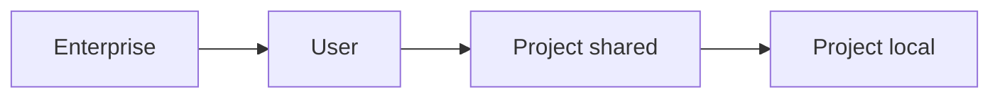

<LevelBadge level="intermediate" />

<VerifyNote lastVerified="2026-06-20" source="https://code.claude.com/docs/en/settings">
Die genauen Schlüssel und Dateispeicherorte bestätigst du am besten in der offiziellen Claude-Code-Einstellungsdokumentation.
</VerifyNote>

`settings.json` ist der Ort, an dem die Konfiguration von Claude Code lebt — [Berechtigungen](/docs/claude-code/permissions), [Hooks](/docs/claude-code/hooks), Umgebungsvariablen, Modell-Voreinstellungen und mehr. Die **Ebenen** zu verstehen ist der Schlüssel.

## Die Ebenen (am-globalsten → am-spezifischsten)

Spätere (spezifischere) Ebenen überschreiben frühere:

1. **Enterprise / managed** — von einem Org-Admin gesetzte Richtlinie. Schlägt alles.
2. **User** — `~/.claude/settings.json`. Deine Voreinstellungen über alle Projekte.
3. **Projekt (geteilt)** — `.claude/settings.json`, ins Repo committet. Teamweit.
4. **Projekt (persönlich)** — `.claude/settings.local.json`, git-ignoriert. Deine Überschreibungen für dieses Repo.

:::tip Committe die geteilte Datei, ignoriere die lokale
Lege Team-Konventionen in `.claude/settings.json` (committet) ab. Lege persönliche Feinjustierungen und maschinenspezifische Pfade in `.claude/settings.local.json` (git-ignoriert) ab. So bleibt das Team konsistent, ohne anderen deine Vorlieben aufzuzwingen.
:::

## Was du häufig einstellen wirst

- **`permissions`** — allow-/ask-/deny-Regeln. Siehe [Berechtigungen](/docs/claude-code/permissions).
- **`hooks`** — Befehle, die bei Lebenszyklus-Ereignissen laufen. Siehe [Hooks](/docs/claude-code/hooks).
- **`env`** — Umgebungsvariablen für die Session.
- **Modell-/Verhaltens-Voreinstellungen** — z. B. das bevorzugte Modell.

## Sicher bearbeiten

- Halte es gültig als JSON (ein nachgestelltes Komma macht es kaputt).
- Bevorzuge **enge** Berechtigungsregeln gegenüber breiten.
- Lege niemals Geheimnisse in eine committete Datei — nutze `env`-Referenzen oder einen Secrets-Manager.

Sofort kopierbare Startdateien findest du in den [Hooks- & settings.json-Rezepten](/docs/templates/hooks-settings).

## Weiter

- [Berechtigungen & Berechtigungsmodi](/docs/claude-code/permissions)
- [Hooks: Deterministische Automatisierung](/docs/claude-code/hooks)
- [Eigene Slash-Befehle](/docs/claude-code/slash-commands)
