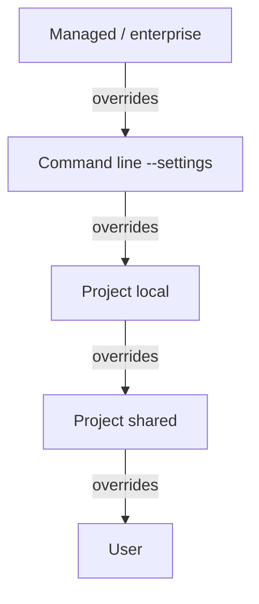

<LevelBadge level="intermediate" />

<VerifyNote lastVerified="2026-09-23" source="https://code.claude.com/docs/en/settings">
Fünfstufiger Vorrangstapel (verwaltet → Befehlszeile → Projekt lokal → Projekt gemeinsam → Benutzer) und die Regel "Umgebungsvariablen sind keine Ebene" von der offiziellen Seite [Settings files and precedence](https://code.claude.com/docs/en/settings). Overrides pro Schlüssel sind in der [Einstellungsreferenz](https://code.claude.com/docs/en/settings-reference) aufgeführt.
</VerifyNote>

`settings.json` ist der Ort, an dem die Konfiguration von Claude Code lebt — [Berechtigungen](/docs/claude-code/permissions), [Hooks](/docs/claude-code/hooks), Umgebungsvariablen, Modell-Voreinstellungen und mehr. Die **Ebenen** zu verstehen ist der Schlüssel.

## Die Ebenen (höchster Vorrang zuerst)

Wenn derselbe Schlüssel an mehreren Stellen gesetzt ist, verwendet Claude Code den Wert der höchsten Ebene, die ihn setzt:

1. **Verwaltet / Enterprise** — `managed-settings.json`, eine MDM-Richtlinie oder servergesteuerte Einstellungen aus der claude.ai-Konsole. Nichts, was du setzt, überschreibt sie (abgesehen von einigen sicherheitsrelevanten Ausnahmen).
2. **Befehlszeile** — `claude --settings '<json-or-path>'`, nur für eine Sitzung. Steht über jeder Datei außer der verwalteten und schreibt in keine Datei.
3. **Projekt (persönlich)** — `.claude/settings.local.json`, von Git ignoriert. Deine Overrides für dieses Repository.
4. **Projekt (gemeinsam)** — `.claude/settings.json`, im Repository versioniert. Teamweit.
5. **Benutzer** — `~/.claude/settings.json`. Deine Standardwerte über alle Projekte hinweg.

```mermaid
flowchart TB
  M[Managed / enterprise] -->|overrides| C[Command line --settings]
  C -->|overrides| L[Project local]
  L -->|overrides| P[Project shared]
  P -->|overrides| U[User]
```

:::note Umgebungsvariablen sind keine Ebene
Sie stehen außerhalb dieses Stapels und werden pro Schlüssel aufgelöst. Zum Beispiel gilt `ANTHROPIC_MODEL` vor dem Schlüssel `model` aus jeder Datei, während `ANTHROPIC_DEFAULT_MODEL` nur greift, wenn keine Datei `model` setzt.
:::

:::tip Committe die geteilte Datei, ignoriere die lokale
Lege Team-Konventionen in `.claude/settings.json` (committet) ab. Lege persönliche Feinjustierungen und maschinenspezifische Pfade in `.claude/settings.local.json` (git-ignoriert) ab. So bleibt das Team konsistent, ohne anderen deine Vorlieben aufzuzwingen.
:::

## Was du häufig einstellen wirst

- **`permissions`** — allow-/ask-/deny-Regeln. Siehe [Berechtigungen](/docs/claude-code/permissions).
- **`hooks`** — Befehle, die bei Lebenszyklus-Ereignissen laufen. Siehe [Hooks](/docs/claude-code/hooks).
- **`env`** — Umgebungsvariablen für die Session.
- **Modell-/Verhaltens-Voreinstellungen** — z. B. das bevorzugte Modell.

## Sicher bearbeiten

- Halte es gültig als JSON (ein nachgestelltes Komma macht es kaputt).
- Bevorzuge **enge** Berechtigungsregeln gegenüber breiten.
- Lege niemals Geheimnisse in eine committete Datei — nutze `env`-Referenzen oder einen Secrets-Manager.

Sofort kopierbare Startdateien findest du in den [Hooks- & settings.json-Rezepten](/docs/templates/hooks-settings).

## Weiter

- [Berechtigungen & Berechtigungsmodi](/docs/claude-code/permissions)
- [Hooks: Deterministische Automatisierung](/docs/claude-code/hooks)
- [Eigene Slash-Befehle](/docs/claude-code/slash-commands)
