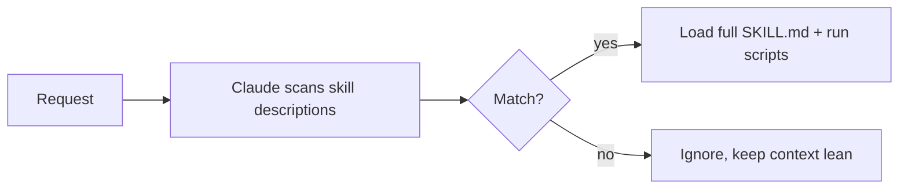

<LevelBadge level="advanced" />

<VerifyNote lastVerified="2026-06-20" source="https://code.claude.com/docs/en/skills">
Das Datei-Layout von Skills und wo Skills laufen (Claude Code, Claude.ai, Cowork) entwickeln sich weiter — überprüfe das in der offiziellen Skills-Dokumentation.
</VerifyNote>

Ein **Skill** verpackt Expertise — Anweisungen plus optionale Skripte und Ressourcen —, die Claude **nur dann lädt, wenn sie relevant ist**. Statt alles in die [CLAUDE.md](/docs/claude-code/claude-md) zu stopfen, gibst du Claude eine Bibliothek von Fähigkeiten, die es bei Bedarf hinzuzieht.

## Anatomie

Ein Skill ist ein Ordner mit einer `SKILL.md`: YAML-Frontmatter + Anweisungen.

```markdown
---
name: pdf-forms
description: Use when the user needs to fill, read, or generate PDF forms.
---

# PDF Forms
Steps and rules for working with PDF forms…
(optionally reference scripts/ or resources/ in this folder)
```

Die **`description` ist der Auslöser** — Claude liest sie, um zu entscheiden, *wann* der Skill aktiviert wird. Schreibe sie als "Use when…", spezifisch genug, dass sie zur richtigen Zeit geladen wird und sonst nicht.

## Progressive Offenlegung (warum Skills skalieren)

Claude lädt nicht den vollständigen Inhalt jedes Skills im Voraus — es sieht das leichtgewichtige `name` + `description` und zieht die vollständigen Anweisungen (und führt Skripte aus) erst hinzu, wenn eine Anfrage passt. Das hält den Kontext schlank, auch bei vielen installierten Skills.



## Wo sie liegen

- Persönlich: `~/.claude/skills/<name>/SKILL.md`
- Projekt (teilbar): `.claude/skills/<name>/SKILL.md`
- Gebündelt in einem [Plugin](/docs/claude-code/plugins-marketplaces) zur Team-Verteilung.

AILmanac liefert [7 fertige Skill-Pakete](/docs/templates/skills) — kopiere eines hinein, um es auszuprobieren.

## Skill vs. Befehl vs. Subagent vs. MCP

| Werkzeug | Was es ist | Du vs. Claude löst aus |
|---|---|---|
| [Slash-Befehl](/docs/claude-code/slash-commands) | Eine gespeicherte Eingabeaufforderung | **Du** rufst ihn auf |
| **Skill** | Expertise auf Abruf + Skripte | **Claude** lädt ihn, wenn relevant |
| [Subagent](/docs/claude-code/subagents) | Ein delegierter Agent mit eigenem Kontext | Claude delegiert |
| [MCP](/docs/claude-code/mcp) | Eine Verbindung zu externen Werkzeugen/Daten | Stellt aufrufbare Werkzeuge bereit |

## Weiter

- [Schreibe deinen ersten Skill (Walkthrough)](/docs/walkthroughs/first-skill)
- [SKILL.md-Vorlagen](/docs/templates/skills)
- [Plugins & Marketplaces](/docs/claude-code/plugins-marketplaces)
