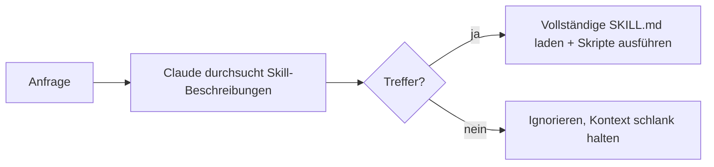

<LevelBadge level="advanced" />

<VerifyNote lastVerified="2026-06-23" source="https://code.claude.com/docs/en/skills">
Das Datei-Layout von Skills, die progressive Offenlegung und wo Skills laufen (Claude Code, Claude.ai, Cowork) entwickeln sich weiter — überprüfe sie in der offiziellen Skills-Dokumentation.
</VerifyNote>

Ein **Skill** verpackt Expertise — Anweisungen plus optionale Skripte und Ressourcen —, die Claude **nur dann lädt, wenn sie relevant ist**. Statt alles in die [CLAUDE.md](/docs/claude-code/claude-md) zu stopfen, gibst du Claude eine Bibliothek von Fähigkeiten, die es bei Bedarf hinzuzieht.

## Anatomie

Ein Skill ist ein Ordner mit einer `SKILL.md`: YAML-Frontmatter + Anweisungen.

```markdown
---
name: pdf-forms
description: Use when the user needs to fill, read, or generate PDF forms.
---

# PDF Forms
Steps and rules for working with PDF forms…
(optionally reference scripts/ or resources/ in this folder)
```

Die **`description` ist der Auslöser** — Claude liest sie, um zu entscheiden, *wann* der Skill aktiviert wird. Schreibe sie als "Use when…", spezifisch genug, dass sie zur richtigen Zeit geladen wird und sonst nicht.

## Progressive Offenlegung (warum Skills skalieren)

Claude lädt nicht den vollständigen Inhalt jedes Skills im Voraus — es sieht das leichtgewichtige `name` + `description` und zieht die vollständigen Anweisungen (und führt Skripte aus) erst hinzu, wenn eine Anfrage passt. Das hält den Kontext schlank, auch bei vielen installierten Skills.



## Wo sie liegen

- Persönlich: `~/.claude/skills/<name>/SKILL.md`
- Projekt (teilbar): `.claude/skills/<name>/SKILL.md`
- Gebündelt in einem [Plugin](/docs/claude-code/plugins-marketplaces) zur Team-Verteilung.

AILmanac liefert [7 fertige Skill-Pakete](/docs/templates/skills) — kopiere eines hinein, um es auszuprobieren.

## Praxisbeispiel: ein Skill, der sich selbst auslöst

Erstelle `~/.claude/skills/release-notes/SKILL.md`:

```markdown
---
name: release-notes
description: Use when the user asks to write release notes or a changelog from git history.
---

# Release Notes
1. Run `git log <last-tag>..HEAD --oneline` to get the commits.
2. Group them into Features / Fixes / Breaking changes.
3. Write user-facing notes — what changed for *users*, not commit messages.
4. Output Markdown ready to paste into a GitHub release.
```

Später tippst du: *"Entwirf Release Notes seit v1.4."* Claude hatte diese Schritte nie im Kontext — aber die Anfrage passt zur `description`, also zieht es die vollständige `SKILL.md` hinzu, führt das `git log` aus und erzeugt gruppierte Notizen. Du hast nichts beim Namen aufgerufen; die **description hat das Routing übernommen**. Füge eine `scripts/`-Datei im selben Ordner hinzu, und der Skill kann sie als Teil von Schritt 1 ausführen.

## Skill vs. Befehl vs. Subagent vs. MCP

| Werkzeug | Was es ist | Du vs. Claude löst aus |
|---|---|---|
| [Slash-Befehl](/docs/claude-code/slash-commands) | Eine gespeicherte Eingabeaufforderung | **Du** rufst ihn auf |
| **Skill** | Expertise auf Abruf + Skripte | **Claude** lädt ihn, wenn relevant |
| [Subagent](/docs/claude-code/subagents) | Ein delegierter Agent mit eigenem Kontext | Claude delegiert |
| [MCP](/docs/claude-code/mcp) | Eine Verbindung zu externen Werkzeugen/Daten | Stellt aufrufbare Werkzeuge bereit |

Faustregel: **Du** willst es bei Bedarf auslösen → Slash-Befehl. **Claude** soll die Vorgehensweise kennen und sie anwenden, wenn relevant → Skill. Die Arbeit soll in einem separaten Kontext stattfinden → Subagent. Du musst ein externes System erreichen → MCP.

## Häufige Fehler

- **Eine Beschreibung, die nicht auslöst.** "Helps with PDFs" ist zu vage; "Use when the user needs to fill, read, or generate PDF forms" sagt Claude genau, wann es zu laden ist. Die Beschreibung ist der gesamte Aktivierungsmechanismus — schreibe sie zum Abgleich, nicht für Menschen.
- **Stattdessen alles in die CLAUDE.md packen.** Die [CLAUDE.md](/docs/claude-code/claude-md) lädt in *jeder* Session und kostet immer Kontext; ein Skill lädt *nur, wenn relevant*. Verschiebe situative Vorgehensweisen in Skills und behalte die CLAUDE.md für stets gültige Projektregeln.
- **Ein einziger riesiger Skill.** Viele kleine, scharf beschriebene Skills routen besser als ein Allzweck-Skill — progressive Offenlegung hilft nur, wenn jede Beschreibung spezifisch ist.
- **Vergessen, dass er teilbar ist.** Ein Projekt-Skill in `.claude/skills/`, in git eingecheckt, gibt dem ganzen Team die Fähigkeit; ein persönlicher in `~/.claude/skills/` bleibt deiner.

## Weiter

- [Schreibe deinen ersten Skill (Walkthrough)](/docs/walkthroughs/first-skill)
- [SKILL.md-Vorlagen](/docs/templates/skills)
- [Plugins & Marketplaces](/docs/claude-code/plugins-marketplaces)
