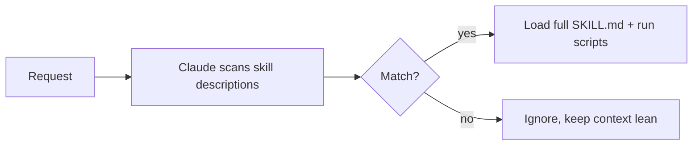

<LevelBadge level="advanced" />

<VerifyNote lastVerified="2026-06-23" source="https://code.claude.com/docs/en/skills">
Der Aufbau von Skill-Dateien, die progressive Offenlegung und wo Skills laufen (Claude Code, Claude.ai, Cowork) entwickeln sich weiter — prüfe es in der offiziellen Skills-Dokumentation.
</VerifyNote>

<Callout type="objectives" items={["Definieren, was ein Skill ist und wie er sich davon unterscheidet, alles in CLAUDE.md zu stopfen", "Eine SKILL.md lesen und schreiben — Frontmatter plus Anweisungen — und verstehen, warum die Beschreibung der Auslöser ist", "Progressive Offenlegung erklären und warum sie viele Skills skalieren lässt, ohne den Kontext aufzublähen", "Die drei Orte kennen, an denen Skills leben: persönlich, Projekt und in einem Plugin gebündelt", "Richtig wählen zwischen Skill, Slash-Befehl, Subagent und MCP", "Die vier häufigen Fehler vermeiden, die Skills am Auslösen hindern"]} />

Ein **Skill** verpackt Expertise — Anweisungen plus optionale Skripte und Ressourcen — die Claude **nur lädt, wenn sie relevant ist**. Statt alles in [CLAUDE.md](/docs/claude-code/claude-md) zu stopfen, gibst du Claude eine Bibliothek von Fähigkeiten, die es bei Bedarf hereinholt.

## Anatomie

Ein Skill ist ein Ordner mit einer `SKILL.md`: YAML-Frontmatter + Anweisungen.

```markdown
---
name: pdf-forms
description: Use when the user needs to fill, read, or generate PDF forms.
---

# PDF Forms
Steps and rules for working with PDF forms…
(optionally reference scripts/ or resources/ in this folder)
```

<Callout type="tip" items={["Die Beschreibung ist der Auslöser — Claude liest sie, um zu entscheiden, wann der Skill zu aktivieren ist. Schreib sie als \"Use when…\", spezifisch genug, damit sie zur richtigen Zeit lädt und sonst nicht."]} />

## Progressive Offenlegung (warum Skills skalieren)

Claude lädt nicht den vollen Körper jedes Skills im Voraus — es sieht den leichtgewichtigen `name` + `description` und holt die vollen Anweisungen (und führt Skripte aus) nur, wenn eine Anfrage passt. Das hält den Kontext schlank, selbst mit vielen installierten Skills.



## Wo sie leben

<Steps items={[{title:"Persönlich", body:"~/.claude/skills/<name>/SKILL.md — bleibt deins, verfügbar über alle deine Projekte."},{title:"Projekt (teilbar)", body:".claude/skills/<name>/SKILL.md — committe es nach git und das ganze Team bekommt die Fähigkeit."},{title:"In einem Plugin gebündelt", body:"Pack Skills in ein Plugin zur Team-Verteilung. Siehe Plugins & Marktplätze."}]} />

AILmanac liefert [7 fertige Skill-Pakete](/docs/templates/skills) — kopier eines hinein, um es auszuprobieren.

## Praxisbeispiel: ein Skill, der sich selbst auslöst

Erstelle `~/.claude/skills/release-notes/SKILL.md`:

```markdown
---
name: release-notes
description: Use when the user asks to write release notes or a changelog from git history.
---

# Release Notes
1. Run `git log <last-tag>..HEAD --oneline` to get the commits.
2. Group them into Features / Fixes / Breaking changes.
3. Write user-facing notes — what changed for *users*, not commit messages.
4. Output Markdown ready to paste into a GitHub release.
```

Später tippst du den Prompt unten. Claude hatte diese Schritte nie im Kontext — aber die Anfrage passt zur `description`, also holt es die volle `SKILL.md`, führt das `git log` aus und produziert gruppierte Notizen. Du hast nichts namentlich aufgerufen; die **Beschreibung hat das Routing übernommen**. Füge eine `scripts/`-Datei im selben Ordner hinzu und der Skill kann sie als Teil von Schritt 1 ausführen.

<PromptCard title="Den Skill durch Absicht auslösen — kein Name nötig">{`Draft release notes since v1.4.`}</PromptCard>

## Skill vs. Befehl vs. Subagent vs. MCP

| Tool | Was es ist | Du vs. Claude löst aus |
|---|---|---|
| [Slash-Befehl](/docs/claude-code/slash-commands) | Ein gespeicherter Prompt | **Du** rufst ihn auf |
| **Skill** | Expertise auf Abruf + Skripte | **Claude** lädt ihn, wenn relevant |
| [Subagent](/docs/claude-code/subagents) | Ein delegierter Agent mit eigenem Kontext | Claude delegiert |
| [MCP](/docs/claude-code/mcp) | Eine Verbindung zu externen Tools/Daten | Stellt Tools zum Aufrufen bereit |

<Callout type="takeaways" items={["Du willst es auf Abruf auslösen → Slash-Befehl.", "Claude soll die Prozedur kennen und sie anwenden, wenn relevant → Skill.", "Die Arbeit soll in einem separaten Kontext passieren → Subagent.", "Du musst ein externes System erreichen → MCP."]} />

## Häufige Fehler

<Callout type="warning" items={["Eine Beschreibung, die nicht auslöst. \"Hilft mit PDFs\" ist zu vage; \"Use when the user needs to fill, read, or generate PDF forms\" sagt Claude genau, wann es zu laden ist. Die Beschreibung ist der ganze Aktivierungsmechanismus — schreib sie fürs Matching, nicht für Menschen.", "Stattdessen alles in CLAUDE.md zu packen. CLAUDE.md lädt in jeder Sitzung und kostet immer Kontext; ein Skill lädt nur, wenn relevant. Verschieb situative Prozeduren in Skills und halte CLAUDE.md für immer-wahre Projektregeln.", "Ein riesiger Skill. Viele kleine, scharf beschriebene Skills routen besser als ein Allzweck-Skill — progressive Offenlegung hilft nur, wenn jede Beschreibung spezifisch ist.", "Vergessen, dass er teilbar ist. Ein Projekt-Skill in .claude/skills/, nach git committet, gibt dem ganzen Team die Fähigkeit; ein persönlicher in ~/.claude/skills/ bleibt deins."]} />

## Die Begriffe wiederholen

<Flashcards cards={[{front:"Was ist ein Skill?", back:"Ein Ordner mit einer SKILL.md, der Anweisungen plus optionale Skripte und Ressourcen verpackt, den Claude nur lädt, wenn relevant."},{front:"Was ist der Auslöser für einen Skill?", back:"Das description-Feld — Claude liest es, um zu entscheiden, wann der Skill zu aktivieren ist. Schreib es als \"Use when…\", spezifisch genug, um zur richtigen Zeit zu laden und sonst nicht."},{front:"Was ist progressive Offenlegung?", back:"Claude sieht nur den leichtgewichtigen name + description im Voraus und holt die volle SKILL.md (und führt Skripte aus) nur, wenn eine Anfrage passt — was den Kontext schlank hält, selbst mit vielen Skills."},{front:"Persönlich vs. Projekt — Skill-Speicherort?", back:"Persönlich: ~/.claude/skills/<name>/SKILL.md (bleibt deins). Projekt: .claude/skills/<name>/SKILL.md (nach git committen, um mit dem Team zu teilen)."},{front:"Skill vs. Slash-Befehl?", back:"Du rufst einen Slash-Befehl auf Abruf auf; Claude lädt einen Skill automatisch, wenn die Anfrage zu seiner Beschreibung passt."},{front:"Skill vs. CLAUDE.md?", back:"CLAUDE.md lädt in jeder Sitzung und kostet immer Kontext; ein Skill lädt nur, wenn relevant. Halte immer-wahre Regeln in CLAUDE.md, situative Prozeduren in Skills."}]} />

## Teste dich selbst

<Quiz title="Teste dich selbst" questions={[{q:"Was entscheidet in einer SKILL.md tatsächlich, wann Claude den Skill aktiviert?", options:["Der Ordnername","Das description-Feld im Frontmatter","Die erste Überschrift im Körper","Manuelle Aktivierung durch den Nutzer"], answer:1, explain:"Die Beschreibung ist der Auslöser — Claude liest sie, um zu entscheiden, wann der Skill zu aktivieren ist. Schreib sie als \"Use when…\", spezifisch genug, um zur richtigen Zeit zu laden."},{q:"Was ist progressive Offenlegung?", options:["Claude lädt den vollen Körper jedes Skills im Voraus","Claude sieht nur name + description und lädt die volle SKILL.md nur, wenn eine Anfrage passt","Skills offenbaren ihre Schritte dem Nutzer Zeile für Zeile","CLAUDE.md wird über eine Sitzung hinweg schrittweise geladen"], answer:1, explain:"Progressive Offenlegung bedeutet, dass Claude den leichtgewichtigen name + description sieht und die vollen Anweisungen (und Skripte) nur holt, wenn eine Anfrage passt — was den Kontext schlank hält, selbst mit vielen installierten Skills."},{q:"Du willst, dass das GANZE TEAM eine Fähigkeit über git bekommt. Wohin packst du den Skill?", options:["~/.claude/skills/<name>/SKILL.md","/etc/claude/skills/","\.claude/skills/<name>/SKILL.md nach git committet","In CLAUDE.md"], answer:2, explain:"Ein Projekt-Skill in .claude/skills/, nach git committet, gibt dem ganzen Team die Fähigkeit; ein persönlicher in ~/.claude/skills/ bleibt deins."},{q:"Du willst etwas selbst, auf Abruf, namentlich auslösen. Welches Tool passt?", options:["Skill","Slash-Befehl","Subagent","MCP"], answer:1, explain:"Faustregel: Du willst es auf Abruf auslösen → Slash-Befehl. Claude lädt eine Prozedur, wenn relevant → Skill; separater Kontext → Subagent; ein externes System erreichen → MCP."},{q:"Warum einen Skill einer situativen Prozedur in CLAUDE.md vorziehen?", options:["CLAUDE.md kann keine Prozeduren enthalten","CLAUDE.md lädt in jeder Sitzung und kostet immer Kontext, während ein Skill nur lädt, wenn relevant","Skills laufen schneller als CLAUDE.md","CLAUDE.md kann nicht über git geteilt werden"], answer:1, explain:"CLAUDE.md lädt in jeder Sitzung und kostet immer Kontext; ein Skill lädt nur, wenn relevant. Verschieb situative Prozeduren in Skills und halte CLAUDE.md für immer-wahre Projektregeln."}]} />

## Weiter

- [Schreib deinen ersten Skill (Walkthrough)](/docs/walkthroughs/first-skill)
- [SKILL.md-Templates](/docs/templates/skills)
- [Plugins & Marktplätze](/docs/claude-code/plugins-marketplaces)
