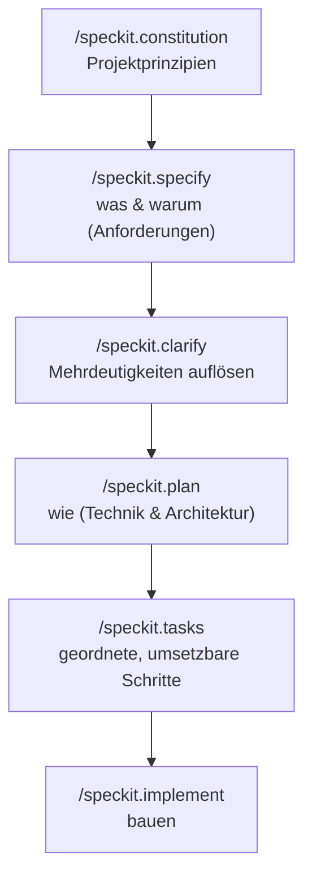

<LevelBadge level="intermediate" />

# Spec-getriebene Entwicklung mit Spec Kit

Vibe-Coding — „Bau mir ein Dashboard“, und nimm einfach an, was zurückkommt — funktioniert wunderbar, bis das Feature groß wird. Dann driftet der Agent ab: Er vergisst eine frühere Entscheidung, erfindet eine Funktion neu oder liefert etwas, das technisch läuft, aber nicht das ist, was du gemeint hast. **Spec-getriebene Entwicklung (Spec-Driven Development, SDD)** ist die Lösung, die sich 2026 in der Agentic-Coding-Szene durchgesetzt hat: Statt den Prompt als Wegwerfware zu behandeln, machst du eine **geschriebene, prüfbare Spezifikation zur einzigen Wahrheitsquelle** und lässt den Agenten Code *daraus* generieren.

GitHubs Open-Source-Werkzeug **[Spec Kit](https://github.com/github/spec-kit)** macht aus dieser Idee einen konkreten Workflow, den du heute direkt in Claude Code ausführen kannst.

<Callout type="objectives" items={["Verstehen, was spec-getriebene Entwicklung ist und welches Problem sie löst", "Die Spec-Kit-Phasen durchgehen: constitution → specify → plan → tasks → implement", "Die Specify-CLI installieren und in Claude Code einbinden", "Die optionalen Qualitäts-Gates kennen (clarify, analyze, checklist)", "Entscheiden, wann sich SDD trotz Mehraufwand lohnt und wann nicht"]} />

<VerifyNote lastVerified="2026-06-28" source="https://github.com/github/spec-kit">
Spec Kit entwickelt sich schnell (~116k★, MIT-lizenziert). Befehlsnamen, das `specify init`-Flag zur Agentenauswahl und die unterstützten Tools ändern sich zwischen Releases — bestätige den aktuellen Quickstart im Repo-README, bevor du dich auf eine exakte Syntax verlässt. Die unten stehenden Slash-Command-Namen verwenden den `/speckit.*`-Namespace, der in jüngeren Releases eingeführt wurde.
</VerifyNote>

## Warum Specs statt nur Prompts

Ein Prompt ist verschwunden, sobald der Turn endet. Eine **Spec ist ein Artefakt**: Sie kann gelesen, in einem PR geprüft, korrigiert und erneut ausgeführt werden. Diese eine Verschiebung behebt die drei Arten, auf die große agentische Builds schiefgehen:

- **Drift** — der Agent widerspricht einer früheren Entscheidung, weil sie nirgends festgehalten wurde. Die Spec ist das Gedächtnis.
- **Mehrdeutigkeit** — „mach es schön“ bedeutet zehn verschiedene Dinge. Anforderungen in Prosa zu zwingen, deckt die Lücken *auf*, bevor Code existiert, wo sie billig zu beheben sind.
- **Nicht prüfbare Diffs** — ein generierter PR mit 2.000 Zeilen ist schwer zu beurteilen. Eine geprüfte Spec + ein geprüfter Plan machen den Diff *erwartbar* statt überraschend.

Das mentale Modell: **Intent ist das wertvolle, langlebige Ding; Code ist ein nachgelagertes, regenerierbares Artefakt.** SDD ist der disziplinierte Cousin von Claude Codes eigenem [Plan Mode](/docs/claude-code/plan-mode) — erst planen, dann bauen — hochskaliert auf ein ganzes Feature und in Dateien deines Repos festgehalten.

## Der Spec-Kit-Workflow

Spec Kit strukturiert ein Feature als kurze Pipeline von Slash-Commands. Jeder davon schreibt Markdown-Artefakte in dein Repo (unter `.specify/`), sodass jede Phase einsehbar und versionskontrolliert ist.

<Steps items={[{title: "Constitution", body: "Führe /speckit.constitution einmal pro Projekt aus. Es schreibt leitende Prinzipien — Code-Stil, Test-Anspruch, architektonische Nicht-Verhandelbares — in .specify/memory/constitution.md. Jede spätere Phase wird dagegen geprüft, das ist also dein dauerhaftes Leitplanken-Element (denk daran wie an eine CLAUDE.md, die sich auf Prinzipien fokussiert)."}, {title: "Specify", body: "Führe /speckit.specify aus und beschreibe, WAS du baust und WARUM — User Stories, Anforderungen, Erfolgskriterien. Bewusst NICHT den Tech-Stack. Der Agent erzeugt eine strukturierte Spec, die du liest und korrigierst, bevor es weitergeht."}, {title: "Plan", body: "Führe /speckit.plan mit deinen technischen Entscheidungen aus — Framework, Datenspeicher, Einschränkungen. Jetzt wird das WIE geschrieben: Architektur, Komponenten und wie sie die Spec erfüllen. Technische Entscheidungen leben hier, nicht in der Spec, damit die Spec implementierungsagnostisch bleibt."}, {title: "Tasks", body: "Führe /speckit.tasks aus, um den Plan in eine nummerierte, geordnete Liste kleiner, einzeln prüfbarer Schritte aufzubrechen. Das macht den Build auditierbar — du siehst die Abfolge, bevor irgendein Code geschrieben wird."}, {title: "Implement", body: "Führe /speckit.implement aus, und der Agent arbeitet die Aufgabenliste ab und baut das Feature gegen den Plan und die Constitution. Weil jede vorherige Phase geprüft wurde, ist der resultierende Diff erwartbar, keine Überraschung."}]} />

### Optionale Qualitäts-Gates

Drei weitere Befehle ziehen die Schleife enger, wenn ein Feature folgenreich ist:

- **`/speckit.clarify`** — durchleuchtet die Spec nach unzureichend spezifizierten Bereichen und stellt dir gezielte Fragen *vor* der Planung. Am besten direkt nach `specify` ausführen.
- **`/speckit.analyze`** — gleicht Spec, Plan und Tasks auf Konsistenz und Abdeckungslücken ab.
- **`/speckit.checklist`** — erzeugt eine Validierungs-Checkliste, damit „fertig“ definiert und testbar ist.

<Callout type="tip" items={["Führe /speckit.clarify vor /speckit.plan aus — Mehrdeutigkeit zu beheben ist am billigsten, bevor die Architektur festgelegt ist.", "Behandle jedes generierte Artefakt wie einen PR: lies es, korrigiere es, und gehe erst dann zur nächsten Phase weiter.", "Committe die .specify/-Artefakte — sie sind die prüfbare Aufzeichnung der Intention hinter dem Code."]} />

## Mit Claude Code zum Laufen bringen

Spec Kit liefert eine CLI, **Specify**, die die Slash-Commands in dein Projekt scaffoldet. Sie unterstützt über 30 Coding-Agenten, Claude Code darunter.

<Steps items={[{title: "Die Specify-CLI installieren", body: "Verwende uv, um sie aus dem Repo zu installieren. (Python + uv erforderlich.)"}, {title: "Ein Projekt initialisieren", body: "Scaffolde die .specify/-Struktur und die Agenten-Befehle. Führe init in einem neuen oder bestehenden Repo aus; wähle bei der Abfrage Claude Code als deinen Agenten (oder übergib das aktuelle Integrations-Flag aus dem README)."}, {title: "Claude Code öffnen und die Befehle prüfen", body: "Starte claude im Projektordner. Du erkennst, dass alles verdrahtet ist, wenn /speckit.constitution, /speckit.specify, /speckit.plan, /speckit.tasks und /speckit.implement als Slash-Commands erscheinen."}]} />

<PromptCard title="Install the Specify CLI (uv)">{`uv tool install specify-cli --from git+https://github.com/github/spec-kit.git`}</PromptCard>

<PromptCard title="Scaffold spec-driven workflow into a project">{`# new project
specify init my-feature

# or in the current repo
specify init --here`}</PromptCard>

<PromptCard title="Then, inside Claude Code, run the pipeline">{`/speckit.constitution Establish principles: TypeScript strict, tests for every public function, no secrets in code.
/speckit.specify Build a CSV export for the reports page: users pick a date range and download a CSV of matching rows.
/speckit.clarify
/speckit.plan Next.js App Router, server action for the query, stream the CSV; no new dependencies.
/speckit.tasks
/speckit.implement`}</PromptCard>

<Callout type="warning" items={["Das genaue Flag zur Agentenauswahl für specify init ändert sich zwischen Releases — prüfe den README-Quickstart, statt ein Flag blind zu kopieren.", "SDD macht die Notwendigkeit der Verifikation nicht überflüssig: lies den generierten Code und führe ihn aus. Die Spec macht den Diff prüfbar, nicht automatisch korrekt.", "Lege niemals Secrets oder Zugangsdaten in der Spec, im Plan oder in der Constitution ab — sie werden wie jede andere Datei committet."]} />

## Wann man es nutzt (und wann nicht)

SDD tauscht anfängliche Zeremonie gegen Kontrolle. Dieser Tausch lohnt sich, wenn die Arbeit groß, mehrdeutig oder von anderen geprüft werden muss — und ist reiner Mehraufwand, wenn nicht.

<Callout type="info" items={["Greif zu SDD: Greenfield-Features, Multi-File-Builds, alles, was ein Teammitglied prüfen muss, oder Arbeit, die du an eine Subagenten-Flotte übergibst.", "Überspring SDD: einmalige Skripte, winzige Fixes, explorativer Wegwerf-Code — ein einfacher Prompt oder der Plan Mode ist schneller.", "Brownfield funktioniert auch: richte /speckit.specify auf eine Erweiterung einer bestehenden Codebasis, nicht nur auf neue Projekte."]} />

<Flashcards title="SDD at a glance" cards={[{front: "Was ist die Wahrheitsquelle bei SDD?", back: "Die geschriebene Spezifikation. Code ist ein regenerierbares Artefakt, das ihr nachgelagert ist."}, {front: "Was macht /speckit.constitution?", back: "Schreibt dauerhafte Projektprinzipien (Stil, Test-Anspruch, Architekturregeln), gegen die jede spätere Phase geprüft wird."}, {front: "Wohin gehören Tech-Stack-Entscheidungen?", back: "In /speckit.plan — nicht in die Spec. Die Spec bleibt implementierungsagnostisch (was & warum); der Plan ist das Wie."}, {front: "Was macht einen Spec-Kit-Build auditierbar?", back: "/speckit.tasks erzeugt eine geordnete, prüfbare Aufgabenliste, bevor irgendein Code geschrieben wird, und jede Phase schreibt einsehbare Markdown-Artefakte."}, {front: "Wann sollte man SDD NICHT verwenden?", back: "Einmalige Skripte, winzige Fixes oder Wegwerf-Exploration — die Zeremonie kostet mehr, als sie spart."}]} />

## Teste dich selbst

<Quiz title="Check yourself" questions={[{q: "Was ist die Kernidee der spec-getriebenen Entwicklung?", options: ["Detailliertere Einmal-Prompts schreiben", "Eine prüfbare Spezifikation zur Wahrheitsquelle machen und Code daraus generieren", "Die Planung überspringen und den Agenten improvisieren lassen"], answer: 1, explain: "SDD behandelt die Intention als das langlebige, wertvolle Artefakt und Code als nachgelagerte, regenerierbare Ausgabe — das Gegenteil von Wegwerf-Prompt-Vibe-Coding."}, {q: "Welche Spec-Kit-Phase sollte den Technologie-Stack und die Architektur erfassen?", options: ["/speckit.specify", "/speckit.plan", "/speckit.constitution"], answer: 1, explain: "specify beschreibt das WAS und WARUM (implementierungsagnostisch); plan ist der Ort, an dem das WIE — Framework, Datenspeicher, Architektur — entschieden wird."}, {q: "Wann lohnt sich spec-getriebene Entwicklung den Mehraufwand NICHT?", options: ["Ein Multi-File-Greenfield-Feature, das ein Teammitglied prüfen muss", "Ein Wegwerf-Einzeiler-Skript oder ein winziger Fix", "Jede Arbeit, die du an Subagenten übergibst"], answer: 1, explain: "Die anfängliche Zeremonie von SDD zahlt sich bei großer, mehrdeutiger oder geprüfter Arbeit aus. Für einen trivialen Fix ist ein einfacher Prompt oder der Plan Mode schneller."}]} />

<Callout type="takeaways" items={["Spec-getriebene Entwicklung macht eine prüfbare Spec — nicht den Prompt — zur Wahrheitsquelle und tötet damit Drift, Mehrdeutigkeit und nicht prüfbare Diffs.", "GitHubs Spec Kit (die Specify-CLI) bringt SDD als /speckit.*-Slash-Commands in Claude Code.", "Die Pipeline ist constitution → specify → (clarify) → plan → (analyze) → tasks → (checklist) → implement, wobei jede Phase einsehbare Artefakte schreibt.", "Halte das WAS/WARUM in der Spec und das WIE im Plan; prüfe jedes Artefakt wie einen PR, bevor du weitergehst.", "Nutze es für große, mehrdeutige oder geprüfte Features; überspring es bei Wegwerf-Arbeit — und verifiziere immer trotzdem den generierten Code."]} />

## Weiter

- [Plan Mode](/docs/claude-code/plan-mode) — die eingebaute, leichtgewichtigere „erst planen, dann bauen“-Schleife
- [Slash Commands](/docs/claude-code/slash-commands) — wie die /speckit.*-Befehle in Claude Codes Command-System passen
- [CLAUDE.md & Memory Files](/docs/claude-code/claude-md) — die Prinzipien-als-Gedächtnis-Idee hinter der Constitution
- [Subagents](/docs/claude-code/subagents) — übergib eine geprüfte Aufgabenliste an eine Flotte von Agenten
- [Coding & Software Development](/docs/playbooks/coding) — die Alles-verifizieren-Haltung, auf der SDD beruht

## Quellen & weiterführende Literatur

- [github/spec-kit — Toolkit for Spec-Driven Development](https://github.com/github/spec-kit) (MIT)
- [Spec Kit README & quickstart](https://github.com/github/spec-kit/blob/main/README.md)
- [Anthropic — Plan Mode in Claude Code](https://code.claude.com/docs/en/interactive-mode)
