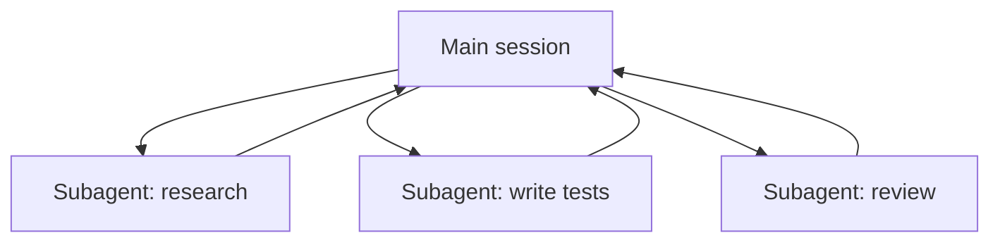

<LevelBadge level="advanced" />

<VerifyNote lastVerified="2026-06-20" source="https://code.claude.com/docs/en/sub-agents">
Die Subagenten-Konfiguration und die `/agents`-Oberfläche ändern sich mit der Zeit — überprüfe das in der offiziellen Dokumentation.
</VerifyNote>

Ein **Subagent** ist eine separate Claude-Instanz mit ihrem **eigenen Kontextfenster** und einem **abgegrenzten Werkzeugsatz**, an die deine Hauptsession ein Stück Arbeit delegiert. Er meldet ein Ergebnis zurück, nicht sein gesamtes Transkript — so bleibt die Hauptsession fokussiert und übersichtlich.

## Warum delegieren

- **Schütze den Hauptkontext.** Ein Recherche-Tauchgang oder ein großer Datei-Durchlauf kann tausende Tokens verbrauchen; mach das in einem Subagenten, und nur die Schlussfolgerung kommt zurück.
- **Spezialisieren.** Gib einem Subagenten einen zugeschnittenen System-Prompt und nur die Werkzeuge, die er braucht (z. B. einen schreibgeschützten Prüfer).
- **Parallelisieren.** Führe unabhängige Teilaufgaben gleichzeitig aus — z. B. drei Module simultan erkunden.

## Sie definieren

Subagenten werden als Markdown-Dateien mit Frontmatter konfiguriert (Name, Beschreibung, erlaubte Werkzeuge, manchmal ein Modell) und über die `/agents`-Oberfläche verwaltet. Die `description` sagt dem Hauptagenten, *wann* an ihn zu delegieren ist. Grenze Werkzeuge eng ab — ein Prüfer braucht selten Schreibzugriff.

## Wann NICHT zu parallelisieren ist

:::warning Parallelität ist nicht umsonst
- **Abhängige Schritte** müssen sequenziell sein — fächere keine Arbeit auf, bei der Schritt B die Ausgabe von Schritt A braucht.
- **Gemeinsame Dateischreibvorgänge** können kollidieren; isoliere sie (siehe [Git Worktrees](/docs/claude-code/worktrees)) oder serialisiere sie.
- **Koordinationsaufwand** kann bei kleinen Aufgaben den Nutzen übersteigen. Delegiere, wenn die Teilaufgabe umfangreich und unabhängig ist.
:::

## Subagent vs. die "Agenten" der API/des SDK

Diese Seite handelt von der eingebauten Delegation von Claude Code. Deine *eigenen* Agenten programmatisch zu bauen ist [Agenten auf der API bauen](/docs/api/building-agents). Das mentale Modell — ein Ziel, eine Tool-Schleife, isolierter Kontext — ist dasselbe.

## Weiter

- [Einen Multi-Subagenten-Workflow entwerfen (Walkthrough)](/docs/walkthroughs/multi-subagent-workflow)
- [Kontextverwaltung](/docs/claude-code/context-management)
- [Git Worktrees](/docs/claude-code/worktrees)
