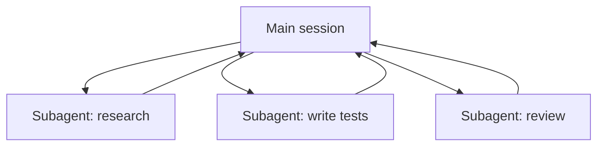

<LevelBadge level="advanced" />

<VerifyNote lastVerified="2026-06-23" source="https://code.claude.com/docs/en/sub-agents">
Die Frontmatter-Felder von Subagenten, die integrierte Agenten-Auswahl und die `/agents`-Oberfläche ändern sich im Lauf der Zeit — überprüfe sie in der offiziellen Dokumentation.
</VerifyNote>

Ein **Subagent** ist eine separate Claude-Instanz mit ihrem **eigenen Kontextfenster** und einer **abgegrenzten Menge an Werkzeugen**, an die deine Hauptsitzung einen Teil der Arbeit delegiert. Sie meldet ein Ergebnis zurück, nicht ihr gesamtes Transkript — so bleibt die Hauptsitzung fokussiert und übersichtlich.

## Warum delegieren

- **Schütze den Hauptkontext.** Ein Recherche-Tauchgang oder ein großer Datei-Durchlauf kann tausende Tokens verbrennen; mach das in einem Subagenten, und nur die Schlussfolgerung kommt zurück.
- **Spezialisiere.** Gib einem Subagenten einen zugeschnittenen System-Prompt und nur die Werkzeuge, die er braucht (z. B. einen schreibgeschützten Prüfer).
- **Parallelisiere.** Führe unabhängige Teilaufgaben gleichzeitig aus — z. B. drei Module simultan erkunden.



## Die integrierten Agenten, die du bereits hast

Bevor du eigene definierst, solltest du wissen, dass Claude Code mit Subagenten ausgeliefert wird, an die es automatisch delegiert:

- **Explore** — ein schneller, schreibgeschützter Agent (läuft auf einem günstigeren Modell), um eine Codebasis zu durchsuchen und zu verstehen, ohne sie anzufassen.
- **Plan** — sammelt Kontext während des Plan-Modus, damit die Recherche aus dem schreibgeschützten Hauptgespräch herausgehalten wird.
- **General-purpose** — ein Agent mit vollem Werkzeugumfang für komplexe, mehrstufige Arbeit, die Erkundung und Änderungen kombiniert.

Du rufst diese selten beim Namen auf; Claude greift zu ihnen, wenn eine Aufgabe passt. Eigene Subagenten sind für die Arbeiter gedacht, die *du* immer wieder mit denselben Anweisungen neu erstellst.

## Eigene definieren

Ein Subagent ist eine Markdown-Datei mit YAML-Frontmatter (der Textkörper wird zu seinem System-Prompt). Nur `name` und `description` sind erforderlich; alles andere ist optional. Lege ihn pro Projekt in `.claude/agents/` ab (checke ihn in git ein, damit das Team ihn teilt) oder pro Benutzer in `~/.claude/agents/`. Erstelle einen mit dem `/agents`-Befehl oder von Hand:

```markdown
---
name: code-reviewer
description: Expert code reviewer. Use proactively after code changes.
tools: Read, Glob, Grep
model: sonnet
---

You are a senior reviewer. Read the changed files, then report only
high-confidence issues: correctness bugs, security risks, and missing
tests. For each, show the file:line, the problem, and a concrete fix.
Do not restate what the code does. Never edit files.
```

Zwei Dinge machen einen Subagenten gut:

- **Die `description` ist das Routing-Signal.** Claude liest sie, um zu entscheiden, *wann* delegiert wird, also schreibe sie wie einen Auslöser — "Use proactively after code changes" zieht ihn automatisch heran; ein vages "helps with code" tut das nicht. Das ist die wirkungsvollste Zeile der Datei.
- **Grenze die Werkzeuge eng ab.** Das `tools`-Feld ist eine Positivliste (oder verwende `disallowedTools` als Negativliste). Ein Prüfer, der nur `Read, Glob, Grep` kann, *kann* deinen Code nicht versehentlich bearbeiten — die Einschränkung ist eine Garantie, kein Hinweis. Lässt du `tools` weg, erbt der Subagent alles, was die Hauptsitzung hat.

## Praxisbeispiel: ein paralleler Review-Fan-out

Du hast ein Feature fertiggestellt, das drei Module berührt, und möchtest jedes schnell und unabhängig prüfen. In deiner Hauptsitzung:

> "Prüfe die Änderungen in `auth/`, `billing/` und `api/` — verwende den code-reviewer-Subagenten auf jedem, parallel."

Claude erzeugt drei `code-reviewer`-Instanzen gleichzeitig. Jede liest nur ihr Modul, verbrennt ihren eigenen Kontext für die Dateiinhalte und gibt eine kurze Befundliste zurück. Deine Hauptsitzung sieht nie die rohen Diffs — nur drei ordentliche Berichte — und das Ganze ist ungefähr in der Zeit der langsamsten Einzelprüfung fertig statt in der Summe aller drei. Da der Prüfer schreibgeschützt ist, können drei gleichzeitig arbeitende Agenten nicht bei einem Schreibvorgang kollidieren.

## Wann man NICHT parallelisiert

:::warning Parallelität ist nicht umsonst
- **Abhängige Schritte** müssen sequenziell sein — fächere keine Arbeit auf, bei der Schritt B die Ausgabe von Schritt A braucht.
- **Gemeinsame Dateischreibvorgänge** können kollidieren; isoliere sie (siehe [Git Worktrees](/docs/claude-code/worktrees)) oder serialisiere sie.
- **Koordinationsaufwand** kann bei kleinen Aufgaben den Nutzen übersteigen. Delegiere, wenn die Teilaufgabe umfangreich und unabhängig ist.
:::

## Subagent vs. die "Agenten" der API/des SDK

Diese Seite handelt von der eingebauten Delegation von Claude Code. Deine *eigenen* Agenten programmatisch zu bauen ist [Agenten auf der API bauen](/docs/api/building-agents). Das mentale Modell — ein Ziel, eine Tool-Schleife, isolierter Kontext — ist dasselbe.

## Häufige Fehler

- **Eine vage `description`.** Wenn sie nicht sagt, *wann* der Subagent zu verwenden ist, delegiert Claude nicht im richtigen Moment (oder gar nicht). Beginne mit "Use when…" / "Use proactively after…".
- **Werkzeuge weit offen lassen.** Ein Subagent, der prüfen soll, sollte nicht schreiben können. Eine Positivliste macht aus der Absicht eine Garantie.
- **Gemeinsames Gedächtnis erwarten.** Ein Subagent bekommt seine `description`, seinen System-Prompt und die Aufgabe, die du ihm übergibst — nicht dein Hauptgespräch. Übergib den nötigen Kontext in der Delegation.
- **Abhängige Arbeit auffächern.** Parallelität hilft nur für *unabhängige* Teilaufgaben; wenn B die Ausgabe von A braucht, führe sie nacheinander aus.

## Weiter

- [Einen Multi-Subagenten-Workflow entwerfen (Walkthrough)](/docs/walkthroughs/multi-subagent-workflow)
- [Kontextverwaltung](/docs/claude-code/context-management)
- [Git Worktrees](/docs/claude-code/worktrees)
