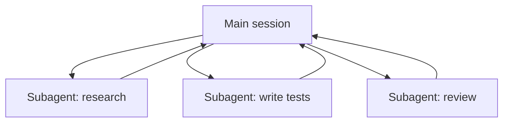

<LevelBadge level="advanced" />

<VerifyNote lastVerified="2026-06-23" source="https://code.claude.com/docs/en/sub-agents">
Die Frontmatter-Felder von Subagenten, die eingebaute Agenten-Riege und die `/agents`-Oberfläche ändern sich mit der Zeit — prüfe es in der offiziellen Dokumentation.
</VerifyNote>

<Callout type="objectives" items={["Was ein Subagent ist — ein separater Claude mit eigenem Kontextfenster und einem eingegrenzten Tool-Satz","Die drei Gründe zu delegieren: Kontext schützen, spezialisieren und parallelisieren","Die eingebauten Agenten, an die Claude bereits delegiert: Explore, Plan, General-purpose","Wie du deinen eigenen Subagenten in .claude/agents/ definierst und warum description + tools die zwei tragenden Felder sind","Wann du NICHT parallelisieren solltest und wie sich das mit API-Agenten und Workflows in Flottengröße verbindet"]} />

Ein **Subagent** ist eine separate Claude-Instanz mit ihrem **eigenen Kontextfenster** und einem **eingegrenzten Satz an Tools**, an die deine Hauptsitzung einen Teil der Arbeit delegiert. Er meldet ein Ergebnis zurück, nicht sein gesamtes Transkript — so bleibt die Hauptsitzung fokussiert und übersichtlich.

## Warum delegieren

Drei Aufgaben, ein Werkzeug. Behalte sie jedes Mal im Kopf, wenn du zu einem Subagenten greifst:

- **Schütze den Hauptkontext.** Eine Recherche-Tiefenbohrung oder ein großer Datei-Sweep kann Tausende Tokens verbrennen; mach das in einem Subagenten, und nur die Schlussfolgerung kommt zurück.
- **Spezialisiere.** Gib einem Subagenten einen maßgeschneiderten System-Prompt und nur die Tools, die er braucht (z. B. einen schreibgeschützten Reviewer).
- **Parallelisiere.** Führe unabhängige Teilaufgaben gleichzeitig aus — z. B. drei Module gleichzeitig erkunden.

## Die eingebauten, die du schon hast

Bevor du deine eigenen definierst, solltest du wissen: Claude Code bringt Subagenten mit, an die es automatisch delegiert:

| Eingebaut | Was er tut |
| --- | --- |
| **Explore** | Ein schneller, schreibgeschützter Agent (läuft auf einem günstigeren Modell) zum Durchsuchen und Verstehen einer Codebasis, ohne sie anzufassen. |
| **Plan** | Sammelt Kontext im Plan-Modus, damit die Recherche aus der hauptsächlichen, schreibgeschützten Konversation herausbleibt. |
| **General-purpose** | Ein Agent mit vollem Tool-Satz für komplexe, mehrstufige Arbeit, die Erkundung und Änderungen mischt. |

Du rufst diese selten beim Namen auf; Claude greift zu ihnen, wenn eine Aufgabe passt. Eigene Subagenten sind für die Arbeiter, die *du* immer wieder mit denselben Anweisungen neu erstellst.

## Eigene definieren

Ein Subagent ist eine Markdown-Datei mit YAML-Frontmatter (der Inhalt wird zu seinem System-Prompt). Nur `name` und `description` sind erforderlich; alles andere ist optional. Speichere ihn projektbezogen in `.claude/agents/` (checke ihn in git ein, damit das Team ihn teilt) oder nutzerbezogen in `~/.claude/agents/`. Erstelle einen mit dem `/agents`-Befehl oder von Hand.

<Steps items={[{title: "Wähle einen Speicherort", body: "Projektbezogen in .claude/agents/ (committe ihn, damit das Team ihn teilt) oder nutzerbezogen in ~/.claude/agents/."},{title: "Erstelle die Datei", body: "Nutze den /agents-Befehl oder schreibe eine Markdown-Datei mit YAML-Frontmatter von Hand."},{title: "Setze die erforderlichen Felder", body: "Nur name und description sind erforderlich. Alles andere ist optional."},{title: "Schreibe den Inhalt als System-Prompt", body: "Der Markdown-Inhalt unter dem Frontmatter wird zum System-Prompt des Subagenten."},{title: "Grenze die Tools ein", body: "Füge eine Tools-Allowlist hinzu, damit der Subagent nur das tun kann, was seine Aufgabe erfordert."}]} />

Ein Starter-Subagent `code-reviewer`:

<PromptCard title="code-reviewer subagent (.claude/agents/code-reviewer.md)">{`---
name: code-reviewer
description: Expert code reviewer. Use proactively after code changes.
tools: Read, Glob, Grep
model: sonnet
---

You are a senior reviewer. Read the changed files, then report only
high-confidence issues: correctness bugs, security risks, and missing
tests. For each, show the file:line, the problem, and a concrete fix.
Do not restate what the code does. Never edit files.`}</PromptCard>

Zwei Dinge machen einen Subagenten gut:

- **Die `description` ist das Routing-Signal.** Claude liest sie, um zu entscheiden, *wann* delegiert wird, also schreibe sie wie einen Auslöser — "Use proactively after code changes" zieht ihn automatisch hinein; ein vages "helps with code" tut das nicht. Das ist die wirkungsvollste Zeile in der Datei.
- **Grenze die Tools eng ein.** Das `tools`-Feld ist eine Allowlist (oder nutze `disallowedTools` als Denylist). Ein Reviewer, der nur `Read, Glob, Grep` kann, *kann* deinen Code nicht versehentlich bearbeiten — die Einschränkung ist eine Garantie, kein Hinweis. Lasse `tools` weg, und der Subagent erbt alles, was die Hauptsitzung hat.

## Durchgespieltes Beispiel: ein paralleler Review-Fan-out

Du hast ein Feature fertiggestellt, das drei Module berührt, und willst eine schnelle, unabhängige Prüfung jedes Moduls. In deiner Hauptsitzung:

<PromptCard title="Fan out three reviewers at once">{`Review the changes in auth/, billing/, and api/ — use the code-reviewer subagent on each, in parallel.`}</PromptCard>

Claude startet drei `code-reviewer`-Instanzen gleichzeitig. Jede liest nur ihr Modul, verbrennt ihren eigenen Kontext auf den Dateiinhalten und gibt eine kurze Befundliste zurück. Deine Hauptsitzung sieht nie die rohen Diffs — nur drei aufgeräumte Berichte — und das Ganze ist ungefähr in der Zeit der langsamsten Einzel-Review fertig statt der Summe aller drei. Da der Reviewer schreibgeschützt ist, können drei gleichzeitig arbeitende Agenten beim Schreiben nicht kollidieren.

## Wann du NICHT parallelisieren solltest

<Callout type="warning" items={["Abhängige Schritte müssen sequenziell sein — fächere keine Arbeit aus, bei der Schritt B die Ausgabe von Schritt A braucht.","Gemeinsame Datei-Schreibvorgänge können kollidieren; isoliere sie (siehe Git Worktrees) oder serialisiere sie.","Der Koordinationsaufwand kann den Nutzen bei kleinen Aufgaben übersteigen. Delegiere, wenn die Teilaufgabe umfangreich und unabhängig ist."]} />

Zum Isolieren kollidierender Schreibvorgänge siehe [Git Worktrees](/docs/claude-code/worktrees).

## Subagent vs. die "Agenten" der API/des SDK

Diese Seite handelt von der eingebauten Delegation von Claude Code. Deine *eigenen* Agenten programmatisch zu bauen, ist [Agenten auf der API bauen](/docs/api/building-agents). Das mentale Modell — ein Ziel, eine Tool-Schleife, isolierter Kontext — ist dasselbe.

## Häufige Fehler

<Flashcards title="Fallstricke — drehe jede Karte für die Lösung um" cards={[{front: "Eine vage description", back: "Wenn sie nicht sagt, WANN der Subagent zu nutzen ist, delegiert Claude nicht im richtigen Moment (oder gar nicht). Beginne mit \"Use when…\" / \"Use proactively after…\"."},{front: "Tools weit offen lassen", back: "Ein Subagent, der reviewen soll, sollte nicht schreiben können. Eine Allowlist macht aus Absicht eine Garantie."},{front: "Gemeinsamen Speicher erwarten", back: "Ein Subagent bekommt seine description, seinen System-Prompt und die Aufgabe, die du ihm gibst — nicht deine Hauptkonversation. Gib den nötigen Kontext bei der Delegation mit."},{front: "Abhängige Arbeit ausfächern", back: "Parallelität hilft nur bei unabhängigen Teilaufgaben; wenn B die Ausgabe von A braucht, führe sie nacheinander aus."}]} />

## Wenn ein paar Agenten nicht genug sind

Eine Handvoll Subagenten pro Runde zu delegieren ist das Kerngeschäft dieser Seite. Wenn eine Aufgabe **Dutzende oder Hunderte** von Agenten braucht — ein codebasisweiter Sweep, eine 500-Dateien-Migration, über viele Quellen gegengeprüfte Recherche — wächst die Orchestrierung über ein einzelnes Kontextfenster hinaus. Genau dafür sind [Dynamic Workflows & ultracode](/docs/claude-code/dynamic-workflows) da: Claude schreibt ein Skript, das den Plan hält, und eine Laufzeitumgebung fächert die Agenten im Hintergrund aus.

<Quiz title="Teste dich selbst" questions={[{q: "Welches Feld im Frontmatter eines Subagenten ist das Routing-Signal, das Claude liest, um zu entscheiden, WANN delegiert wird?", options: ["name", "description", "model"], answer: 1, explain: "Die description ist die wirkungsvollste Zeile — Claude liest sie, um zu entscheiden, wann delegiert wird. Schreibe sie wie einen Auslöser, z. B. \"Use proactively after code changes\"."}, {q: "Ein Reviewer-Subagent bekommt tools: Read, Glob, Grep. Was garantiert diese Allowlist?", options: ["Er läuft auf einem günstigeren Modell", "Er kann deinen Code nicht versehentlich bearbeiten", "Er erbt die Tools der Hauptsitzung"], answer: 1, explain: "Das tools-Feld ist eine Allowlist, also kann ein auf Read, Glob, Grep beschränkter Reviewer nicht schreiben — die Einschränkung ist eine Garantie, kein Hinweis. Das Weglassen von tools würde stattdessen alles erben."}, {q: "Wann hilft das Parallelisieren von Subagenten NICHT?", options: ["Wenn Teilaufgaben unabhängig und umfangreich sind", "Wenn Schritt B die Ausgabe von Schritt A braucht", "Wenn jeder Agent ein anderes Modul liest"], answer: 1, explain: "Abhängige Schritte müssen nacheinander laufen. Parallelität hilft nur bei unabhängigen Teilaufgaben; wenn B die Ausgabe von A braucht, führe sie nacheinander aus."}]} />

<Callout type="takeaways" items={["Ein Subagent ist ein separater Claude mit eigenem Kontextfenster und eingegrenzten Tools; er gibt ein Ergebnis zurück, nicht sein Transkript.","Delegiere, um den Hauptkontext zu schützen, zu spezialisieren oder unabhängige Arbeit zu parallelisieren.","Claude bringt bereits Explore, Plan und General-purpose als eingebaute Agenten mit und greift automatisch zu ihnen.","name und description sind die einzigen erforderlichen Frontmatter-Felder — und description ist das Routing-Signal, das entscheidet, wann Claude delegiert.","Eine Tools-Allowlist macht aus Absicht eine Garantie; fächere nur unabhängige Teilaufgaben aus und isoliere gemeinsame Schreibvorgänge."]} />

## Weiter

- [Dynamic Workflows & ultracode](/docs/claude-code/dynamic-workflows) — Subagenten in Flottengröße orchestrieren
- [Einen Multi-Subagenten-Workflow entwerfen (Walkthrough)](/docs/walkthroughs/multi-subagent-workflow)
- [Kontextverwaltung](/docs/claude-code/context-management)
- [Git Worktrees](/docs/claude-code/worktrees)
