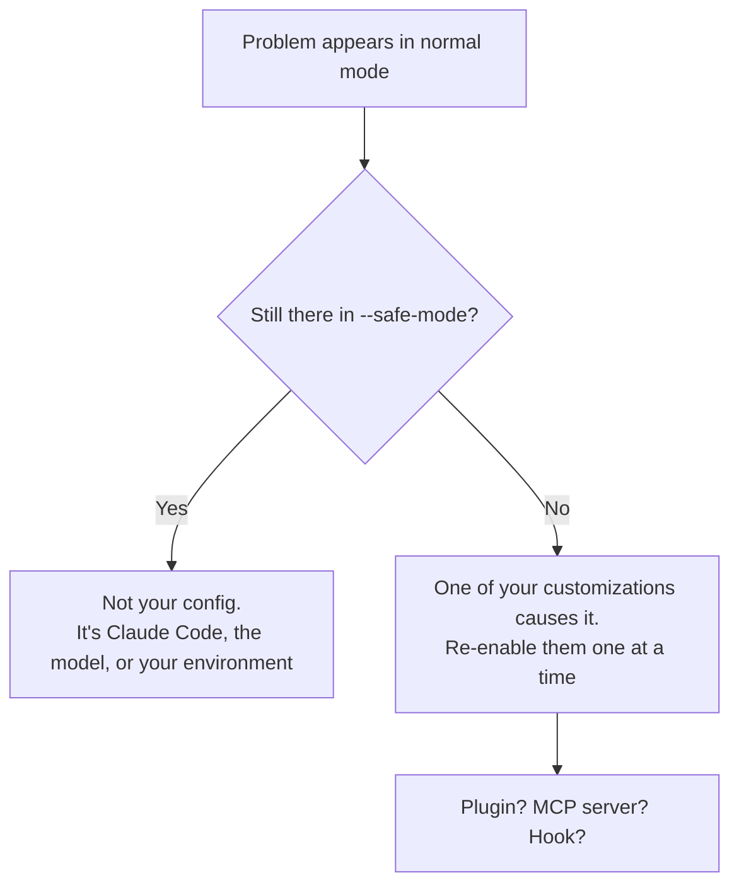

<LevelBadge level="intermediate" />

<Callout type="objectives" items={["Jedes Claude-Code-Problem in einem Schritt seiner Lösung zuordnen — mithilfe einer Symptomtabelle", "Die beiden Diagnosebefehle ausführen, die die meisten Einrichtungsprobleme lösen, bevor du irgendetwas von Hand debuggst", "Isolieren, ob ein Plugin, ein MCP-Server oder ein Hook die eigentliche Ursache ist", "Die vier klassischen Laufzeitfehler beheben: hoher Speicherverbrauch, Abstürze, Kompaktierungs-Thrashing und eine Suche, die nichts findet", "Die richtigen Belege sammeln, bevor du einen Fehlerbericht einreichst"]} />

<VerifyNote lastVerified="2026-07-17" source="https://code.claude.com/docs/en/troubleshooting">
Befehle, Flags und Umgebungsvariablen auf dieser Seite sind gegen die offizielle Claude-Code-Dokumentation zur Fehlerbehebung geprüft. Diagnosen ändern sich zwischen Releases — prüfe dort, bevor du dich auf ein exaktes Flag verlässt.
</VerifyNote>

## Die Grundidee

Fast jedes Claude-Code-Problem ist von einer von zwei Arten, und die haben völlig unterschiedliche Lösungen:

- **Deine Einrichtung ist falsch** — ein Plugin, ein MCP-Server, ein Hook, eine Einstellungsdatei, eine fehlende Binärdatei. Die Lösung ist *Konfiguration*.
- **Die Sitzung ist überlastet** — das Kontextfenster ist voll, eine riesige Datei hat den Speicher gesprengt, das Terminal kann nicht rendern. Die Lösung ist *Hygiene*.

Zu raten, welche von beiden vorliegt, ist der Punkt, an dem Leute einen Nachmittag verlieren. Die Tabelle unten erspart das Raten.

:::tip Eine andere Art von "seltsam"?
Auf dieser Seite geht es darum, dass sich das **Werkzeug** falsch verhält — es startet nicht, es hängt, die Suche findet nichts. Wenn sich das **Modell** falsch verhält — es hat einen Fakt erfunden, eine Anweisung vergessen, etwas Vernünftiges verweigert — dann ist das eine andere Seite: [Warum hat Claude das getan?](/docs/contribute/troubleshooting)
:::

## Hier anfangen: Symptom → wohin

Finde dein Symptom. Lies nicht den Rest der Seite.

| Symptom | Gehe zu |
|---|---|
| `command not found`, Installation schlägt fehl, `EACCES`, PATH- oder TLS-Fehler | [Offiziell: Installation & Anmeldung](https://code.claude.com/docs/en/troubleshoot-install) |
| Anmeldeschleifen, OAuth-Fehler, `403 Forbidden`, "organization disabled" | [Offiziell: Anmeldung & Authentifizierung](https://code.claude.com/docs/en/troubleshoot-install#login-and-authentication) |
| Einstellungen greifen nicht, Hooks feuern nicht, MCP-Server laden nicht | [Isoliere deine Konfiguration](#isoliere-deine-konfiguration) unten |
| `API Error: 5xx`, `529 Overloaded`, `429`, Validierungsfehler | [Fehler & Ratenbegrenzungen](/docs/api/errors-and-rate-limits) |
| `model not found` / "you may not have access to it" | [Aktuelle Modelle & Preise](/docs/whats-new/models-and-pricing) |
| VS Code oder JetBrains erkennt Claude nicht | [IDE-Integrationen](/docs/claude-code/ide-integrations) |
| Hohe CPU- oder Speicherauslastung | [Speicher und CPU](#speicher-und-cpu) unten |
| Hängt, friert ein, reagiert nicht | [Hänger und Einfrieren](#hänger-und-einfrieren) unten |
| `Autocompact is thrashing` | [Kompaktierungs-Thrashing](#kompaktierungs-thrashing) unten |
| Suche, `@file`, Agenten oder Skills finden keine Dateien | [Suche findet nichts](#suche-findet-nichts) unten |
| Kästchen, Verschmierungen oder falsche Glyphen in einem IDE-Terminal | [Verstümmelter Terminaltext](#verstümmelter-terminaltext) unten |

## Die zwei Befehle, die man zuerst ausführt

Bevor du irgendetwas von Hand debuggst, führe die eingebaute Überprüfung aus. Sie diagnostiziert deine Installation, Einstellungen, Erweiterungen und Kontextnutzung — und schlägt Lösungen vor, die sie nach deiner Bestätigung anwenden kann.

<Steps items={[{title: "Führe die Überprüfung innerhalb einer Sitzung aus", body: "/doctor (Alias /checkup) inspiziert deine Installation, Einstellungen, Erweiterungen und Kontextnutzung und bietet dann an, die möglichen Lösungen anzuwenden. Das allein behebt die meisten Einrichtungsbeschwerden."}, {title: "Wenn Claude Code gar nicht erst startet, führe es aus deiner Shell aus", body: "claude doctor macht dieselbe Überprüfung von außerhalb einer Sitzung, sodass eine kaputte Konfiguration nicht das Werkzeug blockieren kann, das sie diagnostizieren würde."}, {title: "Wenn das Problem nach einem Werkzeug oder Connector riecht, prüfe MCP separat", body: "/mcp gibt den Live-Status jedes konfigurierten MCP-Servers aus — der schnellste Weg zu sehen, ob ein Server nicht geladen wurde, statt sich falsch zu verhalten."}]} />

<PromptCard title="Eine kaputte Einrichtung diagnostizieren">{`# inside a session
/doctor

# if the session won't start at all
claude doctor

# check MCP server status
/mcp`}</PromptCard>

## Isoliere deine Konfiguration

Wenn Einstellungen nicht greifen, Hooks nicht feuern oder etwas einfach *daneben* ist, lautet die Frage nie "was ist kaputt" — sondern **welche deiner Anpassungen ist kaputt**. Beantworte sie, indem du sie alle auf einmal entfernst.

`--safe-mode` startet Claude Code mit deaktivierten Anpassungen: keine Plugins, keine MCP-Server, keine Hooks.

<PromptCard title="Gegen eine saubere Konfiguration testen">{`claude --safe-mode`}</PromptCard>

Das liefert dir ein klares Binärergebnis:



Sobald du weißt, dass es eine Anpassung ist, halbiere: aktiviere sie gruppenweise wieder, bis das Problem zurückkehrt. Die Verdächtigen, grob nach Häufigkeit als Übeltäter geordnet, sind [MCP-Server](/docs/claude-code/mcp), [Hooks](/docs/claude-code/hooks), [Plugins](/docs/claude-code/plugins-marketplaces) und [Einstellungen](/docs/claude-code/settings).

<Callout type="tip" items={["--safe-mode ist auch der richtige erste Schritt bei mysteriöser Langsamkeit, nicht nur bei völligem Versagen. Ein geschwätziger MCP-Server ist eine sehr häufige Ursache für beides."]} />

## Speicher und CPU

Claude Code funktioniert mit den meisten Umgebungen, kann aber bei großen Codebasen echte Ressourcen verbrauchen. Arbeite diese der Reihe nach ab — sie sind vom Günstigsten zuerst sortiert.

<Steps items={[{title: "Regelmäßig kompaktieren", body: "Führe /compact aus, um den Kontext zu verkleinern. Ein aufgeblähtes Kontextfenster ist die mit Abstand häufigste Ursache einer schweren Sitzung. Siehe /docs/claude-code/context-management."}, {title: "Zwischen großen Aufgaben neu starten", body: "Schließe und starte Claude Code neu, wenn du zu einer unabhängigen Arbeit wechselst, statt einen Prozess einen ganzen Nachmittag lang Zustand anhäufen zu lassen."}, {title: "Große Build-Verzeichnisse verbergen", body: "Füge Build-Ausgaben, Caches und mitgelieferte Abhängigkeiten zu .gitignore hinzu, damit sie gar nicht erst in eine Suche oder einen Lesevorgang gelangen."}, {title: "Deine Anpassungen ausschließen", body: "Starte mit claude --safe-mode neu. Wenn die Nutzung sinkt, ist ein Plugin, ein MCP-Server oder ein Hook die Quelle — halbiere von dort aus."}, {title: "Wenn der Speicher weiterhin hoch ist, sammle Belege", body: "Führe /heapdump aus, um einen JavaScript-Heap-Snapshot plus eine Speicheraufschlüsselung nach ~/Desktop zu schreiben (oder in dein Home-Verzeichnis unter Linux ohne Desktop-Ordner)."}]} />

Die `/heapdump`-Aufschlüsselung meldet Resident Set Size, JS-Heap, Array-Buffer und nicht zugeordneten nativen Speicher. Diese Aufteilung ist der nützliche Teil: Sie sagt dir, ob das Wachstum in JavaScript-Objekten oder tief unten im nativen Code steckt. Um zu untersuchen, was den Speicher am Leben hält, öffne die `.heapsnapshot`-Datei in den Chrome DevTools unter **Memory → Load**.

<VerifyNote lastVerified="2026-07-17" source="https://code.claude.com/docs/en/troubleshooting">
`/heapdump` schreibt nach `~/Desktop` und weicht auf Linux-Systemen ohne Desktop-Ordner auf das Home-Verzeichnis aus. Hänge beide Dateien an, wenn du ein Speicherproblem meldest.
</VerifyNote>

## Hänger und Einfrieren

Wenn Claude Code nicht mehr reagiert:

<Steps items={[{title: "Brich die aktuelle Operation ab", body: "Drücke Strg+C. Das bricht ab, was gerade läuft, ohne die Sitzung zu beenden."}, {title: "Wenn es immer noch nicht reagiert, beende das Terminal", body: "Schließe das Terminal und starte neu. Das fühlt sich destruktiv an, ist es aber nicht."}, {title: "Setze dort fort, wo du aufgehört hast", body: "Führe claude --resume im GLEICHEN Verzeichnis aus. Ein Neustart verliert deine Unterhaltung nicht — das Transkript überlebt den Prozess."}]} />

<Callout type="tip" items={["Die Angst, eine lange Unterhaltung zu verlieren, ist der Grund, warum Leute einen Hänger aussitzen, statt ihn zu beenden. Tu das nicht — claude --resume im gleichen Verzeichnis holt die Sitzung zurück."]} />

## Kompaktierungs-Thrashing

Dieser Fehler sieht alarmierend aus und ist in Wirklichkeit ein *Schutz*:

```
Autocompact is thrashing: the context refilled to the limit...
```

Er bedeutet, dass die automatische Kompaktierung **erfolgreich war** — und dann eine Datei oder Werkzeugausgabe sofort das gesamte Kontextfenster wieder gefüllt hat, mehrmals hintereinander. Claude Code hört mit dem Wiederholen auf, statt API-Aufrufe für eine Schleife zu verbrennen, die keine Fortschritte macht.

Die Ursache ist fast immer eine überdimensionierte Sache, die als Ganzes gelesen wird. Wähle die Lösung, die zu deiner Situation passt:

| Situation | Lösung |
|---|---|
| Eine riesige Datei ist das Problem | Bitte Claude, einen Zeilenbereich oder eine einzelne Funktion statt der ganzen Datei zu lesen |
| Der Kontext enthält eine große Ausgabe, die du nicht mehr brauchst | `/compact` mit einem Fokus, der sie fallen lässt |
| Der große Lesevorgang ist wirklich notwendig | Verschiebe ihn zu einem [Subagenten](/docs/claude-code/subagents), damit er ein separates Kontextfenster verbrennt |
| Die frühere Unterhaltung spielt keine Rolle mehr | `/clear` |

<PromptCard title="Mit einem Fokus kompaktieren, der den Ballast abwirft">{`/compact keep only the plan and the diff`}</PromptCard>

Die Subagenten-Option ist die, die Leute vergessen, und sie ist oft die beste: Ein Subagent liest die riesige Datei in *seinem* Kontext und gibt nur die Schlussfolgerung an deinen zurück. Siehe [Kontextverwaltung](/docs/claude-code/context-management) und [Subagenten](/docs/claude-code/subagents).

## Suche findet nichts

Wenn das Suchwerkzeug, `@file`-Erwähnungen, eigene Agenten oder eigene Skills Dateien nicht finden, von denen du weißt, dass sie existieren, kann die mitgelieferte `ripgrep`-Binärdatei auf deinem System wahrscheinlich nicht laufen. Die Lösung ist, das plattformeigene `ripgrep` zu installieren und Claude Code anzuweisen, es zu verwenden.

<Steps items={[{title: "Installiere ripgrep für deine Plattform", body: "macOS: brew install ripgrep — Ubuntu/Debian: sudo apt install ripgrep — Alpine: apk add ripgrep — Arch: pacman -S ripgrep — Windows: winget install BurntSushi.ripgrep.MSVC"}, {title: "Weise Claude Code an, die mitgelieferte Binärdatei nicht mehr zu verwenden", body: "Setze USE_BUILTIN_RIPGREP=0 in deiner Umgebung. Ohne diesen Schritt ändert die Installation von ripgrep nichts."}, {title: "Überprüfen", body: "Führe die Suche oder @file-Erwähnung, die fehlschlug, erneut aus. Führe /doctor aus, wenn sie immer noch leer bleibt."}]} />

<PromptCard title="Suche unter macOS reparieren">{`brew install ripgrep
export USE_BUILTIN_RIPGREP=0`}</PromptCard>

### Die WSL-Ausnahme

Unter WSL sind unvollständige Suchergebnisse normalerweise **keine** kaputte Binärdatei. Das Lesen über die Windows/Linux-Dateisystemgrenze hinweg bringt eine Festplattenleistungseinbuße mit sich, sodass die Suche weniger Treffer zurückgibt als erwartet. Die Suche funktioniert weiterhin — sie liefert nur weniger.

<Callout type="warning" items={["Unter WSL meldet claude doctor die Suche als OK, selbst wenn die Ergebnisse unvollständig sind. Eine grüne Überprüfung schließt dies nicht aus — genau das macht es schwer zu diagnostizieren."]} />

Drei Auswege, der beste zuerst: verschiebe das Projekt auf das Linux-Dateisystem (`/home/`) statt `/mnt/c/`; führe Claude Code nativ unter Windows statt über WSL aus; oder verenge deine Suchen, damit weniger Dateien gescannt werden — "Suche nach der JWT-Validierungslogik im auth-service-Paket" schlägt "finde den Auth-Code".

## Verstümmelter Terminaltext

Zeichen, die als Kästchen, Verschmierungen oder falsche Glyphen im integrierten Terminal von VS Code, Cursor oder Devin Desktop erscheinen, sind ein Problem des **GPU-Renderers**, kein Schrift- oder Codierungsproblem.

<PromptCard title="Verstümmelte Glyphen in einem IDE-Terminal reparieren">{`/terminal-setup`}</PromptCard>

Das setzt `terminal.integrated.gpuAcceleration` auf `"off"`. Du kannst es stattdessen von Hand in deinen Editor-Einstellungen setzen und das Fenster neu laden — gleiches Ergebnis.

## Große Tabellen werden abgeschnitten

Eine Markdown-Tabelle mit über 200 Zeilen rendert ihre ersten 200, gefolgt von einer Zeile `… N more rows not shown`. Das ist **nur eine Anzeigebegrenzung** — die vollständige Tabelle ist weiterhin in der Unterhaltung, und `/copy` kopiert jede Zeile. Bei einer Tabelle, die zu groß ist, um sie überhaupt in einem Terminal zu lesen, bitte Claude, sie in eine Datei zu schreiben.

<VerifyNote lastVerified="2026-07-17" source="https://code.claude.com/docs/en/troubleshooting">
Die Anzeigebegrenzung von 200 Zeilen kam mit Claude Code v2.1.208. Davor wurde jede Zeile gerendert, sodass das Fortsetzen einer Sitzung mit einer sehr großen Tabelle beim erneuten Rendern hängen bleiben konnte.
</VerifyNote>

## Einen guten Fehlerbericht einreichen

Wenn hier nichts passt, melde es — aber bring Belege mit. Ein Bericht, der sagt "es ist langsam", kommt nirgendwohin; einer mit einem Heap-Snapshot und einem `--safe-mode`-Ergebnis wird behoben.

<Steps items={[{title: "Führe /doctor und /mcp aus", body: "Halte fest, was die Überprüfung sagt und welche MCP-Server tatsächlich geladen sind. Die Hälfte der gemeldeten Fehler wird hier beantwortet."}, {title: "Notiere, ob --safe-mode etwas ändert", body: "Dieser eine Fakt sagt einem Maintainer, ob er sich Claude Code oder deine Anpassungen ansehen soll. Es ist die wertvollste Zeile in deinem Bericht."}, {title: "Hänge Artefakte für Ressourcenprobleme an", body: "Bei Speicherproblemen hänge beide von /heapdump geschriebenen Dateien an — den Snapshot und die Aufschlüsselung."}, {title: "Sende ihn", body: "Verwende /feedback in Claude Code, um direkt an Anthropic zu melden, oder prüfe github.com/anthropics/claude-code zuerst auf ein bekanntes Problem."}]} />

<Callout type="takeaways" items={["Führe zuerst /doctor (Alias /checkup) aus — aus deiner Shell als claude doctor, wenn die Sitzung nicht startet. Es diagnostiziert Installation, Einstellungen, Erweiterungen und Kontextnutzung und kann Lösungen anwenden.", "claude --safe-mode deaktiviert alle Anpassungen auf einmal. Ob das Problem das überlebt, ist der aussagekräftigste Fakt, den du sammeln kannst.", "Hoher Speicher: /compact, zwischen Aufgaben neu starten, Build-Verzeichnisse in .gitignore, dann --safe-mode, dann /heapdump für Belege.", "Ein Hänger ist keine verlorene Unterhaltung — Strg+C, dann das Terminal neu starten, dann claude --resume im gleichen Verzeichnis.", "Autocompact-Thrashing bedeutet, dass ein überdimensionierter Lesevorgang das Fenster wieder füllt. Lies in Stücken, /compact mit einem Fokus, oder delegiere den Lesevorgang an einen Subagenten.", "Wenn die Suche nichts findet, kann meist das mitgelieferte ripgrep nicht laufen: installiere das ripgrep deiner Plattform UND setze USE_BUILTIN_RIPGREP=0. Unter WSL ist es stattdessen eine Dateisystemgrenz-Einbuße — und claude doctor meldet die Suche weiterhin als OK."]} />

<Quiz title="Prüfe dich selbst" questions={[{q: "Hooks feuern nicht und Einstellungen scheinen ignoriert zu werden. Was ist das aussagekräftigste Einzelne, das man versuchen kann?", options: ["Claude Code neu installieren", "claude --safe-mode ausführen und sehen, ob das Problem das überlebt", "Deine CLAUDE.md löschen"], answer: 1, explain: "--safe-mode deaktiviert alle Anpassungen auf einmal. Wenn das Problem verschwindet, verursacht es eines deiner Plugins, MCP-Server oder Hooks, und du kannst halbieren. Wenn es überlebt, ist deine Konfiguration nicht die Ursache — was genauso nützlich zu wissen ist."}, {q: "Claude Code hängt mitten in einer Aufgabe und Strg+C hilft nicht. Du schließt das Terminal. Was passiert mit deiner Unterhaltung?", options: ["Sie ist verloren — deshalb solltest du Hänger aussitzen", "Sie überlebt — führe claude --resume im gleichen Verzeichnis aus", "Sie ist nur gespeichert, wenn du zuvor /compact ausgeführt hast"], answer: 1, explain: "Ein Neustart verliert deine Unterhaltung nicht. Führe claude --resume im GLEICHEN Verzeichnis aus, um die Sitzung wieder aufzunehmen. Die Angst, das Transkript zu verlieren, ist genau der Grund, warum Leute Hänger unnötig aussitzen."}, {q: "Du siehst 'Autocompact is thrashing: the context refilled to the limit...'. Was ist tatsächlich passiert?", options: ["Die Kompaktierung schlug fehl und der Kontext ist beschädigt", "Die Kompaktierung war erfolgreich, aber eine Datei oder Werkzeugausgabe füllte das Fenster sofort mehrmals hintereinander wieder", "Deinem Plan sind die Token ausgegangen"], answer: 1, explain: "Die Kompaktierung war erfolgreich — dann füllte etwas Überdimensioniertes den Kontext wiederholt wieder. Claude Code hört mit dem Wiederholen auf, um keine API-Aufrufe für eine Schleife zu verbrennen, die keine Fortschritte macht. Behebe den überdimensionierten Lesevorgang: stückle ihn, /compact mit einem Fokus, oder verschiebe ihn zu einem Subagenten."}, {q: "Du hast ripgrep mit brew installiert, weil @file-Erwähnungen nichts fanden, aber die Suche ist immer noch kaputt. Was hast du übersehen?", options: ["Du musst deine Maschine neu starten", "Du musst außerdem USE_BUILTIN_RIPGREP=0 setzen, damit Claude Code deine Binärdatei statt der mitgelieferten verwendet", "brew installiert die falsche Version — verwende apt"], answer: 1, explain: "Nur ripgrep zu installieren ändert nichts. Du musst USE_BUILTIN_RIPGREP=0 in deiner Umgebung setzen, um Claude Code anzuweisen, deine Plattform-Binärdatei statt der mitgelieferten zu verwenden, die nicht laufen konnte."}, {q: "Unter WSL gibt die Suche weniger Treffer als erwartet zurück, aber claude doctor meldet die Suche als OK. Was ist los?", options: ["doctor lügt — die ripgrep-Binärdatei ist kaputt", "Das Lesen über die Windows/Linux-Dateisystemgrenze bringt eine Festplatteneinbuße, sodass die Suche weniger liefert, während sie weiterhin funktioniert", "Dein Projekt ist zu groß, um indiziert zu werden"], answer: 1, explain: "Unter WSL bedeuten dateisystemübergreifende Leseeinbußen, dass die Suche weniger Ergebnisse zurückgibt als auf einem nativen Dateisystem. Sie funktioniert weiterhin, sodass doctor die Suche als OK meldet — was es schwer erkennbar macht. Verschiebe das Projekt nach /home/, führe es nativ unter Windows aus, oder reiche engere Suchen ein."}]} />

## Weiter

- [Warum hat Claude das getan?](/docs/contribute/troubleshooting) — Fehlerbehebung beim Verhalten des *Modells* statt des Werkzeugs
- [Kontextverwaltung](/docs/claude-code/context-management) — `/compact` vs. `/clear` und wie du Sitzungen schlank hältst
- [Fehler & Ratenbegrenzungen](/docs/api/errors-and-rate-limits) — `429`, `529` und Wiederholungsstrategie auf der API
- [MCP-Token-Kosten](/docs/claude-code/mcp-token-cost) — wenn ein verbundener Server im Stillen das Problem ist
