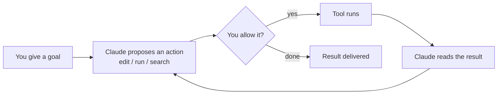

<LevelBadge level="beginner" />

<VerifyNote lastVerified="2026-06-27" source="https://code.claude.com/docs/en/overview">
Installationsbefehle und der genaue Funktionsumfang ändern sich oft. Behandle die offizielle Claude-Code-Dokumentation als die maßgebliche Quelle für die Einrichtung.
</VerifyNote>

<Callout type="objectives" items={["Erklären, was Claude Code agentisch macht, nicht nur ein Chatfenster", "Sich die agentische Schleife vorstellen: Ziel, Aktion, Erlaubnis, Beobachten, Wiederholen", "Die Oberflächen benennen, auf denen Claude Code läuft, und wie Einstellungen mit dir mitreisen", "Die Dinge, die du konfigurierst, nach Hebelwirkung ordnen, beginnend mit CLAUDE.md", "Die Form einer sicheren ersten Sitzung mit dem Plan-Modus durchgehen"]} />

**Claude Code** ist Anthropics *agentisches* Coding-Tool. Anders als ein Chatfenster kann es tatsächlich **Dinge in deinem Projekt tun**: Dateien lesen und bearbeiten, Shell-Befehle ausführen, die Codebasis durchsuchen und externe Tools aufrufen — alles mit deiner Erlaubnis.

## Das mentale Modell: eine agentische Schleife

Das ist die eine Idee, die alles andere verständlich macht. Du gibst ein Ziel in natürlicher Sprache vor ("füge Tests für das Auth-Modul hinzu und behebe, was fehlschlägt"). Claude **plant, handelt, beobachtet das Ergebnis und wiederholt**, bis das Ziel erreicht ist. Du behältst die Kontrolle über [Berechtigungen](/docs/claude-code) und den [Plan-Modus](/docs/claude-code).

<Callout type="tip" items={["Die Schleife rückt nur bei Aktionen vor, die du erlaubst. Nichts bearbeitet oder läuft, ohne durch dieses Berechtigungstor zu gehen — genau deshalb sind die nächsten Abschnitte wichtig."]} />

## Wo du es ausführen kannst

Dasselbe Claude Code folgt dir über die Oberflächen hinweg — es **teilt deine Einstellungen, Hooks und Berechtigungen**, wo immer du arbeitest.

- **Terminal (CLI)** — die ursprüngliche Oberfläche; funktioniert in jeder Shell.
- **IDE-Erweiterungen** — VS Code und JetBrains, mit Inline-Diffs.
- **Desktop und Web** — und es teilt deine Einstellungen, Hooks und Berechtigungen über die Oberflächen hinweg.

## Was du konfigurieren wirst (grob nach Hebelwirkung)

Stell dir das als eine Leiter vor: Beherrsche zuerst die obersten Sprossen, dann ergänze Power-Features erst, wenn ein echter Bedarf auftaucht.

<Steps items={[{title: "CLAUDE.md", body: "Persistente Projektanweisungen. Höchste Wirkung, geringster Aufwand — fang hier an."}, {title: "Plan-Modus", body: "Untersuchen und vorschlagen, bevor Änderungen ausgeführt werden."}, {title: "Berechtigungen", body: "Entscheide, was Claude ohne Nachfrage tun darf."}, {title: "settings.json", body: "Das vollständige Konfigurationssystem unter allem."}, {title: "Power-Features", body: "Slash-Befehle, Hooks, Skills, Subagenten und MCP-Server — ergänzt, wenn du sie brauchst."}]} />

Jede Sprosse verlinkt in ihre eigene Lektion: [CLAUDE.md](/docs/claude-code), [Plan-Modus](/docs/claude-code), [Berechtigungen](/docs/claude-code), [settings.json](/docs/claude-code), [Slash-Befehle](/docs/claude-code), [Hooks](/docs/claude-code), [Skills](/docs/claude-code), [Subagenten](/docs/claude-code) und [MCP-Server](/docs/claude-code).

## Deine erste Sitzung (die Form davon)

<Steps items={[{title: "Installieren und authentifizieren", body: "Siehe die offizielle Dokumentation für aktuelle Befehle."}, {title: "Ein Projekt öffnen", body: "cd in ein Projekt und Claude Code starten."}, {title: "Eine Starter-CLAUDE.md generieren", body: "Führe /init aus, um deine Projektanweisungen zu scaffolden."}, {title: "Etwas Kleines und Konkretes fragen", body: "Versuche: Erkläre, wie das Routing in dieser App funktioniert."}, {title: "Zuerst eine Änderung im Plan-Modus machen", body: "Prüfe den vorgeschlagenen Plan, dann lass ihn ausführen."}]} />

Zwei Befehle, die du dir aus dieser ersten Sitzung merken solltest:

<PromptCard title="Scaffold project instructions">{`/init`}</PromptCard>

<PromptCard title="A safe, read-only first ask">{`Explain how routing works in this app.`}</PromptCard>

Für aktuelle Installations- und Authentifizierungsbefehle siehe die [offizielle Dokumentation](https://code.claude.com/docs/en/overview).

<Callout type="tip" items={["Starte schreibgeschützt. Nutze für deine erste echte Aufgabe den Plan-Modus — Claude untersucht und zeigt dir einen Plan, ohne Dateien anzufassen. Das ist der sicherste Weg, Vertrauen aufzubauen."]} />

## Schlüsselbegriffe auf einen Blick

<Flashcards title="Claude-Code-Vokabular" cards={[{front: "Agentisches Tool", back: "Ein Tool, das Aktionen in deinem Projekt ausführt — Dateien liest/bearbeitet, Befehle ausführt, Code durchsucht, externe Tools aufruft — nicht nur ein Chatfenster."}, {front: "Agentische Schleife", back: "Ziel in natürlicher Sprache, dann plant Claude, handelt, beobachtet das Ergebnis und wiederholt, bis das Ziel erreicht ist."}, {front: "Plan-Modus", back: "Claude untersucht und schlägt einen Plan vor, bevor Änderungen ausgeführt werden — der sicherste Einstieg."}, {front: "CLAUDE.md", back: "Persistente Projektanweisungen. Höchste Wirkung, geringster Aufwand; mit /init generiert."}, {front: "Berechtigungen", back: "Das Kontrolltor: was Claude tun darf, ohne dich zuerst zu fragen."}]} />

<Quiz title="Teste dich selbst" questions={[{q: "Was unterscheidet Claude Code von einem Chatfenster?", options: ["Es schreibt längere Antworten", "Es kann Aktionen in deinem Projekt ausführen — Dateien bearbeiten, Befehle ausführen, Code durchsuchen — mit deiner Erlaubnis", "Es funktioniert nur im Terminal"], answer: 1, explain: "Claude Code ist agentisch: Es handelt in deinem Projekt (Dateien lesen/bearbeiten, Shell-Befehle ausführen, suchen, Tools aufrufen), alles mit deiner Erlaubnis."}, {q: "Was passiert in der agentischen Schleife direkt nachdem Claude eine Aktion vorgeschlagen hat?", options: ["Das Tool läuft automatisch", "Du entscheidest, ob du es erlaubst", "Das Ergebnis wird geliefert"], answer: 1, explain: "Jede vorgeschlagene Aktion geht durch ein Berechtigungstor — das Tool läuft nur, wenn du es erlaubst."}, {q: "Welcher Einrichtungsschritt hat die höchste Wirkung bei geringstem Aufwand?", options: ["MCP-Server", "Hooks", "CLAUDE.md"], answer: 2, explain: "CLAUDE.md — persistente Projektanweisungen — steht an erster Stelle, weil es die höchste Wirkung bei geringstem Aufwand hat."}]} />

<Callout type="takeaways" items={["Claude Code ist agentisch: Es handelt in deinem Projekt mit deiner Erlaubnis, chattet nicht nur.", "Die Schleife ist Ziel, vorschlagen, erlauben, ausführen, beobachten, wiederholen — du steuerst sie über Berechtigungen und den Plan-Modus.", "Es läuft im Terminal, in VS Code/JetBrains und auf Desktop und Web und teilt Einstellungen, Hooks und Berechtigungen über die Oberflächen hinweg.", "Konfiguriere nach Hebelwirkung: zuerst CLAUDE.md, dann Plan-Modus, Berechtigungen, settings.json, dann Power-Features.", "Starte eine erste Sitzung schreibgeschützt im Plan-Modus, um Vertrauen aufzubauen, bevor du Änderungen ausführen lässt."]} />

## Weiter

- Die wirkungsvollste Einrichtung → [CLAUDE.md & Memory-Dateien](/docs/claude-code)
- Mach es von Anfang bis Ende → [Walkthrough: Claude Code für ein echtes Repo anpassen](/docs/walkthroughs)
- Baue deine eigenen Automatisierungen → [Vorlagen & Rezepte](/docs/templates)
