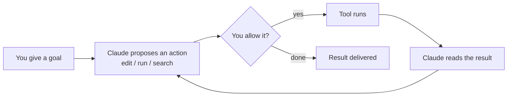

<LevelBadge level="beginner" />

<VerifyNote lastVerified="2026-06-20" source="https://code.claude.com/docs/en/overview">
Installationsbefehle und der genaue Funktionsumfang ändern sich häufig. Betrachte die offizielle Claude-Code-Dokumentation als Quelle der Wahrheit für die Einrichtung.
</VerifyNote>

**Claude Code** ist Anthropics *agentisches* Coding-Werkzeug. Anders als ein Chatfenster kann es tatsächlich **Dinge in deinem Projekt tun**: Dateien lesen und bearbeiten, Shell-Befehle ausführen, die Codebasis durchsuchen und externe Werkzeuge aufrufen — alles mit deiner Erlaubnis.

## Das mentale Modell: eine agentische Schleife

Das ist die eine Idee, durch die alles andere Sinn ergibt:

Du gibst ein Ziel in klarer Sprache vor ("füge Tests für das Auth-Modul hinzu und behebe, was fehlschlägt"). Claude **plant, handelt, beobachtet das Ergebnis und wiederholt**, bis das Ziel erreicht ist. Die Kontrolle behältst du über [Berechtigungen](/docs/claude-code) und den [Plan-Modus](/docs/claude-code).

## Wo du es ausführen kannst

- **Terminal (CLI)** — die ursprüngliche Oberfläche; funktioniert in jeder Shell.
- **IDE-Erweiterungen** — VS Code und JetBrains, mit Inline-Diffs.
- **Desktop und Web** — und es teilt deine Einstellungen, Hooks und Berechtigungen über alle Oberflächen hinweg.

## Was du konfigurieren wirst (grob nach Wirkungsgrad)

1. **[CLAUDE.md](/docs/claude-code)** — dauerhafte Projektanweisungen. Höchste Wirkung, geringster Aufwand.
2. **[Plan-Modus](/docs/claude-code)** — untersuchen und vorschlagen, *bevor* Änderungen ausgeführt werden.
3. **[Berechtigungen](/docs/claude-code)** — was Claude ohne Nachfrage tun darf.
4. **[settings.json](/docs/claude-code)** — das vollständige Konfigurationssystem.
5. **[Slash-Befehle](/docs/claude-code)**, **[Hooks](/docs/claude-code)**, **[Skills](/docs/claude-code)**, **[Subagenten](/docs/claude-code)**, **[MCP-Server](/docs/claude-code)** — Power-Features, die du nach Bedarf darauflegst.

## Deine erste Session (der grobe Ablauf)

1. Installieren und authentifizieren (aktuelle Befehle siehe [offizielle Dokumentation](https://code.claude.com/docs/en/overview)).
2. Mit `cd` in ein Projekt wechseln und Claude Code starten.
3. `/init` ausführen, um eine erste **CLAUDE.md** zu erzeugen.
4. Bitte um etwas Kleines und Konkretes: *"Erkläre, wie das Routing in dieser App funktioniert."*
5. Probiere dann zuerst eine Änderung im **Plan-Modus**, prüfe den Plan und lass ihn ausführen.

:::tip Beginne schreibgeschützt
Nutze für deine erste echte Aufgabe den [Plan-Modus](/docs/claude-code) — Claude untersucht und zeigt dir einen Plan, ohne Dateien anzufassen. Das ist die sicherste Art, Vertrauen aufzubauen.
:::

## Weiter

- Die wirkungsvollste Einrichtung → [CLAUDE.md & Memory-Dateien](/docs/claude-code)
- End-to-End ausprobieren → [Walkthrough: Claude Code für ein echtes Repo anpassen](/docs/walkthroughs)
- Eigene Automatisierungen bauen → [Vorlagen & Rezepte](/docs/templates)
