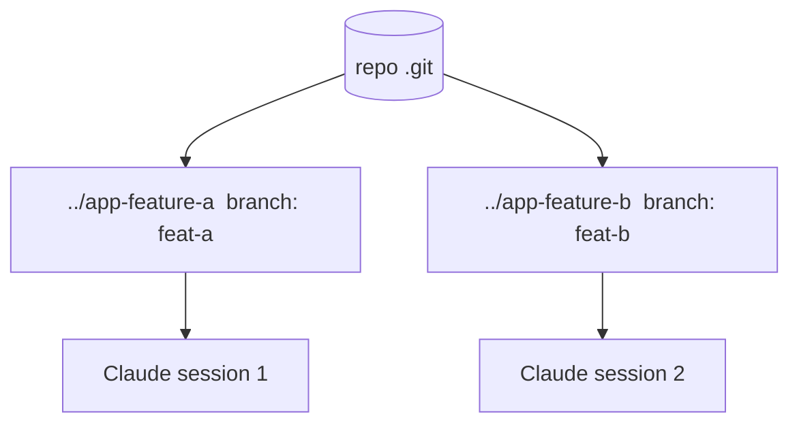

<LevelBadge level="advanced" />

Ein **Git Worktree** erlaubt es einem Repository, **mehrere Arbeitsverzeichnisse** zu haben, jedes ausgecheckt auf einem anderen Branch. Kombiniere das mit Claude Code und du kannst **mehrere Sessions parallel** am selben Projekt ausführen — jede bearbeitet ihre eigenen Dateien, ohne Kollisionen.

## Das Problem, das es löst

Wenn zwei Claude-Sessions gleichzeitig dasselbe Arbeitsverzeichnis bearbeiten, geraten sie sich mit ihren Änderungen in die Quere. Worktrees geben jeder Session ihr **eigenes Verzeichnis und ihren eigenen Branch**, sodass parallele Arbeit isoliert bleibt, bis du mergst.



## Die Grundlagen

```bash
# from your repo
git worktree add ../app-feature-a -b feat-a   # new dir + new branch
git worktree add ../app-fix-123 -b fix-123
git worktree list
# when done with one:
git worktree remove ../app-feature-a
```

Öffne in jedem Worktree-Verzeichnis eine Claude-Code-Session und lass sie unabhängig voneinander arbeiten.

## Wann es sich lohnt

- **Parallele Features/Fixes**, die du gleichzeitig vorantreiben möchtest.
- **Eine lange Aufgabe läuft** in einem Worktree, während du in einem anderen weiterarbeitest.
- **Riskante Experimente**, isoliert von deinem Haupt-Checkout.

## Fallstricke

:::warning Achte auf das Zurück-Mergen
- Branches werden irgendwann **gemergt** — Konflikte zeigen sich dann, nicht währenddessen. Halte Worktrees fokussiert und kurzlebig.
- Betreibe keine **zustandsbehafteten, gemeinsam genutzten Ressourcen** (eine Dev-DB, ein Port) aus zwei Worktrees, ohne sie zu trennen.
- Räume mit `git worktree remove` auf, damit sich keine veralteten Verzeichnisse ansammeln.
:::

## Worktrees vs. Subagenten

- **[Subagenten](/docs/claude-code/subagents)** = Parallelität *innerhalb* einer Session (Delegation, isolierter Kontext).
- **Worktrees** = Parallelität *über* Sessions hinweg auf der Festplatte (isolierte Branches/Dateien). Sie ergänzen sich gut: Eine Session in einem Worktree kann selbst Subagenten starten.

## Weiter

- [Subagenten & parallele Agenten](/docs/claude-code/subagents)
- [Headless-Modus & das Agent SDK](/docs/claude-code/headless-and-agent-sdk)
- [Kontextverwaltung](/docs/claude-code/context-management)
