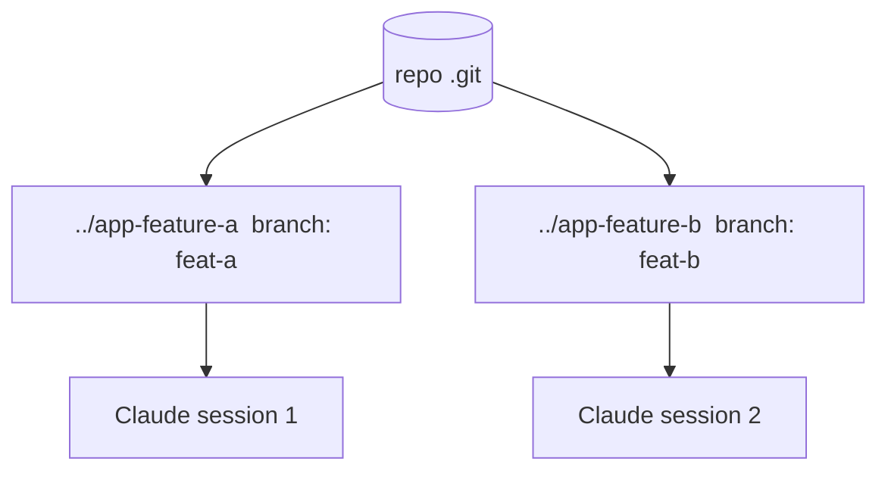

<LevelBadge level="advanced" />

<Callout type="objectives" items={["Was ein Git-Worktree ist — ein Repo, mehrere Arbeitsverzeichnisse, jedes auf seinem eigenen Branch","Das genaue Problem, das er löst: parallele Claude-Sitzungen daran hindern, an denselben Dateien zu kollidieren","Die vier Befehle zum Hinzufügen, Auflisten und Entfernen von Worktrees","Wann sich die Technik lohnt — und die drei Fallstricke, die beim Mergen zubeißen","Wie Worktrees mit Subagenten zusammenspielen: Parallelität über Sitzungen hinweg vs. innerhalb einer"]} />

Ein **Git-Worktree** ermöglicht es einem Repository, **mehrere Arbeitsverzeichnisse** zu haben, jedes auf einen anderen Branch ausgecheckt. Kombiniert mit Claude Code kannst du **mehrere Sitzungen parallel** auf demselben Projekt ausführen — jede bearbeitet ihre eigenen Dateien, ohne Kollisionen.

## Das Problem, das er löst

Wenn zwei Claude-Sitzungen gleichzeitig dasselbe Arbeitsverzeichnis bearbeiten, stolpern sie über die Änderungen der jeweils anderen. Worktrees geben jeder Sitzung ihr **eigenes Verzeichnis und ihren eigenen Branch**, sodass parallele Arbeit isoliert bleibt, bis du mergst.

## Die Grundlagen

Vier Befehle tragen den ganzen Workflow: einen Worktree hinzufügen (neues Verzeichnis + neuer Branch), auflisten, was existiert, und einen entfernen, wenn du fertig bist.

<Steps items={[{title: "Einen Worktree für ein Feature hinzufügen", body: "Von deinem Repo aus erstellt git worktree add ../app-feature-a -b feat-a ein neues Verzeichnis UND einen neuen Branch in einem Schritt."},{title: "Einen weiteren für einen Fix hinzufügen", body: "git worktree add ../app-fix-123 -b fix-123 — ein zweites isoliertes Verzeichnis/Branch, neben dem ersten."},{title: "Sehen, was du hast", body: "git worktree list zeigt jedes Arbeitsverzeichnis und den Branch, auf dem es liegt."},{title: "Aufräumen, wenn fertig", body: "git worktree remove ../app-feature-a baut einen Worktree ab, damit sich keine veralteten Verzeichnisse ansammeln."}]} />

<PromptCard title="The four-command workflow">{`# from your repo
git worktree add ../app-feature-a -b feat-a   # new dir + new branch
git worktree add ../app-fix-123 -b fix-123
git worktree list
# when done with one:
git worktree remove ../app-feature-a`}</PromptCard>

Öffne in jedem Worktree-Verzeichnis eine Claude-Code-Sitzung und lass sie unabhängig arbeiten.

## Wann es sich lohnt

- **Parallele Features/Fixes**, die du gleichzeitig voranbringen willst.
- **Eine lange laufende Aufgabe** in einem Worktree, während du in einem anderen weiterarbeitest.
- **Riskante Experimente**, isoliert von deinem Haupt-Checkout.

## Fallstricke

<Callout type="warning" items={["Achte auf den Merge-Back: Branches werden irgendwann gemergt — Konflikte tauchen dann auf, nicht währenddessen. Halte Worktrees fokussiert und kurzlebig.","Führe keine zustandsbehafteten, gemeinsamen Ressourcen (eine Dev-DB, einen Port) aus zwei Worktrees aus, ohne sie zu trennen.","Räume mit git worktree remove auf, damit sich keine veralteten Verzeichnisse ansammeln."]} />

## Worktrees vs. Subagenten

Zwei verschiedene Achsen der Parallelität — sie konkurrieren nicht, sie stapeln sich.

| | Was es parallelisiert | Isolation |
| --- | --- | --- |
| **[Subagenten](/docs/claude-code/subagents)** | Arbeit *innerhalb* einer Sitzung (Delegation) | Isolierter Kontext |
| **Worktrees** | Arbeit *über* Sitzungen hinweg auf der Festplatte | Isolierte Branches/Dateien |

Sie spielen gut zusammen: Eine Sitzung in einem Worktree kann selbst Subagenten starten.

<Callout type="tip" items={["Nutze einen Worktree, wenn du zwei Claude-Sitzungen brauchst, die gleichzeitig dasselbe Repo berühren; nutze einen Subagenten, wenn eine Sitzung einen Teil der Arbeit in isolierten Kontext auslagern muss."]} />

<Quiz title="Teste dich selbst" questions={[{q: "Was gibt dir ein Git-Worktree?", options: ["Mehrere Branches in einem einzigen Arbeitsverzeichnis", "Mehrere Arbeitsverzeichnisse für ein Repo, jedes auf seinem eigenen Branch", "Eine Sicherungskopie deines .git-Ordners"], answer: 1, explain: "Ein Git-Worktree ermöglicht es einem Repository, mehrere Arbeitsverzeichnisse zu haben, jedes auf einen anderen Branch ausgecheckt — sodass parallele Sitzungen nicht kollidieren."}, {q: "Welcher Befehl erstellt ein neues Verzeichnis UND einen neuen Branch in einem Schritt?", options: ["git worktree list", "git worktree add ../app-feature-a -b feat-a", "git worktree remove ../app-feature-a"], answer: 1, explain: "git worktree add ../app-feature-a -b feat-a erstellt das neue Verzeichnis und den neuen Branch zusammen. list zeigt bestehende Worktrees; remove baut einen ab."}, {q: "Wann tauchen Merge-Konflikte aus parallelen Worktrees tatsächlich auf?", options: ["Kontinuierlich, während beide Sitzungen bearbeiten", "Beim Merge-Back, nicht währenddessen", "Nie, weil Branches isoliert sind"], answer: 1, explain: "Branches bleiben isoliert, während du arbeitest, also tauchen Konflikte nicht währenddessen auf — sie erscheinen beim Merge-Back. Halte Worktrees fokussiert und kurzlebig, um sie zu begrenzen."}, {q: "Wie hängen Worktrees und Subagenten zusammen?", options: ["Sie sind dasselbe Feature mit zwei Namen", "Worktrees parallelisieren über Sitzungen hinweg auf der Festplatte; Subagenten parallelisieren innerhalb einer Sitzung — und sie spielen zusammen", "Du musst dich für eins entscheiden; beide zu nutzen bricht die Isolation"], answer: 1, explain: "Subagenten sind Parallelität innerhalb einer Sitzung (isolierter Kontext); Worktrees sind Parallelität über Sitzungen hinweg auf der Festplatte (isolierte Branches/Dateien). Eine Sitzung in einem Worktree kann selbst Subagenten starten."}]} />

<Callout type="takeaways" items={["Ein Git-Worktree = ein Repo, mehrere Arbeitsverzeichnisse, jedes auf seinem eigenen Branch — die Basis für kollisionsfreie parallele Claude-Sitzungen.","Zwei Sitzungen auf einem Arbeitsverzeichnis stolpern übereinander; ein Worktree pro Sitzung hält Dateien und Branches isoliert, bis du mergst.","git worktree add ../dir -b branch erstellt Verzeichnis + Branch; list zeigt sie; remove räumt auf.","Lohnt sich für parallele Features/Fixes, lang laufende Aufgaben neben anderer Arbeit und isolierte riskante Experimente.","Hüte dich vor dem Merge-Back, teile keine zustandsbehafteten Ressourcen (DB, Port) über Worktrees hinweg und räume immer auf — und denk daran, dass Worktrees mit Subagenten zusammenspielen."]} />

## Weiter

- [Subagenten & parallele Agenten](/docs/claude-code/subagents)
- [Headless-Modus & das Agent SDK](/docs/claude-code/headless-and-agent-sdk)
- [Kontextverwaltung](/docs/claude-code/context-management)
