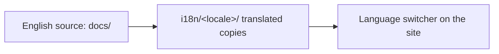

<LevelBadge level="intermediate" />

AILmanac ist zwar Englisch-zuerst, aber **darauf ausgelegt, übersetzt zu werden** — so erreicht es „alle Menschen auf der Welt". Wenn du es in deine Sprache bringen möchtest, hier ist der Weg.

## Wie i18n hier funktioniert

Die Website nutzt die eingebaute Internationalisierung von Docusaurus. **Englisch ist die kanonische Quelle.** Eine Sprache ist ein paralleler Satz übersetzter Dateien; Docusaurus liefert einen Sprachumschalter aus, sobald eine Sprache aktiviert ist.

## Die goldene Regel: übernimm sie, bevor wir sie ausliefern

:::warning Keine halben Übersetzungen in Produktion
Eine Sprache wird erst dann **in Produktion aktiviert, wenn sich jemand zur Pflege verpflichtet.** Eine zu 30 % übersetzte, monatelang veraltete Sprache schadet der Glaubwürdigkeit mehr als gar keine Übersetzung. Besser einen *vollständigen Abschnitt* gut übersetzen, als verstreute Teilseiten.
:::

## Wie du eine Übersetzung beiträgst

1. **Eröffne ein Issue** (verwende die *translation*-Vorlage) und gib an, welche Sprache und welchen Abschnitt du übernimmst.
2. **Übersetze zuerst einen zusammenhängenden Block** — z. B. das gesamte *Start Here* — keine zufälligen Seiten.
3. **Lass Code, Befehle und `VerifyNote`-Quellen unverändert**; übersetze Prosa, Überschriften und Admonition-Text.
4. **Übersetze keine Modell-IDs oder Links**; behalte `/docs/...`-Pfade so bei.
5. **Eröffne einen PR.** Ein Maintainer prüft ihn, und sobald eine Sprache einen Verantwortlichen + einen vollständigen ersten Abschnitt hat, aktivieren wir sie.

## Tipps

- **Nutze Claude für den Entwurf**, dann überprüft ein fließend sprechender Mensch — KI-Übersetzung ist ein hervorragender erster Durchgang, keine endgültige Instanz ([Halluzinationen](/docs/foundations/hallucinations) gelten auch für Übersetzungen).
- **Triff das Level/den Ton** der englischen Seite.
- **Markiere nicht übersetzbare Begriffe** (behalte „prompt", „token" etc., wo das in der Tech-Community deiner Sprache üblich ist).

## Weiter

- [In 10 Minuten beitragen](/docs/contribute/contribute-in-10-minutes)
- [Content-Styleguide](/docs/contribute/style-guide)
- [Verhaltenskodex & Governance](/docs/contribute/governance)
