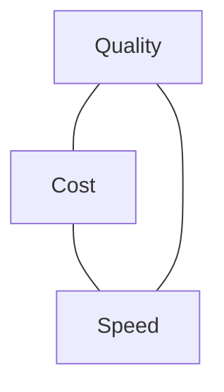

<LevelBadge level="intermediate" />

Qualität, Kosten und Geschwindigkeit ziehen gegeneinander. Du kannst nicht alle drei gleichzeitig maximieren — aber du *kannst* jede dort einsetzen, wo es darauf ankommt, und überall sonst sparen.

## Das Dreieck

Ein größeres Modell ist klüger, aber langsamer und teurer; ein kleineres ist schnell und günstig, aber weniger leistungsfähig. Gutes Engineering bedeutet, **jede Aufgabe an den richtigen Punkt** dieses Dreiecks zu leiten.

## Die größten Hebel (grob in Reihenfolge)

1. **Das Modell richtig dimensionieren.** Verwende Opus nicht für Klassifizierung. Beginne mit Sonnet, wechsle für einfache/hochvolumige Schritte zu Haiku und reserviere Opus für die schwierigen Teile — [Ein Modell auswählen](/docs/api/choosing-a-model).
2. **Modellabstufung / Kaskaden.** Nutze zuerst ein günstiges Modell; eskaliere nur bei Bedarf zu einem stärkeren (z. B. bei Fällen mit geringer Konfidenz).
3. **[Prompt-Caching](/docs/api/prompt-caching).** Verwende ein stabiles Prompt-Präfix über mehrere Aufrufe hinweg wieder — große Einsparungen bei wiederholten System-Prompts, RAG-Kontext oder Tool-Katalogen von Agenten.
4. **Eingabe-Tokens kürzen.** Sende nur, was wichtig ist; [RAG](/docs/foundations/rag) schlägt das Hineinstopfen der gesamten Wissensbasis. Kürzere Eingaben = günstiger *und* oft besser.
5. **Ausgabe begrenzen** mit sinnvollen `max_tokens` und straffen Formatanweisungen.
6. **Batche** Offline-Arbeit, bei der Latenz keine Rolle spielt.

## Latenzspezifische Gewinne

- **Streame** Antworten, damit Nutzer die Ausgabe sofort sehen — enorm für die *gefühlte* Geschwindigkeit, selbst wenn die Gesamtzeit unverändert bleibt ([Streaming](/docs/api/streaming)).
- **Parallelisiere** unabhängige Teilaufrufe.
- **Cache** wiederholte Arbeit; berechne vor, wo du kannst.
- Wähle ein **kleineres Modell** für den interaktiven Pfad; erledige die schwere Arbeit asynchron.

## Optimiere nicht blind

Miss zuerst: Wo gehen die Tokens und die Sekunden tatsächlich hin? Optimiere dann den größten Posten. Und prüfe die Qualität nach jeder Kostensenkung mit [Evals](/docs/foundations/evals) erneut — ein günstigeres Setup, das falsch ist, ist nicht günstiger.

## Weiter

- [Ein Claude-Modell auswählen](/docs/api/choosing-a-model)
- [Prompt-Caching & Kostenoptimierung](/docs/api/prompt-caching)
- [Tokens, Kontext & Preise](/docs/api/tokens-and-pricing)
