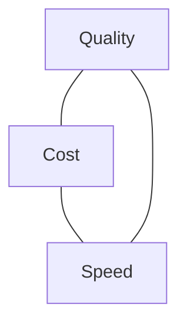
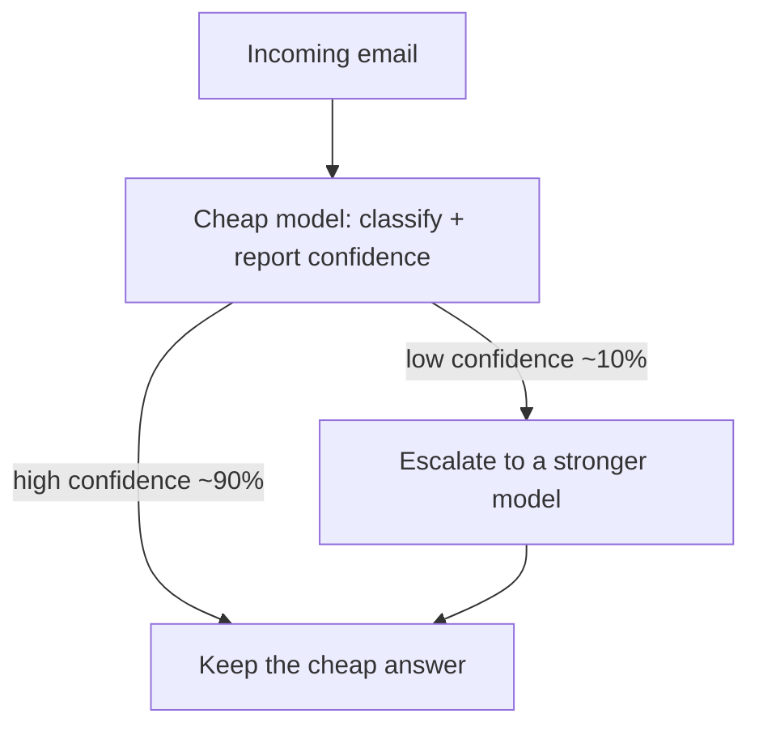

<LevelBadge level="intermediate" />

<Callout type="objectives" items={["Das Dreieck aus Kosten/Qualität/Geschwindigkeit — warum du nie alle drei gleichzeitig maximieren kannst","Die sechs größten Hebel, um dort zu investieren, wo es zählt, und überall sonst zu sparen","Wie eine „billig-zuerst"-Kaskade 90 % des Volumens an ein kleines Modell leitet und die Kosten um ~70 % senkt, ohne die Qualität bei den harten Fällen zu verlieren","Die latenzspezifischen Gewinne (Streaming, Parallelität, Caching, Async), die die gefühlte Geschwindigkeit neu formen","Warum „blind optimieren" die Qualität verbrennt — zuerst messen, dann mit Evals absichern"]} />

Qualität, Kosten und Geschwindigkeit ziehen gegeneinander. Du kannst nicht alle drei gleichzeitig maximieren — aber du *kannst* jede dort einsetzen, wo es darauf ankommt, und überall sonst sparen.

## Das Dreieck

```mermaid
flowchart TD
  Q[Quality] --- C[Cost]
  C --- S[Speed]
  S --- Q
```

Ein größeres Modell ist klüger, aber langsamer und teurer; ein kleineres ist schnell und günstig, aber weniger leistungsfähig. Gutes Engineering bedeutet, **jede Aufgabe an den richtigen Punkt** dieses Dreiecks zu leiten.

## Die größten Hebel (grob in Reihenfolge)

<Steps items={[{title: "Modell richtig dimensionieren", body: "Führe Opus nicht für Klassifizierung aus. Beginne mit Sonnet, wechsle für einfache/hochvolumige Schritte zu Haiku, reserviere Opus für die schwierigen Teile. Der größte Einzelhebel — siehe /docs/api/choosing-a-model."}, {title: "Modellabstufung / Kaskaden", body: "Nutze zuerst ein günstiges Modell; eskaliere nur bei Bedarf zu einem stärkeren (z. B. bei Fällen mit geringer Konfidenz). Siehe das ausgearbeitete Beispiel unten."}, {title: "Prompt-Caching", body: "Verwende ein stabiles Prompt-Präfix über mehrere Aufrufe hinweg wieder — große Einsparungen bei wiederholten System-Prompts, RAG-Kontext oder Agent-Tool-Katalogen. Siehe /docs/api/prompt-caching."}, {title: "Eingabe-Tokens kürzen", body: "Sende nur, was wichtig ist. RAG schlägt das Hineinstopfen der gesamten Wissensbasis. Kürzere Eingaben = günstiger UND oft bessere Ausgabe."}, {title: "Ausgabe-Tokens begrenzen", body: "Setze sinnvolle max_tokens und straffe Formatanweisungen. Ausgabe-Tokens werden zum höchsten Satz abgerechnet — sie zu begrenzen kappt den Ausläufer."}, {title: "Offline-Arbeit batchen", body: "Für alles, was nicht interaktiv sein muss, nutze die Message Batches API. Tauscht Latenz gegen einen großen Rabatt pro Token."}]} />

## Ausgearbeitetes Beispiel: eine „billig-zuerst"-Kaskade

Kaskadierung ist der Hebel, den man überspringt, weil er vage klingt. Machen wir ihn konkret. Angenommen, du musst 100.000 Support-E-Mails triagieren. Der naive Ansatz schickt jede E-Mail durch dein stärkstes Modell. Eine Kaskade leitet den Großteil des Volumens an ein günstiges Modell und eskaliert nur die harten Fälle:

```mermaid
flowchart TD
  In[Incoming email] --> Cheap[Cheap model: classify + report confidence]
  Cheap -->|high confidence ~90%| Done[Keep the cheap answer]
  Cheap -->|low confidence ~10%| Strong[Escalate to a stronger model]
  Strong --> Done
```

Nehmen wir an, das günstige Modell löst 90 % der Fälle allein und ein stärkeres Modell kostet etwa das 5-Fache pro Token. Rechnen wir in relativen *Kosteneinheiten* (1 = ein günstiger Durchgang über eine E-Mail):

- **Alles-stark:** `100k × 5 = 500k` Kosteneinheiten.
- **Kaskade:** `100k × 1` (jede E-Mail bekommt den günstigen Durchgang) `+ 10k × 5` (die 10 %, die eskalieren) `= 150k` Kosteneinheiten.

Das ist etwa eine **70 %-Ersparnis**, und die wirklich harten Fälle bekommen weiterhin dein bestes Modell. Die Multiplikatoren und die Aufteilung sind exemplarisch — setze deine eigenen [Token-Zahlen und Preise](/docs/api/tokens-and-pricing) ein und miss die *echte* Eskalationsrate mit [Evals](/docs/foundations/evals). Die Lehre gilt unabhängig: Die Ersparnis kommt daher, *wie selten* du den teuren Satz zahlst, nicht vom Satz selbst.

## Latenzspezifische Gewinne

<Callout type="tip" items={["Streame Antworten — Nutzer sehen die ersten Tokens sofort, die gefühlte Geschwindigkeit steigt sprunghaft, auch wenn die Gesamtzeit unverändert bleibt (/docs/api/streaming).","Parallelisiere unabhängige Teilaufrufe — eine Anfrage, die auf drei Tools verzweigt, endet in max(latency), nicht in sum(latency).","Cache wiederholte Arbeit und berechne vor, wo du kannst — die schnellsten Tokens sind die, die du nicht generieren musst.","Wähle ein kleineres Modell für den interaktiven Pfad; verschiebe schwere Arbeit asynchron, damit der Nutzer nicht darauf wartet.","Reduziere max_tokens für interaktive Endpunkte — lange Generierungen sind die dominante Quelle für Tail-Latenz."]} />

## Optimiere nicht blind

Miss zuerst: Wo gehen die Tokens und die Sekunden tatsächlich hin? Optimiere dann den größten Posten. Und prüfe die Qualität nach jeder Kostensenkung mit [Evals](/docs/foundations/evals) erneut — ein günstigeres Setup, das falsch ist, ist nicht günstiger.

<Quiz title="Selbstkontrolle" questions={[{q: "Welcher Hebel ist MEISTENS der größte einzelne Kostenhebel?", options: ["Prompt-Caching aktivieren", "Das Modell richtig dimensionieren (kein Flagship für Jobs, die ein kleines Modell problemlos schafft)", "Kleineres max_tokens setzen", "Batch-Modus nutzen"], answer: 1, explain: "Die Modellwahl ist bei Weitem der größte Multiplikator — oft 5–10× zwischen den Stufen. Caching, Begrenzung und Batching sind sinnvoll, aber keines schlägt „hör auf, Flagship-Preise für einen Job zu zahlen, den ein Modell der Haiku-Klasse korrekt erledigt."."}, {q: "Woher kommt die Ersparnis in einer „billig-zuerst"-Kaskade tatsächlich?", options: ["Das günstige Modell ist per Token intrinsisch billiger", "Wie SELTEN du am Ende den teuren Satz zahlst — die meisten Fälle lösen sich auf der günstigen Stufe", "Prompt-Caching, das sich hinter der Kaskade verbirgt", "Das Streamen der Antworten"], answer: 1, explain: "Die Rechnung (100k × 1 + 10k × 5 vs. 100k × 5) zeigt, dass die Ersparnis von der Eskalationsrate dominiert wird. Wenn du 90 % an billig und 10 % an stark leitest, zahlst du den teuren Satz nur auf einem Zehntel des Volumens."}, {q: "Du willst, dass sich eine Antwort für den Nutzer schneller anfühlt. Welcher Hebel hilft AM MEISTEN, ohne die Modellwahl zu ändern?", options: ["max_tokens auf 5 setzen, damit die Antwort kurz ist", "Tokens beim Generieren streamen, damit die Zeit bis zum ersten Token stark sinkt", "Die Anfrage zweimal parallel wiederholen und die schnellste behalten", "Einen Ladespinner hinzufügen"], answer: 1, explain: "Streaming formt die WAHRGENOMMENE Latenz neu, ohne die Gesamt-Generierungszeit zu ändern — Nutzer sehen Ausgabe, während sie entsteht, sodass sich eine 4-Sekunden-Antwort sofort anfühlt. Kürzen mit winzigem max_tokens schadet der Qualität; parallele Wiederholungen verbrennen Kosten."}, {q: "Du hast Kosten gesenkt, indem du bei einem Workflow von Sonnet auf Haiku gewechselt bist. Was ist der nötige nächste Schritt?", options: ["Ausrollen — die Kosten sind gefallen, das ist der ganze Gewinn", "Evals erneut ausführen, um zu bestätigen, dass die Qualität nicht eingebrochen ist — ein günstigeres Setup, das falsch ist, ist nicht günstiger", "Den Prompt cachen, damit es noch weniger kostet", "Ein Fallback zu Opus für jede Anfrage hinzufügen"], answer: 1, explain: "Jede Kostensenkung muss durch Evals abgesichert werden. Eine günstige falsche Antwort kostet meist mehr als eine teure richtige — durch Wiederholungen, Eskalationen oder nachgelagerte Aufräumarbeit. Miss die Qualität nach jeder Änderung."}]} />

<Callout type="takeaways" items={["Das Dreieck ist real: Qualität, Kosten und Geschwindigkeit ziehen gegeneinander — Engineering heißt, jede Aufgabe an den richtigen Punkt zu leiten, nicht alle drei zu maximieren.","Das richtige Dimensionieren des Modells ist der größte Einzelhebel; Kaskaden multiplizieren ihn, indem du Flagship-Preise nur bei der harten Minderheit zahlst.","Prompt-Caching, straffe max_tokens und RAG-getriebenes Kürzen der Eingabe verstärken sich mit der Modellwahl.","Die Latenzwahrnehmung ist eine eigene Achse — Streaming, parallele Teilaufrufe und asynchrone Schwerarbeit formen die UX neu, ohne die reinen Kosten zu ändern.","Jede Kostensenkung muss durch Evals abgesichert werden — ein günstigeres Setup, das falsch ist, ist nicht günstiger."]} />

## Weiter

- [Ein Claude-Modell auswählen](/docs/api/choosing-a-model)
- [Prompt-Caching & Kostenoptimierung](/docs/api/prompt-caching)
- [Tokens, Kontext & Preise](/docs/api/tokens-and-pricing)
