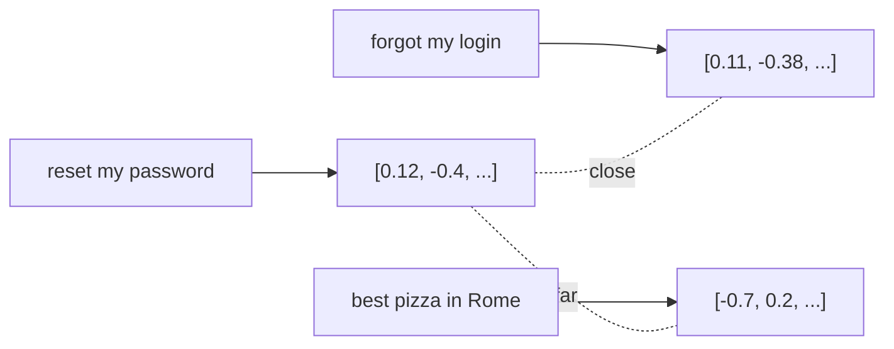

<LevelBadge level="intermediate" />

Ein **Embedding** verwandelt ein Stück Text in eine Liste von Zahlen (einen **Vektor**), die seine *Bedeutung* erfasst. Texte mit ähnlicher Bedeutung erhalten Vektoren, die nah beieinander liegen — selbst wenn sie kein einziges Wort teilen. Das ist der Trick hinter der **semantischen Suche** und [RAG](/docs/foundations/rag).

## Die Intuition

Stell dir vor, jeder Satz wird als Punkt in einem riesigen mehrdimensionalen Raum platziert, so angeordnet, dass **ähnliche Bedeutungen nahe beieinander liegen**. "Wie setze ich mein Passwort zurück?" landet nahe bei "Ich habe meinen Login vergessen", weit entfernt von "beste Pizza in Rom".

## Semantische vs. Stichwortsuche

- **Stichwortsuche** gleicht wörtliche Begriffe ab ("Passwort" findet "Passwort").
- **Semantische Suche** gleicht *Bedeutung* ab — "Ich kann mich nicht anmelden" findet das Passwort-Zurücksetzen-Dokument, auch ohne das Wort "Passwort".

Die besten Ergebnisse **kombinieren** oft beides (hybride Suche).

## Wie eine Vektorsuche funktioniert

1. **Embedde** deine Dokumente (in der Regel in **Chunks** aufgeteilt) und speichere die Vektoren in einer **Vektordatenbank**.
2. Zur Abfragezeit **embedde die Anfrage**.
3. Finde die **nächstgelegenen** Vektoren (per Kosinus-Ähnlichkeit / Distanz).
4. Gib diese Chunks zurück — typischerweise, um sie in [RAG](/docs/foundations/rag) einzuspeisen.

## Praktische Hinweise

- **Chunking ist entscheidend.** Zu groß = verrauschte Treffer; zu klein = verlorener Kontext. Stimme es ab.
- **Verwende konsequent ein einziges Embedding-Modell** — Vektoren aus verschiedenen Modellen sind nicht vergleichbar.
- **Metadaten + Filter** (Datum, Quelle, Typ) machen das Retrieval weitaus präziser.
- Eine Vektor-DB ist nicht immer nötig — für kleine Korpora reicht eine einfache In-Memory-Suche aus.

## Weiter

- [Retrieval-Augmented Generation (RAG)](/docs/foundations/rag)
- [Fine-Tuning vs. Prompting vs. RAG](/docs/foundations/finetune-vs-prompt-vs-rag)
- [Halluzinationen & wie man sie reduziert](/docs/foundations/hallucinations)
