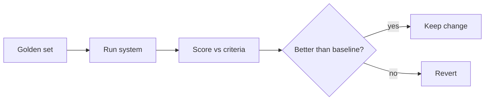

<LevelBadge level="advanced" />

Wenn du irgendetwas auslieferst, das auf KI basiert, sind **Evals** der Weg, mit dem du weißt, dass es funktioniert — und wie du weißt, dass eine Änderung es besser gemacht hat und nicht schlechter. Ohne sie fliegst du blind: Eine Prompt-Anpassung, die einen Fall verbessert, kann unbemerkt zehn andere kaputt machen.

## Das Minimal-Eval (Minimum Viable Eval)

Du brauchst kein Framework, um zu starten:

1. **Sammle ein Golden Set.** 20–100 echte Eingaben mit den *korrekten* oder *akzeptablen* Ausgaben (oder klaren Kriterien). Decke die einfachen Fälle, die kniffligen und die Randfälle ab, die dich gebissen haben.
2. **Definiere, was "gut" bedeutet** pro Aufgabe — exakte Übereinstimmung, enthält Schlüsselfakten, valides JSON-Schema, keine halluzinierten Zahlen, Tonfall usw.
3. **Führe aus und bewerte** dein aktuelles Setup gegen das Set.
4. **Ändere eine Sache** (Prompt, Modell, Retrieval), führe erneut aus, **vergleiche**. Behalte die Änderung nur, wenn sich der Wert verbessert.

## Metriken auswählen

- **Deterministische Prüfungen** wo möglich: Schema valide? Enthält den richtigen Wert? Code besteht die Tests? Diese sind günstig und vertrauenswürdig.
- **LLM-as-Judge** für unscharfe Qualität (Hilfsbereitschaft, Tonfall): Lass ein Modell Ausgaben anhand einer Rubrik bewerten. Nützlich, aber **kalibriere es** — Judges haben Verzerrungen (Länge, Position). Validiere den Judge an einer Stichprobe gegen menschliche Bewertungen.
- **Menschliche Überprüfung** für den Anteil mit den höchsten Einsätzen.

## Wann man sie ausführt

- **Vor/nach jeder Prompt- oder Modelländerung.**
- **Bei einer Modellmigration** — ein neues Modell kann das Verhalten verändern ([Fehler & Migration](/docs/api/errors-and-rate-limits)).
- **In der CI** für Produktivsysteme, als Gate.

:::tip Trenne die Stufen
Bei [RAG](/docs/foundations/rag) und [Agenten](/docs/api/building-agents) bewerte jede Stufe (hat das Retrieval das richtige Dokument gefunden? wurde das Tool korrekt aufgerufen?) — nicht nur die finale Antwort. Das grenzt Fehler ein.
:::

## Weiter

- [Halluzinationen & wie man sie reduziert](/docs/foundations/hallucinations)
- [Agenten auf der API bauen](/docs/api/building-agents)
- [Ein Modell & einen Anbieter auswählen](/docs/foundations/choosing-a-model-provider)
