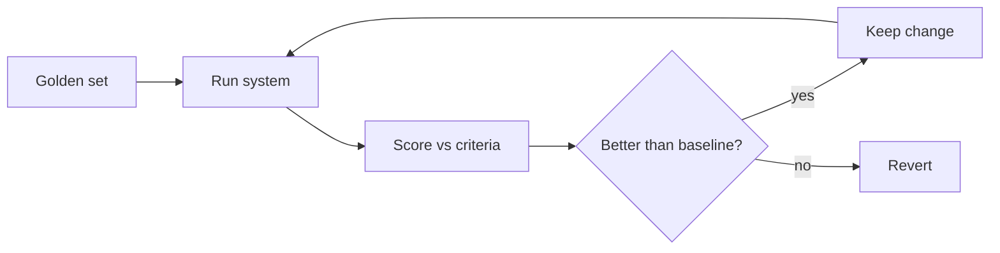

<LevelBadge level="advanced" />

<Callout type="objectives" items={[
  "Baue das kleinste nützliche Eval — ein Golden Set aus 20–100 echten Eingaben mit klaren Pass-Kriterien",
  "Wähle die richtige Metrik pro Aufgabe: deterministische Prüfungen, LLM-as-Judge oder menschliche Überprüfung",
  "Führe Evals als Gate aus — vor/nach jeder Prompt-Änderung, jedem Modellwechsel und in CI",
  "Bewerte jede Stufe (Retrieval, Tool-Call, finale Antwort), nicht nur die letzte, um Regressionen zu lokalisieren"
]} />

Wenn du irgendetwas auslieferst, das auf KI basiert, sind **Evals** der Weg, mit dem du weißt, dass es funktioniert — und wie du weißt, dass eine Änderung es besser gemacht hat und nicht schlechter. Ohne sie fliegst du blind: Eine Prompt-Anpassung, die einen Fall verbessert, kann unbemerkt zehn andere kaputt machen. Evals verwandeln "gefühlsbasierte" Iteration in eine messbare Schleife.

## Das Minimal-Eval

Du brauchst kein Framework, um zu starten. Die gesamte Schleife hat vier Schritte:

<Steps items={[
  {title: "Sammle ein Golden Set", body: "20–100 echte Eingaben mit den korrekten oder akzeptablen Ausgaben (oder klaren Kriterien dafür, was als Pass zählt). Decke die einfachen Fälle, die kniffligen und die Randfälle ab, die dich bereits in der Produktion gebissen haben."},
  {title: "Definiere, was 'gut' bedeutet — pro Aufgabe", body: "Exakte Übereinstimmung? Enthält einen bestimmten Schlüsselfakt? Valides JSON, das zu deinem Schema passt? Keine halluzinierten Zahlen? Markenkonformer Tonfall? Schreib die Pass-Kriterien auf — eine Zeile pro Fall reicht."},
  {title: "Führe aus und bewerte deine Baseline", body: "Führe dein aktuelles Setup gegen das Set aus und notiere den Wert. Das ist jetzt die Zahl, die es zu schlagen gilt. Speichere sie — dein zukünftiges Ich wird sie brauchen."},
  {title: "Ändere eine Sache, führe erneut aus, vergleiche", body: "Prompt-Anpassung, Modellwechsel, Retrieval-Änderung — eine Variable auf einmal. Wenn der Wert steigt und nichts regressiert, behalte die Änderung. Wenn nicht, verwirf sie. Das ist die gesamte Schleife."}
]} />

```mermaid
flowchart LR
  G[Golden set] --> R[Run system]
  R --> S[Score vs criteria]
  S --> C{Better than baseline?}
  C -->|yes| K[Keep change]
  C -->|no| X[Revert]
  K --> R
```

## Metriken auswählen

Nicht jede Frage verdient denselben Test. Passe die Metrik an die Aufgabe an:

| Aufgabentyp | Metrik | Kosten | Vertrauenswürdigkeit |
|---|---|---|---|
| Strukturierte Ausgabe (JSON, SQL) | Schemavalidierung, exakte Übereinstimmung | Gratis | Hoch |
| Codegenerierung | Führe die Tests aus, die er geschrieben hat | Günstig | Hoch |
| Extraktion (Daten, Entitäten) | String contains / Regex | Gratis | Hoch |
| Klassifikation | Accuracy, Precision, Recall | Gratis | Hoch |
| Zusammenfassungen, Entwürfe, Tonfall | LLM-as-Judge mit einer Rubrik | Mittel | Mittel — muss kalibriert werden |
| Hochriskante Texte, Sicherheit | Menschliche Überprüfung einer Stichprobe | Teuer | Am höchsten |

Drei Faustregeln:

- **Deterministische Prüfungen wo möglich.** Wenn die Antwort "valides JSON, das zu diesem Schema passt" oder "der Code besteht diese Tests" ist, frag kein LLM — prüf es einfach.
- **LLM-as-Judge für unscharfe Qualität.** Hilfsbereitschaft, Tonfall, Faktentreue-vs-Quelle. Günstig, schnell, aber mit *Verzerrungen* (Länge, Position, Selbstbevorzugung). Validiere den Judge an menschlichen Bewertungen auf einer Stichprobe, bevor du seinen Zahlen vertraust.
- **Menschen für die höchstriskante Stichprobe.** Selbst 10 von Menschen bewertete Fälle pro Release schlagen 0.

<PromptCard title="Starter-Rubrik für LLM-as-Judge">{`You are grading assistant responses against a source document.

For each response, output a JSON object with these fields:
- grounded: true if every factual claim is supported by the source, else false
- complete: true if the response answers all parts of the question, else false
- concise: true if the response contains no filler or repetition, else false
- overall_score: 1-5 (1 = unusable, 5 = ship it)
- reasoning: one sentence explaining the score

Do not consider length. Do not consider whether the response comes first or second.

<source>{{SOURCE}}</source>
<question>{{QUESTION}}</question>
<response>{{RESPONSE}}</response>

Return only the JSON, no preamble.`}</PromptCard>

## Wann man sie ausführt

- **Vor/nach jeder Prompt- oder Modelländerung.** Keine Ausnahmen. Der ganze Sinn des Golden Sets besteht darin, die Änderung zu erwischen, die du für sicher gehalten hast.
- **Bei einer Modellmigration.** Neue Modelle verschieben das Verhalten — manchmal unbemerkt. Führe Evals aus, bevor du die Modell-ID umlegst. Siehe [Fehler & Migration](/docs/api/errors-and-rate-limits).
- **In CI, für Produktivsysteme.** Verwandle ein grünes Eval in ein Merge-Gate. Regressionen werden abgefangen, bevor die Nutzer sie sehen.
- **Nach jedem gemeldeten Bug.** Füge den fehlgeschlagenen Fall zum Golden Set hinzu. Das Set wächst, wie es das System tut.

## Bewerte jede Stufe, nicht nur die finale Antwort

Bei [RAG](/docs/foundations/rag) und [Agenten](/docs/api/building-agents) verdeckt eine einzige "finale Antwort"-Bewertung, wo es kaputtgeht. Bewerte jede Stufe separat, damit Regressionen an einer Stelle landen:

| Stufe | Was zu prüfen ist |
|---|---|
| Retrieval | Enthielt das Top-k das Dokument mit der Antwort? |
| Tool-Auswahl | Hat der Agent das richtige Tool für diese Runde gewählt? |
| Tool-Argumente | Waren die Argumente wohlgeformt und korrekt? |
| Finale Antwort | Entspricht sie den Golden-Kriterien? |

Wenn der Retrieval-Score fällt, aber der Score der finalen Antwort stabil bleibt, weißt du: Es ist eine Retrieval-Regression — kein Prompt-Problem. Genau diese Lokalisierung macht Evals nützlich fürs Debugging, nicht nur zum Punkten.

## Häufige Fehler

- **Mit demselben Modell bewerten, das die Antwort erzeugt hat.** Selbstbevorzugungs-Bias bläht die Werte auf. Nimm ein anderes Modell — oder besser: eine andere Familie — als Judge.
- **Judge-Prompts, die die "richtige" Antwort verraten.** Wenn der Judge die Gold-Antwort sieht, findet er Gründe, ihre Übereinstimmung zu belohnen. Bewerte nach Kriterien, nicht nach Ähnlichkeit.
- **Golden Sets, die am Tag eins eingefroren wurden.** Das Set sollte jedes Mal wachsen, wenn dich die Produktion überrascht. Ein veraltetes Set misst die Vergangenheit.
- **Auf das Eval hin optimieren statt auf die Aufgabe.** Wenn du Prompts gegen ein kleines Set tunst, bis jeder Fall besteht, hast du möglicherweise überangepasst. Halte ~20 % der Fälle als Validierungs-Slice zurück, den du während der Iteration niemals ansiehst.

<Quiz title="Prüfe dich selbst" questions={[
  {q: "Was ist das Minimal-Eval?", options: ["Ein auf deine Daten feinabgestimmtes Modell", "Ein Golden Set aus 20–100 echten Eingaben mit Pass-Kriterien, gegen die du bewerten kannst", "Ein Dashboard, das Latenz und Kosten verfolgt"], answer: 1, explain: "20–100 echte Eingaben mit einer klaren Definition von 'gut' reichen zum Start. Du brauchst kein Framework — du brauchst etwas, das du bewerten kannst."},
  {q: "Wann solltest du eine deterministische Prüfung einem LLM-as-Judge vorziehen?", options: ["Niemals — LLM-Judges sind nuancierter", "Wenn das Pass-Kriterium objektiv ist (Schema valide, exakte Übereinstimmung, Tests bestehen)", "Nur wenn du dir keinen LLM-Judge leisten kannst"], answer: 1, explain: "Wenn du Pass/Fail per Code entscheiden kannst, tu es — deterministische Prüfungen sind kostenlos, schnell und unverzerrt. Reserviere LLM-as-Judge für wirklich unscharfe Qualitätsdimensionen."},
  {q: "Warum bei einem RAG-Agenten jede Stufe separat bewerten?", options: ["Um Compliance zu erfüllen", "Damit eine Regression dir sagt, WO es kaputtgegangen ist (Retrieval, Tool oder finale Antwort)", "Um das Eval langsamer und gründlicher zu machen"], answer: 1, explain: "Ein einziger End-to-End-Score verdeckt, welche Stufe regressiert ist. Stufenbewertungen erlauben dir, Bugs zu lokalisieren — Retrieval fiel, aber Final hielt? Das ist eine Retrieval-Regression, keine Prompt-Regression."},
  {q: "Was ist ein Warnzeichen, dass du auf dein Eval-Set überangepasst hast?", options: ["Dein Golden Set ändert sich nie und besteht zu 100 %", "Du nutzt einen LLM-Judge", "Du führst Evals in CI aus"], answer: 0, explain: "Ein eingefrorenes Golden Set mit 100 % Pass-Rate heißt meist, dass du auf Auswendiglernen getunt hast. Halte einen Validierungs-Slice zurück, den du während der Iteration nie anschaust, und lasse das Set aus echten Produktionsfehlern wachsen."}
]} />

<Callout type="takeaways" items={[
  "20–100 echte Eingaben + Pass-Kriterien + eine Variable auf einmal = eine funktionierende Eval-Schleife.",
  "Deterministisch > LLM-Judge > Mensch — nimm die günstigste Metrik, die die Aufgabe erlaubt.",
  "Bewerte jede Stufe einer Pipeline, nicht nur die finale Antwort.",
  "Das Golden Set wächst mit jedem gemeldeten Bug. Ein veraltetes Set misst die Vergangenheit."
]} />

## Weiter

- [Deinen KI-Agenten bewerten](/docs/playbooks/evaluating-agents) — das tiefere Playbook: Trajektorien-Scoring, LLM-Judge-Kalibrierung, CI-Gate
- [Halluzinationen & wie man sie reduziert](/docs/foundations/hallucinations)
- [Agenten auf der API bauen](/docs/api/building-agents)
- [Ein Modell & einen Anbieter auswählen](/docs/foundations/choosing-a-model-provider)
