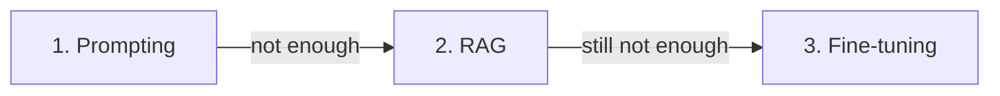

<LevelBadge level="intermediate" />

Wenn das Modell nicht das tut, was du willst, gibt es drei Hebel — und die Leute greifen zuerst nach dem teuren. Hier ist die Reihenfolge, die tatsächlich funktioniert.

## Probiere in dieser Reihenfolge

### 1. Prompting — beginne immer hier
Klarere Anweisungen, Beispiele, eine Rolle, Ausgabe-Vorgaben ([Prompting-Grundlagen](/docs/prompting/basics)). Behebt die **Mehrheit** der Probleme, kostet nichts extra und lässt sich sofort iterieren. Das meiste "das Modell ist schlecht in X" entpuppt sich als "der Prompt war vage".

### 2. RAG — wenn *dein* Wissen gebraucht wird
Wenn die Lücke in **fehlenden oder aktuellen Informationen** besteht (deine Dokumente, deine Daten, aktuelle Fakten), füge [RAG](/docs/foundations/rag) hinzu. Hält Wissen aktualisierbar und zitierbar, ohne das Modell anzutasten.

### 3. Fine-Tuning — letztes Mittel, für *Verhalten/Format* im großen Maßstab
Fine-Tuning trainiert ein Modell auf deinen Beispielen weiter. Greife nur dann darauf zurück, wenn Prompting + RAG keinen konsistenten **Stil, kein Format oder kein Aufgabenverhalten** erreichen können und du **viele hochwertige Beispiele** sowie das Volumen hast, das es rechtfertigt.

## Die Entscheidungstabelle

| Dein Problem | Greife zu |
|---|---|
| Vage/falsche Ausgaben, falsches Format | **Prompting** |
| Kennt deine Daten nicht / braucht aktuelle Infos | **RAG** |
| Braucht einen sehr bestimmten Stil/ein bestimmtes Verhalten, konsistent, im großen Maßstab | **Fine-Tuning** |
| Muss Aktionen ausführen | (Nicht diese — das ist [Tool-Nutzung/Agenten](/docs/api/tool-use)) |

## Warum die Leute es falsch machen

Fine-Tuning *klingt* nach "dem Modell etwas beibringen", also fühlt es sich wie die eigentliche Lösung an. Aber es ist die langsamste, teuerste, unflexibelste Option, es **fügt kein frisches Wissen** gut hinzu (das macht RAG), und es ist leicht, es schlecht zu machen. Schöpfe zuerst Prompting und RAG aus — Schritt 3 wirst du meist nicht brauchen.

:::tip Sie lassen sich kombinieren
Ein starkes System ist oft ein guter **Prompt** + **RAG** für Wissen, wobei Fine-Tuning für einen eng umrissenen Verhaltensbedarf reserviert bleibt. Sie schließen sich nicht gegenseitig aus.
:::

## Weiter

- [Retrieval-Augmented Generation (RAG)](/docs/foundations/rag)
- [Prompting-Grundlagen](/docs/prompting/basics)
- [KI-Qualität bewerten (Evals)](/docs/foundations/evals)
