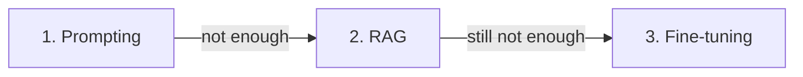

<LevelBadge level="intermediate" />

<Callout type="objectives" items={["Die drei Hebel, die du hast, wenn das Modell nicht das tut, was du willst","Die Reihenfolge, die tatsächlich funktioniert — und warum Fine-Tuning fast nie Schritt 1 ist","Wann RAG die richtige Lösung ist und wann es überzogen wäre","Worin Fine-Tuning wirklich gut ist (und worin nicht)","Wie sich die drei in einem echten Produktivsystem kombinieren"]} />

Wenn das Modell nicht das tut, was du willst, gibt es drei Hebel — und die Leute greifen zuerst nach dem teuren. Hier ist die Reihenfolge, die tatsächlich funktioniert.

## Probiere in dieser Reihenfolge

```mermaid
flowchart LR
  A[1. Prompting] -->|not enough| B[2. RAG]
  B -->|still not enough| C[3. Fine-tuning]
```

<Steps items={[{title: "1. Prompting — beginne immer hier", body: "Klarere Anweisungen, Beispiele, eine Rolle, Ausgabe-Vorgaben (siehe /docs/prompting/basics). Behebt die Mehrheit der Probleme, kostet nichts extra und lässt sich sofort iterieren. Das meiste „das Modell ist schlecht in X“ entpuppt sich als „der Prompt war vage.“"}, {title: "2. RAG — wenn DEIN Wissen gebraucht wird", body: "Wenn die Lücke in fehlenden oder aktuellen Informationen besteht (deine Dokumente, deine Daten, aktuelle Fakten), füge RAG hinzu (/docs/foundations/rag). Hält Wissen aktualisierbar und zitierbar, ohne das Modell anzutasten — tausche ein Dokument aus und die nächste Antwort spiegelt es wider."}, {title: "3. Fine-Tuning — letztes Mittel, für Verhalten/Format im großen Maßstab", body: "Fine-Tuning trainiert ein Modell auf deinen Beispielen weiter. Greife nur dann darauf zurück, wenn Prompting + RAG keinen konsistenten Stil, kein Format oder kein Aufgabenverhalten erreichen können UND du viele hochwertige Beispiele hast UND das Volumen, das es rechtfertigt."}]} />

## Die Entscheidungstabelle

| Dein Problem | Greife zu |
|---|---|
| Vage/falsche Ausgaben, falsches Format | **Prompting** |
| Kennt deine Daten nicht / braucht aktuelle Infos | **RAG** |
| Braucht einen sehr bestimmten Stil/ein bestimmtes Verhalten, konsistent, im großen Maßstab | **Fine-Tuning** |
| Muss Aktionen ausführen | (Nicht diese — das ist [Tool-Nutzung/Agenten](/docs/api/tool-use)) |

<Flashcards title="Welcher Hebel löst welches Problem" cards={[{front: "Symptom: die Ausgabe ist vage, hat das falsche Format oder verfehlt den Sinn der Aufgabe.", back: "Löse mit PROMPTING. Füge Rolle, Vorgaben, Beispiele und ein Zielformat hinzu. Am günstigsten und schnellsten — in neun von zehn Fällen ist das die ganze Antwort."}, {front: "Symptom: das Modell kennt die Dokumente deines Unternehmens, die aktuelle Preisliste oder die Nachrichten der letzten Woche nicht.", back: "Löse mit RAG. Rufe die relevanten Chunks zur Anfragezeit ab und injiziere sie als Kontext. Das Wissen bleibt aktualisierbar und zitierbar — kein Retraining nötig."}, {front: "Symptom: du brauchst einen sehr konsistenten Hausstil, ein JSON-Schema oder ein enges Klassifizierungsverhalten über tausende Aufrufe hinweg, und Prompting driftet immer wieder ab.", back: "Erwäge FINE-TUNING. Nur nachdem Prompting + RAG gescheitert sind, und nur mit Hunderten bis Tausenden hochwertiger Beispiele plus dem Aufrufvolumen, um die Trainingskosten wieder hereinzuholen."}, {front: "Symptom: das Modell muss Aktionen ausführen (eine E-Mail senden, eine Abfrage ausführen, eine API aufrufen).", back: "Keiner dieser drei — das ist TOOL-NUTZUNG / AGENTEN. Siehe /docs/api/tool-use."}]} />

## Warum die Leute es falsch machen

Fine-Tuning *klingt* nach "dem Modell etwas beibringen", also fühlt es sich wie die eigentliche Lösung an. Aber es ist die langsamste, teuerste, unflexibelste Option, es **fügt kein frisches Wissen** gut hinzu (das macht RAG), und es ist leicht, es schlecht zu machen. Schöpfe zuerst Prompting und RAG aus — Schritt 3 wirst du meist nicht brauchen.

<Callout type="warning" items={["Ein Frontier-Modell auf deinen Daten fine-zu-tunen fügt NICHT zuverlässig neue Fakten hinzu — es verschiebt Stil und Verhalten. Fakten halluzinieren weiterhin.","Ein fine-getuntes Modell ist an diese Basis-Version gebunden. Wenn der Anbieter eine bessere Basis ausliefert, trainierst du neu oder bleibst hängen.","Schlechte Trainingsdaten verstärken schlechtes Verhalten — ein mittelmäßiger Datensatz macht das Modell schlechter, nicht besser.","Die meisten „wir brauchen Fine-Tuning"-Anfragen sind eigentlich „unser Prompt sind 40 Zeilen ad-hoc-Regeln" — refaktoriere zuerst den Prompt."]} />

:::tip Sie lassen sich kombinieren
Ein starkes System ist oft ein guter **Prompt** + **RAG** für Wissen, wobei Fine-Tuning für einen eng umrissenen Verhaltensbedarf reserviert bleibt. Sie schließen sich nicht gegenseitig aus.
:::

<PromptCard title="Ein konkretes Beispiel: „Das Modell kann keine Fragen zu unserem Produkt beantworten"">{`# Wrong first move: fine-tune on the product manual.
# Right first move: retrieve the relevant chapter and inject it.

# 1. PROMPTING (baseline)
System: "You are a support agent for Acme Widgets. Be concise, cite doc sections."
User:   "Does the Widget Pro support Bluetooth 5.3?"
# Fails — model has no idea what a Widget Pro is.

# 2. + RAG (usually enough)
System: "You are a support agent for Acme Widgets. Be concise, cite doc sections."
Context: [top-3 chunks from product manual retrieved by embedding search]
User:    "Does the Widget Pro support Bluetooth 5.3?"
# Works — model reads the retrieved specs and answers with a citation.

# 3. + Fine-tuning (only if house voice / format is still drifting after 1+2)
# Train on 500-2000 (prompt, ideal answer) pairs to lock in the style — NOT to teach facts.`}</PromptCard>

<Quiz title="Selbstkontrolle" questions={[{q: "Das Modell gibt vage, formatfremde Antworten auf deine Aufgabe. Was probierst du zuerst?", options: ["Auf einem Batch idealer Ausgaben fine-tunen", "RAG hinzufügen, damit es besseren Kontext abrufen kann", "Den Prompt straffen — Rolle, Vorgaben, Beispiele, Zielformat", "Auf ein größeres Modell wechseln"], answer: 2, explain: "Prompting ist immer Schritt 1. Das meiste „das Modell ist schlecht in X\" entpuppt sich als „der Prompt war vage.\" Es ist kostenlos, sofort iterierbar und löst die Mehrheit der Probleme."}, {q: "Dein Modell kennt dein internes Wiki nicht. Welcher Hebel?", options: ["Prompting — schreibe einen längeren System-Prompt, der das Wiki beschreibt", "RAG — rufe die relevante Wiki-Seite zur Anfragezeit ab und injiziere sie", "Fine-Tuning — trainiere auf dem Wiki-Korpus, damit das Modell es „kennt\"", "Keiner — wechsle einfach das Modell"], answer: 1, explain: "Fehlende ODER frische Informationen sind genau das, was RAG löst. Fine-Tuning ist unzuverlässig, um Fakten hinzuzufügen, und ist an ein Basismodell gebunden. RAG hält das Wissen aktualisierbar und zitierbar — tausche die Wiki-Seite und die nächste Antwort spiegelt es wider."}, {q: "Worin ist Fine-Tuning TATSÄCHLICH gut?", options: ["Neues faktisches Wissen zum Modell hinzufügen", "Einen konsistenten Stil, ein Format oder ein enges Aufgabenverhalten im großen Maßstab festzurren, wenn Prompting + RAG es nicht erreichen", "Das Modell schneller machen", "Den Bedarf an einem System-Prompt beseitigen"], answer: 1, explain: "Fine-Tuning verschiebt Stil und Verhalten, nicht Fakten. Es ist das richtige letzte-Mittel-Werkzeug für einen engen, hochvolumigen Verhaltensbedarf (z. B. ein striktes JSON-Schema in einem bestimmten Ton über Millionen von Aufrufen zu produzieren). Fakten gehören in RAG."}, {q: "Welche Kombination hat die Form eines reifen Produktivsystems?", options: ["Alles fine-tunen und Prompting überspringen", "Starker Prompt + RAG für Wissen, mit Fine-Tuning reserviert für einen engen Verhaltensbedarf — sie schließen sich nicht gegenseitig aus", "Nur einer der drei — sie zu mischen erzeugt Konflikte", "Prompt + Fine-Tune, niemals RAG"], answer: 1, explain: "Die drei Hebel setzen sich zusammen. Ein guter Prompt setzt den Rahmen, RAG liefert das frische Wissen, und Fine-Tuning (wenn überhaupt) zurrt ein spezifisches Verhalten im großen Maßstab fest."}]} />

<Callout type="takeaways" items={["Drei Hebel, wenn das Modell nicht das tut, was du willst: Prompting, RAG, Fine-Tuning — in dieser Reihenfolge.","Prompting behebt ~9 von 10 „Modell ist schlecht in X"-Beschwerden bei Nullkosten und sofortiger Iteration.","RAG ist die richtige Lösung, wenn die Lücke fehlendes oder frisches Wissen ist — Fine-Tuning ist NICHT zuverlässig, um Fakten hinzuzufügen.","Fine-Tuning ist ein letztes Mittel für konsistenten Stil/Format/Verhalten im großen Maßstab und braucht Hunderte bis Tausende hochwertiger Beispiele plus das Aufrufvolumen, um sich zu rechtfertigen.","In einem echten Produktivsystem setzen sich die drei zusammen: starker Prompt + RAG + enges Fine-Tuning."]} />

## Weiter

- [Retrieval-Augmented Generation (RAG)](/docs/foundations/rag)
- [Prompting-Grundlagen](/docs/prompting/basics)
- [KI-Qualität bewerten (Evals)](/docs/foundations/evals)
