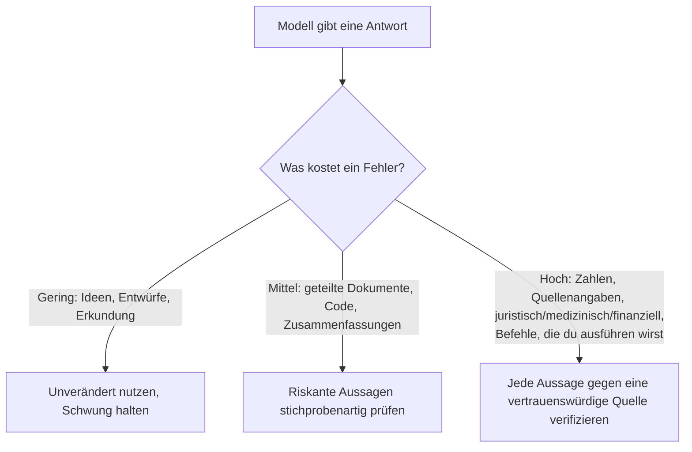

<LevelBadge level="intermediate" />

Eine **Halluzination** liegt vor, wenn ein Modell etwas Falsches mit völliger Überzeugung behauptet. Es lügt nicht und ist nicht kaputt — es ist die Kehrseite davon, wie LLMs funktionieren: Sie erzeugen *plausiblen* Text, und plausibel ist nicht immer wahr (siehe [Was ist ein LLM?](/docs/foundations/what-is-an-llm)). Du kannst das nicht vollständig wegprompten, aber du kannst es drastisch reduzieren und den Rest abfangen.

## Warum es passiert

Das Modell sagt eine wahrscheinliche Fortsetzung voraus. Wenn es etwas nicht "weiß", ist die *am wahrscheinlichsten aussehende* Fortsetzung oft eine selbstbewusste, wohlgeformte — und falsche — Antwort. Es gibt kein eingebautes "Ich bin unsicher"-Signal, es sei denn, du schaffst Raum dafür.

## Die Hochrisikozonen

Sei am skeptischsten, wenn die Ausgabe Folgendes umfasst:

- **Zitate, Quellenangaben und Referenzen** — erfundene Paper, gefälschte URLs, falsch zugeordnete Zitate.
- **Konkrete Zahlen, Daten und Statistiken** — plausible, aber erfundene Werte.
- **Nischenwissen oder sehr aktuelle Fakten** — jenseits dessen, was das Modell zuverlässig gelernt hat.
- **APIs und Bibliotheksdetails** — Methoden oder Parameter, die nicht existieren.
- **Personen und juristische/medizinische Details** — hohe Einsätze, leicht subtil falsch zu machen.

## Der Werkzeugkasten zur Reduktion

Kombiniere diese — jeder einzelne Punkt hilft:

1. **Verankere es in Quellen.** Füge den Quelltext ein und sage *"antworte nur aus dem obigen Text; wenn es dort nicht steht, sage es"*. Das ist die Kernidee hinter [RAG](/docs/foundations/rag).
2. **Gib ihm einen Ausweg.** Erlaube ausdrücklich *"Wenn du nicht sicher bist, sage 'Ich weiß es nicht'"* — das reduziert selbstbewusstes Raten dramatisch.
3. **Verlange Begründung und Quellenangaben.** *"Zitiere den genauen Satz, der jede Aussage stützt."* Unbelegte Aussagen werden offensichtlich.
4. **Senke die Kreativität** bei faktischen Aufgaben, wenn das Modell eine Temperatursteuerung bietet (siehe [Sampling-Steuerung](/docs/foundations/sampling-controls)).
5. **Nutze Tools.** Für Mathematik, aktuelle Daten oder Nachschlagevorgänge gib dem Modell einen Taschenrechner/eine Suche/ein [Tool](/docs/api/tool-use), statt dich auf seine Erinnerung zu verlassen.
6. **Gegenchecken.** Stelle dieselbe Frage auf zwei Arten oder lass einen zweiten Durchlauf den ersten kritisieren.

## Ein Anti-Halluzinations-Prompt zum Kopieren und Einfügen

Der Großteil des obigen Werkzeugkastens lässt sich zu einem einzigen wiederverwendbaren Wrapper zusammenfassen. Füge deine Quelle an der gezeigten Stelle ein und stelle deine Frage — er verankert die Antwort, gibt dem Modell einen Ausweg und erzwingt Quellenangaben in einem Zug:

```text
Du antwortest AUSSCHLIESSLICH aus der QUELLE unten.
Regeln:
- Wenn die Antwort nicht in der QUELLE steht, antworte exakt: "Nicht in der Quelle angegeben."
- Zitiere nach jeder Aussage den genauen Satz aus der QUELLE, der sie stützt.
- Füge kein externes Wissen, keine Schätzungen und keine Annahmen hinzu.

QUELLE:
"""
[füge hier das Dokument, das Transkript oder die Daten ein]
"""

FRAGE: [deine Frage]
```

Warum es funktioniert: Die Notfallklausel "Nicht in der Quelle angegeben" nimmt den Druck zu raten, und die Regel, den Satz zu zitieren, macht es unmöglich, eine unbelegte Aussage zu verbergen. Lass den QUELLE-Block weg, wenn du wirklich das Eigenwissen des Modells willst — aber dann liegt die Verifizierung wieder bei dir.

## Die Denkweise, die dich tatsächlich schützt

:::warning Verifiziere, was wichtig ist — immer
Kein Prompt macht die Ausgabe zu 100 % zuverlässig. Bei allem Folgenreichen — einer Zahl in einem Bericht, einer Quellenangabe, einem Befehl, den du ausführen wirst, einem medizinischen/juristischen/finanziellen Detail — **prüfe es gegen eine vertrauenswürdige Quelle**. Behandle KI als schnellen ersten Entwurf, nicht als endgültige Autorität. Das ist der Kern der [Verantwortungsvollen Nutzung](/docs/security/responsible-use).
:::

Eine einfache Regel: **Die Kosten eines Fehlers bestimmen den Umfang der Verifizierung.** Brainstorming? Vertraue freizügig. Eine Statistik veröffentlichen? Verifiziere jedes Mal.



## Weiter

- [Retrieval-Augmented Generation (RAG)](/docs/foundations/rag)
- [KI-Qualität bewerten (Evals)](/docs/foundations/evals)
- [Verantwortungsvolle Nutzung, Ethik & Verifizierung](/docs/security/responsible-use)
