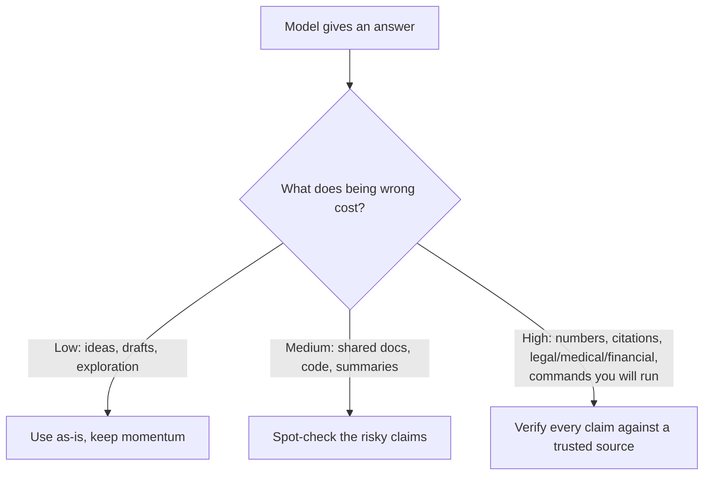

<LevelBadge level="intermediate" />

<Callout type="objectives" items={["Verstehen, WARUM Modelle selbstbewusste, gut formulierte Antworten erfinden", "Die 5 Hochrisikozonen erkennen, in denen du am skeptischsten sein solltest", "Einen 6-teiligen Werkzeugkasten anwenden, um Halluzinationen drastisch zu reduzieren", "Einen Copy-Paste-Anti-Halluzinations-Prompt nutzen, der erdet, einen Ausweg gibt und Zitate erzwingt", "Die Denkweise annehmen, die den Verifizierungsaufwand an die Kosten des Irrtums anpasst"]} />

Eine **Halluzination** ist, wenn ein Modell etwas Falsches mit völliger Überzeugung behauptet. Es lügt nicht und ist nicht kaputt — es ist die Kehrseite davon, wie LLMs funktionieren: Sie erzeugen *plausiblen* Text, und plausibel ist nicht immer wahr (siehe [Was ist ein LLM?](/docs/foundations/what-is-an-llm)). Du kannst das nicht völlig wegprompten, aber du kannst es drastisch reduzieren und den Rest abfangen.

## Warum es passiert

Das Modell sagt eine wahrscheinliche Fortsetzung voraus. Wenn es etwas nicht "weiß", ist die *am wahrscheinlichsten aussehende* Fortsetzung oft eine selbstbewusste, gut formulierte — und falsche — Antwort. Es gibt kein eingebautes "Ich bin unsicher"-Signal, es sei denn, du schaffst Raum dafür.

<Callout type="tip" items={["Der Fix für die meisten Halluzinationen besteht darin, bewusst Raum für Unsicherheit zu schaffen — gib dem Modell die Erlaubnis zu sagen, dass es etwas nicht weiß."]} />

## Die Hochrisikozonen

Sei am skeptischsten, wenn die Ausgabe Folgendes betrifft:

- **Zitate, Belege und Quellenangaben** — erfundene Papers, falsche URLs, falsch zugeordnete Zitate.
- **Konkrete Zahlen, Daten und Statistiken** — plausible, aber erfundene Werte.
- **Nischen- oder sehr aktuelle Fakten** — jenseits dessen, was das Modell zuverlässig gelernt hat.
- **APIs und Bibliotheksdetails** — Methoden oder Parameter, die es nicht gibt.
- **Personen und rechtliche/medizinische Details** — hoher Einsatz, leicht subtil falsch zu machen.

## Der Reduktions-Werkzeugkasten

Staple diese — jeder einzelne hilft:

<Steps items={[
  {title: "Erde es in Quellen", body: "Füge den Quelltext ein und sage \"antworte nur aus dem obigen Text; wenn es nicht darin steht, sage es.\" Das ist die Kernidee hinter RAG (/docs/foundations/rag)."},
  {title: "Gib ihm einen Ausweg", body: "Erlaube ausdrücklich \"Wenn du nicht sicher bist, sage 'Ich weiß es nicht'\" — das reduziert selbstbewusstes Raten drastisch."},
  {title: "Verlange Begründung und Zitate", body: "\"Zitiere den genauen Satz, der jede Behauptung stützt.\" Unbelegte Behauptungen werden offensichtlich."},
  {title: "Senke die Kreativität", body: "Für faktische Aufgaben, bei denen das Modell eine Temperaturregelung bereitstellt, drehe sie herunter (siehe Sampling-Steuerung unter /docs/foundations/sampling-controls)."},
  {title: "Nutze Tools", body: "Für Mathematik, aktuelle Daten oder Nachschlagevorgänge gib dem Modell einen Taschenrechner/eine Suche/ein Tool (/docs/api/tool-use), statt der Erinnerung zu vertrauen."},
  {title: "Gegenprüfen", body: "Stelle dieselbe Frage auf zwei Arten oder lass einen zweiten Durchgang den ersten kritisieren."}
]} />

## Ein Copy-Paste-Anti-Halluzinations-Prompt

Der Großteil des obigen Werkzeugkastens lässt sich in einen wiederverwendbaren Wrapper zusammenfassen. Füge deine Quelle an der gezeigten Stelle ein und stelle deine Frage — er erdet die Antwort, gibt dem Modell einen Ausweg und erzwingt Zitate in einem Zug:

<PromptCard title="Anti-hallucination wrapper">{`You answer ONLY from the SOURCE below.
Rules:
- If the answer is not in the SOURCE, reply exactly: "Not stated in the source."
- After every claim, quote the exact sentence from the SOURCE that supports it.
- Do not add outside knowledge, estimates, or assumptions.

SOURCE:
"""
[paste the document, transcript, or data here]
"""

QUESTION: [your question]`}</PromptCard>

Warum es funktioniert: Die "Not stated in the source"-Notluke nimmt den Druck zu raten, und die Zitiere-den-Satz-Regel macht jede unbelegte Behauptung unmöglich zu verstecken. Lass den SOURCE-Block weg, wenn du wirklich das eigene Wissen des Modells willst — aber dann liegt die Verifizierung wieder bei dir.

## Die Denkweise, die dich wirklich schützt

<Callout type="warning" items={["Kein Prompt macht die Ausgabe zu 100 % zuverlässig. Für alles Folgenreiche — eine Zahl in einem Bericht, ein Zitat, einen Befehl, den du ausführen wirst, ein medizinisches/rechtliches/finanzielles Detail — prüfe es gegen eine vertrauenswürdige Quelle. Behandle KI als schnellen ersten Entwurf, nicht als endgültige Autorität. Das ist der Kern verantwortungsvoller Nutzung (/docs/security/responsible-use)."]} />

Eine einfache Regel: **Die Kosten des Irrtums bestimmen die Menge der Verifizierung.** Brainstorming? Vertraue frei. Eine Statistik veröffentlichen? Verifiziere jedes Mal.

<Callout type="takeaways" items={["Halluzinationen sind ein Nebenprodukt plausibilitätsbasierter Generierung, kein Bug, den du vollständig wegprompten kannst.", "Sei am skeptischsten bei Zitaten, Zahlen/Daten, Nischen- oder aktuellen Fakten, API-Details und Personen-/Rechts-/Medizin-Details.", "Staple den Werkzeugkasten: in Quellen erden, einen Ausweg geben, Zitate verlangen, Temperatur senken, Tools nutzen, gegenprüfen.", "Ein Wrapper-Prompt erdet + gibt einen Ausweg + erzwingt Zitate in einem Zug.", "Passe den Verifizierungsaufwand an die Kosten des Irrtums an — vertraue frei, wenn es billig ist, verifiziere jede Behauptung, wenn es folgenreich ist."]} />

<Quiz title="Teste dich selbst" questions={[
  {
    q: "Warum halluzinieren Modelle?",
    options: [
      "Sie belügen den Nutzer absichtlich",
      "Sie sagen die am plausibelsten aussehende Fortsetzung voraus, die nicht immer wahr ist",
      "Sie sind kaputt und müssen neu trainiert werden",
      "Ihnen geht mitten in der Antwort immer der Speicher aus"
    ],
    answer: 1,
    explain: "Halluzination ist die Kehrseite davon, wie LLMs funktionieren: Sie erzeugen plausiblen Text, und plausibel ist nicht immer wahr. Wenn das Modell etwas nicht weiß, ist die am wahrscheinlichsten aussehende Fortsetzung oft selbstbewusst, gut formuliert und falsch."
  },
  {
    q: "Welche davon ist eine Hochrisikozone, in der du am skeptischsten sein solltest?",
    options: [
      "Offenes Brainstorming für Ideen",
      "Einen Satz umformulieren, den du bereits geschrieben hast",
      "Konkrete Zahlen, Daten und Statistiken",
      "Nach einer einfachen Definition fragen, die du gegenchecken kannst"
    ],
    answer: 2,
    explain: "Konkrete Zahlen, Daten und Statistiken sind eine Hochrisikozone — sie können plausibel, aber erfunden sein. Weitere Hochrisikozonen sind Zitate/Belege, Nischen- oder aktuelle Fakten, API-Details und Personen-/Rechts-/Medizin-Details."
  },
  {
    q: "Was ist der einzige direkteste Effekt davon, dem Modell einen ausdrücklichen Ausweg wie \"Wenn du nicht sicher bist, sage 'Ich weiß es nicht'\" zu geben?",
    options: [
      "Es macht das Modell schneller",
      "Es reduziert selbstbewusstes Raten drastisch",
      "Es erhöht automatisch die Temperatur",
      "Es verbindet das Modell mit einer Live-Suche"
    ],
    answer: 1,
    explain: "Dem Modell ausdrücklich zu erlauben, zu sagen, dass es etwas nicht weiß, nimmt den Druck, eine selbstbewusste Vermutung zu produzieren, was halluzinierte Antworten drastisch reduziert."
  },
  {
    q: "Welche Regel entscheidet, wie viel Verifizierung eine Antwort braucht?",
    options: [
      "Die Länge der Antwort",
      "Das vom Modell angegebene Vertrauensniveau",
      "Die Kosten des Irrtums",
      "Wie lange das Schreiben des Prompts gedauert hat"
    ],
    answer: 2,
    explain: "Die Kosten des Irrtums bestimmen die Menge der Verifizierung. Brainstorming? Vertraue frei. Eine Statistik veröffentlichen? Verifiziere jedes Mal."
  },
  {
    q: "Was macht im Anti-Halluzinations-Wrapper-Prompt jede unbelegte Behauptung unmöglich zu verstecken?",
    options: [
      "Die Temperatur auf null senken",
      "Die Regel, nach jeder Behauptung den genauen stützenden Satz aus der SOURCE zu zitieren",
      "Die Frage zweimal stellen",
      "Den SOURCE-Block entfernen"
    ],
    answer: 1,
    explain: "Die Zitiere-den-Satz-Regel zwingt das Modell, jede Behauptung mit einem genauen Satz aus der SOURCE zu belegen, sodass jede tatsächlich unbelegte Behauptung offensichtlich wird. Die \"Not stated in the source\"-Notluke nimmt den Druck zu raten."
  }
]} />

## Weiter

- [Retrieval-Augmented Generation (RAG)](/docs/foundations/rag)
- [KI-Qualität bewerten (Evals)](/docs/foundations/evals)
- [Verantwortungsvolle Nutzung, Ethik & Verifizierung](/docs/security/responsible-use)
