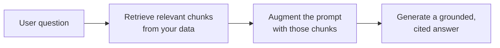

<LevelBadge level="intermediate" />

<Callout type="objectives" items={[
  "Was RAG ist und die Retrieve-Augment-Generate-Schleife",
  "Wie man indiziert, abruft, augmentiert und mit Zitaten generiert",
  "Warum RAG das Fine-Tuning für 'über meine Dokumente antworten'-Bedürfnisse schlägt",
  "Die fünf Fehlermodi, die die RAG-Qualität töten",
  "Ein Copy-Paste-Erdungs-Prompt, der die zwei größten Lücken schließt"
]} />

**RAG** bringt ein Modell dazu, Fragen über **deine** Daten zu beantworten — Dokumente, eine Wissensdatenbank, eine Codebasis —, auf denen es nie trainiert wurde. Die Idee ist einfach: die relevanten Teile **abrufen** (retrieve), den Prompt damit **augmentieren** (augment), dann eine Antwort **generieren** (generate), die in diesen Teilen geerdet ist.

## Die Schleife

<Steps items={[
  {title: "Indiziere deine Daten", body: "In Chunks aufteilen, sie embedden (siehe /docs/foundations/embeddings) und in einem Vektor- (und/oder Schlüsselwort-)Index speichern."},
  {title: "Abrufen", body: "Ziehe die Top-Chunks, die für die Frage am relevantesten sind."},
  {title: "Augmentieren", body: "Setze diese Chunks in den Prompt mit einer Anweisung wie \"Antworte nur aus dem Kontext unten; wenn es nicht darin steht, sage es.\""},
  {title: "Generieren", body: "Erzeuge die Antwort — und zitiere idealerweise, aus welchem Chunk jede Behauptung stammt."}
]} />

Für den Embedding-Schritt bei der Indizierung siehe [Embeddings & Vektorsuche](/docs/foundations/embeddings).

## Warum RAG statt Fine-Tuning?

<Callout type="tip" items={[
  "Frisch: aktualisiere die Daten, nicht das Modell",
  "Überprüfbar: liefert Zitate",
  "Günstig: weit günstiger als ein erneutes Training"
]} />

Für die meisten "über meine Dokumente antworten"-Bedürfnisse ist RAG das richtige erste Werkzeug — siehe [Fine-Tuning vs. Prompting vs. RAG](/docs/foundations/finetune-vs-prompt-vs-rag).

## Die Fehlermodi (wo die RAG-Qualität stirbt)

<Callout type="warning" items={[
  "Schlechtes Retrieval = schlechte Antwort. Wenn der richtige Chunk nicht abgerufen wird, kann das Modell ihn nicht nutzen. Die meisten 'RAG ist falsch'-Probleme sind Retrieval-Probleme.",
  "Zu grobe/feine Chunks ruinieren die Relevanz (siehe Embeddings).",
  "Keine Erdungsanweisung: Das Modell mischt abgerufene Fakten mit eigenen Vermutungen. Sage ihm, es soll nur aus dem Kontext antworten und Lücken zugeben.",
  "Zu viel hineinstopfen: Irrelevante Chunks verwässern das Signal und kosten Tokens. Rufe wenige, hochwertige Chunks ab.",
  "Keine Zitate: Du kannst nicht verifizieren, also kannst du nicht vertrauen."
]} />

Der Chunking-Fehler hängt mit [Embeddings](/docs/foundations/embeddings) zusammen, und Über-Stopfen kostet [Tokens](/docs/foundations/tokens-and-context).

<Callout type="tip" items={[
  "Bewerte das Retrieval separat: Miss 'haben wir den richtigen Chunk abgerufen?' getrennt von 'hat das Modell gut geantwortet?' Das lokalisiert das Problem schnell. Siehe Evals (/docs/foundations/evals)."
]} />

## Copy-Paste: ein Erdungs-Prompt

Der wirkungsvollste einzelne Fix ist eine Erdungsanweisung. Setze deine abgerufenen Chunks in eine Vorlage wie diese — sie zwingt das Modell, *nur* aus dem Kontext zu antworten, jede Behauptung zu zitieren und Lücken zuzugeben, statt zu raten:

<PromptCard title="Grounding prompt">{`You are answering strictly from the context below.

Rules:
- Use ONLY the context to answer. Do not use outside knowledge.
- Cite the source after each claim, like [chunk 2].
- If the answer is not in the context, reply exactly:
  "I don't have that in the provided sources."
- Quote numbers and names verbatim — never paraphrase a figure.

Context:
[chunk 1] ...
[chunk 2] ...
[chunk 3] ...

Question: <the user's question>`}</PromptCard>

Kombiniere ihn mit *wenigen* hochwertigen Chunks (nicht allem, was du abgerufen hast), und du schließt die zwei größten Lücken auf einmal: halluziniertes Vermischen und nicht überprüfbare Antworten. [Bewerte](/docs/foundations/evals) dann Retrieval und Generierung separat, damit du weißt, welche Hälfte du justieren musst.

## Beherrsche die Begriffe

<Flashcards cards={[
  {front: "RAG", back: "Relevante Teile deiner Daten abrufen, den Prompt damit augmentieren, dann eine in diesen Teilen geerdete Antwort generieren."},
  {front: "Index-Schritt", back: "Daten in Chunks aufteilen, sie embedden, in einem Vektor- und/oder Schlüsselwort-Index speichern."},
  {front: "Augment-Schritt", back: "Die abgerufenen Chunks in den Prompt setzen mit einer Erdungsanweisung: nur aus dem Kontext antworten, Lücken zugeben."},
  {front: "Warum RAG statt Fine-Tuning", back: "Frisch (Daten aktualisieren, nicht das Modell), liefert Zitate, weit günstiger als ein erneutes Training."},
  {front: "Häufigster RAG-Fehlermodus", back: "Schlechtes Retrieval. Wenn der richtige Chunk nicht abgerufen wird, kann das Modell ihn nicht nutzen — die meisten 'RAG ist falsch'-Probleme sind Retrieval-Probleme."},
  {front: "Erdungsanweisung", back: "Sage dem Modell, es soll NUR aus dem Kontext antworten, jede Behauptung zitieren und sagen, wenn die Antwort nicht darin steht."}
]} />

<Quiz title="Teste dich selbst" questions={[
  {
    q: "Wofür stehen die drei Buchstaben in RAG, in der Reihenfolge?",
    options: ["Read, Analyze, Generate", "Retrieve, Augment, Generate", "Rank, Aggregate, Group", "Reduce, Append, Generate"],
    answer: 1,
    explain: "RAG = relevante Chunks abrufen (Retrieve), den Prompt damit augmentieren (Augment), dann eine geerdete Antwort generieren (Generate)."
  },
  {
    q: "Wenn 'RAG falsch ist', was ist meistens das eigentliche Problem?",
    options: ["Das Modell ist zu klein", "Retrieval — der richtige Chunk wurde nicht gezogen", "Zu wenige Tokens im Kontextfenster", "Die Embeddings sind falsch feinabgestimmt"],
    answer: 1,
    explain: "Schlechtes Retrieval = schlechte Antwort. Wenn der richtige Chunk nicht abgerufen wird, kann das Modell ihn nicht nutzen. Die meisten 'RAG ist falsch'-Probleme sind Retrieval-Probleme."
  },
  {
    q: "Warum wird RAG für 'über meine Dokumente antworten' meist dem Fine-Tuning vorgezogen?",
    options: ["Es macht das Modell größer", "Es hält Wissen frisch, liefert Zitate und ist günstiger als ein erneutes Training", "Es macht jeden Prompt überflüssig", "Es garantiert, dass das Modell nie halluziniert"],
    answer: 1,
    explain: "RAG hält Wissen frisch (Daten aktualisieren, nicht das Modell), liefert Zitate und ist weit günstiger als ein erneutes Training."
  },
  {
    q: "Was ist der wirkungsvollste einzelne Fix, um das Modell daran zu hindern, Fakten mit Vermutungen zu vermischen?",
    options: ["Jeden möglichen Chunk abrufen", "Eine Erdungsanweisung, die Antworten nur aus dem Kontext erzwingt", "Die Temperatur erhöhen", "Zitate weglassen, um Tokens zu sparen"],
    answer: 1,
    explain: "Eine Erdungsanweisung zwingt das Modell, nur aus dem Kontext zu antworten, jede Behauptung zu zitieren und Lücken zuzugeben, statt zu raten."
  },
  {
    q: "Warum sollte man Retrieval getrennt von der Generierung bewerten?",
    options: ["Es wird vom Modellanbieter verlangt", "Es lokalisiert das Problem schnell — du weißt, welche Hälfte du justieren musst", "Es reduziert automatisch die Token-Kosten", "Generierung lässt sich sonst nicht messen"],
    answer: 1,
    explain: "'Haben wir den richtigen Chunk abgerufen?' getrennt von 'hat das Modell gut geantwortet?' zu messen, lokalisiert das Problem schnell und sagt dir, welche Hälfte du justieren musst."
  }
]} />

<Callout type="takeaways" items={[
  "RAG = relevante Chunks abrufen, den Prompt augmentieren, eine geerdete, zitierte Antwort generieren.",
  "Indizieren (Chunken + Embedden + Speichern), Top-Chunks abrufen, mit einer Erdungsanweisung augmentieren, mit Zitaten generieren.",
  "Bevorzuge RAG gegenüber Fine-Tuning für Dokument-Q&A: frisch, zitiert, günstiger.",
  "Die meisten Fehler sind Retrieval-Fehler — rufe wenige hochwertige Chunks ab, nicht alles.",
  "Füge immer eine Erdungsanweisung hinzu und zitiere; bewerte Retrieval und Generierung separat."
]} />

## Weiter

- [Embeddings & Vektorsuche](/docs/foundations/embeddings)
- [Fine-Tuning vs. Prompting vs. RAG](/docs/foundations/finetune-vs-prompt-vs-rag)
- [Recherche- & Synthese-Playbook](/docs/playbooks/research)
