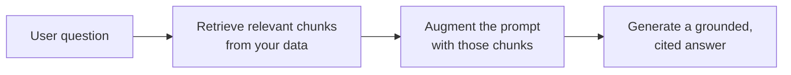

<LevelBadge level="intermediate" />

**RAG** bringt ein Modell dazu, Fragen über **deine** Daten zu beantworten — Dokumente, eine Wissensbasis, eine Codebasis — auf die es nie trainiert wurde. Die Idee ist simpel: Die relevanten Stücke **abrufen (retrieve)**, den Prompt damit **anreichern (augment)** und dann eine Antwort **generieren**, die in diesen Stücken verankert ist.

## Der Ablauf

1. **Indiziere** deine Daten: In Chunks aufteilen, sie [embedden](/docs/foundations/embeddings), in einem Vektor- (und/oder Stichwort-)Index speichern.
2. **Rufe** die für die Frage relevantesten Top-Chunks **ab**.
3. **Anreichern**: Setze diese Chunks in den Prompt mit einer Anweisung wie *"Antworte nur aus dem untenstehenden Kontext; wenn es dort nicht steht, sage es"*.
4. **Generiere** — und im Idealfall **gib an**, aus welchem Chunk jede Aussage stammt.

## Warum RAG statt Fine-Tuning?

RAG hält Wissen **frisch** (aktualisiere die Daten, nicht das Modell), liefert **Quellenangaben** und ist weitaus günstiger als ein erneutes Training. Für die meisten "beantworte etwas über meine Dokumente"-Bedürfnisse ist es das richtige erste Werkzeug — siehe [Fine-Tuning vs. Prompting vs. RAG](/docs/foundations/finetune-vs-prompt-vs-rag).

## Die Fehlerquellen (wo die RAG-Qualität stirbt)

- **Schlechtes Retrieval = schlechte Antwort.** Wird der richtige Chunk nicht abgerufen, kann das Modell ihn nicht nutzen. Die meisten "RAG ist falsch"-Probleme sind *Retrieval*-Probleme.
- **Chunking zu grob/fein** — ruiniert die Relevanz ([Embeddings](/docs/foundations/embeddings)).
- **Keine Verankerungsanweisung** — das Modell vermischt abgerufene Fakten mit eigenen Vermutungen. Weise es an, *nur* aus dem Kontext zu antworten und Lücken zuzugeben.
- **Zu viel Hineinstopfen** — irrelevante Chunks verwässern das Signal und kosten [Tokens](/docs/foundations/tokens-and-context). Rufe wenige, hochwertige Chunks ab.
- **Keine Quellenangaben** — du kannst nicht verifizieren, also kannst du nicht vertrauen.

:::tip Bewerte das Retrieval separat
Miss "haben wir den richtigen Chunk abgerufen?" getrennt von "hat das Modell gut geantwortet?". Das grenzt das Problem schnell ein. Siehe [Evals](/docs/foundations/evals).
:::

## Weiter

- [Embeddings & Vektorsuche](/docs/foundations/embeddings)
- [Fine-Tuning vs. Prompting vs. RAG](/docs/foundations/finetune-vs-prompt-vs-rag)
- [Recherche- & Synthese-Playbook](/docs/playbooks/research)
