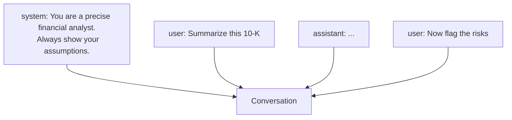

<LevelBadge level="beginner" />

Jede KI-Konversation besteht aus **Nachrichten**, und jede Nachricht hat eine **Rolle**. Das Verständnis der drei Rollen erklärt, wie man das Modell steuert — und warum manche Anweisungen haften bleiben und andere nicht.

## Die drei Rollen

- **System** — die übergeordnete Einrichtung für die gesamte Konversation: wer das Modell sein soll, die Regeln, das Format. Einmal gesetzt, gilt durchgehend.
- **User** — das bist du: deine Fragen und Eingaben, Zug um Zug.
- **Assistant** — die Antworten des Modells. (Du kannst dem Assistant auch *Worte in den Mund legen* als Beispiele — siehe [Few-Shot](/docs/prompting/few-shot).)

## Warum der System-Prompt dein wirkungsvollster Hebel ist

Die System-Nachricht rahmt **alles, was danach kommt**. Hier setzt du die Rolle, die Standards, den Tonfall und die harten Regeln des Modells — und das Modell gewichtet sie stark. Wenn du konsistentes Verhalten über eine ganze Konversation (oder App) hinweg willst, platziere es hier, nicht vergraben in einem User-Zug.

In der Praxis:
- **Chat-Apps:** Deine kontospezifischen [benutzerdefinierten Anweisungen](/docs/claude-app/custom-instructions) fungieren als persönlicher System-Prompt.
- **Claude Code:** [CLAUDE.md](/docs/claude-code/claude-md) übernimmt diese Rolle für dein Projekt.
- **Die API:** der [`system`-Parameter](/docs/api/first-call).

Dieselbe Idee, drei Oberflächen.

## Praktische Tipps

- **Sei im System-Prompt konkret** bezüglich Rolle, Regeln und Ausgabeformat — das ist der Ort mit der größten Hebelwirkung dafür.
- **Halte User-Züge fokussiert** auf die eigentliche Aufgabe; füge die Regeln nicht in jedem Zug erneut ein.
- **Widersprüchliche Anweisungen?** Eine spätere, ausdrückliche User-Anweisung kann eine vage System-Anweisung überschreiben — sei konsistent, um Überraschungen zu vermeiden ([Fehlerbehebung](/docs/contribute/troubleshooting)).

## Weiter

- [Prompting-Grundlagen](/docs/prompting/basics)
- [Benutzerdefinierte Anweisungen & Styles](/docs/claude-app/custom-instructions)
- [Tokens, Kontext & Gedächtnis](/docs/foundations/tokens-and-context)
