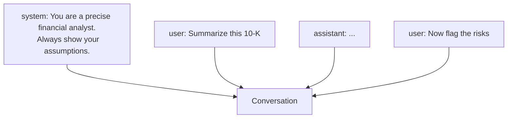

<LevelBadge level="beginner" />

<Callout type="objectives" items={["Die drei Rollen, aus denen jede KI-Konversation aufgebaut ist — und wofür jede da ist", "Warum der System-Prompt der wirkungsvollste Ort ist, um Verhalten zu steuern", "Wie dieselbe Idee in Chat-Apps, Claude Code und der API auftaucht", "Eine häufige Falle: Regeln in einem User-Zug vergraben statt in der System-Nachricht"]} />

Jede KI-Konversation besteht aus **Nachrichten**, und jede Nachricht hat eine **Rolle**. Das Verständnis der drei Rollen erklärt, wie man das Modell steuert — und warum manche Anweisungen haften bleiben und andere nicht.

## Die drei Rollen

<Steps items={[{title: "system — der dauerhafte Auftrag", body: "Übergeordnete Einrichtung für die ganze Konversation: wer das Modell sein soll, die Regeln, das Ausgabeformat. Einmal gesetzt, gilt für jeden folgenden Zug."}, {title: "user — dein Zug jedes Mal", body: "Deine Fragen und Eingaben, Zug um Zug. Halte sie auf die eigentliche Aufgabe fokussiert; wiederhole die dauerhaften Regeln nicht in jedem Zug."}, {title: "assistant — die Antwort des Modells", body: "Die Antworten des Modells. Du kannst dem Assistant auch Worte in den Mund legen als Few-Shot-Beispiele (siehe /docs/prompting/few-shot) — das Modell behandelt sie als vorherige Züge und setzt in diesem Stil fort."}]} />

```mermaid
flowchart TD
  S["system: You are a precise financial analyst.
  Always show your assumptions."] --> C[Conversation]
  U1[user: Summarize this 10-K] --> C
  A1[assistant: ...] --> C
  U2[user: Now flag the risks] --> C
```

## Warum der System-Prompt dein wirkungsvollster Hebel ist

Die System-Nachricht rahmt **alles, was danach kommt**. Hier setzt du die Rolle, die Standards, den Tonfall und die harten Regeln des Modells — und das Modell gewichtet sie stark. Wenn du konsistentes Verhalten über eine ganze Konversation (oder App) hinweg willst, platziere es hier, nicht vergraben in einem User-Zug.

Dieselbe Idee, drei Oberflächen:

| Oberfläche | Was die System-Prompt-Rolle übernimmt |
|---|---|
| **Chat-Apps** (Claude.ai, ChatGPT, Gemini) | Die kontospezifischen [benutzerdefinierten Anweisungen](/docs/claude-app/custom-instructions) |
| **Claude Code** | [`CLAUDE.md`](/docs/claude-code/claude-md) im Projekt-Wurzelverzeichnis |
| **Die API** | Der `system`-Parameter in der Anfrage ([erster Aufruf](/docs/api/first-call)) |

## Ein durchgespieltes Vorher/Nachher

Der häufigste Fehler ist, die dauerhaften Regeln in jeden User-Zug zu stopfen statt in die System-Nachricht. Schau, was sich ändert.

**Vorher — Regeln in einen User-Zug gepresst, jedes Mal wiederholt:**

<PromptCard title="Regeln im User-Zug (fragil)">{`user: You are a precise financial analyst. Always show your assumptions.
Never invent numbers. Now: summarize this 10-K.
[10-K text]`}</PromptCard>

**Nachher — Regeln in die System-Nachricht gehoben, User-Züge bleiben schlank:**

<PromptCard title="Regeln in der System-Nachricht (dauerhaft)">{`system: You are a precise financial analyst. Always show your assumptions.
Never invent numbers. Cite the section of the filing for each claim.

user: Summarize this 10-K.
[10-K text]

user: Now flag the risks.`}</PromptCard>

Die „Nachher“-Version hält das Verhalten über die Züge hinweg stabil, halbiert die Tokens, die du jeden Zug erneut sendest, und macht die App leichter änderbar — du bearbeitest den dauerhaften Auftrag an einer Stelle.

## Dem Assistant Worte in den Mund legen

Ein zu selten genutzter Kniff: Du kannst einen `assistant`-Zug vorschieben als **Few-Shot-Beispiel** oder **Formatvorlage**, und das Modell setzt in diesem Stil fort. So werden Templates und Rubriken durchgesetzt, ohne einen aufgeblähten Prompt zu brauchen.

<PromptCard title="Den Assistant auf ein Format vorbereiten">{`system: You are a code reviewer. Return only the sections below.

user: Review this pull request. [diff]

assistant: ## Summary
- 
## Risks
- 
## Suggested changes
-`}</PromptCard>

Das Modell behandelt deinen vorbereiteten Assistant-Zug wie eine vorherige Antwort und vervollständigt in derselben Form.

## Häufige Fehler

<Callout type="tip" items={["Regeln in jedem User-Zug — setze dauerhafte Regeln einmal in die System-Nachricht; nutze User-Züge für die eigentliche Aufgabe.", "Sich über Züge hinweg widersprechen — eine spätere, ausdrückliche User-Anweisung kann eine vage System-Anweisung überschreiben. Sei konsistent.", "Die Assistant-Rolle als schreibgeschützt behandeln — du kannst sie vorbereiten, um Format, Ton oder ein Few-Shot-Muster vorzugeben.", "Den System-Prompt mit sich ändernden Fakten überladen — flüchtige Fakten (Docs, Daten, aktueller Stand) gehören in den User-Zug oder in den Retrieval-Kontext, nicht in die System-Nachricht."]} />

## Teste dich selbst

<Quiz title="Teste dich selbst" questions={[{q: "Wo sollten dauerhafte Regeln wie Ton, Format und Rolle stehen?", options: ["In jedem User-Zug wiederholt, damit das Modell sie nicht vergisst", "In der System-Nachricht, einmal gesetzt", "In der ersten Antwort des Assistant", "In der Modellkonfiguration, nicht im Prompt"], answer: 1, explain: "Die System-Nachricht rahmt die ganze Konversation. Regeln einmal dort zu setzen ist dauerhafter, günstiger und leichter zu ändern, als sie in jedem User-Zug zu wiederholen."}, {q: "Welche Datei spielt in Claude Code dieselbe Rolle wie der system-Parameter der API?", options: ["package.json", "CLAUDE.md", "README.md", ".env"], answer: 1, explain: "CLAUDE.md im Projekt-Wurzelverzeichnis ist der dauerhafte Auftrag von Claude Code — das Äquivalent eines System-Prompts für dieses Projekt."}, {q: "Kannst du selbst Text in einen Assistant-Zug schreiben, bevor das Modell antwortet?", options: ["Nein — die Assistant-Rolle ist schreibgeschützt", "Ja — einen Assistant-Zug vorzubereiten gibt Format oder Stil vor, und das Modell setzt von dort fort", "Nur in der API, nie in Chat-Apps", "Nur wenn du Fine-Tuning nutzt"], answer: 1, explain: "Einen Assistant-Zug vorzubereiten ist eine gängige Technik, um ein Template oder einen Few-Shot-Stil durchzusetzen — das Modell behandelt ihn wie eine vorherige Antwort."}, {q: "Ein User-Zug sagt jetzt etwas, das dem System-Prompt widerspricht. Was passiert meist?", options: ["Der System-Prompt gewinnt immer", "Eine spätere, ausdrückliche User-Anweisung kann eine vage System-Anweisung überschreiben — sei konsistent, um Überraschungen zu vermeiden", "Das Modell verweigert die Antwort", "Das Modell mittelt zwischen beiden"], answer: 1, explain: "Der System-Prompt wird stark gewichtet, aber eine klare, ausdrückliche User-Anweisung kann eine vage überschreiben. Konsistenz über die Rollen hinweg zählt."}]} />

<Callout type="takeaways" items={["Drei Rollen: system setzt den Auftrag, user fragt pro Zug, assistant antwortet (oder wird vorbereitet).", "Der System-Prompt ist der wirkungsvollste Hebel — setze dauerhafte Regeln dort einmalig.", "Chat-Anweisungen, CLAUDE.md und das API-`system`-Feld sind dieselbe Idee auf drei Oberflächen.", "Flüchtige Fakten gehören in User-Züge oder ins Retrieval, nicht in die System-Nachricht."]} />

## Weiter

- [Prompting-Grundlagen](/docs/prompting/basics)
- [Benutzerdefinierte Anweisungen & Styles](/docs/claude-app/custom-instructions)
- [Tokens, Kontext & Gedächtnis](/docs/foundations/tokens-and-context)
