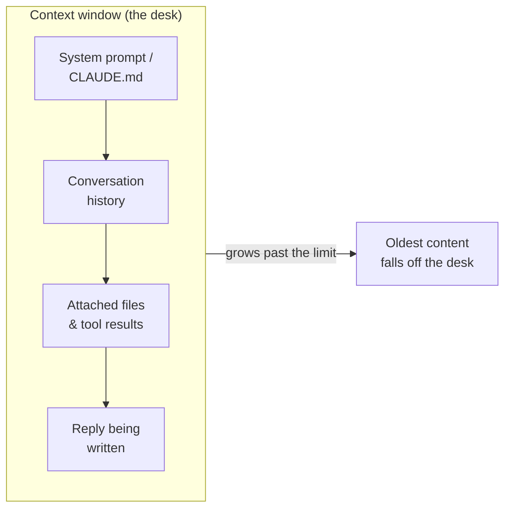

<LevelBadge level="beginner" />

Drei Ideen erklären viele „Warum hat es das getan?"-Momente: **Tokens**, das **Kontextfenster** und das **Gedächtnis**. Wenn du diese verstehst, überraschen dich Abdriften, Vergessen und unerwartete Rechnungen nicht mehr.

<Callout
  type="objectives"
  items={[
    "Text so lesen, wie ein Modell es tut — in Tokens, nicht in Wörtern oder Zeichen",
    "Das Kontextfenster als begrenzten Schreibtisch verstehen und vorhersagen, wann Dinge herunterfallen",
    "‚Context Rot‘ erkennen — warum Modelle die Mitte einer langen Eingabe verlieren können",
    "Die vier echten Quellen von ‚Gedächtnis‘ kennen und es gezielt bereitstellen"
  ]}
/>

## Tokens: die Einheit, in der Modelle denken

Modelle lesen keine Zeichen oder Wörter — sie lesen **Tokens**, Textbausteine von etwa ¾ eines Wortes im Englischen. „Unbelievable" sind vielleicht 3–4 Tokens; häufige Wörter jeweils eines; ein Leerzeichen, ein Komma oder ein Stück Code kosten ebenfalls jeweils Tokens. Sowohl deine Eingabe *als auch* die Ausgabe des Modells werden gezählt, und Tokens sind genau das, woran [Preise und Limits](/docs/api/tokens-and-pricing) gemessen werden.

Du musst nicht von Hand zählen, aber ein grobes Gefühl hilft: **~750 Wörter ≈ ~1.000 Tokens**. Tippe etwas und beobachte:

<TokenEstimator />

:::tip Warum sich das Verhältnis verschiebt
Einfaches Englisch landet bei etwa ¾ Wort pro Token. Code, JSON, nicht-lateinische Schriften, lange URLs und seltene Wörter zerfallen in *mehr* Tokens — daher kostet eine 500-Zeilen-Datei oder ein chinesischer Absatz mehr, als die Wortzahl vermuten lässt. Wenn dich eine Rechnung oder ein Limit überrascht, liegt es meist daran.
:::

## Das Kontextfenster: das Arbeitsgedächtnis

Das **Kontextfenster** ist die maximale Anzahl an Tokens, die das Modell gleichzeitig berücksichtigen kann — *dein System-Prompt, das gesamte bisherige Gespräch, alle angehängten Dateien und die Antwort, die es gerade schreibt,* alles zusammen. Stell es dir als den Schreibtisch des Modells vor: groß, aber begrenzt. Fenstergrößen unterscheiden sich je nach Modell und wachsen weiter — sieh dir [Models & Pricing](/docs/whats-new/models-and-pricing) für aktuelle Zahlen an, statt eine auswendig zu lernen.

Alles, was das Modell im Moment „weiß", liegt auf diesem Schreibtisch:

Wenn ein Gespräch über das Fenster hinauswächst, **fällt der älteste Inhalt herunter**. Deshalb kann ein sehr langer Chat scheinbar „vergessen", wie er begann, oder von deiner ursprünglichen Anweisung abdriften.

## Context Rot: es geht nicht nur um *voll* vs. *leer*

Ein subtileres Problem: Selbst wenn noch alles hineinpasst, nutzen Modelle den **Anfang und das Ende** einer langen Eingabe tendenziell zuverlässiger als die **Mitte**. Vergräbst du den einen entscheidenden Satz in der Mitte eines 50-seitigen Einfügetexts, wird er womöglich untergewichtet — ein Fehlermuster, das oft *„lost in the middle"* genannt wird.

<VerifyNote lastVerified="2026-06-29" source="https://arxiv.org/abs/2307.03172">Der „lost in the middle"-Effekt — die verschlechterte Nutzung von Informationen in der Kontextmitte — wurde von Liu et al. (2023) dokumentiert. Neuere Long-Context-Modelle gehen besser damit um, aber die praktische Gewohnheit weiter unten zahlt sich trotzdem aus.</VerifyNote>

<Steps
  items={[
    {title: "Mit der Aufgabe beginnen", body: "Stell die eigentliche Anweisung oder Frage an den Anfang, bevor du ein langes Dokument einfügst — nicht dahinter vergraben."},
    {title: "Am Ende wiederholen", body: "Wiederhole die wichtigste Anweisung in einer Zeile nach dem langen Inhalt. Erste + letzte Position sind die stärksten."},
    {title: "Vor dem Einfügen kürzen", body: "Lass irrelevante Abschnitte weg. Weniger Rauschen in der Mitte bedeutet, dass das verbleibende Signal mehr Aufmerksamkeit bekommt."},
    {title: "Bei riesigem Umfang aufteilen", body: "Fasse bei sehr großen Eingaben zusammen oder zerteile sie, statt alles abzuladen — oder starte für eine neue Teilaufgabe einen frischen Chat."}
  ]}
/>

Hier dieselbe Anfrage, so strukturiert, dass die Anweisung an den starken Positionen sitzt:

<PromptCard title="Anweisung zuerst, am Ende wiederholt">{`Task: Find every place this contract caps our liability, and quote the exact clause.

[... paste the full 40-page contract here ...]

Reminder of the task: list only the liability-cap clauses, with exact quotes and section numbers. Ignore everything else.`}</PromptCard>

:::tip In Claude Code
Lange Agent-Sitzungen stoßen an dieselbe Decke. Claude Code verwaltet das bewusst — komprimiert den Verlauf und lässt dich steuern, was im Blick bleibt. Sieh dir [Context Management](/docs/claude-code/context-management) und [Context Engineering](/docs/frontiers/context-engineering) an.
:::

## Gedächtnis: es gibt keines, außer du stellst es bereit

Standardmäßig ist jedes Gespräch ein **unbeschriebenes Blatt**. Das Modell erinnert sich nicht an deinen letzten Chat. Alles, was wie Gedächtnis aussieht, ist eines von vier Dingen:

| Quelle | Was es ist | Du steuerst es durch |
| --- | --- | --- |
| **Erneut gesendeter Verlauf** | Chat-Apps senden das Gespräch in jeder Runde erneut, bis das Fenster voll ist | Frische Chats starten; Threads fokussiert halten |
| **Gedächtnis-Funktionen** | Manche Claude-Oberflächen tragen Fakten über Chats hinweg | [Memory Across Chats](/docs/claude-app/memory)-Einstellungen |
| **Dateien, die du bereitstellst** | Persistenter Kontext, den du gezielt anhängst | [Projects](/docs/claude-app/projects), [CLAUDE.md](/docs/claude-code/claude-md) |
| **Dein eigener Code** | Die API ist **zustandslos** — du sendest frühere Nachrichten erneut | [First API Call](/docs/api/first-call) |

Der rote Faden: *Wenn das Modell sich etwas merken soll, musst du es immer wieder auf den Schreibtisch legen.*

## Warum das wichtig ist

Fast jedes „es hat meine frühere Anweisung ignoriert" oder „es hat den Faden verloren" lässt sich auf eines von drei Dingen zurückführen: das Fenster lief voll, eine neue Sitzung startete kalt, oder das entscheidende Detail saß in der toten Mitte eines langen Einfügetexts. Mit diesem Wissen strukturierst du Prompts und Sitzungen so, dass das Wichtige *im Blick* bleibt.

## Überprüfe dich selbst

<Quiz
  questions={[
    {
      q: "Wie viele Tokens sind ungefähr 750 Wörter einfaches Englisch?",
      options: ["Etwa 250", "Etwa 1.000", "Etwa 3.000", "Genau 750"],
      answer: 1,
      explain: "Eine praktische Faustregel lautet ~750 Wörter ≈ ~1.000 Tokens für gewöhnliches Englisch. Code und nicht-lateinische Schriften liegen höher."
    },
    {
      q: "Ein langer Chat beginnt zu ‚vergessen‘, wie er begann. Die wahrscheinlichste Ursache ist:",
      options: [
        "Das Modell ist kaputt",
        "Der früheste Inhalt fiel aus dem Kontextfenster, als das Gespräch wuchs",
        "Das Modell hat deine früheren Nachrichten dauerhaft gelernt",
        "Tokens wurden zurückerstattet"
      ],
      answer: 1,
      explain: "Das Kontextfenster ist begrenzt. Wenn ein Gespräch es überschreitet, fallen die ältesten Tokens vom ‚Schreibtisch‘ — frühe Anweisungen können also aus dem Blick verschwinden."
    },
    {
      q: "Du musst ein riesiges Dokument plus eine entscheidende Anweisung einfügen. Beste Platzierung?",
      options: [
        "Anweisung nur in der exakten Mitte des Dokuments",
        "Anweisung ganz am Anfang UND am Ende wiederholt",
        "Keine Anweisung — lass das Modell raten",
        "Anweisung in einem separaten Chat, den das Modell nicht sehen kann"
      ],
      answer: 1,
      explain: "Modelle nutzen Anfang und Ende einer langen Eingabe am zuverlässigsten (‚lost in the middle‘). Beginne mit der Aufgabe und wiederhole sie am Ende."
    }
  ]}
/>

## Schlüsselbegriffe

<Flashcards
  title="Den Wortschatz verankern"
  cards={[
    {front: "Token", back: "Der Textbaustein, den ein Modell tatsächlich verarbeitet — etwa ¾ eines englischen Wortes. Eingabe und Ausgabe werden beide gezählt, und die Abrechnung erfolgt pro Token."},
    {front: "Kontextfenster", back: "Die maximalen Tokens, die ein Modell gleichzeitig berücksichtigen kann: System-Prompt + Verlauf + Dateien + die Antwort, alles zusammen. Begrenzt — Inhalt jenseits des Limits fällt herunter."},
    {front: "Lost in the middle", back: "Die Tendenz, Anfang und Ende einer langen Eingabe zuverlässiger zu nutzen als die Mitte. Platziere entscheidende Anweisungen an den starken Positionen."},
    {front: "Zustandslosigkeit", back: "Die API erinnert sich zwischen Aufrufen an nichts. Um ein Gespräch fortzusetzen, sendest du die früheren Nachrichten selbst erneut."}
  ]}
/>

:::note Erkenntnisse
- **Tokens** sind die Einheit von Denken und Abrechnung — ~1.000 pro 750 englische Wörter, mehr bei Code und anderen Schriften.
- Das **Kontextfenster** ist ein begrenzter Schreibtisch; lange Chats vergessen, weil alter Inhalt herunterfällt.
- Selbst innerhalb des Fensters gilt: **beginne mit deiner Anweisung und wiederhole sie am Ende** — die Mitte wird untergenutzt.
- Es gibt **standardmäßig kein Gedächtnis**. Stelle es bewusst bereit mit Dateien, Projects, CLAUDE.md oder durch erneutes Senden des Verlaufs.
:::

## Weiter

- [What Is an LLM?](/docs/foundations/what-is-an-llm)
- [System, User & Assistant Roles](/docs/foundations/roles)
- [Context Engineering](/docs/frontiers/context-engineering)
- [Tokens, Context & Pricing (API)](/docs/api/tokens-and-pricing)
