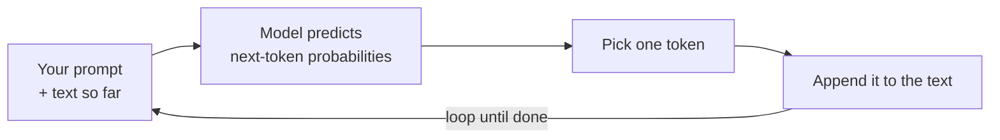

<LevelBadge level="beginner" />

Ein **Large Language Model** (LLM) — die Technologie hinter Claude — tut eine täuschend einfache Sache: Es liest Text und **sagt voraus, was als Nächstes kommt**, Stück für Stück. Das ist alles. Alles andere ergibt sich daraus, dass es genau das erstaunlich gut macht.

<Callout
  type="objectives"
  items={[
    "Das Ein-Satz-Denkmodell verinnerlichen: Ein LLM ist eine sehr ausgefeilte Autovervollständigung",
    "Sehen, wie das Modell eine Antwort Token für Token in einer Schleife aufbaut",
    "Verstehen, warum dieser Mechanismus sowohl seine Stärken als auch seine Eigenheiten erklärt",
    "Wissen, was ein LLM NICHT ist — und wie das die Art ändert, wie man es nutzt"
  ]}
/>

## Das Ein-Satz-Denkmodell

> Ein LLM ist eine sehr ausgefeilte Autovervollständigung, die eine enorme Menge Text gelesen und die Muster gelernt hat, wie Sprache — und die Ideen darin — tendenziell weitergehen.

Wenn du eine Frage stellst, „schlägt“ das Modell keine Antwort nach. Es erzeugt die plausibelste Fortsetzung deines Textes, Token für Token (siehe [Tokens & Kontext](/docs/foundations/tokens-and-context)). Plausible Fortsetzungen einer guten Frage sind meist gute Antworten — und genau deshalb funktioniert das überhaupt.

:::tip Analogie: Vorschlagstastatur auf Steroiden
Denk an die Autovervollständigung auf deinem Handy, die das nächste Wort vorschlägt. Stell dir nun vor, sie hätte die meisten Bücher, Artikel und den Code im Internet gelesen — und würde nicht nur das nächste Wort vorschlagen, sondern einen ganzen Aufsatz, eine Übersetzung oder ein Programm, das passt. Das ist die Intuition hinter einem LLM.
:::

## Ein Token nach dem anderen

Die ganze Maschine ist eine Schleife: lies alles Bisherige, sage das nächste Stück voraus, hänge es an, wiederhole.

<Steps
  items={[
    {title: "Lesen", body: "Das Modell nimmt deinen Prompt plus alles bisher Erzeugte als einen einzigen Textblock auf."},
    {title: "Vorhersagen", body: "Es berechnet Wahrscheinlichkeiten dafür, was das nächste Token sein könnte."},
    {title: "Auswählen", body: "Es wählt ein Token aus. Ob das deterministisch oder etwas zufällig ist, steuern Sampling-Einstellungen wie die Temperatur."},
    {title: "Anhängen & wiederholen", body: "Das gewählte Token wird an den Text angehängt, und der etwas längere Text wird wieder eingespeist — die Schleife läuft, bis die Antwort fertig ist."}
  ]}
/>

Jeder Schritt sagt immer nur **ein** Token voraus und speist dann den etwas längeren Text wieder ein. Das Modell hat keinen Plan für die ganze Antwort im Voraus — Kohärenz entsteht dadurch, dass diese Vorhersage tausendfach extrem gut ausgeführt wird. Wie sich der Schritt „ein Token auswählen“ verhält (gierig vs. etwas zufällig), steuern [Sampling-Einstellungen](/docs/foundations/sampling-controls) wie die Temperatur.

## Warum das seine Stärken erklärt

Weil es Muster über Texte, Code und Argumentation hinweg gelernt hat, kann ein LLM flüssig **schreiben, zusammenfassen, übersetzen, erklären und programmieren** — Aufgaben, die alle „setze diesen Text sinnvoll fort“ sind. Gib ihm einen klaren Einstieg, und es erzeugt eine starke Fortsetzung. Deshalb ist [Prompting](/docs/prompting/basics) so wichtig: Du formst den Anfang des Textes, den es fortsetzt.

## Warum das seine Eigenheiten erklärt

Derselbe Mechanismus erklärt die Schwachstellen:

- **Es kann selbstbewusst falsch liegen.** Eine flüssig klingende Fortsetzung ist nicht immer eine wahre — das ist [Halluzination](/docs/foundations/hallucinations).
- **Es „weiß“ die heutigen Fakten nicht wirklich**, es sei denn, du lieferst sie oder es hat ein Werkzeug, um sie nachzuschlagen.
- **Es hat kein Gedächtnis** zwischen Gesprächen, es sei denn, du gibst ihm eines.

## Was ein LLM **nicht** ist

:::warning Pass deine Erwartungen an und du bekommst bessere Ergebnisse
- ❌ **Keine Datenbank und keine Suchmaschine.** Es erzeugt, es ruft keine geprüften Datensätze ab.
- ❌ **Kein Taschenrechner.** Es kann über Mathematik nachdenken, ist aber nicht garantiert exakt — gib ihm dafür Werkzeuge.
- ❌ **Keine Person.** Keine Gefühle, Absichten oder durchgängiges Gedächtnis. Es ist eine leistungsstarke Textmaschine.
:::

Behandle es wie einen brillanten, schnellen, belesenen Assistenten, der sich gelegentlich falsch erinnert — und **überprüfe**, was wichtig ist.

## Schlüsselbegriffe

<Flashcards
  title="Wiederhole die Kernkonzepte"
  cards={[
    {front: "LLM (Large Language Model)", back: "Die Technologie hinter Claude. Es liest Text und sagt voraus, was als Nächstes kommt, Stück für Stück."},
    {front: "Vorhersage des nächsten Tokens", back: "Die Kernschleife: lies den bisherigen Text, sage das nächste Token voraus, hänge es an, wiederhole bis fertig."},
    {front: "Token", back: "Das Textstück, das das Modell bei jedem Schritt vorhersagt. Das Modell sagt immer nur eines auf einmal voraus."},
    {front: "Halluzination", back: "Eine flüssig klingende Fortsetzung, die tatsächlich nicht wahr ist — eine Nebenwirkung des Erzeugens, nicht des Abrufens."},
    {front: "Sampling / Temperatur", back: "Steuert, wie sich der Schritt „ein Token auswählen“ verhält — gierig vs. etwas zufällig."}
  ]}
/>

<Callout
  type="takeaways"
  items={[
    "Ein LLM ist eine sehr ausgefeilte Autovervollständigung — es sagt das nächste Token voraus, es schlägt keine Antwort nach",
    "Kohärenz entsteht dadurch, dass diese Vorhersageschleife Token für Token tausendfach läuft",
    "Derselbe Mechanismus erklärt seine Stärken (schreiben, zusammenfassen, übersetzen, erklären, programmieren) und seine Eigenheiten (selbstbewusst falsch, keine Live-Fakten, kein Gedächtnis)",
    "Es ist keine Datenbank, kein Taschenrechner und keine Person — überprüfe, was wichtig ist"
  ]}
/>

## Teste dich selbst

<Quiz
  title="Teste dich selbst"
  questions={[
    {
      q: "Was tut ein LLM grundsätzlich, wenn du ihm eine Frage stellst?",
      options: [
        "Es schlägt die Antwort in einer Datenbank geprüfter Fakten nach",
        "Es erzeugt die plausibelste Fortsetzung deines Textes, ein Token nach dem anderen",
        "Es durchsucht das Live-Web nach der aktuellsten Antwort"
      ],
      answer: 1,
      explain: "Ein LLM schlägt nichts nach — es erzeugt die plausibelste Fortsetzung deines Textes, Token für Token."
    },
    {
      q: "Warum kann ein LLM selbstbewusst falsch liegen?",
      options: [
        "Eine flüssig klingende Fortsetzung ist nicht immer eine wahre — das ist Halluzination",
        "Ihm geht mitten in der Antwort der Speicher aus",
        "Es weigert sich, Fragen zu beantworten, die es nicht kennt"
      ],
      answer: 0,
      explain: "Es erzeugt plausibel klingenden Text, statt geprüfte Datensätze abzurufen, daher kann eine flüssige Fortsetzung trotzdem falsch sein — das ist Halluzination."
    },
    {
      q: "Welche Aussage über ein LLM ist richtig?",
      options: [
        "Es ist eine Suchmaschine, die geprüfte Datensätze abruft",
        "Es ist ein Taschenrechner, der garantiert exakt ist",
        "Es ist keine Person und hat kein durchgängiges Gedächtnis zwischen Gesprächen, es sei denn, du gibst ihm eines"
      ],
      answer: 2,
      explain: "Ein LLM ist eine leistungsstarke Textmaschine — keine Datenbank, kein Taschenrechner, keine Person. Es hat kein Gedächtnis zwischen Gesprächen, es sei denn, du lieferst es."
    }
  ]}
/>

## Weiter

- [Tokens, Kontext & Gedächtnis](/docs/foundations/tokens-and-context)
- [Halluzinationen & wie man sie reduziert](/docs/foundations/hallucinations)
- [Prompting-Grundlagen](/docs/prompting/basics)
