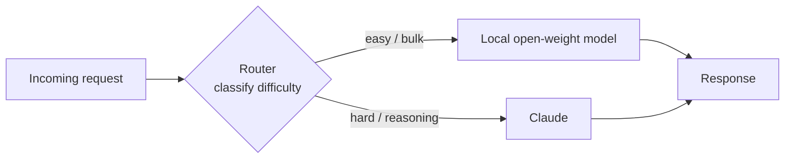

<LevelBadge level="advanced" />

Die Gegenüberstellung „Frontier-Modell **oder** lokales Modell“ ist eine falsche Alternative. Die kosteneffizientesten, datenschutzfreundlichsten und widerstandsfähigsten Systeme im Produktiveinsatz nutzen **beide** — ein kleines Open-Weight-Modell, das lokal läuft, für die einfache, hochvolumige oder sensible Arbeit, und ein Frontier-Modell wie Claude als **intelligente Schicht**, die das schwierige Reasoning übernimmt. Auf dieser Seite geht es um die langlebigen *Muster*, die beide so verdrahten, dass jedes das tut, worin es am besten ist. Die Muster sind anbieterneutral — Claude passt einfach hervorragend in die „Reasoning“-Rolle — und sie überdauern jeden konkreten Modellnamen.

<Callout type="objectives" items={[
  "Verstehen, WARUM ein Hybrid (Frontier + lokal) jedes Modell allein bei Kosten, Privatsphäre und Resilienz schlägt",
  "Die fünf langlebigen Hybrid-Muster lernen: Router/Big-Little, Draft-then-Refine, Privacy-Redaction, Massen-Vor-/Nachverarbeitung und Offline-Fallback",
  "Für jedes Muster: wissen, wann man danach greift, welchen Trade-off man eingeht und eine konkrete Skizze",
  "Den eigenen Claude+lokal-Hybrid mit einer wiederholbaren Vier-Schritt-Methode entwerfen",
  "Wissen, dass diese Muster anbieterneutral sind — Claude fügt sich als ‚intelligente Schicht' ein, kein Lock-in",
]} />

## Warum hybrid, nicht entweder-oder

Ein lokales Open-Weight-Modell (siehe [Modelle lokal mit Ollama betreiben](/docs/models/run-models-locally-ollama)) und ein Frontier-Modell sind in *unterschiedlichen* Dingen gut:

- **Lokal** ist privat (Daten verlassen niemals deine Maschine), günstig im großen Maßstab (keine Rechnung pro Token), latenzarm bei kleinen Modellen und funktioniert offline. Aber es hat eine echte **Fähigkeitslücke** bei den schwierigsten Reasoning-, Long-Context- und agentischen Aufgaben.
- **Claude (Frontier)** führt genau bei diesen schwierigen Aufgaben, aber jeder Aufruf kostet Tokens und sendet Daten an eine Cloud-API.

Die Einsicht hinter jedem Muster unten: **Die meisten Anfragen sind einfach, und die schwierigen sind die Minderheit.** Wenn ein günstiges lokales Modell den Großteil bewältigen kann und du das Frontier-Modell für die wirklich schwierige Teilmenge reservierst, bekommst du den größten Teil der Frontier-Qualität zu einem Bruchteil der Kosten — und du kannst sensible Daten lokal halten. Microsofts *Hybrid LLM*-Paper hat dies formalisiert: ein gelernter Router, der einfache Anfragen an ein kleines Modell sendet, machte **bis zu 40 % weniger Aufrufe** an das große Modell ohne Einbußen bei der Antwortqualität ([arXiv 2404.14618](https://arxiv.org/abs/2404.14618)). Das Open-Source-Framework [RouteLLM](https://github.com/lm-sys/RouteLLM) berichtet ähnliche Ergebnisse — nahezu Frontier-Qualität zu etwa **der Hälfte der Kosten** bei gängigen Benchmarks, indem rund die Hälfte der Anfragen an das günstigere Modell geroutet wird.

> Wähle deinen Hybrid nach **Beschränkung**, nicht nach Hype. Wenn du noch nicht weißt, welches Modell zu welcher Aufgabe passt, beginne bei [Ein Modell wählen](/docs/models/choosing-a-model) — und komme dann zurück und entscheide, *wo die Grenze verläuft* zwischen lokal und Frontier.

---

## Muster 1 — Router / Big-Little

**Die Idee.** Setze einen schlanken **Klassifikator** vor jede Anfrage. Er betrachtet die Aufgabe und entscheidet: einfach/Massenarbeit → lokales Modell; schwieriges Reasoning → Claude. Entlehnt aus dem „big.LITTLE“-CPU-Design, bei dem ein Telefon Hintergrundarbeit auf winzigen, effizienten Kernen ausführt und den großen Kern nur bei schwerer Last weckt.

**Wann verwenden.** Du hast einen gemischten Strom von Anfragen — viele triviale, ein paar wirklich schwierige — und willst Frontier-Preise nur für die schwierigen zahlen. Das ist der Arbeitspferd-Hybrid.

**Der Trade-off.** Der Router kann sich *irren*. Leitet er eine schwierige Aufgabe fälschlich zum lokalen Modell, sinkt die Qualität; leitet er eine einfache fälschlich zu Claude, zahlst du zu viel. Du justierst einen Schwellenwert, um Kosten gegen Qualität abzuwägen, und du solltest diesen Schwellenwert auf deinen eigenen Daten mit einer kleinen Eval **messen** (siehe [Evals](/docs/power-user/evals)).

**Die Skizze.** Der Router kann so einfach sein wie eine Regelschicht (Länge, Schlüsselwörter, Vorhandensein von Code) oder so reichhaltig wie ein kleines Klassifikatormodell. Eine günstige, transparente Option ist es, das **lokale** Modell selbst die Schwierigkeit klassifizieren zu lassen und dann zu dispatchen:

<PromptCard title="Router-Klassifikations-Prompt (läuft auf dem lokalen Modell)">{`You are a request router. Classify the user request into exactly one tier.

Return ONLY a JSON object: {"tier": "...", "reason": "..."}

Tiers:
- "local"  → simple, mechanical, or high-volume: short rewrites, formatting,
             single-fact lookup, basic classification/extraction, boilerplate.
- "frontier" → hard reasoning, multi-step planning, long-context synthesis,
             ambiguous instructions, code that must be correct, anything where
             a wrong answer is costly.

Bias toward "local" when in doubt about a CHEAP, low-risk task,
and toward "frontier" when a mistake would be EXPENSIVE.

Request:
"""
{{REQUEST}}
"""`}</PromptCard>

Die Ausgabe des Routers ist eine Routing-Entscheidung, nicht die endgültige Antwort — halte sie winzig und schnell. Für reichhaltigeres Routing über viele Tools oder Modelle hinweg verallgemeinert sich dieselbe Klassifizieren-dann-Dispatchen-Logik (und ähnelt der Art, wie Modelle zwischen [Tools](/docs/api/tool-use) wählen).

---

## Muster 2 — Draft-then-Refine

**Die Idee.** Das lokale Modell erzeugt einen **günstigen ersten Entwurf**; Claude **poliert, korrigiert oder verifiziert** ihn. Du zahlst Frontier-Tokens für die Verfeinerung, nicht für die Generierung von Grund auf — und ein guter Entwurf macht Claudes Aufgabe kürzer und zuverlässiger.

**Wann verwenden.** Offene Generierung, bei der ein grober Entwurf viel günstiger ist als ein perfekter, das Endergebnis aber hochwertig sein muss: Langform-Texte, Code, strukturierte Dokumente, Zusammenfassungen, die exakt stimmen müssen.

**Der Trade-off.** Zwei Modellaufrufe statt einem erhöhen die Latenz, und ein *schlechter* Entwurf kann den Verfeinerer in Richtung seiner Fehler verankern. Der Gewinn zeigt sich, wenn das Entwerfen der teure Teil ist und die Verfeinerung vergleichsweise günstig — verifiziere auf deinen Daten, dass „lokal entwerfen + Frontier verfeinern“ tatsächlich „Frontier macht alles“ bei den Kosten pro akzeptablem Output schlägt.

**Die Skizze.** Lokales Modell entwirft → übergib den Entwurf an Claude mit einer fokussierten Anweisung: *„Hier ist ein Entwurf. Korrigiere Fehler, straffe und verifiziere Behauptungen; gib die korrigierte Version zurück.“* Das ist dieselbe Intuition, die **spekulatives Dekodieren** auf Token-Ebene antreibt — ein kleiner Drafter schlägt vor, das große Modell verifiziert und behält nur, was standhält ([NVIDIA: spekulatives Dekodieren](https://developer.nvidia.com/blog/an-introduction-to-speculative-decoding-for-reducing-latency-in-ai-inference/)). Auf Aufgabenebene tust du dasselbe von Hand: günstiger Vorschlag, teure Verifikation.

---

## Muster 3 — Privacy-Redaction

**Die Idee.** Ein lokales Modell (oder lokales NLP-Tooling) **entfernt PII** aus dem Text, *bevor* irgendetwas an eine Cloud-API gesendet wird. Claude denkt über die redaktierte Version nach; du fügst die echten Werte bei Bedarf lokal auf dem Rückweg wieder ein.

**Wann verwenden.** Du willst Frontier-Reasoning, hantierst aber mit regulierten oder sensiblen Daten (Gesundheit, Finanzen, Kundendaten), und rohe PII **dürfen** deine Umgebung nicht verlassen. Redaction erlaubt dir, das Cloud-Modell auf die *Form* des Problems anzuwenden, ohne die darin enthaltenen Personen offenzulegen.

**Der Trade-off.** Redaction ist nie perfekt — eine übersehene Entität ist ein Leck, und Über-Redaction zerstört Kontext, den das Modell braucht, um gut zu antworten. Behandle den Redaktor als Sicherheitskontrolle: teste seinen Recall und halte die Entredaktierungs-Zuordnung strikt lokal.

**Die Skizze.** Lass einen lokalen Detektor/Anonymisierer über die Eingabe laufen, ersetze Entitäten durch Platzhalter (`[PERSON_1]`, `[EMAIL_1]`), sende den redaktierten Text an Claude und re-hydratisiere dann die Platzhalter lokal. Microsofts Open-Source-Tool [Presidio](https://github.com/microsoft/presidio) ist hier der gängige Baustein — es erkennt und anonymisiert PII und kann ein einsteckbares NLP-Backend nutzen, einschließlich eines lokalen Modells für einen zweiten Durchgang bei schwierigen Fällen. Ein entscheidendes, oft übersehenes Detail: redaktiere **alles**, was das Modell erreicht, einschließlich abgerufener Dokumente und Tool-Ergebnisse — nicht nur die letzte Nachricht des Nutzers.

---

## Muster 4 — Massen-Vor-/Nachverarbeitung

**Die Idee.** Das lokale Modell bewältigt **hochvolumige, repetitive** Arbeit — Extraktion, Klassifikation, Tagging, Normalisierung über Tausende von Elementen — und Claude bewältigt nur die **wenigen schwierigen Fälle**, die das lokale Modell als geringes Vertrauen markiert.

**Wann verwenden.** Pipeline-Workloads: 100.000 Support-Tickets klassifizieren, Felder aus einem Berg von Dokumenten extrahieren, einen Content-Schwall taggen. Jedes Element durch eine Frontier-API laufen zu lassen, wäre langsam und teuer; die meisten Elemente sind einfach.

**Der Trade-off.** Du brauchst ein zuverlässiges **Vertrauens-/Eskalationssignal**, damit die richtigen Elemente eskaliert werden. Zu eifrig und du zahlst zu viel; zu zurückhaltend und die Qualität leidet beim schwierigen Schwanz. Das selbstberichtete Vertrauen des lokalen Modells ist ein Ausgangspunkt, aber validiere es.

**Die Skizze.** Das lokale Modell verarbeitet den vollständigen Batch und hängt einen Vertrauenswert an; Elemente unter einem Schwellenwert (oder die eine Schema-/Validierungsprüfung nicht bestehen) werden an Claude für die schwierige Entscheidung eskaliert. Das ist Muster 1, angewandt auf einen Batch statt auf eine Live-Anfrage — dieselbe Ökonomie „günstig bewältigt den Großteil, Frontier bewältigt den Schwanz“, die Kaskaden ausnutzen, oft **40–70 % Kostenersparnis** bei minimalem Qualitätsverlust bei der einfachen Mehrheit.

---

## Muster 5 — Offline-Fallback

**Die Idee.** Das lokale Modell ist das **Sicherheitsnetz**. Wenn die Cloud-API ausfällt, ratenbegrenzt oder unerreichbar ist, fallen Anfragen *über* zum lokalen Modell, statt *völlig* zu scheitern. Verschlechterte Antworten schlagen Fehlerseiten.

**Wann verwenden.** Alles, wo Verfügbarkeit wichtiger ist als immer-beste Qualität: interne Tools, die weiterlaufen müssen, On-Device-Funktionen, Produkte, die Nutzern während eines Anbieterausfalls keinen harten Fehler zeigen können.

**Der Trade-off.** Fallback-Antworten sind per Definition **geringerer Qualität** — du tauschst die Frontier-Obergrenze gegen „funktioniert noch“. Mache die Verschlechterung explizit (beschrifte sie, schränke den Funktionsumfang ein), statt stillschweigend schwächere Antworten zu liefern, als wären sie die echte Sache.

**Die Skizze.** Verpacke Aufrufe in eine geordnete Kette: versuche Claude → bei Verfügbarkeitsfehler (Timeout, 429/5xx), wiederhole mit Backoff → wenn weiterhin fehlschlagend, route zum lokalen Modell. LLM-Gateways wie LiteLLM und OpenRouter implementieren genau dieses Fallback-Ketten-Muster, einschließlich Caching gängiger Prompts, sodass ein Offline-Pfad noch etwas Nützliches liefern kann. Das langlebige Prinzip: **halte ein lokales Modell als deine letzte Linie warm**, sodass ein Ausfall das Erlebnis verschlechtert, statt es zu zerstören.

---

## Entwirf deinen eigenen Claude+lokal-Hybrid

<Steps items={[
  {title: "Kartiere deine Anfrageverteilung", body: "Beprobe echten Traffic und kennzeichne, welcher Anteil wirklich schwierig vs. einfach/Massenarbeit vs. sensibel ist. Die Form dieser Verteilung sagt dir, welches Muster sich auszahlt — ein langer einfacher Schwanz begünstigt einen Router oder Massen-Vorverarbeitung; eine kleine sensible Teilmenge begünstigt Redaction."},
  {title: "Wähle das Muster, das zur Beschränkung passt", body: "Gemischter Live-Traffic → Muster 1 (Router). Hochwertige Generierung mit Budget → Muster 2 (Draft-then-Refine). Regulierte/sensible Daten → Muster 3 (Redaction). Pipeline / Batch-Volumen → Muster 4 (Massen). Verfügbarkeit ist kritisch → Muster 5 (Fallback). Viele Systeme kombinieren zwei oder drei."},
  {title: "Setze die Grenze, dann miss sie", body: "Entscheide, wo lokal aufhört und Claude beginnt (ein Router-Schwellenwert, ein Vertrauensgrenzwert, eine Redaction-Policy). Führe eine kleine Eval auf DEINEN Daten aus, um Zahlen auf den Kosten-Qualität-Trade zu bringen. Vertraue keinem Leaderboard oder der Schlagzeile eines Anbieters — miss auf deiner Aufgabe. Siehe die Evals-Seite."},
  {title: "Füge Observability und ein Sicherheitsventil hinzu", body: "Protokolliere jede Routing-/Eskalationsentscheidung und ihr Ergebnis, damit du die Grenze neu justieren kannst, wenn sich Modelle und Traffic ändern. Halte einen expliziten Fallback (Muster 5) bereit, sodass ein Anbieterausfall sich anmutig verschlechtert, statt zu zerbrechen."},
]} />

<VerifyNote lastVerified="2026-06-28" source="https://docs.anthropic.com/en/docs/build-with-claude/models">
Konkrete Modellnamen, Kontextfenster, Preise pro Token und Ratenlimits ändern sich häufig und werden hier absichtlich **nicht** wiederholt — sie sind der volatile Teil. Bevor du einen Kosten- oder Qualitätsschwellenwert für einen Router oder eine Kaskade festlegst, prüfe die aktuelle Claude-Modellpalette und Preisgestaltung an der Quelle oben sowie die aktuellen Namen lokaler Modelle in der <a href="https://ollama.com/library">Ollama-Bibliothek</a>. Die Muster auf dieser Seite sind langlebig; die exakten Zahlen hinter der Grenze sind es nicht.
</VerifyNote>

<Quiz title="Überprüfe dich selbst" questions={[
  {q: "Was ist die ökonomische Kerneinsicht, die jedes Hybrid-Muster funktionieren lässt?", options: ["Lokale Modelle sind immer besser als Frontier-Modelle", "Die meisten Anfragen sind einfach; nur eine Minderheit braucht wirklich Frontier-Reasoning", "Frontier-Modelle sind pro Token günstiger als lokale Modelle"], answer: 1, explain: "Der Großteil des echten Traffics ist einfach. Wenn ein günstiges lokales Modell die einfache Mehrheit bewältigt und du das Frontier-Modell für die schwierige Minderheit reservierst, bekommst du den größten Teil der Qualität zu einem Bruchteil der Kosten. Diese Asymmetrie ist es, die jedes Muster hier ausnutzt."},
  {q: "Du musst ein Frontier-Modell nutzen, um über Kundendaten nachzudenken, aber rohe PII dürfen deine Umgebung nicht verlassen. Welches Muster passt?", options: ["Router / Big-Little", "Privacy-Redaction", "Offline-Fallback"], answer: 1, explain: "Privacy-Redaction entfernt PII lokal, bevor irgendetwas die Cloud-API erreicht, sodass Claude über eine redaktierte Version nachdenkt und die echten Werte in deiner Umgebung bleiben. Der Router entscheidet, WOHIN die Arbeit gesendet wird; er entfernt keine sensiblen Daten."},
  {q: "Was ist das Hauptrisiko, das spezifisch für das Router/Big-Little-Muster ist?", options: ["Es kann immer nur ein Modell nutzen", "Eine fehlgeleitete Aufgabe kostet Qualität (schwierig zu lokal gesendet) oder Geld (einfach zu Frontier gesendet)", "Es erfordert, dass die Cloud-API jederzeit online ist"], answer: 1, explain: "Der Router ist ein Klassifikator und er kann sich irren. Eine schwierige Aufgabe fälschlich zum schwachen Modell zu leiten, schadet der Qualität; eine einfache fälschlich zum Frontier zu leiten, verschwendet Geld. Deshalb justierst und misst du den Routing-Schwellenwert auf deinen eigenen Daten."},
  {q: "Warum lohnt sich Draft-then-Refine manchmal NICHT?", options: ["Es erzeugt immer geringere Qualität als ein einzelner Frontier-Aufruf", "Zwei Aufrufe erhöhen die Latenz, und ein schlechter lokaler Entwurf kann den Verfeinerer in Richtung seiner Fehler verankern", "Frontier-Modelle können keinen Text bearbeiten, den sie nicht selbst geschrieben haben"], answer: 1, explain: "Draft-then-Refine gewinnt nur, wenn das Entwerfen der teure Teil ist und die Verfeinerung günstig. Zwei Modellaufrufe erhöhen die Latenz, und ein schwacher Entwurf kann den Verfeinerer in die Irre führen — verifiziere also auf deinen Daten, dass lokal-Entwurf + Frontier-Verfeinerung tatsächlich Frontier-macht-alles schlägt."},
]} />

<Flashcards title="Die fünf Hybrid-Muster auf einen Blick" cards={[
  {front: "Router / Big-Little", back: "Klassifiziere jede Anfrage, dann dispatche: einfach/Massenarbeit → lokal, schwieriges Reasoning → Claude. Der Arbeitspferd-Hybrid. Trade-off: der Router kann fehlleiten — justiere den Schwellenwert auf deinen eigenen Daten."},
  {front: "Draft-then-Refine", back: "Lokales Modell entwirft günstig; Claude poliert/verifiziert. Zahle Frontier-Tokens für Verfeinerung, nicht für Generierung. Trade-off: zusätzliche Latenz, und ein schlechter Entwurf kann den Verfeinerer verankern."},
  {front: "Privacy-Redaction", back: "Ein lokales Modell/NLP-Tool entfernt PII, bevor irgendetwas die Cloud-API erreicht; re-hydratisiere lokal. Erlaubt dir, Frontier-Reasoning auf sensiblen Daten zu nutzen. Trade-off: eine übersehene Entität ist ein Leck; redaktiere auch Tool-Ergebnisse und abgerufene Dokumente, nicht nur die Nutzernachricht."},
  {front: "Massen-Vor-/Nachverarbeitung", back: "Lokal bewältigt hochvolumige Extraktion/Klassifikation über den gesamten Batch; Claude bewältigt nur Eskalationen mit geringem Vertrauen. Muster 1 auf einen Batch angewandt. Braucht ein zuverlässiges Vertrauens-/Eskalationssignal."},
  {front: "Offline-Fallback", back: "Lokales Modell ist das Sicherheitsnetz: wenn die Cloud-API ausfällt oder ratenbegrenzt ist, falle ÜBER zu lokal, statt völlig zu scheitern. Verschlechterte Antworten schlagen Fehler. Mache die Verschlechterung explizit."},
]} />

<Callout type="takeaways" items={[
  "Frontier vs. lokal ist eine falsche Alternative — die besten Systeme nutzen beide, mit Claude als anbieterneutraler ‚intelligenter Schicht' für die schwierige Minderheit der Arbeit",
  "Alle fünf Muster reiten auf einer Einsicht: die meisten Anfragen sind einfach und günstig; reserviere Frontier-Ausgaben für die wirklich schwierige Teilmenge",
  "Router/Big-Little ist das Arbeitspferd; Draft-then-Refine kauft Qualität mit Budget; Redaction schaltet sensible Daten frei; Massen-Vorverarbeitung skaliert Pipelines; Offline-Fallback kauft Resilienz — und sie lassen sich kombinieren",
  "Jedes Muster hat eine Grenze (ein Schwellenwert, ein Vertrauensgrenzwert, eine Redaction-Policy) — miss sie auf DEINEN Daten mit einer kleinen Eval, nie an einem Leaderboard",
  "Halte die volatilen Zahlen (Modellnamen, Preise, Limits) hinter einem Verify-Schritt; die Muster sind langlebig, die Spezifika sind es nicht",
]} />

## Quellen & weiterführende Literatur

- [Hybrid LLM: Cost-Efficient and Quality-Aware Query Routing (arXiv 2404.14618, ICLR 2024)](https://arxiv.org/abs/2404.14618)
- [RouteLLM — Open-Source-Framework zum Bereitstellen und Evaluieren von LLM-Routern (GitHub, LMSYS)](https://github.com/lm-sys/RouteLLM)
- [RouteLLM: An Open-Source Framework for Cost-Effective LLM Routing (LMSYS-Blog)](https://www.lmsys.org/blog/2024-07-01-routellm/)
- [Microsoft Presidio — PII erkennen, redaktieren und anonymisieren (GitHub)](https://github.com/microsoft/presidio)
- [Presidio PII-Maskierung mit LiteLLM — Tutorial](https://docs.litellm.ai/docs/tutorials/presidio_pii_masking)
- [An Introduction to Speculative Decoding (NVIDIA Technical Blog)](https://developer.nvidia.com/blog/an-introduction-to-speculative-decoding-for-reducing-latency-in-ai-inference/)
- [Model fallbacks — zuverlässige KI mit automatischem Failover (OpenRouter-Doku)](https://openrouter.ai/docs/guides/routing/model-fallbacks)
- [Anthropic — Übersicht über Claude-Modelle](https://docs.anthropic.com/en/docs/build-with-claude/models)
