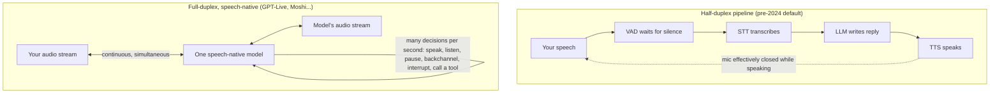

<LevelBadge level="beginner" />

Ein Jahrzehnt lang bedeutete mit einem Computer zu reden, sich abzuwechseln wie mit einem Walkie-Talkie, das vorgab, ein Mensch zu sein. Am **8. Juli 2026 brachte OpenAI GPT-Live heraus** — ein Sprachmodell, das zuhört, *während* es spricht — und die Walkie-Talkie-Ära begann offiziell zu enden. Diese Seite erklärt, was sich unter der Haube tatsächlich geändert hat, warum der alte Voice-Stack zwangsläufig roboterhaft wirken musste und wie man die gesamte Sprachagenten-Landschaft von 2026 ohne den Hype beurteilt.

<Callout type="objectives" items={[
  "Verstehen, warum die klassische STT → LLM → TTS-Pipeline immer träge wirkte — es ist Physik, kein Feinschliff",
  "Wissen, was Full-Duplex bedeutet: ein speech-native Modell, das gleichzeitig zuhört und spricht",
  "Die verifizierten Fakten zu GPT-Live und der aktuellen Voice-Landschaft kennen (OpenAI, Google, ElevenLabs, Anthropic, offene Modelle)",
  "Wissen, wann ein Sprachagent heute wirklich tragfähig ist — und was noch bricht",
]} />

<VerifyNote lastVerified="2026-07-13" source="https://openai.com/index/introducing-gpt-live/">
GPT-Live wurde vor wenigen Tagen gestartet, und Details (Modell-Stufen, Rollout, API-Zugang) bewegen sich schnell. Produktnamen, Verfügbarkeit und Latenzangaben auf dieser Seite sind verderblich — prüfe jede Anbieterseite (verlinkt in Quellen) für den heutigen Stand.
</VerifyNote>

## Das 200-Millisekunden-Problem

Hier ist der Fakt, der alles andere auf dieser Seite erklärt: **Menschen antworten einander in etwa 0–200 Millisekunden.** Eine wegweisende sprachübergreifende Studie über 10 Sprachen (Stivers et al., *PNAS* 2009) fand heraus, dass die Antwortlücken in jeder untersuchten Kultur nahe **0 ms** liegen — wir beginnen routinemäßig zu antworten, *bevor* die andere Person fertig ist, weil unser Gehirn das Ende ihres Redebeitrags vorhersagt.

Vergleichen wir das nun mit dem klassischen Sprachassistenten-Stack. Er war eine **Pipeline aus drei separaten Modellen**, die zusammengeklebt waren:

1. **STT (speech-to-text)** transkribiert dein Audio in Text,
2. ein **LLM** liest das Transkript und schreibt eine Antwort,
3. **TTS (text-to-speech)** verwandelt die Antwort wieder in Audio.

Jede Stufe muss (meist) fertig sein, bevor die nächste startet, sodass sich ihre Verzögerungen **stapeln**. Schlimmer noch: Die Pipeline hat keine Ahnung, wann du aufgehört hast zu reden — Audio hat keinen "Senden"-Knopf — also schnallten die Entwickler einen **VAD (voice activity detection)**-Stilletimer davor: warte auf etwa eine halbe bis eine ganze Sekunde Stille, dann *rate*, dass der Redebeitrag vorbei ist. Genau dieser Hack erklärt beide klassischen Fehlermodi: pausiere mitten im Satz zum Nachdenken und der Bot fällt dir ins Wort; beende knapp und er sitzt trotzdem da und wartet auf seinen Stilletimer. Rechnet man alles zusammen, ergeben sich 1–3 Sekunden Funkstille, wo ein Mensch ~0–200 ms erwartet — **eine Größenordnung zu langsam**, noch bevor das Modell überhaupt ein Wort gesagt hat.

Und es wird noch schlimmer: Die Pipeline ist **half-duplex**, wie ein Walkie-Talkie. Während der Bot spricht, hört er nicht zu. Du kannst nicht unterbrechen ("barge in") ohne besonderes Engineering, der Bot kann nie "mhmm" sagen, während *du* sprichst, und jede Überlappung — der menschlichste Teil eines Gesprächs — ist konstruktionsbedingt schlicht unmöglich.

## Was "Full-Duplex" tatsächlich bedeutet

**Full-Duplex** ist ein Telekom-Begriff: Beide Richtungen übertragen *gleichzeitig* (ein Telefonat), im Gegensatz zu **Half-Duplex**, wo sie sich abwechseln (ein Walkie-Talkie). Auf Voice-AI angewendet:

- **Das Modell hört und spricht gleichzeitig.** Es gibt keine "du bist dran / ich bin dran"-Zustandsmaschine — eingehendes Audio strömt kontinuierlich herein, während ausgehendes Audio hinausströmt.
- **Es ist speech-native.** Ein Modell nimmt Audio direkt auf und produziert es direkt, statt dass drei Modelle Text zwischen sich hin- und herreichen. Kein Transkriptionsschritt, kein Synthese-Schritt, keine gestapelte Latenz — und kein Informationsverlust (Tonfall, Zögern, Ironie und Emotion überleben, weil sie nie zu Text plattgedrückt wurden).
- **Turn-Taking wird zu erlerntem Verhalten, nicht zu einem Timer.** Laut OpenAIs Beschreibung von GPT-Live trifft das Modell Interaktionsentscheidungen "viele Male pro Sekunde": ob es spricht, weiter zuhört, pausiert, bestätigt, unterbricht oder ein Tool aufruft. Der Stilleerkennungs-Hack verschwindet, weil das Modell Redebeitragsenden *vorhersagt*, so wie es Menschen tun.
- **Backchannels und Barge-in kommen kostenlos dazu.** Es kann "mhmm" murmeln, während du sprichst (ein **Backchannel**), mitten im Satz stoppen in dem Moment, in dem du einhakst (**Barge-in**), oder still bleiben, während du nachdenkst — alles unmöglich oder gehackt in einer Pipeline.

Kaum jemand weiß das: **Full-Duplex wurde nicht 2026 von OpenAI erfunden.** Das französische Labor **Kyutai machte Moshi 2024 open source** — ein Full-Duplex-Sprachmodell mit ~160 ms theoretischer / ~200 ms praktischer Latenz, das *zwei parallele Audioströme* modelliert (deinen und seinen eigenen) und einen "Inner Monologue" aus zeitlich ausgerichteten Text-Tokens nutzt, um seine Sprache sprachlich kohärent zu halten. Du kannst die Gewichte herunterladen und es heute lokal ausführen. Was sich diesen Monat geändert hat, ist, dass Full-Duplex vom Forschungsdemo zur **Standardschnittstelle für Hunderte Millionen ChatGPT-Nutzer** geworden ist.

## GPT-Live: was OpenAI tatsächlich ausgeliefert hat

Verifiziert gegen OpenAIs Ankündigung und Launch-Berichterstattung (8. Juli 2026):

- **Zwei Modelle: GPT-Live-1 und GPT-Live-1 mini.** Das mini ersetzt Advanced Voice Mode als ChatGPT-Voice-Standard (inklusive Free-Tier); das größere GPT-Live-1 ist für zahlende Tiers. TechCrunch berichtet, dass über **150 Millionen Menschen** die Sprachfunktionen von ChatGPT bereits nutzen.
- **Echte Full-Duplex-Architektur.** Kontinuierliche Verarbeitung von Input während der Erzeugung von Output, mit Sprechen/Zuhören/Pausieren/Unterbrechen/Tool-Entscheidungen, die viele Male pro Sekunde getroffen werden. Es gibt Backchannels ("mhmm", "yeah"), bewältigt schnelles Hin und Her und kann — bemerkenswerterweise — **still bleiben** und einfach Kontext aufnehmen, bis es gebraucht wird.
- **Delegation an ein Frontier-Modell.** Für Websuche, tiefere Argumentation oder agentische Arbeit übergibt GPT-Live die Aufgabe an OpenAIs Frontier-Modell (GPT-5.5 beim Start) **im Hintergrund und spricht weiter mit dir**, während das Ergebnis zurückkommt. Das Sprachmodell ist das konversationelle Front-End; das schwere Denken passiert anderswo. Diese Aufteilung "schneller Redner + langsamer Denker" ist das Architekturmuster, das man im Auge behalten sollte.
- **Live-Übersetzung** ergibt sich aus dem kontinuierlichen Design des Zuhörens-während-des-Sprechens — das Modell kann deinen Satz nahezu in dem Moment in einer anderen Sprache wiedergeben, in dem du ihn sagst. (Die Launch-Berichterstattung merkte an, dass die Akzentqualität in manchen Sprachen noch uneinheitlich ist.)
- **Keine Entwickler-API beim Start.** GPT-Live ist vorerst ein ChatGPT-Produkt; OpenAI sagt, API-Zugang komme, und hat ein Anmeldeformular. Für Entwickler **bleibt gpt-realtime auf der Realtime API das aktuelle Entwicklerprodukt** (siehe unten).
- **Bekannte Grenzen beim Start:** kein Video/Bildschirmfreigabe in der Voice-Session, uneinheitliche Qualität außerhalb der großen Sprachen, und OpenAI sagt, es überwache Effekte emotionaler Abhängigkeit.

<VerifyNote lastVerified="2026-07-13" source="https://openai.com/index/introducing-gpt-live/">
Die Verfügbarkeit der Tiers, das genaue Frontier-Modell hinter der Delegation und das Timing der API sind hier die am schnellsten veränderlichen Behauptungen — prüfe OpenAIs Ankündigung erneut, bevor du sie wiederholst.
</VerifyNote>

## Die Voice-Landschaft, verifiziert (Juli 2026)

| Akteur | Was existiert | Full-Duplex? | Anmerkungen |
|---|---|---|---|
| **OpenAI — GPT-Live** | ChatGPT Voice (Consumer) | **Ja** — speech-native | Delegiert harte Aufgaben mitten im Gespräch an ein Frontier-Modell; noch keine API |
| **OpenAI — Realtime API (gpt-realtime)** | Entwickler-API, GA | Speech-to-Speech, einzelnes Modell | Produktive Sprachagenten: SIP-Telefonie, Remote-MCP-Server, Bildeingabe |
| **Google — Gemini Live API** | Entwickler-API (AI Studio / Vertex, GA) | Native-Audio, Streaming | Barge-in, "proactive audio" (spricht nur, wenn relevant), affektiver Dialog, Tool-Nutzung + Google Search |
| **ElevenLabs — Agents** | Agent-Plattform (gestartet März 2026) | Orchestrierter Stack mit proprietärem Turn-Taking-Modell | TTS/STT + Turn-Taking + Tool-Aufrufe; 70+ Sprachen; Behauptungen von unter 500 ms erster Turn; Telefon-/Web-/App-Kanäle |
| **Anthropic — Claude** | [Voice Mode in den Claude-Apps](/docs/claude-app/voice-mode); Push-to-Talk `/voice` in Claude Code (März 2026, mehrsprachig aus der Beta im Juni 2026) | **Nein** — rundenbasiert | Sprich, erhalte gesprochene Antworten mit gespeichertem Transkript. Kein speech-native Full-Duplex-Modell zum Verifizierungsdatum angekündigt — lass dir von niemandem etwas anderes erzählen |
| **Kyutai — Moshi** | Offene Gewichte + Code (GitHub, Hugging Face) | **Ja** — der Open-Source-Beweis | ~160–200 ms Latenz, Dual-Stream-Audio, "Inner Monologue"; läuft lokal |

Zwei Erkenntnisse aus dieser Tabelle, die die meiste Berichterstattung übersieht: **(1)** "Sprachagent" bedeutet heute zwei verschiedene Architekturen — echte speech-native Full-Duplex-Modelle (GPT-Live, Moshi, Geminis Native-Audio) versus sehr schnelle, gut orchestrierte Pipelines mit einem erlernten Turn-Taking-Modell obendrauf (ElevenLabs Agents). Beide können sich gut anfühlen; nur die ersten können Sprache überlappen. **(2)** Die Open-Source-Option ist real: Moshi beweist, dass man Full-Duplex auf eigener Hardware ausführen kann, was zählt, wenn dein Anwendungsfall kein Audio in eine Cloud senden darf (siehe [Ein Modell auswählen](/docs/models/choosing-a-model) für dieses Entscheidungsframework).

## Wie ein Full-Duplex-Gespräch tatsächlich abläuft

<Steps items={[
  {title: "Audio strömt kontinuierlich herein", body: "Es gibt kein Aufnehmen-dann-Senden. Dein Mikrofon-Audio wird Frame für Frame in Tokens kodiert (Moshis Codec nutzt 80-ms-Frames) und dem Modell zugeführt, sobald es eintrifft — sogar während das Modell mitten im Satz ist."},
  {title: "Das Modell trifft ständig Mikro-Entscheidungen", body: "Viele Male pro Sekunde wählt es: weiterreden, stoppen, still bleiben, einen Backchannel einwerfen ('mhmm') oder eine Antwort beginnen. Turn-Taking ist eine Vorhersage, die das Modell aus echten Gesprächen gelernt hat, kein Stilletimer."},
  {title: "Du unterbrichst; es gibt sofort nach", body: "Barge-in ist nativ: Das Modell hört dich in dem Moment, in dem du beginnst, weil es nie aufgehört hat zuzuhören. Es bricht seinen eigenen Satz ab, nimmt auf, was du gesagt hast, und passt sich an — kein 'Stopp'-Stichwort nötig."},
  {title: "Harte Fragen werden sanft delegiert", body: "Frage etwas, das Websuche oder echte Argumentation erfordert, und GPT-Live übergibt es dem Frontier-Modell im Hintergrund — während es das Gespräch am Leben hält ('lass mich das kurz prüfen... also wie gesagt—'). Die Antwort wird eingewoben, wenn sie bereit ist."},
  {title: "Stille ist ein gültiger Zug", body: "Ein Full-Duplex-Modell kann bewusst nichts sagen — und dich laut denken lassen, ohne den Redebeitrag an sich zu reißen. Pipeline-Bots konnten das buchstäblich nicht; ihr VAD behandelte deine Pause als Einladung."},
]} />

## Wann Sprachagenten jetzt tragfähig sind — und was noch bricht

**Jetzt wirklich tragfähig:**

- **Kundensupport und Telefon-Workflows.** Turn-Taking im Sekundenbruchteil plus Barge-in beseitigen die beiden größten Beschwerdeauslöser. Die SIP-Unterstützung der Realtime API und ElevenLabs Agents zielen genau darauf ab.
- **Freihändige und augenbeanspruchende Nutzung.** Autofahren, Kochen, Außeneinsätze, Barrierefreiheit — die Interaktion hält endlich mit der Sprache Schritt ([Voice Mode in den Claude-Apps](/docs/claude-app/voice-mode) deckt bereits die Erfassen-und-Transkribieren-Version davon ab).
- **Live-Übersetzung und Sprachpraxis.** Zuhören-während-des-Sprechens macht nahezu simultanes Dolmetschen und natürliche Konversationsübungen zum ersten Mal möglich.
- **Voice als Agenten-Front-End.** Das Delegationsmuster — mit einem schnellen Sprachmodell chatten, während ein langsames Frontier-Modell die Arbeit erledigt — ist OpenAIs erklärte Wette für das Management "langlaufender agentischer Arbeit" per Voice.

**Bricht noch:**

- **Halluzinierte Audioausgabe.** Speech-native Modelle können in *Klang* halluzinieren, nicht nur in Fakten: falsche Sprachdrift, verstümmelte Namen und Zahlen oder schräge Akzente (die Übersetzungsdemo beim Start von GPT-Live zog genau diese Kritik auf sich). Vertraue nie einer gesprochenen Zahl, die du nicht bestätigt hast.
- **Laute Umgebungen und Nebengeräusche.** Immer offene Mikrofone hören alles — Nebengespräche, Fernseher, einen zweiten Sprecher. Full-Duplex macht das Modell *anfälliger* für Umgebungsgeräusche, nicht weniger.
- **Sicherheit von Echtzeit-Aktionen.** Ein Modell, das mit Gesprächsgeschwindigkeit handelt, kann mit Gesprächsgeschwindigkeit auf einen falsch gehörten Satz reagieren. Jeder Sprachagent, der Geld, Nachrichten oder Löschungen berührt, braucht explizite gesprochene Bestätigungs-Gates und eine Tendenz zu schreibgeschützten Standardeinstellungen — dieselben Regeln wie bei jedem Agenten (siehe [Grundlagen](/docs/foundations)), aber mit einem Eingabekanal geringerer Wiedergabetreue.
- **Emotionale Abhängigkeit.** Ein System, das Backchannels gibt, zögert und deiner nie überdrüssig wird, ist so gebaut, dass es sich wie ein Freund anfühlt. OpenAI selbst weist auf die Überwachung dessen hin. Gestalte (und nutze) entsprechend.

<PromptCard title="System-Prompt-Grundgerüst für einen Sprachagenten (funktioniert auf speech-native Modellen und Pipelines)">{`You are a voice assistant for {company}. You are SPEAKING, not writing.

Style:
- Short sentences. One idea per sentence. No lists, no markdown, no URLs read aloud.
- If the user interrupts, stop immediately and address what they said.
- If the user pauses mid-thought, stay silent. Do not fill silence.

Safety:
- Before ANY action that sends, buys, deletes, or changes something:
  say back exactly what you will do and wait for a clear spoken "yes".
- Repeat numbers, names, and addresses back for confirmation — always.
- If audio is unclear or noisy, say what you think you heard and ask.
- If asked for something outside {scope}, say so and offer a human handoff.`}</PromptCard>

<Quiz title="Teste dich selbst" questions={[
  {q: "Warum wirkte der klassische STT → LLM → TTS-Stack immer träge?", options: ["Die Modelle waren zu klein", "Drei sequenzielle Stufen plus ein Stilleerkennungs-Timer stapeln sich zu 1–3 s Verzögerung, gegenüber den ~0–200 ms, die Menschen erwarten", "Mikrofone fügen Latenz hinzu", "TTS-Stimmen waren roboterhaft"], answer: 1, explain: "Es ist strukturell: Jede Stufe wartet auf die vorherige, und ein VAD wartet auf Stille, bevor überhaupt etwas beginnt. Menschen antworten innerhalb von ~0–200 ms (Stivers et al., PNAS 2009), also war die Pipeline konstruktionsbedingt eine Größenordnung zu langsam."},
  {q: "Was kann ein Full-Duplex-Modell konstruktionsbedingt, was eine Half-Duplex-Pipeline nicht kann?", options: ["Sachfragen beantworten", "Flüssiger sprechen", "Zuhören, während es spricht — was Barge-in, Backchannels und überlappende Sprache ermöglicht", "Tools nutzen"], answer: 2, explain: "Half-Duplex wechselt die Redebeiträge ab wie ein Walkie-Talkie: Während der Bot spricht, hört er nicht zu. Gleichzeitiges Zuhören-und-Sprechen ist die definierende Eigenschaft von Full-Duplex."},
  {q: "Wie behandelt GPT-Live eine Frage, die Websuche oder tiefe Argumentation erfordert?", options: ["Es verweigert Voice bei harten Fragen", "Es pausiert den Anruf, bis die Antwort bereit ist", "Es antwortet nur aus dem Gedächtnis", "Es delegiert im Hintergrund an ein Frontier-Modell und hält das Gespräch währenddessen am Laufen"], answer: 3, explain: "Die Aufteilung 'schneller Redner + langsamer Denker': Das speech-native Modell führt das Gespräch und übergibt die schwere Arbeit an ein Frontier-Modell (GPT-5.5 beim Start), wobei es das Ergebnis einwebt, sobald es bereit ist."},
  {q: "Welche dieser Aussagen war WAHR, BEVOR GPT-Live gestartet wurde?", options: ["Ein Full-Duplex-Sprachmodell mit ~200 ms Latenz war bereits open source (Kyutais Moshi, 2024)", "Kein Modell konnte unterbrochen werden", "Voice-AI erforderte per Gesetz eine Internetverbindung", "Claude hatte ein speech-native Full-Duplex-Modell"], answer: 0, explain: "Moshi lieferte 2024 offene Gewichte mit Dual-Stream-Full-Duplex-Audio und ~160–200 ms Latenz. Die Bedeutung von GPT-Live liegt in der Massentauglichmachung von Full-Duplex, nicht in dessen Erfindung. Claudes Sprachfunktionen bleiben zum Verifizierungsdatum rundenbasiert."},
]} />

<Flashcards title="Voice-AI-Vokabular" cards={[
  {front: "Half-Duplex", back: "Kommunikation, die die Richtungen abwechselt — Walkie-Talkie-Stil. Die alte Sprachassistenten-Pipeline: Während der Bot spricht, hört er nicht zu."},
  {front: "Full-Duplex", back: "Beide Richtungen gleichzeitig, wie bei einem Telefonat. Das Modell hört und spricht gleichzeitig und entscheidet viele Male pro Sekunde, ob es reden, pausieren oder nachgeben soll."},
  {front: "Speech-native Modell", back: "Ein einzelnes Modell, das Audio direkt aufnimmt und produziert — keine STT/TTS-Stufen, keine gestapelte Latenz, und Tonfall/Emotion überleben, weil Sprache nie zu Text plattgedrückt wird."},
  {front: "Barge-in", back: "Den Agenten mitten im Satz unterbrechen und ihn sofort stoppen und anpassen lassen. Nativ in Full-Duplex; ein aufgesetzter Hack in Pipelines."},
  {front: "Backchannel", back: "Kurze Zuhörersignale — 'mhmm', 'yeah', 'verstanden' — die gemacht werden, während die ANDERE Partei spricht. Konstruktionsbedingt unmöglich in Half-Duplex."},
  {front: "VAD / Endpointing", back: "Voice activity detection: der Stilletimer, den alte Pipelines nutzten, um zu raten, dass du fertig geredet hast. Ursache sowohl des Ins-Wort-Fallens als auch des unangenehmen Wartens."},
  {front: "Latenzstapelung", back: "Pipeline-Verzögerungen summieren sich: VAD-Warten + STT + LLM + TTS ≈ 1–3 s. Menschen erwarten ~0–200 ms — die Lücke, die Bots roboterhaft wirken ließ."},
  {front: "Delegation (schneller Redner / langsamer Denker)", back: "GPT-Lives Muster: Ein schnelles speech-native Modell führt das Gespräch und übergibt Suche/Argumentation im Hintergrund an ein Frontier-Modell, wobei der Chat währenddessen am Leben bleibt."},
]} />

<Callout type="takeaways" items={[
  "Der alte Stack war nicht schlecht gebaut — er war strukturell zu langsam: gestapelte STT/LLM/TTS-Latenz plus ein Stilletimer, gegenüber den ~0–200 ms, die Menschen erwarten",
  "Full-Duplex = ein speech-native Modell, das zuhört, während es spricht; Barge-in, Backchannels und bewusste Stille werden zu erlerntem Verhalten, nicht zu Hacks",
  "GPT-Live (8. Juli 2026) macht Full-Duplex in ChatGPT massentauglich und leistet Pionierarbeit bei der Delegation: schnelles Sprachmodell vorn, Frontier-Modell-Argumentation im Hintergrund",
  "Die Landschaft teilt sich in zwei: speech-native Full-Duplex (GPT-Live, Gemini Native-Audio, Moshi — open source seit 2024) vs schnelle orchestrierte Pipelines mit erlerntem Turn-Taking (ElevenLabs Agents); Claudes Voice bleibt rundenbasiert",
  "Sprachagenten sind jetzt tragfähig für Support, Freihändigkeit und Übersetzung — aber Audio-Halluzinationen, laute Räume und die Sicherheit von Echtzeit-Aktionen verlangen weiterhin Bestätigungs-Gates",
]} />

## Weiter

- [Die KI-Modelllandschaft: Ein Modell auswählen](/docs/models/choosing-a-model) — das Entscheidungsframework, angewendet auf jede Modalität
- [Mit Claude sprechen (Voice Mode)](/docs/claude-app/voice-mode) — was Claudes Sprachfunktionen heute leisten
- [Grundlagen](/docs/foundations) — Tokens, Kontext und die Agenten-Sicherheitsgrundlagen, die Voice erbt

## Quellen & weiterführende Literatur

- [Introducing GPT-Live — OpenAI](https://openai.com/index/introducing-gpt-live/) — die Launch-Ankündigung (8. Juli 2026)
- [OpenAI releases new voice models for more natural live conversations — TechCrunch](https://techcrunch.com/2026/07/08/openai-releases-new-voice-models-for-more-natural-live-conversations/) — Launch-Berichterstattung: Tiers, 150 Mio. Voice-Nutzer, Vorbehalte zur Übersetzungsdemo
- [Introducing gpt-realtime and Realtime API updates for production voice agents — OpenAI](https://openai.com/index/introducing-gpt-realtime/) — das aktuelle Entwickler-Speech-to-Speech-Produkt (GA)
- [Gemini Live API capabilities — Google AI for Developers](https://ai.google.dev/gemini-api/docs/live-api/capabilities) — Native-Audio, Barge-in, proactive audio, Tool-Nutzung
- [ElevenLabs Agents](https://elevenlabs.io/agents) — die Agent-Plattform: Turn-Taking-Modell, Kanäle, Sprachen
- [Moshi: a speech-text foundation model for real-time dialogue — Kyutai (arXiv 2410.00037)](https://arxiv.org/abs/2410.00037) — die offene Full-Duplex-Architektur: Dual-Streams, Inner Monologue, 160 ms theoretische Latenz
- [kyutai-labs/moshi — GitHub](https://github.com/kyutai-labs/moshi) — Code und Gewichte, um Full-Duplex lokal auszuführen
- [Universals and cultural variation in turn-taking in conversation — Stivers et al., PNAS 2009](https://www.pnas.org/doi/10.1073/pnas.0903616106) — der Beleg für die ~0–200 ms menschliche Redebeitragslücke
- [Claude Code rolls out a voice mode capability — TechCrunch](https://techcrunch.com/2026/03/03/claude-code-rolls-out-a-voice-mode-capability/) — Status der Push-to-Talk-Spracheingabe von Claude
