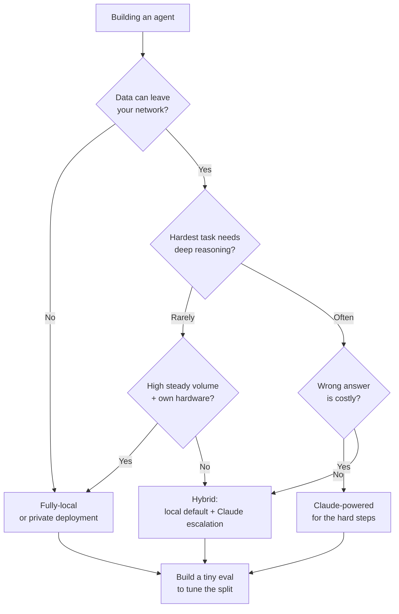

<LevelBadge level="intermediate" />

Du baust einen Agenten. Die erste echte Weggabelung: Läuft er auf einem **vollständig lokalen** Open-Weight-Modell (privat, kostenlos im Betrieb, dein eigenes), auf **Claude** (Frontier-Qualität, gehostet) oder auf einem **Hybrid** aus beidem? Diese Seite ist ein Entscheidungsrahmen — die Faktoren, die es tatsächlich entscheiden, ein klarer "wenn X → tendiere zu Y"-Ablauf und die ehrliche Realität, dass **hybrid meist gewinnt**: lokal für die einfachen/sensiblen 90 %, Claude für die schweren 10 %.

<Callout type="objectives" items={[
  "Die Faktoren benennen, die tatsächlich über lokal vs. Claude vs. hybrid entscheiden",
  "Einen klaren 'wenn X → tendiere zu Y'-Entscheidungsablauf für deinen Agenten durchgehen",
  "Verstehen, warum ein Hybrid (lokaler Standard + Claude-Eskalation) oft beide Extreme schlägt",
  "Mit einer winzigen Eval als Tie-Breaker abschließen — kein Leaderboard",
]} />

<VerifyNote lastVerified="2026-06-28" source="https://artificialanalysis.ai/">
Die dauerhaften Aussagen hier — *eine Fähigkeitslücke zwischen den besten Open-Weight- und Frontier-Modellen existiert, schließt sich aber stetig*, und *Routing/Cascade (erst günstiges Modell, bei Schwierigkeit eskalieren) spart Kosten bei gehaltener Qualität* — sind stabil. Aber die **konkreten Zahlen** (wie groß die Lücke diesen Monat ist, welches Open-Modell führt, Claude-Preise pro Token, exakte Tokens/Sek. auf bestimmter Hardware) verändern sich ständig. Behandle jede konkrete Zahl als verderblich und prüfe einen Live-Tracker wie [Artificial Analysis](https://artificialanalysis.ai/), bevor du darauf wettest.
</VerifyNote>

## Die drei Optionen, in einem Atemzug

- **Vollständig lokaler Agent** — ein Open-Weight-Modell (Llama, Qwen, Mistral, DeepSeek usw.), das auf deiner eigenen Hardware über Ollama/LM Studio/vLLM läuft. Daten verlassen deine Maschine nie; keine Kosten pro Aufruf; funktioniert offline; begrenzt durch deine Hardware und die Obergrenze des Modells. → [Lokale KI-Agenten](/docs/models/local-ai-agents)
- **Claude-betriebener Agent** — ruft die Claude-API auf. Frontier-Reasoning und Tool-Nutzung, keine Infrastruktur zu betreuen, skaliert sofort; aber Daten verlassen dein Netzwerk, du zahlst pro Aufruf und brauchst Konnektivität.
- **Hybrid** — ein lokales Modell erledigt den routinemäßigen/sensiblen Großteil; schwere oder geschäftskritische Schritte eskalieren zu Claude. Das Muster, auf das die meisten Produktions-Agenten konvergieren. → [Claude + lokale Modelle](/docs/models/claude-plus-local-models)

## Die Faktoren, die es tatsächlich entscheiden

Lass deinen Agenten durch diese laufen. Die meisten Entscheidungen werden schon durch die ersten zwei oder drei geklärt.

| Faktor | Tendiert zu **lokal**, wenn… | Tendiert zu **Claude**, wenn… |
|---|---|---|
| **Datensensibilität / Datenschutz** | Daten sind reguliert oder dürfen dein Netzwerk nicht verlassen | Daten sind unsensibel oder du hast eine konforme Datenvereinbarung |
| **Aufgabenschwierigkeit & Reasoning-Tiefe** | Aufgaben sind eng, klar abgegrenzt, repetitiv | Aufgaben brauchen tiefes mehrstufiges Reasoning, langen Kontext, kniffliges Tool-Use |
| **Zuverlässigkeitsanforderungen** | Ein Retry oder ein Mensch reicht bei einem Fehler | Jeder Schritt muss stimmen; Fehler sind teuer |
| **Latenz** | Lokale Hardware antwortet schnell genug | Du zahlst lieber für Geschwindigkeit, als GPUs bereitzustellen |
| **Kosten bei deinem Volumen** | Hohes, stetiges Volumen — feste Hardware amortisiert sich | Niedriges/sprunghaftes Volumen — Bezahlung pro Aufruf schlägt im Leerlauf stehende GPUs |
| **Offline-Anforderung** | Muss air-gapped / ohne Konnektivität laufen | Immer-online ist in Ordnung |
| **Vorhandene Hardware** | Du besitzt leistungsfähige GPU(s) / Unified Memory | Du tust es nicht und willst sie nicht kaufen/mieten |
| **Betreuungsbudget** | Du kannst tunen, quantisieren, evaluieren, warten | Du willst, dass es "einfach funktioniert", ohne Ops |

**Die beiden, die es meist entscheiden:** Wenn die Daten dein Netzwerk *nicht* verlassen dürfen, drängt dich das allein zu lokal (oder zu einer privaten Bereitstellung), unabhängig von allem anderen. Wenn sie es dürfen, ist **Aufgabenschwierigkeit** der nächste Ausschlagfaktor — einfache Arbeit ist lokal günstig zu erledigen; bei schwerem Reasoning beißt die [Frontier-Lücke](/docs/models/choosing-a-model) noch.

<Callout type="info" items={[
  "Die Fähigkeitslücke zwischen Open-Weight und Frontier ist real, schließt sich aber schnell — Top-Open-Modelle sind exzellent bei Routine- und vielen Coding-Aufgaben und liegen bei den schwersten agentischen, langfristigen und tief-reasoning-lastigen Aufgaben noch zurück.",
  "Genau diese Asymmetrie macht hybrid mächtig: Schicke die einfache/sensible Mehrheit lokal, reserviere Claude für den Anteil, der wirklich Frontier-Reasoning braucht.",
]} />

## Der Entscheidungsablauf

<Steps items={[
  {title: "Dürfen die Daten dein Netzwerk verlassen?", body: "Wenn NEIN → lokal (oder eine private/VPC-Bereitstellung) ist deine Grundlage. Datenschutz ist eine harte Einschränkung, keine Präferenz — er dominiert die anderen Faktoren. Wenn JA → weiter im Ablauf."},
  {title: "Wie schwer ist das Schwerste, das dein Agent tun muss?", body: "Wenn jede Aufgabe eng und repetitiv ist → ein gutes lokales Modell schafft wahrscheinlich die Hürde; tendiere zu lokal. Wenn einige Schritte tiefes Reasoning, langen Kontext oder heikle Multi-Tool-Orchestrierung brauchen → tendiere für zumindest diese Schritte zu Claude."},
  {title: "Wie teuer ist eine falsche Antwort?", body: "Wenn ein Fehler nur einen Retry oder einen menschlichen Blick bedeutet → lokale Toleranzen reichen. Wenn ein einzelner schlechter Schritt teuer oder unsicher ist → bevorzuge Claudes Zuverlässigkeit dort, wo es zählt."},
  {title: "Wie sind dein Volumen und deine Hardware?", body: "Hohes, stetiges Volumen auf Hardware, die du bereits besitzt → lokal amortisiert sich wunderbar. Niedriges oder sprunghaftes Volumen, keine GPUs → Claudes Bezahlung pro Aufruf vermeidet stillstehendes Eisen."},
  {title: "Willst du wirklich Infrastruktur betreiben?", body: "Bereit zu quantisieren, zu serven, zu überwachen und Modelle neu zu evaluieren → lokal/hybrid ist machbar. Null Ops gewünscht → Claude, oder ein Hybrid, bei dem der lokale Teil kinderleicht ist."},
  {title: "Standardmäßig hybrid, dann beweise, dass du es nicht brauchst", body: "Lokales Modell als Standard-Arbeiter; Claude als Eskalationspfad für den schweren/geschäftskritischen Anteil. Starte hier, es sei denn, Schritt 1 erzwingt rein lokal oder die Aufgabe ist durchgehend schwer (dann rein Claude)."},
]} />

## Warum hybrid oft gewinnt

Die meisten realen Workloads sind **schief**: Eine große Mehrheit der Anfragen ist einfach und/oder sensibel, und eine kleine Minderheit ist wirklich schwer. Ein Hybrid nutzt diese Form direkt aus.

- **Lokal erledigt die einfachen/sensiblen 90 %** — schnell, am Rand kostenlos, privat, offline-fähig. Der Großteil deines Traffics berührt nie eine API.
- **Claude erledigt die schweren 10 %** — das mehrstufige Reasoning, die mehrdeutigen Grenzfälle, die Schritte, bei denen Richtigkeit zählt. Du zahlst Frontier-Preise nur für den Anteil, der Frontier-Qualität braucht.

Das ist das **Cascade-/Routing**-Muster: Probiere zuerst das günstige (lokale) Modell; eskaliere zu Claude, wenn ein Qualitätssignal sagt, dass die lokale Antwort nicht gut genug ist, oder route vorab über einen Schwierigkeits-/Sensibilitäts-Klassifikator. Es ist ein gut etablierter Weg, den Großteil der Qualität zu halten und nur einen Bruchteil der reinen Frontier-Kosten zu zahlen — und es fungiert zugleich als Datenschutzgrenze, da sensible Fälle auf "nur lokal" festgelegt werden können.

<PromptCard title="Selbstcheck, bevor du dich auf ein Extrem festlegst">{`Answer for YOUR agent:
1. Must any data stay on my machine?            (yes -> local baseline)
2. What % of tasks are genuinely HARD?          (high -> Claude leans heavier)
3. What's a wrong answer cost me?               (high -> Claude on those steps)
4. My volume + hardware?                        (high+own GPU -> local amortizes)
5. Can I babysit infra?                         (no -> Claude or simple hybrid)

If answers conflict -> you've just described a HYBRID.
Now build the tiny eval below and let DATA pick the split.`}</PromptCard>

Der ehrliche Vorbehalt: Hybrid bedeutet **mehr bewegliche Teile** — zwei Modellpfade, ein Router und ein zu wartendes Qualitätssignal. Wenn dein Agent durchgehend einfach *oder* durchgehend schwer ist, ist ein Setup mit einem einzigen Modell einfacher und wahrscheinlich richtig. Greife zu hybrid, wenn dein Workload wirklich schief ist.

<Flashcards title="Vokabular des Entscheidungsleitfadens" cards={[
  {front: "Vollständig lokaler Agent", back: "Agent, betrieben von einem Open-Weight-Modell auf deiner eigenen Hardware. Privat, keine Kosten pro Aufruf, offline-fähig; begrenzt durch deine Hardware und die Obergrenze des Modells."},
  {front: "Claude-betriebener Agent", back: "Agent, der die Claude-API aufruft. Frontier-Reasoning und Tool-Use, keine Infrastruktur, sofortige Skalierung; Daten verlassen dein Netzwerk und du zahlst pro Aufruf."},
  {front: "Hybrid (Cascade / Routing)", back: "Lokales Modell erledigt die einfache/sensible Mehrheit; Claude erledigt die schwere/geschäftskritische Minderheit. Erst-günstig-dann-eskalieren, oder vorab nach Schwierigkeit/Sensibilität routen."},
  {front: "Der entscheidende Faktor, meistens", back: "Zuerst Datensensibilität (dürfen die Daten das Netzwerk verlassen?), dann Aufgabenschwierigkeit (wie schwer ist der schwerste Schritt?). Der Rest sind Tie-Breaker."},
  {front: "Die Fähigkeitslücke", back: "Top-Open-Weight-Modelle liegen hinter Frontier-Modellen vor allem bei den schwersten Reasoning-/agentischen Aufgaben zurück. Real, aber schrumpfend — genau deshalb ist hybrid so effektiv."},
]} />

<Quiz title="Überprüfe dich selbst" questions={[
  {q: "Dein Agent verarbeitet Daten, die rechtlich dein Netzwerk nicht verlassen dürfen. Was bedeutet das zuerst?", options: ["Nutze Claude — es ist höherwertig", "Eine vollständig lokale oder private Bereitstellung ist die Grundlage, unabhängig von anderen Faktoren", "Wähle, was pro Token am günstigsten ist"], answer: 1, explain: "Datenschutz ist eine harte Einschränkung. Wenn Daten das Netzwerk nicht verlassen dürfen, dominiert das die Entscheidung — lokal (oder eine private/VPC-Bereitstellung) ist deine Grundlage, bevor du irgendetwas anderes abwägst."},
  {q: "Warum gewinnt ein Hybrid-Agent oft bei einem typischen, schiefen Workload?", options: ["Frontier-Modelle sind im großen Maßstab immer günstiger", "Lokal erledigt die einfache/sensible Mehrheit günstig und privat; Claude ist für die schwere Minderheit reserviert, die Frontier-Reasoning braucht", "Es macht jede Evaluierung überflüssig"], answer: 1, explain: "Die meisten Workloads sind schief. Die einfachen/sensiblen 90 % zu einem lokalen Modell und die schweren 10 % zu Claude zu routen, hält den Großteil der Qualität zu einem Bruchteil der reinen Frontier-Kosten — und legt sensible Fälle auf lokal fest."},
  {q: "Wann ist ein Setup mit einem einzigen Modell (rein lokal ODER rein Claude) die bessere Wahl gegenüber hybrid?", options: ["Immer — hybrid ist es nie wert", "Wenn der Workload durchgehend einfach oder durchgehend schwer ist, sodass die zusätzliche Router- und Qualitätssignal-Maschinerie sich nicht rechnet", "Nur wenn du keine GPUs hast"], answer: 1, explain: "Hybrid fügt bewegliche Teile hinzu (zwei Pfade, ein Router, ein Qualitätssignal). Wenn deine Aufgaben alle einfach oder alle schwer sind, ist ein Modell einfacher und meist richtig. Hybrid zahlt sich aus, wenn der Workload wirklich schief ist."},
]} />

## Dann tu das Einzige, das es entscheidet: teste es

Jeder Faktor oben grenzt das Feld ein; **eine winzige Eval kürt den Sieger.** Entscheide nicht nach Gefühl oder einem öffentlichen Leaderboard.

- Sammle **10–50 echte Fälle** aus deinem tatsächlichen Workload, mit bekannt-guten Antworten (schließe deine schwersten und sensibelsten Fälle ein).
- Lass deine engere Auswahl — ein kandidierendes lokales Modell, Claude und (falls relevant) einen Hybrid-Router — über dieselben Fälle laufen.
- Bewerte die Qualität, wäge dann **Kosten und Latenz bei deinem realen Volumen** ab. Ein Qualitätsgewinn von 2 %, der das 10-Fache kostet, ist es vielleicht nicht wert; ein Gewinn von 2 % bei dem Schritt, der stimmen muss, kann nicht verhandelbar sein.
- Bei einem Hybrid sagt dir die Eval auch, **wo du die Grenze ziehst** — was zu Claude eskaliert wird und was lokal bleibt.

Behalte die Eval. Wenn ein neues Open-Weight-Modell erscheint oder sich die Preise verschieben, verwandelt ein erneutes Durchlaufen eine nervenaufreibende Migration in einen Fünf-Minuten-Check. → [Evals](/docs/power-user/evals)

<Callout type="takeaways" items={[
  "Entscheide der Reihe nach: zuerst Datensensibilität (dürfen die Daten das Netzwerk verlassen?), dann Aufgabenschwierigkeit (wie schwer ist der schwerste Schritt?). Der Rest — Latenz, Volumen, Hardware, Betreuungsbudget — sind Tie-Breaker.",
  "Rein lokal gewinnt bei Datenschutz, Offline und Kosten bei stetig hohem Volumen; Claude gewinnt beim schwersten Reasoning, bei Zuverlässigkeit und bei Zero-Ops-Skalierung.",
  "Hybrid gewinnt meist bei schiefen Workloads: lokal für die einfachen/sensiblen 90 %, Claude für die schweren 10 % — Cascade/Routing und Frontier-Preise nur dort zahlen, wo sie sich verdienen.",
  "Die Open-Weight-Lücke ist real, aber schrumpfend — genau das macht hybrid heute so effektiv.",
  "Entscheide nicht nach Gefühl: baue eine winzige Eval auf DEINEN Daten, wäge Kosten und Latenz bei DEINEM Volumen ab und behalte sie für das nächste Modell-Release.",
]} />

## Quellen & weiterführende Literatur

- [Artificial Analysis](https://artificialanalysis.ai/) — unabhängige, häufig aktualisierte Vergleiche von Fähigkeit/Preis/Geschwindigkeit über Open- und Frontier-Modelle (der Ort, um die verderblichen Details nachzuprüfen).
- [Anthropic — Modellübersicht](https://docs.anthropic.com/en/docs/about-claude/models) — Claudes aktuelle Modellpalette, Kontext und Fähigkeiten.
- [Anthropic — API-Preise](https://www.anthropic.com/pricing) — aktuelle Kosten pro Token für deine Mengenrechnung.
- [Ollama](https://ollama.com/) · [LM Studio](https://lmstudio.ai/) — führe Open-Weight-Modelle lokal aus für den lokalen/hybriden Pfad.
- [Meta — Llama](https://www.llama.com/) · [Mistral — Modelle](https://docs.mistral.ai/getting-started/models/) — Open-Weight-Familien, die häufig in lokalen Agenten verwendet werden.

## Weiter

- Baue die lokale Seite → [Lokale KI-Agenten](/docs/models/local-ai-agents)
- Verdrahte den Hybrid → [Claude + lokale Modelle](/docs/models/claude-plus-local-models)
- Rahme die Wahl breit ein → [Ein Modell wählen](/docs/models/choosing-a-model)
- Mache die Entscheidung messbar → [Evals](/docs/power-user/evals)
