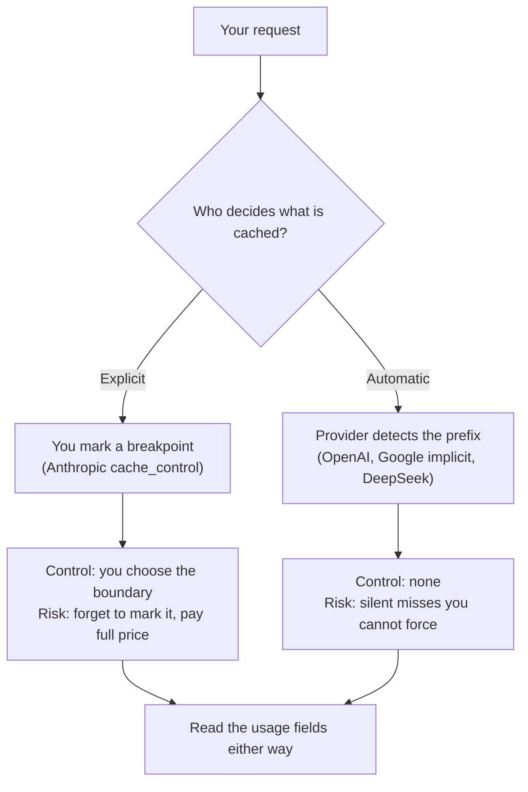

<LevelBadge level="advanced" />

<VerifyNote lastVerified="2026-09-26" source="https://platform.claude.com/docs/en/build-with-claude/prompt-caching">
Jede Zahl auf dieser Seite ist ein veröffentlichter Preis oder Schwellenwert, den die Anbieter nach eigenem Zeitplan ändern — und Googles Caching-Preise für Gemini haben eine geplante Erhöhung zum 01.01.2027. Prüfe die Doku jedes Anbieters erneut, bevor du budgetierst: [Anthropic](https://platform.claude.com/docs/en/build-with-claude/prompt-caching) · [OpenAI](https://developers.openai.com/api/docs/guides/prompt-caching) · [Google](https://ai.google.dev/gemini-api/docs/caching) · [DeepSeek](https://api-docs.deepseek.com/guides/kv_cache).
</VerifyNote>

Prompt-Caching ist der größte einzelne Kostenhebel in einer produktiven LLM-Anwendung — routinemäßig eine Senkung um über 90 % auf der Input-Seite. Jeder große Anbieter hat es inzwischen. Das verleitet zur Annahme, es sei überall dieselbe Funktion — und das ist sie nicht.

Der Mechanismus ist identisch: Der Anbieter verwendet das bereits verarbeitete **Präfix** deines Prompts wieder, statt es erneut zu lesen. Unterschiedlich sind: wer entscheidet, wie lange der Cache lebt, wie lang ein Präfix sein muss, um sich zu qualifizieren, und — das ist der Punkt, der wirklich wehtut — **ob du einen Aufschlag fürs Schreiben zahlst**. Ein auf einem Anbieter abgestimmter Workload kann beim nächsten still aufhören zu cachen oder *mehr* kosten als gar kein Caching.

<Callout type="objectives" items={[
  "Die beiden Steuerungsmodelle unterscheiden — explizite Breakpoints vs. automatische Präfix-Erkennung — und wissen, was jedes davon kostet",
  "Die anbieterübergreifende Tabelle lesen: Mindest-Präfix, TTL, Lese-Rabatt, Schreibaufschlag und das usage-Feld, das einen Treffer beweist",
  "Die portable Break-even-Regel anwenden: wie viele Wiederverwendungen innerhalb der TTL nötig sind, bis Caching sich rechnet",
  "Die fünf Fallen vermeiden, die einen Cache still killen, wenn du einen Workload zwischen Anbietern portierst",
  "Eine echte Trefferquote bei jedem Anbieter aus der Antwort-usage verifizieren, nicht aus der Doku",
]} />

Wenn du ausschließlich mit Claude arbeitest, lies zuerst [Prompt-Caching & Kostenoptimierung](/docs/api/prompt-caching) — dort wird der `cache_control`-Mechanismus in der Tiefe erklärt. Diese Seite ist die Portabilitätsschicht darüber.

## Die beiden Steuerungsmodelle

Alles in diesem Bereich ist eines von zwei Designs, und das Design bestimmt deinen Fehlermodus.



**Explizit** (Anthropic): Du hängst einen Marker an den letzten stabilen Block. Nichts wird gecacht, bis du danach fragst. Du bekommst exakte Kontrolle über die Grenze und kannst mehrere setzen. Du trägst aber auch den Bug: Ein Prompt ohne Breakpoint zahlt auf Dauer den vollen Preis, und nichts warnt dich.

**Automatisch** (OpenAI, Googles implizites Caching, DeepSeek): Der Anbieter hasht dein Präfix und verwendet wieder, was er kann. Nichts zu konfigurieren — und nichts zu reparieren, wenn es nicht trifft. Dein einziger Hebel ist das *Layout* des Prompts — stabile Inhalte zuerst — plus, bei OpenAI, ein Routing-Hinweis.

:::tip Der Hebel, den du in beiden Modellen behältst
Die Präfix-Reihenfolge ist die eine Steuerung, die überall funktioniert. **Stabile Inhalte zuerst, volatile Inhalte zuletzt.** In expliziten Systemen entscheidet sie, wo dein Breakpoint liegen kann; in automatischen Systemen ist sie das *Einzige*, was du kontrollierst.
:::

## Die anbieterübergreifende Tabelle

<VerifyNote lastVerified="2026-09-26" source="https://developers.openai.com/api/docs/guides/prompt-caching">
Die Lese-Verhältnisse unten sind Vielfache des jeweiligen Basis-Input-Preises des Anbieters, keine absoluten Dollarbeträge — genau das macht sie vergleichbar. Absolute Preise stehen auf [Modelle & Preise](/docs/whats-new/models-and-pricing) und auf der Preisseite jedes Anbieters.
</VerifyNote>

| | Anthropic (Claude) | OpenAI | Google (Gemini) | DeepSeek |
|---|---|---|---|---|
| **Steuerung** | Explizit über `cache_control`, bis zu 4 Breakpoints | Automatisch, Präfix-Abgleich | Standardmäßig implizit; explizite Cache-Objekte ebenfalls verfügbar | Automatisch, auf Festplatte |
| **Mindest-Präfix** | 512 Tokens bei Fable 5.1 / Mythos 5.1 / Opus 5.5 / Opus 5 / Fable 5 / Mythos 5; 1.024 bei Sonnet 5 und Opus 4.8; 2.048–4.096 bei älteren Modellen | 1.024 Tokens ab GPT-5.6; davor je nach Request-Einstellungen unterschiedlich | 4.096 Tokens bei Gemini 3.5–3.8 Flash und 3.1 Pro Preview; 2.048 bei Gemini 2.5 Flash / Pro | Nicht als Token-Zahl veröffentlicht — Cache-Einheiten liegen an Request-Grenzen, erkannten gemeinsamen Präfixen und festen Token-Intervallen |
| **TTL** | 5 Minuten standardmäßig; 1 Stunde optional | 30 Minuten standardmäßig ab GPT-5.6 über `prompt_cache_options.ttl`; frühere Modelle nutzen `prompt_cache_retention` — im Speicher (typischerweise 5–10 Min.) oder 24 h | Kein fester veröffentlichter Standardwert für implizites Caching | Automatische Verdrängung „innerhalb von einigen Stunden bis einigen Tagen“, sobald ungenutzt |
| **Cache-Lesen** | 0,1× Basis-Input; 0,05× bei Opus 5.5; 0,025× bei Fable 5.1 / Mythos 5.1 | 0,1× Basis-Input | Als separater Cached-Input-Preis veröffentlicht (0,1× des Standardpreises bei Gemini 3.8 Flash bis zum 31.12.2026) | Separater Cache-Hit-Input-Preis, rund 1/30 des Miss-Preises bei `deepseek-v4-pro` |
| **Schreibaufschlag** | 1,25× Basis-Input für die 5-Minuten-Stufe; 2× für die 1-Stunden-Stufe | 1,25× Basis-Input ab GPT-5.6 | Keiner für implizites Caching; explizites Caching berechnet **Speicherung** mit 0,50 $ pro Million Tokens pro Stunde bei Gemini 3.8 Flash bis zum 31.12.2026 | Keiner veröffentlicht |
| **Nachweis eines Treffers** | `cache_read_input_tokens` und `cache_creation_input_tokens` in `usage` | Anzahl gecachter Tokens in `usage` | `usage.total_cached_tokens` | `prompt_cache_hit_tokens` und `prompt_cache_miss_tokens` |
| **Abrechnungs-/Routing-Hinweis** | Platzierung des Breakpoints | `prompt_cache_key` — separate Cache-Abrechnung ab GPT-5.6, davor Cache-Routing | — | — |

Bei selbst gehosteten offenen Modellen existiert dieselbe Idee eine Ebene tiefer als **Prefix-Caching** in der Serving-Engine: vLLM und SGLang verwenden KV-Cache-Blöcke für ein gemeinsames Präfix wieder. Es gibt keinen Preis pro Token, also auch keinen Break-even zu berechnen — die Kosten sind VRAM, und der Gewinn ist Prefill-Latenz, nicht die Rechnung. vLLM stellt das als `enable_prefix_caching` bereit; in der V1-Engine ist es standardmäßig aktiv, du wirst es auf einem aktuellen Build also eher *aus*- als einschalten. Siehe [Modelle lokal mit Ollama betreiben](/docs/models/run-models-locally-ollama) und [Ein privater lokaler KI-Stack](/docs/models/private-local-ai-stack).

## Die Break-even-Regel

Hier kommt der Teil, den die Anbieter-Dokus als Übungsaufgabe hinterlassen. Caching ist in expliziten Systemen nicht kostenlos, und seit GPT-5.6 ist es das bei OpenAI auch nicht mehr. Ein Schreibaufschlag bedeutet: **Ein Präfix, das du nur einmal wiederverwendest, kann dich mehr kosten, als es nicht zu cachen.**

Sei `P` das, was das Präfix zum Basis-Input-Preis kosten würde, `w` der Schreib-Multiplikator, `r` der Lese-Multiplikator und `N` die Anzahl der Aufrufe, die das Präfix **innerhalb eines TTL-Fensters** teilen.

```text
Without caching:  N · P
With caching:     w · P  +  (N − 1) · r · P

Caching wins when:   w + (N − 1) · r  <  N
Which solves to:     N  >  (w − r) / (1 − r)
```

Setze die veröffentlichten Multiplikatoren ein:

| Stufe | w | r | Break-even-N | Benötigte Wiederverwendungen |
|---|---|---|---|---|
| Anthropic 5 Minuten, Opus 5.5 | 1.25 | 0.05 | 1.26 | **2 Aufrufe** |
| Anthropic 5 Minuten, Standard-Lesestufe | 1.25 | 0.1 | 1.28 | **2 Aufrufe** |
| Anthropic 1 Stunde | 2 | 0.1 | 2.11 | **3 Aufrufe** |
| OpenAI GPT-5.6+ | 1.25 | 0.1 | 1.28 | **2 Aufrufe** |
| Automatisch, kein Schreibaufschlag | 1 | 0.1 | 0 | **1 Aufruf** — nie ein Verlust |

Die Daumenregel ist also kurz: **Zwei Treffer innerhalb der TTL und du bist im Plus; mach drei daraus, bevor du die 1-Stunden-Stufe kaufst.** Darunter ist das Caching eines Präfixes ein kleiner, stiller Verlust.

<Callout type="tip" items={[
  "N zählt Aufrufe innerhalb eines TTL-Fensters, nicht Aufrufe pro Tag. Ein Präfix, das 1.000-mal täglich in Schüben mit 20 Minuten Abstand wiederverwendet wird, zahlt das Schreiben in jedem Schub erneut.",
  "Die 1-Stunden-Stufe ist kein reines Upgrade. Sie verdoppelt den Schreibaufschlag, um ein 12x längeres Fenster zu kaufen — das lohnt sich nur, wenn dein Traffic wirklich dünn ist."
]} />

### Durchgerechnetes Beispiel: ein 50k-Token-Präfix, 1.000 Aufrufe pro Tag

Auf Claude Opus 5.5 — Basis-Input 4 $/MTok, 5-Minuten-Schreiben 5 $/MTok, Lesen 0,20 $/MTok, alles aus Anthropics Preistabelle:

<Steps items={[
  {title: "Gar kein Caching", body: "50.000 Tokens x 1.000 Aufrufe = 50 Mio. Input-Tokens. Bei 4 $/MTok sind das 200 $/Tag, jeden Tag, für Inhalte, die sich nie geändert haben."},
  {title: "Gleichmäßig verteilter Traffic — ein Schreibvorgang", body: "1.000 Aufrufe pro Tag sind ein Aufruf alle ~86 Sekunden, bequem innerhalb der 5-Minuten-TTL, der Cache verfällt also nie. Ein Schreibvorgang (50k zu 5 $/MTok = 0,25 $) plus 999 Lesevorgänge (49,95 Mio. zu 0,20 $/MTok = 9,99 $) sind etwa 10,24 $/Tag — eine Senkung um 95 %."},
  {title: "Stoßweiser Traffic — 100 Schreibvorgänge", body: "Dieselben 1.000 Aufrufe, aber in 100 Schüben mit Lücken von mehr als 5 Minuten. Jetzt zahlst du 100 Schreibvorgänge (5 Mio. zu 5 $/MTok = 25 $) plus 900 Lesevorgänge (45 Mio. zu 0,20 $/MTok = 9 $) — etwa 34 $/Tag. Immer noch eine Senkung um 83 %, aber 3,3x die Rechnung bei gleichmäßigem Traffic."},
  {title: "Über die 1-Stunden-Stufe entscheiden", body: "Bei 100 Schüben pro Tag mit durchschnittlich ~14 Minuten Abstand fasst ein 1-Stunden-Fenster die meisten dieser 100 Schreibvorgänge zu einer Handvoll zusammen. Der Schreibaufschlag verdoppelt sich, prüfe also die Schreibzeile aus Schritt 3 gegen die reduzierte Schreibanzahl, bevor du wechselst."}
]} />

Der Lehrpunkt ist Schritt 3 gegen Schritt 2: **dasselbe Aufrufvolumen, dasselbe Präfix und ein Unterschied von 3,3x in der Rechnung, entschieden allein vom Ankunftsmuster gegen die TTL.** Das Ankunftsmuster ist die Variable, die niemand in die Tabelle schreibt.

## Fünf Fallen beim Portieren eines Workloads

<Callout type="warning" items={[
  "TTL-Lücke: Ein Job, der alle 10 Minuten läuft, trifft bei OpenAIs 30-Minuten-Standard und verfehlt bei Anthropics 5-Minuten-Standard. Gleicher Code, gleicher Prompt, Trefferquote null.",
  "Schwellenwert-Lücke: Ein System-Prompt mit 2.500 Tokens cacht bei Claude Opus 5.5 (Minimum 512 Tokens) und bei GPT-5.6 (1.024), aber nicht bei Gemini 3.8 Flash (4.096). Es schlägt still fehl — kein Fehler, nur eine Rechnung zum vollen Preis.",
  "Invalidierungs-Lücke: Jeder Anbieter invalidiert bei einem geänderten Präfix, aber die nicht offensichtlichen Auslöser unterscheiden sich. Bei Anthropic invalidieren geänderte Tool-Definitionen, tool_choice oder (modellabhängig) Thinking- und Effort-Einstellungen. Bei OpenAI tun das Änderungen an Modell, Tool-Definitionen, Schemas, Reasoning-Effort, Verbosity oder Context-Compaction.",
  "Schreibaufschlag-Lücke: Ein Präfix mit geringer Wiederverwendung von einem automatischen zu einem expliziten Anbieter zu portieren, kann es teurer machen als kein Caching. Rechne die Break-even-Regel von oben durch, bevor du einen Breakpoint setzt.",
  "Observability-Lücke: Die Namen der usage-Felder folgen keiner gemeinsamen Konvention. Jedes Dashboard, das die Cache-Felder eines Anbieters parst, braucht einen Adapter pro Anbieter — sonst liest sich deine Trefferquote nach einer Migration als null."
]} />

Die eine Anthropic-spezifische Mechanik ohne Gegenstück irgendwo sonst: Der Cache wird über ein **Rückblickfenster von 20 Blöcken** pro Breakpoint nachgeschlagen. Eine stetig wachsende Konversation kann dieses Fenster überlaufen und aufhören zu treffen, obwohl das Präfix unverändert ist — siehe [Die Ökonomie des Prompt-Cachings](/docs/frontiers/prompt-caching-economics) für die vollständigen Invalidierungsregeln.

## Verifizieren, nicht annehmen

Dokus beschreiben die Absicht; `usage` beschreibt, was dir berechnet wurde. Prüfe die echte Trefferquote bei jedem Anbieter, den du betreibst.

<PromptCard title="Die Cache-Trefferquote eines Workloads auditieren">{`Audit prompt caching for this codebase.

1. List every place we call an LLM API, with the provider and model.
2. For each call site, identify the prefix that is stable across calls
   and anything volatile that appears BEFORE it (timestamps, user IDs,
   reordered tool lists, freshly serialized JSON with unstable key order).
3. Report the token length of each stable prefix and compare it to that
   provider's minimum cacheable length. Flag any prefix below it.
4. Estimate the typical gap between consecutive calls sharing each prefix
   and compare it to that provider's cache TTL. Flag any gap that exceeds it.
5. Show me where we read the cache fields back from the response usage.
   If we never read them, say so plainly — that is the finding.

Do not change any code. Give me a table of call site, provider, prefix
tokens, minimum, typical gap, TTL, and the fields we read.`}</PromptCard>

Zwei Fehlersignaturen sind es wert, benannt zu werden, weil sie auf einem Dashboard identisch aussehen und entgegengesetzte Lösungen haben:

- **Gecachte Tokens immer null** bei wiederholten Requests, die ein Präfix teilen sollten → ein volatiler Wert sitzt vor deinem stabilen Inhalt, oder das Präfix liegt unter dem Minimum. Vergleiche die *gerenderten* Prompt-Bytes zwischen zwei Aufrufen.
- **Gecachte Tokens ungleich null, aber die Rechnung bewegt sich kaum** → das Präfix cacht, ist aber kurz im Vergleich zu deinem volatilen Suffix. Caching funktioniert; es ist nur nicht dort, wo dein Geld hingeht. Sieh dir stattdessen die Output-Tokens und [warum Agenten Tokens verbrennen](/docs/models/why-agents-burn-tokens) an.

<Flashcards title="Die Begriffe festmachen" cards={[
  {front: "Explizites vs. automatisches Caching", back: "Explizit (Anthropic): Du setzt einen Breakpoint, vorher wird nichts gecacht. Automatisch (OpenAI, Gemini implizit, DeepSeek): Der Anbieter macht den Präfix-Abgleich für dich, und du kannst einen Treffer nicht erzwingen."},
  {front: "Schreibaufschlag", back: "Der Zuschlag auf den Aufruf, der den Cache füllt — 1,25x Basis-Input bei Anthropics 5-Minuten-Stufe und bei OpenAI GPT-5.6+, 2x bei Anthropics 1-Stunden-Stufe. Deshalb kann ein nur einmal wiederverwendetes Präfix gecacht mehr kosten als ungecacht."},
  {front: "Break-even-N", back: "(w - r) / (1 - r), wobei w der Schreib- und r der Lese-Multiplikator ist. Zwei Wiederverwendungen innerhalb der TTL für die 5-Minuten-Stufen, drei für Anthropics 1-Stunden-Stufe."},
  {front: "TTL-Fenster", back: "Wie lange ein ungenutzter Eintrag überlebt. Anthropic 5 Minuten (1 Stunde optional); OpenAI standardmäßig 30 Minuten ab GPT-5.6, mit einer 24-h-Retention-Option bei früheren Modellen. N wird innerhalb eines Fensters gezählt, nicht pro Tag."},
  {front: "Speicher-Abrechnung", back: "Einzigartig bei Geminis explizitem Caching: Du zahlst dafür, den Cache pro Token-Stunde zu halten (0,50 $ pro Million Tokens pro Stunde bei Gemini 3.8 Flash bis zum 31.12.2026), zusätzlich zum Cached-Input-Preis. Implizites Caching hat keine Speichergebühr."},
  {front: "Prefix-Caching (selbst gehostet)", back: "Dieselbe Wiederverwendung eine Ebene tiefer, in vLLM oder SGLang, über KV-Cache-Blöcke. Kein Preis pro Token, also kein Break-even — du zahlst in VRAM und gewinnst bei der Prefill-Latenz."}
]} />

<Quiz title="Selbsttest" questions={[
  {q: "Ein Präfix wird innerhalb des Fensters genau zweimal wiederverwendet. Welche Stufe ist die falsche Wahl?", options: ["Anthropics 5-Minuten-Stufe", "Anthropics 1-Stunden-Stufe", "Ein automatischer Anbieter ohne Schreibaufschlag"], answer: 1, explain: "Der 2x-Schreibaufschlag der 1-Stunden-Stufe braucht N > 2,11, also drei Wiederverwendungen. Bei genau zwei ist es ein kleiner Verlust. Die 5-Minuten-Stufe erreicht Break-even bei 1,28 und der automatische Anbieter verliert nie."},
  {q: "Ein System-Prompt mit 2.500 Tokens cachte bei Claude problemlos und hörte nach einer Portierung zu Gemini 3.8 Flash auf zu cachen. Wahrscheinlichste Ursache?", options: ["Gemini unterstützt kein Caching", "Das Präfix liegt unter Geminis Minimum von 4.096 Tokens", "Die Cache-TTL lief mitten im Request ab"], answer: 1, explain: "Gemini 3.8 Flash verlangt 4.096 Input-Tokens für Cache-Fähigkeit; Claude Opus 5.5 verlangt 512. Ein Präfix mit 2.500 Tokens überspringt die eine Hürde und die andere nicht, ohne Fehlermeldung — nur mit einer Rechnung zum vollen Preis."},
  {q: "Gleicher Prompt, dieselben 1.000 Aufrufe pro Tag. Warum sollte sich die Rechnung verdreifachen?", options: ["Das Modell hat sich geändert", "Die Output-Tokens sind gewachsen", "Die Aufrufe kamen in Schüben mit größerem Abstand als der TTL an und zahlten das Schreiben jedes Mal erneut"], answer: 2, explain: "Break-even-N zählt Wiederverwendungen innerhalb eines TTL-Fensters. Schübe mit größerem Abstand als der TTL lassen den Eintrag verfallen, also zahlt jeder Schub den Schreibaufschlag erneut — das durchgerechnete Beispiel oben geht durch genau diese Änderung von etwa 10 $ auf etwa 34 $ pro Tag."},
  {q: "Die gecachten Tokens sind ungleich null, aber die Rechnung hat sich kaum bewegt. Was sagt dir das?", options: ["Der Cache ist kaputt", "Das Präfix cacht, ist aber klein gegenüber dem volatilen Teil deiner Ausgaben", "Du brauchst die 1-Stunden-Stufe"], answer: 1, explain: "Gecachte Tokens ungleich null beweisen, dass der Cache funktioniert. Wenn die Einsparung klein ist, liegt das Geld einfach nicht im stabilen Präfix — sieh dir stattdessen die Output-Tokens und das volatile Suffix an."}
]} />

<Callout type="takeaways" items={[
  "Zwei Designs, zwei Fehlermodi: Explizites Caching scheitert daran, nie markiert zu werden; automatisches Caching scheitert still, und du kannst keinen Treffer erzwingen.",
  "Caching ist nicht automatisch kostenlos. Mit einem Schreibaufschlag brauchst du N > (w - r) / (1 - r) Wiederverwendungen innerhalb einer TTL — zwei Aufrufe für die 5-Minuten-Stufen, drei für Anthropics 1-Stunden-Stufe.",
  "Das Ankunftsmuster gegen die TTL entscheidet die Rechnung, nicht das Aufrufvolumen: dieselben 1.000 täglichen Aufrufe kosten bei Opus 5.5 gleichmäßig verteilt etwa 10 $ und in Schüben etwa 34 $.",
  "Die Mindest-Präfixlänge reicht anbieterübergreifend von 512 bis 4.096 Tokens — ein Prompt, der bei Claude cacht, kann bei Gemini Flash still aufhören zu cachen.",
  "Beweise die Trefferquote bei jedem Anbieter aus der Antwort-usage; die Feldnamen folgen keiner gemeinsamen Konvention, ein Dashboard braucht also einen Adapter pro Anbieter.",
  "Stabile Inhalte zuerst, volatile Inhalte zuletzt. Das ist der eine Hebel, der bei jedem Anbieter funktioniert, einschließlich selbst gehostetem Prefix-Caching.",
]} />

## Quellen & weiterführende Literatur

- [Anthropic: Prompt-Caching](https://platform.claude.com/docs/en/build-with-claude/prompt-caching) — Mindestlängen pro Modell, das Limit von 4 Breakpoints, die 5-Minuten- und 1-Stunden-Stufen, die Schreib-/Lese-Multiplikatoren, die Invalidierungshierarchie und das Rückblickfenster von 20 Blöcken.
- [OpenAI: Prompt-Caching](https://developers.openai.com/api/docs/guides/prompt-caching) — standardmäßig aktiviert, das Minimum von 1.024 Tokens ab GPT-5.6, `prompt_cache_options.ttl`, `prompt_cache_retention`, `prompt_cache_key` und die Preise 1,25x Schreiben / 0,1x Lesen.
- [Google: Gemini Context-Caching](https://ai.google.dev/gemini-api/docs/caching) und [Gemini-API-Preise](https://ai.google.dev/gemini-api/docs/pricing) — implizites Caching standardmäßig aktiv ab 2.5, die Token-Minima pro Modell, `usage.total_cached_tokens` sowie die Cached-Input- plus Speicherpreise mit ihrer Erhöhung zum 01.01.2027.
- [DeepSeek: Context-Caching auf Festplatte](https://api-docs.deepseek.com/guides/kv_cache) und [DeepSeek-Preise](https://api-docs.deepseek.com/quick_start/pricing) — automatisch für alle Nutzer, wo Cache-Einheiten liegen, das Verdrängungsfenster und die Hit/Miss-Token-Aufteilung in der Antwort.
- [vLLM: automatisches Prefix-Caching](https://docs.vllm.ai/en/latest/features/automatic_prefix_caching/) — was Prefix-Caching beschleunigt und was nicht, wenn du das Modell selbst hostest.
- AILmanac-Begleitseiten: [Prompt-Caching & Kostenoptimierung](/docs/api/prompt-caching) · [Cache-Diagnose](/docs/api/cache-diagnostics) · [Die Ökonomie des Prompt-Cachings](/docs/frontiers/prompt-caching-economics) · [Was KI anbieterübergreifend wirklich kostet](/docs/models/what-ai-costs-across-providers)

## Weiter

- [Cache-Diagnose](/docs/api/cache-diagnostics) — Anthropic ist hier der einzige Anbieter, der benennt, *welcher* Teil des Präfixes abgewichen ist; die Lösungen, die die Seite lehrt, lassen sich auf die anderen übertragen.
- [Was KI anbieterübergreifend wirklich kostet](/docs/models/what-ai-costs-across-providers) — diese Multiplikatoren in eine belastbare Workload-Schätzung verwandeln
- [Warum KI-Agenten Tokens verbrennen (und wie du die Rechnung deckelst)](/docs/models/why-agents-burn-tokens) — die andere Hälfte der Rechnung, die Caching nicht berührt
- [Prompts über Modelle hinweg portieren](/docs/models/porting-prompts-across-models) — was sonst kaputtgeht, wenn derselbe Prompt den Anbieter wechselt
