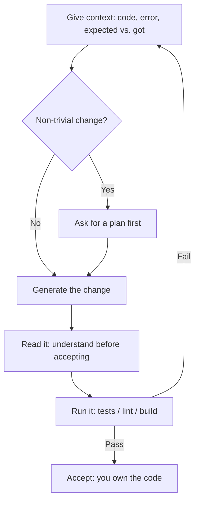

<LevelBadge level="all" />

<Callout type="objectives" items={["Verstehen, worin KI beim Programmieren wirklich stark ist — erklären, generieren, refaktorieren, debuggen, übersetzen, überprüfen", "Den goldenen Zyklus fahren: Kontext rein, planen, generieren, lesen, ausführen — und Fehlschläge als frischen Kontext zurückschleifen", "Zu Prompts greifen, die sich lohnen, statt zu vagen Einzeilern", "Die zwei harten Regeln verinnerlichen: durch Ausführen überprüfen und niemals Secrets einfügen"]} />

Ob du gerade das Programmieren lernst oder produktive Software auslieferst — KI verändert den Arbeitszyklus. Die Gewinner behandeln sie als schnellen, sachkundigen Partner — und **überprüfen alles, was sie produziert**.

## Worin sie großartig ist

- **Erklären** von unbekanntem Code oder Fehlern in einfacher Sprache.
- **Generieren** von Boilerplate, Tests und ersten Entwürfen von Funktionen.
- **Refaktorieren** für mehr Klarheit und **Debuggen** durch das Nachvollziehen eines Stack-Traces.
- **Übersetzen** zwischen Sprachen/Frameworks.
- **Überprüfen** eines Diffs auf Fehler und Code-Smells.

Für echte Codebasen mach das *in* deinem Repository mit [Claude Code](/docs/claude-code/what-is-claude-code), das Dateien lesen, Tests ausführen und mit deiner Zustimmung Änderungen vornehmen kann.

## Der goldene Zyklus

1. **Gib Kontext** — den relevanten Code, den Fehler, was du erwartet hast vs. was du bekommen hast. Vage rein, vage raus.
2. **Bitte um einen Plan** bei nicht-trivialen Änderungen, bevor bearbeitet wird ([Plan-Modus](/docs/claude-code/plan-mode)).
3. **Generiere** die Änderung.
4. **Lies sie** — verstehe sie, bevor du sie akzeptierst. Du bist für den Code verantwortlich.
5. **Führe sie aus** — Tests/Lint/Build. *Vertraue niemals einem „das funktioniert", ohne es auszuführen.*

Der Schritt, der gute von schlechten Ergebnissen trennt, ist der Pfeil zurück nach oben: Wenn ein Test fehlschlägt, flickst du nicht blind herum — du gibst den Fehler als frischen Kontext wieder ein.

## Prompts, die sich lohnen

<PromptCard title="Code erklären + Edge Cases erkennen">{`Explain what this function does and any edge cases it mishandles: {code}`}</PromptCard>

<PromptCard title="Tests generieren">{`Write tests for {function}. Cover the happy path and the edge cases. {code}`}</PromptCard>

<PromptCard title="Debuggen aus einem Stack-Trace">{`This throws {error}. Here's the code and stack trace. Find the root cause and propose a minimal fix. {context}`}</PromptCard>

## Harte Regeln

:::warning Überprüfen und schütze deine Secrets
- **Führe generierten Code aus und überprüfe ihn** — er kann auf subtile Weise falsch sein oder APIs erfinden, die nicht existieren.
- **Füge niemals Secrets/Schlüssel** in einen Prompt ein ([Datenschutz](/docs/foundations/privacy)).
- Für agentisches/automatisiertes Programmieren schränke die [Berechtigungen](/docs/claude-code/permissions) ein und lies [Agenten absichern](/docs/security/securing-agents).
:::

<Quiz title="Prüfe dich selbst" questions={[{q: "Was trennt im goldenen Zyklus die guten von den schlechten KI-Coding-Ergebnissen am stärksten?", options: ["Immer das größte verfügbare Modell verwenden", "Der Pfeil zurück nach oben: die Ausgabe eines fehlgeschlagenen Tests als frischen Kontext zurückgeben, statt blind zu flicken", "Die erste Generierung akzeptieren, um Zeit zu sparen"], answer: 1, explain: "Der Zyklus ist die Methode. Wenn ein Test fehlschlägt, rätst du keine Korrektur — du gibst den Fehler als neuen Kontext zurück, damit der nächste Versuch auf dem tatsächlichen Problem gründet."}, {q: "Warum den generierten Code lesen, bevor du ihn akzeptierst?", options: ["Das Lesen löst den Test-Runner aus", "Er kann subtil falsch sein oder APIs erfinden, die nicht existieren — und die Verantwortung für den Code liegt so oder so bei dir", "Das SDK weigert sich, Code auszuführen, den du nicht geöffnet hast"], answer: 1, explain: "KI-Ausgaben wirken selbstsicher, auch wenn sie falsch sind, und rufen gelegentlich Funktionen auf, die es nicht gibt. Das Lesen ist der Weg, das zu erkennen, bevor es ausgeliefert wird — und die Verantwortung für den Code trägst ohnehin du."}, {q: "Was von diesem sollte niemals in einen Prompt gelangen?", options: ["Die Fehlermeldung und der Stack-Trace", "Secrets oder API-Schlüssel", "Was du erwartet hast versus was tatsächlich passiert ist"], answer: 1, explain: "Fehler, Stack-Traces und Erwartet-vs-Tatsächlich sind genau der Kontext, der die Ergebnisse verbessert. Secrets und Schlüssel sind das eine, was draußen bleiben muss — fügst du sie ein, hast du sie geleakt."}]} />

<Callout type="takeaways" items={["Behandle KI als schnellen, sachkundigen Partner — und überprüfe alles, was sie produziert, indem du es tatsächlich ausführst", "Kontext rein, Qualität raus: liefere den Code, den Fehler und Erwartet-vs-Tatsächlich, niemals eine vage Bitte", "Bitte vor nicht-trivialen Änderungen um einen Plan, damit du den Ansatz prüfst, bevor Code sich ändert", "Lies generierten Code, bevor du ihn akzeptierst — er kann subtil falsch sein oder APIs erfinden, die nicht existieren", "Füge niemals Secrets oder Schlüssel in einen Prompt ein und sperre Berechtigungen zu, bevor ein Agent auf eigene Faust programmiert"]} />

## Weiter

- [Was Claude Code ist](/docs/claude-code/what-is-claude-code)
- [Claude Code für ein echtes Repository anpassen](/docs/walkthroughs/customize-claude-code)
- [Dein erster API-Aufruf](/docs/api/first-call)
