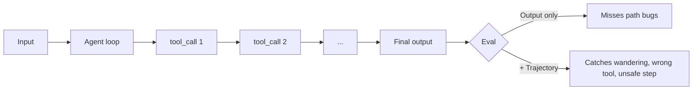

<LevelBadge level="advanced" />

<VerifyNote lastVerified="2026-07-24" source="https://platform.claude.com/docs/en/test-and-evaluate/develop-tests">
Der Evaluationsleitfaden von Anthropic ist die Quelle der Wahrheit für die Methodik (SMART-Kriterien, Exact-Match, LLM-bewertete Likert-/Binärskalen). Die Bewertung von Agenten-Trajektorien ist eine junge Disziplin — behandle Framework-Namen als illustrativ und überprüfe APIs in der jeweiligen Anbieter-Dokumentation.
</VerifyNote>

<Callout type="objectives" items={["Verstehen, warum Agenten-Evals sich von Prompt-Evals unterscheiden — die Trajektorie zählt, nicht nur die finale Antwort", "Ein Golden Set aus 20–100 realen Fällen mit klaren Bestehenskriterien aufbauen", "Vier Ebenen bewerten: Tool-Call-Korrektheit, Trajektorienqualität, Aufgabenerfolg, Produktions-Drift", "LLM-as-Judge sicher einsetzen: erst Rubrik, gegen Menschen kalibrieren, Urteile stichprobenartig prüfen", "Eine Eval ausliefern, die in CI läuft und eine schlechte Änderung stoppt, bevor sie Nutzer erreicht"]} />

Eine **Agenten-Eval** beantwortet eine schwierigere Frage als "hat der Prompt die richtigen Wörter zurückgegeben?" Sie fragt: *hat ein Modell, das in einer Schleife läuft, die richtigen Tools in der richtigen Reihenfolge mit den richtigen Argumenten gewählt, das richtige Ergebnis erreicht — und dabei Budget- und Sicherheitsgrenzen eingehalten?*

Überspringe diesen Schritt und du lieferst einen "hilfreichen" Agenten aus, der jedes Mal still regressiert, wenn du am System-Prompt drehst.

## Warum Agenten eigene Evals brauchen

Eine Single-Prompt-Eval bewertet eine Eingabe → eine Ausgabe. Ein Agent erzeugt eine **Trajektorie**: eine Kette aus Reasoning, Tool-Aufrufen, Zwischenbeobachtungen und Überarbeitungen über viele Turns hinweg. Zwei Fehlerarten machen das schwierig:

- **Richtige Antwort, falscher Pfad.** Der Agent stolpert durch verschwenderische Schleifen, unsichere Aktionen oder Zufallstreffer zur richtigen Ausgabe. Evals, die nur die finale Antwort prüfen, markieren das als Pass; die Produktion nicht.
- **Falsche Antwort, plausibler Pfad.** Jeder Schritt sieht isoliert vernünftig aus, aber der Agent hat ein Tool missbraucht, eine Randbedingung ignoriert oder ein Zwischen-Faktum halluziniert. Du musst das Trace anschauen, nicht nur die Antwort.



## Die vier Eval-Ebenen

Schichte sie günstig-zuerst, damit eine schlechte Änderung schnell scheitert, ohne auf teure Grader zu warten.

<Steps items={[
  {title: "Ebene 1 — Tool-Call-Korrektheit (deterministisch)", body: "Für jeden erwarteten Schritt prüfen: stimmt der Tool-Name, sind die erforderlichen Parameter vorhanden, validieren die Typen? Reiner Code, Millisekunden, kein Modell nötig. Fängt 'hat search aufgerufen, obwohl write_file dran gewesen wäre' ab, bevor irgendetwas anderes läuft."},
  {title: "Ebene 2 — Trajektorienqualität (Rubrik + LLM-Judge)", body: "Bewerte das gesamte Trace: hat der Agent einen sinnvollen Weg genommen, oder ist er umhergewandert, in Schleifen gelandet oder zurückgesprungen? Anzahl der Schritte vs. Minimum, redundante Aufrufe, Retries nach Tool-Fehlern, ob er gestoppt hat, als er fertig war. Nutze hier einen LLM-Judge mit expliziter Rubrik."},
  {title: "Ebene 3 — Aufgabenerfolg (End-to-End)", body: "Wurde das Ziel erreicht? Deterministisch wo möglich (Schema gültig, Datei geschrieben, Test besteht), LLM-bewertet wo unscharf (Zusammenfassung treu, Antwort hilfreich). Das ist deine Headline-Zahl."},
  {title: "Ebene 4 — Produktions-Drift & Sicherheit", body: "In der Produktion echte Traces sampeln und einen Ausschnitt nachbewerten. Beobachte die Interventionsrate (wie oft musste ein Mensch eingreifen), die Refusal-Rate und die Kosten pro erfolgreicher Aufgabe. Verschieben sich diese, hat sich dein Modell, dein Tool oder dein Input unter dir verändert."}
]} />

## Metriken, die Wert vorhersagen

Nicht jede Metrik gehört aufs Dashboard. Diese fünf treiben 2026 die Ausliefer-Entscheidungen:

| Metrik | Was sie misst | Warum sie zählt |
|---|---|---|
| **Aufgabenerfolgsrate** | % der Golden-Set-Fälle, die der Agent korrekt abschließt | Die Headline. Alles andere ist Diagnostik. |
| **Kosten pro erfolgreicher Aufgabe** | $ / bestandener Fall (Tokens rein + raus, Tool-Kosten) | Erfolg zum 10-fachen Preis ist eine Regression. |
| **Latenz (p50 / p95)** | Wanduhr-Zeit pro Aufgabe, inklusive Tail | p95 ist, was echte Nutzer spüren — Durchschnitte lügen. |
| **Tool-Call-Genauigkeit** | % der erwarteten Tool-Aufrufe mit korrektem Namen + Args | Sagt Trajektorienqualität voraus; günstig zu berechnen. |
| **Interventionsrate** | % der Aufgaben, bei denen ein Mensch in der Produktion übernehmen musste | Die Autonomie-Zahl. Steigend = Vertrauen sinkt. |

Verfolge sie zusammen — eine, die sich ohne die anderen bewegt, ist meist ein Frühsignal, kein Rauschen.

## Das Golden Set aufbauen

<Steps items={[
  {title: "Reale Eingaben minen", body: "Ziehe 20–100 Aufgaben aus tatsächlicher Nutzung (Logs, Support-Tickets, Nutzeranfragen). Decke den häufigen einfachen Pfad, die knifflige Mitte und die Edge Cases ab, die dich schon einmal gebissen haben."},
  {title: "Bestehenskriterien pro Fall schreiben", body: "Für jeden: Wie sieht 'fertig' aus? Exakte erwartete Ausgabe, geforderte Fakten, gültiges JSON-Schema, Dateien, die existieren müssen, oder eine Rubrik für unscharfe Fälle. Kannst du das Kriterium nicht formulieren, ist der Fall unbrauchbar — streiche oder präzisiere ihn."},
  {title: "Die ideale Trajektorie annotieren", body: "Skizziere für einen Teilbereich die Tool-Sequenz, die ein guter Agent nehmen würde. Genau dagegen prüft Ebene 1."},
  {title: "Einfrieren, versionieren", body: "Commite das Set in dein Repo. Bearbeite nie einen Fall an Ort und Stelle — lege v2 neben v1, damit die Score-Historie vergleichbar bleibt."},
  {title: "Aus Fehlern wachsen lassen", body: "Jeder Prod-Bug wird zu einem neuen Eval-Fall, bevor du ihn behebst. So bleibt das Set vorhersagekräftig, statt zu verfallen."}
]} />

## LLM-as-Judge — günstig, schnell, aber kalibrieren

Unscharfe Ausgaben von Hand zu bewerten skaliert nicht. Ein fähiges Modell, das gegen eine explizite Rubrik liest, schon — Anthropics eigener [Eval-Methodik-Leitfaden](https://platform.claude.com/docs/en/test-and-evaluate/develop-tests) empfiehlt dieses Muster für Ton, Treue, Hilfsbereitschaft und Sicherheit.

Judges haben gut dokumentierte Biases: Sie bevorzugen längere Antworten, die erste gezeigte Option und Ausgaben, die ihre eigene Ausdrucksweise widerspiegeln. Drei Gewohnheiten halten sie ehrlich:

- **Rubrik, keine Bauchgefühle.** "Bewerte Hilfsbereitschaft 1–5" ist nutzlos. Verankere jeden Punkt auf der Skala an beobachtbarem Verhalten.
- **Kalibriere gegen ein von Menschen gelabeltes Sample.** Lass Menschen 30–50 Fälle bewerten; miss die Judge-vs-Mensch-Übereinstimmung (Ziel: Cohens κ ≥ 0.6). Weicht er ab, verschärfe die Rubrik.
- **Nutze ein anderes Modell als Judge.** Mit demselben Modell zu bewerten, das die Ausgabe erzeugt hat, verzerrt in beide Richtungen.
- **Prüfe Urteile wöchentlich stichprobenartig.** Lies 10 zufällige Judge-Scores und deren Begründungen. Das ist der günstigste Weg, Drift zu erkennen.

<PromptCard title="LLM-as-Judge-Rubrik-Vorlage">{`You are grading an AI assistant's response against a rubric. Be strict. Cite exact evidence from the response.

<task>{task}</task>
<response>{response}</response>

Rubric (rate 1–5 per dimension):
- Task completion: 1 = ignored task; 3 = partial; 5 = fully done, no gaps.
- Faithfulness: 1 = contains false claims; 3 = mostly grounded, one soft claim; 5 = every claim traceable to input/tools.
- Efficiency: 1 = wandered/looped; 3 = extra steps; 5 = minimum viable path.

Output JSON only:
{"task_completion": N, "faithfulness": N, "efficiency": N, "evidence": "<quote>", "verdict": "pass"|"fail"}`}</PromptCard>

<PromptCard title="Trajektorien-Review-Prompt (Ebene 2)">{`You are auditing an AI agent's tool-call trajectory. The goal was: {goal}
Expected minimum steps: {n_min}

<trajectory>
{list of tool_name(args) -> result, in order}
</trajectory>

Answer in JSON:
{"steps_taken": N, "wasted_steps": N, "wrong_tool_calls": [<indices>], "unsafe_actions": [<indices>], "verdict": "pass"|"fail", "reason": "<one sentence>"}`}</PromptCard>

<PromptCard title="Adversarialer Fallgenerator (Set wachsen lassen)">{`Generate 5 new eval cases that are likely to break an agent whose current failures cluster around: {failure_pattern}.

For each case give: input, expected output OR pass criterion, ideal tool sequence, and why this case is hard.

Return YAML.`}</PromptCard>

## CI-Gate: die schlechte Änderung stoppen, bevor sie ausgeliefert wird

Die Eval zahlt sich erst aus, wenn sie Regressionen automatisch blockiert. Verdrahte sie in CI als Check bei jeder Prompt-/Modell-/Tool-Änderung:

```python
# tests/eval_gate.py — runs on every PR
import json, sys
from anthropic import Anthropic
from my_agent import run_agent

client = Anthropic()
golden = json.load(open("evals/golden.v3.json"))

results = []
for case in golden:
    trace = run_agent(case["input"])
    layer1 = tool_calls_match(trace, case["expected_tools"])   # deterministic
    layer3 = judge(client, case, trace.final_output)           # LLM rubric
    results.append({"id": case["id"], "layer1": layer1, "layer3": layer3["verdict"]})

pass_rate = sum(r["layer3"] == "pass" for r in results) / len(results)
tool_acc  = sum(r["layer1"] for r in results) / len(results)

# Gates — tighten over time
assert pass_rate >= 0.85, f"Task success dropped to {pass_rate:.0%}"
assert tool_acc  >= 0.90, f"Tool-call accuracy dropped to {tool_acc:.0%}"
print(f"PASS: task={pass_rate:.0%} tools={tool_acc:.0%}")
```

Speichere die Scores pro Lauf, damit du den Trend charten kannst. Ein Abfall von 3+ Punkten zwischen Merges ist eine echte Regression, kein Rauschen.

<Callout type="warning" title="Anti-Patterns, die Evals unterliefern lassen" items={["Nur die finale Antwort bewerten — verpasst jeden Trajektorien-Bug. Bewerte auch Ebenen 1 und 2.", "Statisches Golden Set — wächst es nicht mit jedem Prod-Fehler mit, sagt es Prod nicht mehr voraus. Reserviere monatlich Zeit.", "Gleiches Modell als Agent und Judge — Bias in beide Richtungen. Rotiere für die Bewertung zu einem anderen Modell.", "Keine Kosten oder Latenz im Gate — ein Prompt-Tweak, der 8 Tool-Aufrufe hinzufügt, kann die Eval 'bestehen' und dabei die Rechnung verzehnfachen.", "Nur-Bauchgefühl-Scoring — 'fühlt sich besser an' ist keine Metrik. Wenn du zwei Zahlen nicht diffen kannst, kannst du nicht souverän ausliefern."]} />

<Callout type="takeaways" items={["Agenten produzieren Trajektorien, nicht Antworten — bewerte den Weg, nicht nur das Ergebnis", "Schichte günstig-zuerst: Tool-Call-Korrektheit → Trajektorienqualität → Aufgabenerfolg → Produktions-Drift", "Die fünf Metriken, die Ausliefer-Entscheidungen tragen: Aufgabenerfolgsrate, Kosten pro Erfolg, p50/p95-Latenz, Tool-Call-Genauigkeit, Interventionsrate", "LLM-as-Judge skaliert, aber nur mit expliziter Rubrik, einem anderen Modell und Kalibrierung gegen menschliche Labels", "Ein Golden Set, das nicht aus Prod-Fehlern wächst, sagt Prod nicht mehr voraus — lass es monatlich wachsen", "Verdrahte die Eval als hartes Gate in CI — der Check, der eine Regression fängt, bevor Nutzer es tun"]} />

## Prüfe dich selbst

<Quiz title="Prüfe dich selbst" questions={[
  {
    q: "Warum brauchen Agenten Trajektorien-Evals und nicht nur Final-Antwort-Evals?",
    options: [
      "Final-Antwort-Evals sind zu langsam, um in CI zu laufen",
      "Ein Agent kann via Umherwandern oder unsicherer Schritte zur richtigen Antwort kommen (richtige Antwort, falscher Pfad) — und einen plausibel aussehenden Pfad zu einer falschen Antwort produzieren",
      "Trajektorien-Evals sind die einzige Art, die LLM-as-Judge unterstützt",
      "Final-Antwort-Evals funktionieren nur für Klassifikationsaufgaben"
    ],
    answer: 1,
    explain: "Zwei Fehlermuster verstecken sich vor reinen Output-Scores: richtige Antwort über einen schlechten Pfad (als Pass markiert, wird in Prod regressieren) und falsche Antwort über einen plausiblen Pfad (scheitert lautlos). Du musst die Trajektorie ebenso wie das Ergebnis bewerten."
  },
  {
    q: "Du schichtest deine Evals. Welche Reihenfolge ist günstig-zu-teuer und korrekt?",
    options: [
      "LLM-bewerteter Aufgabenerfolg → deterministische Tool-Call-Checks → Produktions-Drift → Trajektorien-Rubrik",
      "Deterministische Tool-Call-Korrektheit → Trajektorienqualität (LLM-Judge) → Aufgabenerfolg → Produktions-Drift",
      "Produktions-Drift → Aufgabenerfolg → Trajektorien-Rubrik → Tool-Call-Checks",
      "Trajektorien-Rubrik → Aufgabenerfolg → Tool-Call-Checks → Produktions-Drift"
    ],
    answer: 1,
    explain: "Ebene 1 (deterministische Tool-Call-Checks) läuft in Millisekunden ohne Modell und stoppt schlechte Änderungen schnell. Dann LLM-bewertete Trajektorien- und Aufgabenerfolg-Ebenen, dann Produktions-Drift-Monitoring."
  },
  {
    q: "Welches Paar Gewohnheiten hält LLM-as-Judge tatsächlich langfristig vertrauenswürdig?",
    options: [
      "Mit demselben Modell wie der Agent bewerten und die Rubrik bei jedem Lauf neu schreiben",
      "Eine Rubrik mit beobachtbaren Ankern verwenden und den Judge gegen ein von Menschen gelabeltes Sample kalibrieren",
      "Bauchgefühl-Prompts bevorzugen, um nicht zu überspezifizieren, und Urteile nie stichprobenartig prüfen",
      "Immer das größte verfügbare Modell als Judge nutzen, keine Kalibrierung nötig"
    ],
    answer: 1,
    explain: "Verankerte Rubriken nehmen dem Judge die Freiheit, Kriterien zu erfinden, und menschliche Kalibrierung (Cohens κ ≥ 0.6 ist ein üblicher Zielwert) beweist, dass der Judge mit deiner Grundwahrheit übereinstimmt. Ein anderes Modell zu nutzen und wöchentlich stichprobenartig zu prüfen, vervollständigt das Bild."
  },
  {
    q: "Dein CI-Gate besteht bei der Aufgabenerfolgsrate, aber Latenz und Kosten pro Aufgabe haben sich verdoppelt. Was ist die richtige Entscheidung?",
    options: [
      "Auslieferung — Aufgabenerfolg ist die Headline-Metrik",
      "Gate scheitern lassen: die fünf Ausliefer-Metriken bewegen sich zusammen, und eine 2×-Änderung bei Kosten/Latenz ist eine Regression, auch wenn die Pass-Rate hielt",
      "Eval neu laufen lassen — die Zahlen müssen Rauschen sein",
      "Die Pass-Rate-Schwelle lockern, um die Auslieferung zu rechtfertigen"
    ],
    answer: 1,
    explain: "Die fünf Metriken tragen gemeinsam Ausliefer-Entscheidungen. Ein Prompt-Tweak, der die Pass-Rate flach hält, während er Kosten oder Latenz verdoppelt, ist genau die Art Fehler, für die das Gate existiert — Rechnungs- und UX-Regressionen treffen Nutzer genauso hart wie Genauigkeitseinbrüche."
  }
]} />

<Flashcards cards={[
  {front: "Trajektorie (in Agenten-Evals)", back: "Die vollständige, geordnete Kette aus Tool-Aufrufen, Argumenten, Beobachtungen und Reasoning-Schritten, die ein Agent über eine Aufgabe hinweg unternimmt — das, was du zusätzlich zur finalen Ausgabe bewertest."},
  {front: "Golden Set", back: "Eine eingefrorene, versionierte Sammlung von 20–100 realen Aufgaben mit expliziten Bestehenskriterien (und für einen Teil idealen Trajektorien), gegen die jede Prompt-/Modell-/Tool-Änderung bewertet wird."},
  {front: "Tool-Call-Genauigkeit", back: "% der erwarteten Tool-Aufrufe, bei denen der Name stimmt und die erforderlichen Parameter validieren. Deterministisch, günstig und ein starker Frühindikator für Trajektorienqualität."},
  {front: "LLM-as-Judge", back: "Bewertungsmuster, bei dem ein (anderes) fähiges Modell Ausgaben gegen eine explizite Rubrik bewertet. Schnell und skalierbar, muss aber gegen menschliche Labels kalibriert werden, um vertrauenswürdig zu sein."},
  {front: "Interventionsrate", back: "% der Produktionsaufgaben, bei denen ein Mensch übernehmen musste. Steigende Interventionsrate = sinkende Autonomie, selbst wenn die Offline-Scores gut aussehen."},
  {front: "Kosten pro erfolgreicher Aufgabe", back: "Gesamt-Token- + Tool-Kosten geteilt durch die Anzahl der Aufgaben, die der Agent korrekt abgeschlossen hat. Fängt Regressionen ab, bei denen 'funktioniert noch' das '10× teurer' verbirgt."},
  {front: "CI-Eval-Gate", back: "Ein automatisierter Check bei jedem PR, der das Golden Set ausführt und den Build unterhalb von Schwellen (z. B. Pass-Rate < 85%, Tool-Genauigkeit < 90%) hart scheitern lässt. Blockiert stille Regressionen vor dem Merge."}
]} />

## Weiter

- [Agenten auf der API bauen](/docs/api/building-agents) · [Evals (Grundlagen)](/docs/foundations/evals)
- [Agenten & Tools absichern](/docs/security/securing-agents) · [Halluzinationen und wie man sie reduziert](/docs/foundations/hallucinations)
- [Headless & Agent SDK](/docs/claude-code/headless-and-agent-sdk) · [Managed Agents](/docs/api/managed-agents)
