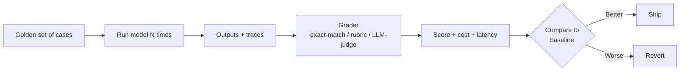

<LevelBadge level="intermediate" />

<VerifyNote lastVerified="2026-07-25" source="https://platform.claude.com/docs/en/test-and-evaluate/develop-tests">
Die Methodik (testgetriebenes Prompt-/Agent-Design, SMART-Kriterien, Exact-Match- vs. LLM-bewertete Rubrik) folgt Anthropics offiziellem „Develop tests"-Guide. Die Konzepte hier sind modell-agnostisch und gelten für OpenAI, Gemini und Open-Weight-Modelle gleichermaßen.
</VerifyNote>

<Callout type="objectives" items={[
  "Verstehen, was ein Eval eigentlich ist — ein wiederholbarer Test, der Modellausgabe gegen eine feste Rubrik bewertet",
  "Wissen, wann ein Vibe-Check reicht und wann nur ein Eval hilft",
  "Die vier Eval-Typen erkennen, die du tatsächlich nutzt, und wann jeder greift",
  "Ein Minimum-Viable-Eval bauen — 20 Fälle, eine Rubrik, ein Skript — an einem Nachmittag",
  "Die sechs Fallen vermeiden, die Evals dich anlügen lassen"
]} />

Wenn du von dieser Seite eine einzige Gewohnheit mitnimmst, dann diese. Prompt-Handwerk, Modellwahl, Tool-Verdrahtung — nichts davon summiert sich, bis du *messen* kannst, ob eine Änderung das System besser oder schlechter gemacht hat. Sobald du das kannst, wird jede zukünftige Entscheidung — Sonnet 5 oder Fable 5 wählen, ein Tool ergänzen, einen System-Prompt straffen, das Thinking-Budget erhöhen — zu einem Fünf-Minuten-Check statt zu einer Woche Streit.

Evals ersetzen „fühlt sich smarter an" durch eine Zahl, die Widerspruch überlebt.

## Was ein Eval eigentlich ist

Ein **Eval** ist drei Dinge zusammengeschraubt:

1. Ein **fester Satz Eingaben** — meist 20 bis wenige hundert Fälle aus echter Nutzung.
2. Eine **Rubrik oder Ground Truth** — was heißt für jeden Fall „korrekt"?
3. Eine **Scoring-Schleife** — ein Skript, das das Modell auf jedem Fall laufen lässt, die Ausgabe mit der Rubrik vergleicht und Pass/Fail (oder abgestuften Score) plus Kosten und Latenz meldet.

Alles andere — Dashboards, LLM-Judges, CI-Gates — ist optionales Gerüst um diesen Kern.

Diese Schleife bei jeder Änderung wiederholen. Das ist das ganze Spiel.

## Wann ein Vibe-Check reicht — und wann nicht

Nicht jeder Prompt braucht ein Eval. Nutze Urteilsvermögen.

| Situation | Vibe-Check OK | Eval bauen |
|---|---|---|
| Einmal-Skript für dich selbst | Ja | — |
| Ein Prompt für fünf Kollegen | Ja (leicht) | Wenn Zuverlässigkeit zählt |
| Alles Nutzergerichtete, egal wie klein | — | Ja |
| Alles Unbeaufsichtigt-Laufende (Agenten, Batches) | — | Ja |
| Jede Entscheidung, Modell oder Anbieter zu wechseln | — | Ja (sonst rätst du) |
| Alles, wo eine falsche Antwort Kosten hat (Geld, Sicherheit, Recht) | — | Ja (nicht verhandelbar) |

Faustregel: **Beim ersten Mal, wo du dich sagen hörst „fühlt sich die neue Version *besser* an?", stopp und bau das Eval.** Die nächsten zehn Änderungen bezahlen es.

## Die vier Eval-Arten, die du nutzen wirst

<Steps items={[
  {title: "Exact-Match / Struktur-Checks", body: "Die Ausgabe muss einem bestimmten String entsprechen, auf eine Regex passen, als gültiges JSON parsen oder ein Schema erfüllen. Billig, schnell, eindeutig. Nutze für Klassifikation, Extraktion, Code der kompilieren muss, Tool-Calls, strukturierte Ausgabe."},
  {title: "Rubrik-Bewertung (Mensch oder LLM-Judge)", body: "Die Ausgabe wird gegen eine explizite Rubrik bewertet — 'ist die Zusammenfassung quellentreu? J/N', 'ist der Ton angemessen? 1–5 mit Ankern'. Nutze für Schreiben, Zusammenfassungen, Erklärungen, überall wo Qualität unscharf ist."},
  {title: "Referenzbasierter Vergleich", body: "Vergleich mit einer bekannt guten Antwort per semantischer Ähnlichkeit, BLEU/ROUGE oder einem LLM, das gefragt wird 'sagt A dasselbe wie B?'. Nutze für Übersetzung, Paraphrase, retrieval-augmentierte Antworten."},
  {title: "Trajektorien- / Prozess-Eval", body: "Für Agenten: Hat er die richtigen Tools in sinnvoller Reihenfolge aufgerufen, ohne zu wandern oder unsichere Schritte? Bewerte den Trace, nicht nur die Endantwort. Siehe das agentenspezifische Playbook für die Mechanik."}
]} />

Echte Systeme mischen diese — ein JSON-Schema-Check gattet eine Rubrik-Bewertung, die eine Ende-zu-Ende-Trajektorien-Prüfung gattet. Billige Schichten scheitern schnell; teure Schichten laufen nur, wenn die billigen bestehen.

## Bau dein Minimum-Viable-Eval

Du kannst an einem Nachmittag ein funktionierendes Eval haben. Alles andere auf dieser Liste vorerst überspringen.

<Steps items={[
  {title: "20 echte Eingaben schnappen", body: "Aus Logs, Support-Tickets oder eigener Nutzung. Deck den häufigen leichten Pfad ab, die knifflige Mitte und zwei oder drei Fälle, die dich schon verbrannt haben. Zwanzig reichen, um eine echte Regression zu erkennen; Hunderte sind für später."},
  {title: "Pass-Kriterien pro Fall schreiben", body: "Ein Satz: 'Ausgabe muss die Bestellnummer des Kunden und einen Refund-Status pending/approved/denied enthalten' — oder 'Ausgabe muss gültiges JSON gemäß Schema X sein'. Wenn du das nicht schreiben kannst, ist der Fall nicht testbar — streichen oder klären."},
  {title: "Ein 50-Zeilen-Skript schreiben", body: "Pro Fall: Eingabe ans Modell schicken, Ausgabe und Token-Counts einfangen, Grader laufen lassen, Pass/Fail plus Kosten aufzeichnen. Eine Ergebnis-CSV reicht — du brauchst keine UI."},
  {title: "Baseline etablieren", body: "Den heutigen Prompt gegen den Satz laufen lassen. Score aufschreiben. Das ist deine Latte. Jede zukünftige Änderung wird daran gemessen."},
  {title: "Einen Workflow drauf gaten", body: "Skript in CI oder einen Pre-Deploy-Check verdrahten. Jede Änderung, die den Score senkt, lässt den Build scheitern. Jetzt verteidigt sich das Eval selbst — niemand muss dran denken, es zu laufen."}
]} />

Das war's. Alles danach — LLM-Judges, Kalibrierung, Dashboards, Kostentracking, Per-Metric-Slicing — amortisiert sich über ein Eval, das bereits existiert und bereits schlechte Änderungen blockt.

## Die sechs Fallen, die Evals lügen lassen

<PromptCard title="Falle 1 — Der Golden Set ist Fake">
Fälle vom Team erfunden, nicht aus echter Nutzung gezogen. Das Eval besteht; Nutzer treffen Eingaben, die das Eval nie sah.

**Fix:** Fälle aus echten Logs schürfen. Jeder Prod-Bug wird ein neuer Fall, *bevor* du ihn behebst.
</PromptCard>

<PromptCard title="Falle 2 — Die Rubrik ist Bauchgefühl">
„Bewerte Qualität 1–5" ohne Anker. Zwei Grader — Mensch oder LLM — sind sich massiv uneinig, und der Score springt beim Re-Run.

**Fix:** Jeden Punkt der Skala an beobachtbares Verhalten binden. „5 = jede Behauptung an die Quelle rückführbar; 3 = eine unbelegte Behauptung; 1 = drei oder mehr unbelegte Behauptungen."
</PromptCard>

<PromptCard title="Falle 3 — Der LLM-Judge ist nicht kalibriert">
Du vertraust einem Modell als Grader, weil es billig ist. Judges haben bekannte Biases: sie bevorzugen längere Antworten, erste Optionen und Ausgaben, die ihre eigene Phrasierung wiederholen.

**Fix:** Menschen 30–50 Fälle bewerten lassen. Judge-vs.-Mensch-Übereinstimmung messen (Cohens Kappa mindestens 0,6). Optionsreihenfolge randomisieren. Wöchentlich Verdicts stichprobenprüfen.
</PromptCard>

<PromptCard title="Falle 4 — Das Eval überfittet">
Du drehst am Prompt, bis der Score auf denselben 20 Fällen maxxt. Prod bricht ein.

**Fix:** In Dev- und Holdout-Set splitten. Während der Iteration nie auf Holdout-Scores schauen. Den Satz aus echten Fehlern wachsen lassen, nicht aus synthetischen Variationen.
</PromptCard>

<PromptCard title="Falle 5 — Eine Zahl, keine Kosten">
Der Score steigt; die Token-Rechnung verdoppelt sich. Oder die Latenz springt auf acht Sekunden. Du hast eine „Verbesserung ausgeliefert", die das Produkt regrediert hat.

**Fix:** Jeder Lauf meldet Score, Kosten pro Fall und p50/p95-Latenz zusammen. Eine Änderung ist nur „besser", wenn sie nicht still zwei der drei regrediert.
</PromptCard>

<PromptCard title="Falle 6 — Modellversions-Drift">
Du pinnst den Prompt, aber nicht das Modell. Der Anbieter rollt ein stilles Update aus; dein Score wandert.

**Fix:** Modellversion explizit pinnen (ein spezifisches datiertes Snapshot, kein floating Alias). Bei jedem Modell-Bump das Eval erneut laufen. Siehe [Modelle & Preise](/docs/whats-new/models-and-pricing) für die aktuell gepinnten Familien.
</PromptCard>

## Tools, die den Aufwand senken

Du brauchst keins davon zum Starten — ein Python-Skript und eine CSV genügen — aber sobald du ein funktionierendes Eval hast, sparen diese Zeit:

- **Anthropics Evaluation-Guide** — die kanonische Methodik, im Einklang mit [Develop your test cases](https://platform.claude.com/docs/en/test-and-evaluate/develop-tests). Hier anfangen, auch wenn du einen anderen Anbieter nutzt.
- **promptfoo** — YAML-definierte Eval-Suites, funktioniert über Anthropic, OpenAI, Google und Open-Modelle hinweg. Gut für Side-by-Side-Modellvergleich.
- **Braintrust / LangSmith / Humanloop** — gehostete Eval-Plattformen mit UI, Kostentracking und Dataset-Versionierung. Nützlich, sobald du hunderte Fälle pro Woche bewertest.
- **Eigene Skripte** — weiter die flexibelste Option, besonders wenn dein Grader deterministisch oder domänenspezifisch ist.

Was auch immer du wählst — die *Fälle* in deinem eigenen Repo halten, versioniert. Tooling ist austauschbar; ein kuratierter Golden Set ist das Asset.

## Cross-Model-Notiz

Ein einmal gebautes Eval schenkt dir **Modell-Portabilität gratis.** Dieselben 20 Fälle plus Grader plus Skript, die Claude Sonnet bewertet haben, bewerten auch Fable 5, GPT-5, Gemini 3.6 oder ein lokales Qwen — mit einer geänderten Zeile. Deshalb lebt jeder, der ernsthafte Modellauswahl betreibt, in seinem Eval, nicht in Benchmark-Ranglisten.

Öffentliche Benchmarks beantworten „welches Modell führt SWE-bench an?". Dein Eval beantwortet „welches Modell handhabt *meine* User-Tickets zu *meinem* Budget ohne Drift". Nur die zweite Frage rollt Produkt aus.

## Quiz — teste dich selbst

<Quiz questions={[
  {
    q: "Du willst wissen, ob ein neuer Prompt besser ist als der alte. Was ist das Minimum-Viable-Eval?",
    options: [
      "Drei Teamkollegen fragen 'fühlt sich das besser an?'",
      "20 echte Fälle, explizite Pass-Kriterien pro Fall, ein Skript, das beide Prompts laufen lässt und Pass-Rate + Kosten + Latenz meldet, Vergleich zur Baseline",
      "Beide Prompts auf einem Beispiel laufen lassen, an das du dich von letzter Woche erinnerst",
      "Beide ausliefern und A/B-Test auf Live-Nutzern"
    ],
    answer: 1,
    explain: "Bauchgefühl überlebt Widerspruch nicht, und A/B in Produktion ist teuer und langsam. Zwanzig kuratierte Fälle mit expliziter Rubrik schlagen alle drei."
  },
  {
    q: "Die Rubrik deines Teams sagt 'bewerte Hilfreichkeit 1–5'. Scores springen bei jedem Re-Run um plus/minus 1 Punkt. Was ist der Fix?",
    options: [
      "Dreimal laufen und mitteln",
      "Jeden Score an beobachtbares Verhalten verankern — '5 = jede Behauptung rückführbar; 3 = eine unbelegte Behauptung; 1 = drei oder mehr unbelegte Behauptungen'",
      "Auf ein größeres Judge-Modell wechseln",
      "Mehr Fälle hinzufügen"
    ],
    answer: 1,
    explain: "Bauchgefühl-Rubriken produzieren Bauchgefühl-Scores. Jeden Punkt zu verankern macht den Grader — Mensch oder LLM — reproduzierbar."
  },
  {
    q: "Der Eval-Score ist um 8 Punkte gestiegen. Sonst hat sich im Report nichts geändert. Ausliefern?",
    options: [
      "Ja — dafür ist das Eval da",
      "Nein — Kosten pro Fall und p50/p95-Latenz auch prüfen, bevor man das eine Verbesserung nennt",
      "Nein — auf ein menschliches Review warten",
      "Ja, aber nur in der EU-Region zuerst"
    ],
    answer: 1,
    explain: "Ein Qualitätsgewinn, der die Token-Rechnung verdoppelt oder p95-Latenz auf 8 Sekunden schiebt, ist in Produktion eine Regression. Score, Kosten und Latenz bewegen sich zusammen — sonst betrügst du dich selbst."
  }
]} />

## Die wichtigsten Erkenntnisse

<Callout type="takeaways" items={[
  "Ein Eval ist ein fester Satz Fälle + eine Rubrik + eine Scoring-Schleife — alles andere ist Gerüst",
  "Zwanzig echte Fälle mit klaren Pass-Kriterien schlagen zweihundert synthetische",
  "Score, Kosten und Latenz zusammen — einen auf Kosten der anderen zu verbessern ist eine Regression",
  "Rubriken an beobachtbares Verhalten verankern; LLM-Judges gegen Menschen kalibrieren",
  "Modellversionen pinnen; bei jedem Anbieter-Update erneut laufen — stille Drift ist real",
  "Ein gutes Eval ist portabel: es lässt dich Claude, GPT, Gemini und lokale Modelle auf DEINER Aufgabe vergleichen, nicht auf Benchmarks"
]} />

## Weiter

- Operator-Level-Agent-Evals mit Trajektorien-Scoring → [Evaluating Your AI Agent](/docs/playbooks/evaluating-agents)
- Die vier Level der Halluzination und wie man jede erkennt → [Halluzinationen](/docs/foundations/hallucinations)
- Modelle nach Daten wählen, nicht nach Bauchgefühl → [Choosing a Model](/docs/models/choosing-a-model)
- Kosten pro erfolgreicher Aufgabe, kontrolliert → [Cut Your Token Usage](/docs/power-user/token-economy)
