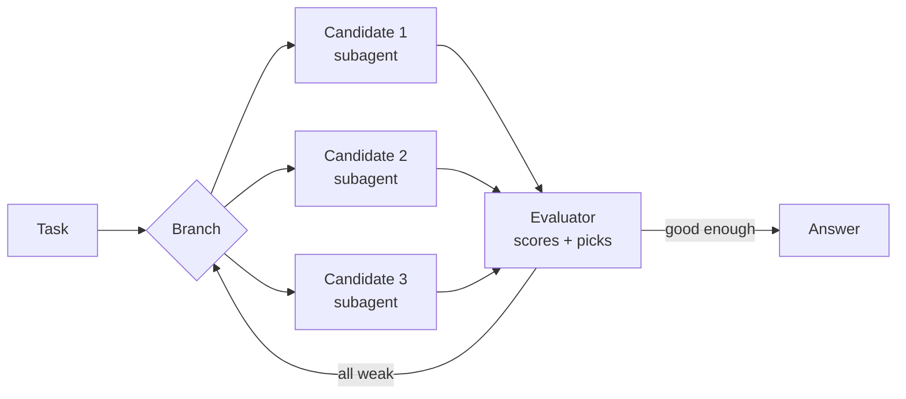
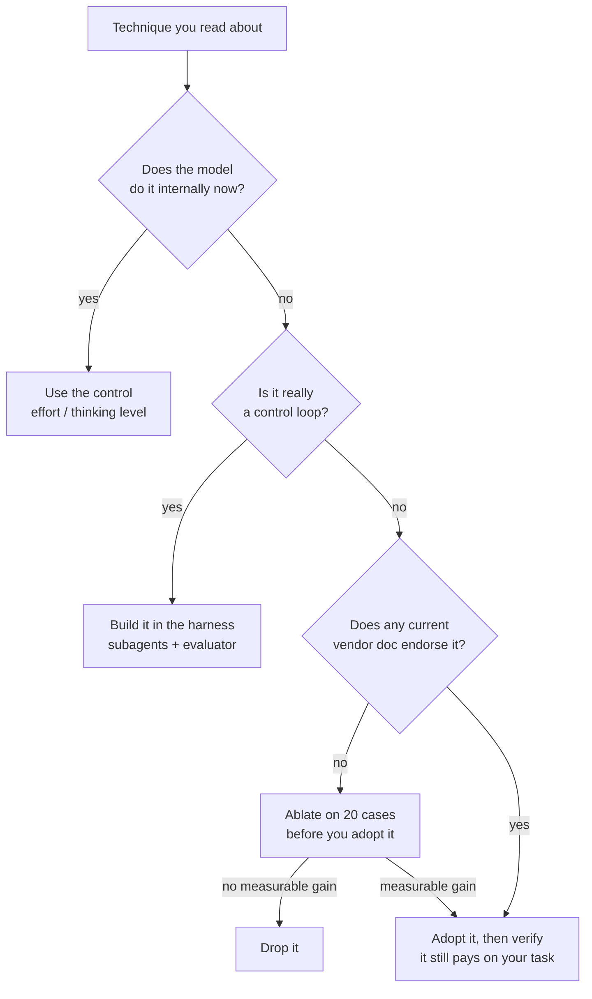

<LevelBadge level="intermediate" />

<Callout type="objectives" items={[
  "Was jede berühmte Prompting-Technik tatsächlich war, in einem Satz",
  "Welche das Modell inzwischen für dich übernimmt und welche der Harness übernimmt",
  "Die drei Techniken, von denen offizielle Hersteller-Leitfäden heute aktiv abraten",
  "Wo die Hersteller offen widersprechen – und wie du es für deine eigene Arbeitslast entscheidest",
]} />

Öffne fast einen beliebigen Prompt-Engineering-Leitfaden und du erhältst eine Liste benannter Techniken: Chain-of-Thought, Tree of Thoughts, Self-Consistency, ReAct, Reflexion, Least-to-Most. Fast alle wurden zwischen 2022 und 2023 veröffentlicht, für Modelle, die **nicht schlussfolgern konnten, wenn man sie nicht dazu zwang**.

Diese Einschränkung ist weg. Heutige Frontier-Modelle schlussfolgern intern, bevor sie antworten, und Agenten-Harnesses durchlaufen Werkzeuge von sich aus in Schleifen. Die meisten dieser Techniken wurden also nicht widerlegt – sie wurden **absorbiert**, entweder in das Modell oder in die Harness. Ein paar sind inzwischen schlicht Fußangeln.

Diese Seite nennt jede einzelne, sagt, wofür sie gedacht war, und gibt ihr eine Bewertung.

## Die eine Sache, die sich geändert hat

Jede Bewertung unten lässt sich auf dieselbe Verschiebung zurückführen: Das Schlussfolgern ist aus deinem Prompt in den eigenen Forward-Pass des Modells gewandert. Alle drei großen Hersteller sagen das inzwischen in ihren eigenen Dokumentationen.

| Hersteller | Was ihr aktueller Leitfaden sagt |
|---|---|
| **Anthropic** | Extended Thinking „automatisiert strukturiertes Schlussfolgern“, und wo es verfügbar ist, ist es „im Allgemeinen vorzuziehen gegenüber manuellem Chain-of-Thought-Prompting“. |
| **OpenAI** | „Vermeide Chain-of-Thought-Prompts: Da diese Modelle intern schlussfolgern, ist es unnötig, sie aufzufordern, ‚Schritt für Schritt zu denken‘ oder ‚ihre Begründung zu erklären‘.“ |
| **Google** | Wenn du „komplexes Prompt Engineering (wie Chain-of-Thought) verwendet hast, um Gemini 2.5 zum Schlussfolgern zu zwingen“, nutze stattdessen die Thinking-Stufe des Modells. |

<VerifyNote lastVerified="2026-10-03" source="https://claude.com/blog/best-practices-for-prompt-engineering">
Zitate überprüft gegen Anthropics [Best Practices für Prompt Engineering 2026](https://claude.com/blog/best-practices-for-prompt-engineering), [OpenAIs Best Practices für Reasoning](https://developers.openai.com/api/docs/guides/reasoning-best-practices) und [Googles Gemini-3-Entwicklerleitfaden](https://ai.google.dev/gemini-api/docs/gemini-3). Hersteller-Leitfäden werden unabhängig voneinander und häufig überarbeitet – lies die Quelle erneut, bevor du auf ihrer Grundlage einen Produktions-Prompt umschreibst.
</VerifyNote>

## Die Bewertungstabelle

| Technik | Was sie war | Bewertung |
|---|---|---|
| **Klare, spezifische Anweisung** | Ziel, Zielgruppe, Format, Einschränkungen nennen | ✅ **Noch immer das ganze Spiel** |
| **Ausgabevertrag** | „Antworte nur mit dem JSON“ / exakte Form | ✅ **Noch immer essenziell** |
| **Prompt Chaining / Zerlegung** | Eine schwere Aufgabe auf mehrere Aufrufe aufteilen | ✅ **Noch immer essenziell** |
| **Erlaubnis zu passen** | „Sag, dass du es nicht weißt, statt zu raten“ | ✅ **Noch immer essenziell** |
| **Kontext + Motivation** | Erklären, *warum* eine Einschränkung wichtig ist | ✅ **Hat an Wert gewonnen** |
| **Meta-Prompting / APE** | Ein Modell den Prompt schreiben oder verbessern lassen | ✅ **Unterschätzt, lebendig** |
| **Chain-of-Thought** | „Denk Schritt für Schritt“ vor dem Antworten | 🔁 **Ins Modell gewandert** |
| **Least-to-Most** | Leichte Teilprobleme zuerst lösen, der Reihe nach | 🔁 **Ins Modell gewandert** |
| **ReAct** | `Thought:` / `Action:` / `Observation:` verschränken | 🔁 **In die Harness gewandert** |
| **Reflexion** | Selbstkritik, dann erneut versuchen und die Lektion behalten | 🔁 **In die Memory-Ebene gewandert** |
| **Tree of Thoughts** | Über Teilantworten verzweigen, bewerten, zurücksetzen | 🔁 **In die Harness gewandert** |
| **Few-Shot-Beispiele** | 3–5 durchgearbeitete Beispiele zeigen | ⚠️ **Umstritten – Hersteller widersprechen sich** |
| **Rolle / Persona** | „Du bist ein Steueranwalt mit 20 Jahren …“ | ⚠️ **Abgewertet, behalte die dünne Variante** |
| **Self-Consistency** | N Antworten ziehen, Mehrheitsentscheid | ⚠️ **Situativ, zahle N× dafür** |
| **Schweres XML-Gerüst** | Jeden Teil jedes Prompts taggen | ⚠️ **Jetzt optional, nicht Standard** |
| **Graph of Thoughts** | Beliebiger Graph aus Schlussfolgerungsschritten | 🧪 **Forschung, kein Hersteller empfiehlt es** |
| **Temperature-Tuning** | Kreativität hoch- oder herunterdrehen | ⛔ **Auf aktuellen Modellen klar abgelehnt** |
| **Emotionaler Druck / Trinkgeld** | „Das ist sehr wichtig für meine Karriere“ | ⛔ **Kein aktueller Hersteller-Leitfaden befürwortet es** |
| **Anweisungswiederholung / GROSSBUCHSTABEN** | Sag es dreimal, laut | ⛔ **Ausgedient** |

Der Rest dieser Seite erklärt die interessanten Zeilen.

## Ins Modell gewandert

### Chain-of-Thought

[Wei et al. (2022)](https://arxiv.org/abs/2201.11903) zeigten, dass ein Modell, das zur Ausgabe von Zwischenschritten aufgefordert wird, weitaus mehr Mathematik- und Logikaufgaben löste. [Kojima et al. (2022)](https://arxiv.org/abs/2205.11916) fanden dann heraus, dass man das meiste davon mit fünf Wörtern auslösen konnte – „Let's think step by step.“ Vier Jahre lang war das der einzelne Trick mit der größten Hebelwirkung im Prompting.

Frontier-Modelle tun das inzwischen unaufgefordert und geben dafür ein *Budget* aus, das du über Effort oder Thinking-Stufe steuerst, nicht über Sätze in deinem Prompt. Siehe [Thinking & Effort](/docs/api/thinking-and-effort) und [Effort-Tuning](/docs/api/effort-tuning).

Die Anweisung ist also nicht mehr gratis. Sie kostet Tokens, sie fügt eine Anweisung hinzu, die das Modell neben der eigentlichen befolgen muss, und auf einem Thinking-Modell kann sie das Schlussfolgern *in die sichtbare Antwort* drücken – genau dorthin, wo du es nicht wolltest.

<PromptCard title="Gewohnheit von 2023 – übertrag das nicht in die Gegenwart">{`You are an expert mathematician with 20 years of experience. This is very
important to my career, so please take a deep breath and work through this
step by step, explaining your reasoning carefully before giving the final
answer. Let's think step by step.

Are there infinitely many primes p with p mod 4 == 3?`}</PromptCard>

<PromptCard title="Version 2026 – dieselbe Frage, nichts verschwendet">{`Are there infinitely many primes p with p mod 4 == 3?

Give the proof sketch, then the one-line answer. If the result is open, say so.`}</PromptCard>

Der zweite Prompt ist kürzer, enthält keine Anweisung, die das Modell in Einklang bringen muss, und gibt sein Budget für den Beweis aus statt für die Erzählung. Die Schlussfolgerungstiefe kommt aus der Effort-Einstellung der Anfrage, nicht aus der Formulierung.

**Behalte manuelles Chain-of-Thought, wenn:** du auf einem kleinen oder lokalen Modell ohne Thinking-Modus arbeitest (siehe [Modelle lokal ausführen](/docs/models/run-models-locally-ollama)), oder du das Schlussfolgern ausdrücklich *in der sichtbaren Ausgabe* brauchst, damit ein Mensch es prüfen kann.

### Least-to-Most

[Zhou et al. (2022)](https://arxiv.org/abs/2205.10625) – das Modell Teilprobleme aufzählen und sie dann der Reihe nach lösen lassen. Dieselbe Geschichte wie bei Chain-of-Thought: Es ist ein Plan, und Planen ist inzwischen das Erste, was ein Thinking-Modell von sich aus tut. Weiterhin nützlich als *menschliche* Gewohnheit, wenn du Arbeit über mehrere Aufrufe zerlegst, was einfach [Prompt Chaining](/docs/prompting/pattern-library) ist.

## In die Harness gewandert

### ReAct

[Yao et al. (2022)](https://arxiv.org/abs/2210.03629) verschränkten Schlussfolgern mit Werkzeugaufrufen, indem sie das Modell Text in einem festen `Thought:` / `Action:` / `Observation:`-Format ausgeben ließen, das dein Code mit Regex parste.

Lies diese Beschreibung noch einmal: Es ist ein Textprotokoll-Workaround für eine API, die keine Werkzeugaufrufe hatte. Die API hat jetzt Werkzeugaufrufe. Natives [Tool Use](/docs/api/tool-use), plus Thinking zwischen Werkzeugaufrufen, *ist* ReAct – implementiert vom Anbieter, typgeprüft und gestreamt. Das Textprotokoll 2026 selbst zu bauen heißt, einen Parser wieder einzuführen, der an einem verirrten Doppelpunkt zerbrechen kann.

**Das eine, was es von ReAct zu behalten lohnt:** die Einsicht, dass das Modell *über ein Werkzeugergebnis nachdenken können soll, bevor es das nächste Werkzeug wählt*. Das ist jetzt ein Plattform-Feature, kein Prompt.

### Tree of Thoughts

[Yao et al. (2023)](https://arxiv.org/abs/2305.10601) verallgemeinerten Chain-of-Thought zu einer Suche: mehrere Kandidaten für den nächsten Schritt erzeugen, bewerten, die vielversprechenden Zweige behalten, aus Sackgassen zurücksetzen.

Als *Prompt* („erkunde drei Ansätze parallel, dann wähle aus“) ist es schwach – ein Modell in einem Kontextfenster, das einen Suchbaum spielt, erzeugt meist drei ähnliche Absätze plus eine selbstbewusste Wahl. Als *Architektur* gedeiht es, unter anderen Namen:

Das ist Tree of Thoughts, mit den Zweigen als echten parallelen Agenten und dem Evaluator als echtem Bewertungsschritt. Bau es mit [Subagenten](/docs/claude-code/subagents) oder [Agenten-Teams](/docs/api/cowork-and-agent-teams) und bewerte es mit [Evals](/docs/foundations/evals) – nicht mit einem schlauen Absatz.

### Reflexion

[Shinn et al. (2023)](https://arxiv.org/abs/2303.11366) ließen den Agenten nach einem gescheiterten Versuch eine kurze verbale Nachbetrachtung schreiben und diese Notiz in den nächsten Versuch mitnehmen – Lernen, ohne Gewichte anzutasten.

Die Idee war richtig und sie hat sich durchgesetzt. Sie hörte nur auf, im Prompt zu leben: Sie lebt jetzt in der **Memory-Ebene**. Siehe [Memory & Context Editing](/docs/api/memory-and-context-editing) und [Verwaltete Agenten-Memory-Stores](/docs/api/managed-agents-memory-stores). Die moderne Version von „reflektiere über dein Scheitern“ ist ein Agent, der eine Lektion in einen dauerhaften Store schreibt, der die [Compaction](/docs/api/compaction) überlebt.

**Mach die billige Variante weiterhin von Hand:** Frag das Modell nach einem schlechten Lauf, was im Prompt oder im Werkzeugsatz es in die Irre geführt hat, und behebe *das*. Das Ergebnis einer Reflexion gehört in deinen System-Prompt, nicht in den nächsten Zug.

### Graph of Thoughts

[Besta et al. (2023)](https://arxiv.org/abs/2308.09687) ersetzten den Baum durch einen beliebigen Graphen – Zweige zusammenführen, Knoten an ihrem Platz verfeinern, Schleifen bilden. Wirklich interessante Forschung; kein Hersteller empfiehlt es, keine verbreitete Harness implementiert es, und die Token-Kosten sind brutal. Kenne den Namen; bau nicht darauf, bis sich etwas ändert.

## Umstritten: Few-Shot-Beispiele

Das ist der ehrliche Fall. Die drei Hersteller geben drei verschiedene Antworten, schriftlich, genau jetzt:

| Hersteller | Leitfaden zu Beispielen |
|---|---|
| **OpenAI** | „Versuche zuerst Zero-Shot … Reasoning-Modelle brauchen oft keine Few-Shot-Beispiele, um gute Ergebnisse zu liefern.“ |
| **Anthropic** | „Beginne mit einem Beispiel (One-Shot). Füge weitere Beispiele (Few-Shot) nur hinzu, wenn die Ausgabe deinen Anforderungen noch nicht entspricht.“ |
| **Google** | „Prompts ohne Few-Shot-Beispiele sind wahrscheinlich weniger effektiv“ – und empfiehlt, sie immer einzubeziehen. |

Löse das nicht, indem du den Hersteller wählst, den du magst. Die Uneinigkeit ist echt und sie spiegelt echte Unterschiede darin, wie diese Modelle trainiert wurden. Löse sie mit einer Ablation an deiner eigenen Aufgabe – das ist eine Sache von 20 Minuten und schlägt jeden Ratschlag, auch den dieser Seite.

<Steps items={[
  {title: "Friere ein Testset ein", body: "Sammle 20 echte Eingaben mit bekannt guten Ausgaben. Nicht 3 – 3 können eine 15-%-Änderung nicht von Rauschen unterscheiden. Siehe /docs/foundations/evals."},
  {title: "Schreibe die Zero-Shot-Variante", body: "Anweisung, Einschränkungen, Ausgabevertrag. Überhaupt keine Beispiele."},
  {title: "Füge genau ein Beispiel hinzu", body: "Wähle die Eingabe, bei der deine Zero-Shot-Variante am meisten falsch lag, und zeige die ideale Ausgabe dafür."},
  {title: "Füge drei weitere hinzu", body: "Deck die Formen ab, in denen deine Aufgabe tatsächlich variiert – nicht vier Versionen des leichten Falls."},
  {title: "Bewerte alle drei Varianten an denselben 20 Eingaben", body: "Gleiches Modell, gleiche Einstellungen, eine geänderte Variable. Erfasse Tokens ebenso wie Qualität."},
  {title: "Liefere die billigste Variante aus, die deine Messlatte erreicht", body: "Wenn One-Shot mit Zero-Shot gleichzieht, liefere Zero-Shot aus: weniger Tokens, weniger Muster-Festlegung, nichts zu pflegen."},
]} />

Der Fehlermodus, den es zu benennen lohnt: Zu viele Beispiele führen zu **Pattern Lock**, bei dem das Modell die oberflächliche Form deiner Beispiele auch bei Eingaben reproduziert, die eine andere Form gebraucht hätten. Wenn Ausgaben eigenartig uniform aussehen, streiche Beispiele, bevor du Anweisungen hinzufügst. Mehr dazu in [Few-Shot richtig gemacht](/docs/prompting/few-shot).

## Abgewertet: Rollen und Personas

„Du bist ein weltklasse Senior-Steueranwalt mit 20 Jahren Erfahrung in einer Top-Kanzlei“ war gängige Praxis. Anthropics aktueller Leitfaden ist unverblümter: „Übermäßig spezifische Rollen können die Hilfsbereitschaft der KI einschränken.“

Der nützliche Teil einer Rolle war nie die Biografie – es waren **Vokabular und Zielgruppe**. Behalte das, lass den Lebenslauf weg:

- ⛔ „Du bist ein legendärer 10x-Entwickler, der nie Bugs schreibt.“
- ✅ „Prüfe das für einen Python-3.12-Service, der in Lambda läuft. Markiere alles, was bei gleichzeitigen Cold Starts scheitern würde.“

Der zweite sagt dem Modell etwas, das es nicht wusste. Der erste sagt ihm, selbstbewusst zu sein, was das Gegenteil davon ist, was du von einem Prüfer willst. Siehe [System-Prompts](/docs/prompting/system-prompts) und [Rollen](/docs/foundations/roles).

## Situativ: Self-Consistency

[Wang et al. (2022)](https://arxiv.org/abs/2203.11171) – dieselbe Frage N-mal ziehen und die Mehrheitsantwort nehmen. Es funktioniert, und es funktioniert weiterhin. Das Problem ist die Rechnung: N× Tokens und N× Latenz für eine Antwort.

Auf einem Frontier-Modell kauft es meist mehr Genauigkeit pro Token, das Effort- oder Thinking-Budget auf **einem** Aufruf zu erhöhen, als drei billige Aufrufe plus eine Abstimmung. Self-Consistency ist weiterhin das richtige Werkzeug, wenn:

- Die Antwort kurz und prüfbar ist (eine Zahl, ein Label, ein Ja/Nein), sodass Abstimmen wohldefiniert ist.
- Du auf einem billigen oder lokalen Modell arbeitest, wo drei Aufrufe noch billiger sind als ein Frontier-Aufruf.
- Du ein *Konfidenzsignal* brauchst – ein 3:0 und ein 2:1 sagen dir Verschiedenes, und das ist anders kaum zu bekommen.

Es ist das falsche Werkzeug für Essays, Code und alles, wo „Mehrheit“ nicht sinnvoll ist.

## Ausgedient

- **Temperature-Tuning.** Nicht bloß abgeraten – **abgelehnt**. Auf aktuellen Frontier-Claude-Modellen gibt eine nicht standardmäßige `temperature`, `top_p` oder `top_k` bei jeder Anfrage einen 400er-Fehler zurück. Google „empfiehlt nachdrücklich, den Temperature-Parameter auf seinem Standardwert von `1.0` zu halten“ für alle Gemini-3-Modelle und warnt, dass ein Senken „zu unerwartetem Verhalten führen kann, etwa Schleifen oder verschlechterter Leistung“. Forme Verhalten über den Prompt und die Effort-Einstellung. Welche Modelle welche Regler freigeben, ist ein bewegliches Ziel – prüfe [Modelle & Preise](/docs/whats-new/models-and-pricing) und [Sampling-Steuerungen](/docs/foundations/sampling-controls).
- **Emotionaler Druck.** [Li et al. (2023)](https://arxiv.org/abs/2307.11760) haben Gewinne durch „das ist sehr wichtig für meine Karriere“ auf Modellen der 2023er-Ära tatsächlich gemessen, und die Trinkgeld-Variante kursierte weithin. Kein aktueller Hersteller-Leitfaden empfiehlt eines von beiden. Behandle den gemessenen Effekt als Eigenschaft der Modelle, an denen er gemessen wurde, nicht als Gesetz des Promptings – und beachte, dass niemand eine Replikation auf einem Frontier-Modell veröffentlicht hat.
- **Anweisungswiederholung und GROSSBUCHSTABEN.** Doppelt genäht für Modelle, die Anweisungen aus der Mitte langer Prompts verloren. Die Bitte nach einem sehr langen Dokument erneut zu nennen, ist weiterhin sinnvoll ([Langer Kontext](/docs/prompting/long-context)); sie in einem Prompt von 200 Tokens dreimal zu sagen, verbraucht nur Kontext und schafft Konflikte, die aufgelöst werden müssen.
- **Vorbelegen des Assistant-Zugs.** War der zuverlässige Weg, Claude ein Ausgabeformat aufzuzwingen. Ausgedient – aktuelle Modelle geben bei einem vorbelegten letzten Assistant-Zug einen 400er zurück. Nutze einen Ausgabevertrag oder [strukturierte Ausgabe](/docs/api/structured-output).

## Wie du über jede Technik entscheidest

Die ganze Seite lässt sich auf dieses Diagramm eindampfen. Eine benannte Technik ist eine Hypothese darüber, wo eine Fähigkeit wohnen muss – im Prompt, im Modell oder in der Harness. Wenn die Fähigkeit umzieht, zieht die Heimat der Technik mit um.

<Flashcards title="Kenne den Kanon" cards={[
  {front: "Chain-of-Thought (2022)", back: "Das Modell auffordern, Zwischenschritte zu erzeugen, bevor es antwortet. Jetzt intern in Thinking-Modellen – steuere es über Effort, nicht über Formulierung."},
  {front: "Zero-Shot CoT", back: "„Let's think step by step“ – löst Schlussfolgern ohne Beispiele aus. Der meistkopierte Prompt der Ära 2022–2024; auf Thinking-Modellen jetzt überflüssig."},
  {front: "Self-Consistency (2022)", back: "N Schlussfolgerungspfade ziehen, die Mehrheitsantwort nehmen. Weiterhin gültig; kostet N×. Am besten für kurze, prüfbare Antworten und Konfidenzsignale."},
  {front: "Least-to-Most (2022)", back: "Teilprobleme aufzählen, dann der Reihe nach lösen. In die interne Planung absorbiert; überlebt als Prompt Chaining auf der menschlichen Seite."},
  {front: "ReAct (2022)", back: "Thought / Action / Observation als geparsten Text verschränken. Ersetzt durch natives Tool Use plus Thinking zwischen Werkzeugaufrufen."},
  {front: "Reflexion (2023)", back: "Verbale Selbstkritik nach einem Scheitern, mitgenommen in den nächsten Versuch. In die Memory-Ebene gewandert – schreibe die Lektion an einen dauerhaften Ort."},
  {front: "Tree of Thoughts (2023)", back: "Über Teillösungen verzweigen, bewerten, zurücksetzen. Schwach als Prompt; stark als Architektur – parallele Subagenten plus ein Evaluator."},
  {front: "Graph of Thoughts (2023)", back: "Beliebiger Graph aus Schlussfolgerungsschritten mit Zusammenführungen und Schleifen. Nur Forschung; kein Hersteller und keine verbreitete Harness implementiert es."},
  {front: "Pattern Lock", back: "Der Fehlermodus zu vieler Few-Shot-Beispiele: Ausgaben kopieren die oberflächliche Form der Beispiele, auch wenn die Eingabe eine andere gebraucht hätte."},
  {front: "Die Absorptionsregel", back: "Techniken werden nicht widerlegt, sie werden absorbiert – ins Modell oder in die Harness. Frage, wo die Fähigkeit jetzt wohnt."},
]} />

<Quiz title="Prüfe dich selbst" questions={[
  {q: "Warum ist „denk Schritt für Schritt“ in einem Prompt für ein Thinking-Modell jetzt eher Kosten als Gewinn?", options: ["Es macht das Modell langsamer beim Streaming-Start", "Das Modell schlussfolgert bereits intern, also fügt die Anweisung Tokens und eine weitere Anweisung zum Abgleichen hinzu – und kann das Schlussfolgern in die sichtbare Antwort drücken", "Es deaktiviert Tool Use", "Es erhöht die Temperature"], answer: 1, explain: "Frontier-Modelle schlussfolgern intern und budgetieren es über Effort oder Thinking-Stufe. Die Anweisung verbraucht Tokens, konkurriert mit deinem eigentlichen Anliegen und kann Schlussfolgern in die Ausgabe verschieben, die du sauber haben wolltest."},
  {q: "Was ist die richtige moderne Heimat für Tree of Thoughts?", options: ["Ein Prompt, der das Modell bittet, drei Ansätze zu erkunden", "Eine Harness, die Kandidatenzweige als parallele Subagenten ausführt und sie mit einem Evaluator bewertet", "Eine höhere Temperature-Einstellung", "Ein längerer System-Prompt"], answer: 1, explain: "Als Prompt liefert es meist drei ähnliche Absätze und eine selbstbewusste Wahl. Als Architektur – parallele Zweige plus ein echter Bewertungsschritt – gedeiht es."},
  {q: "Die drei großen Hersteller geben derzeit schriftlich unterschiedliche Ratschläge zu Few-Shot-Beispielen. Was empfiehlt diese Seite?", options: ["Folge Google, da es Beispielen am freundlichsten gegenübersteht", "Folge OpenAI, da Zero-Shot am billigsten ist", "Führe eine Ablation an 20 eigenen Fällen durch und liefere die billigste Variante aus, die deine Messlatte erreicht", "Vermeide Beispiele vollständig, um portabel zu bleiben"], answer: 2, explain: "Die Uneinigkeit ist echt und spiegelt Trainingsunterschiede. Eine Ablation an 20 Fällen deiner eigenen Aufgabe schlägt den allgemeinen Rat jedes Herstellers."},
  {q: "Was passiert, wenn du eine nicht standardmäßige Temperature an ein aktuelles Frontier-Claude-Modell sendest?", options: ["Sie wird stillschweigend ignoriert", "Die Anfrage gibt einen 400er-Fehler zurück", "Die Ausgabe wird nicht-deterministisch", "Thinking wird deaktiviert"], answer: 1, explain: "Auf aktuellen Frontier-Claude-Modellen gibt eine nicht standardmäßige Temperature, top_p oder top_k bei jeder Anfrage einen 400er-Fehler zurück. Forme Verhalten stattdessen über den Prompt und die Effort-Einstellung."},
]} />

<Callout type="takeaways" items={[
  "Benannte Techniken sind Hypothesen darüber, wo eine Fähigkeit wohnen muss – im Prompt, im Modell oder in der Harness. Zieht die Fähigkeit um, zieht die Technik mit.",
  "Manuelles Chain-of-Thought und Least-to-Most sind ins Modell gewandert: nutze Effort und Thinking-Stufe statt Formulierungen.",
  "ReAct und Tree of Thoughts sind in die Harness gewandert: natives Tool Use, parallele Subagenten und ein echter Evaluator.",
  "Reflexion ist in die Memory-Ebene gewandert: schreibe die Lektion an einen dauerhaften Ort, nicht in den nächsten Zug.",
  "Few-Shot ist zwischen den Herstellern wirklich umstritten – führe eine Ablation an 20 eigenen Fällen durch, statt einem Leitfaden zu vertrauen.",
  "Temperature-Tuning und emotionaler Druck sind ausgedient. Halte Rollenrahmen dünn: Vokabular und Zielgruppe, nie den Lebenslauf.",
]} />

## Weiter

- Die Grundlagen, auf denen jede Technik oben aufbaut → [Prompting-Grundlagen](/docs/prompting/basics)
- Entscheide die Few-Shot-Frage für deine eigene Aufgabe → [Few-Shot richtig gemacht](/docs/prompting/few-shot)
- Die Schlussfolgerungssteuerung, die „denk Schritt für Schritt“ ersetzt hat → [Thinking & Effort](/docs/api/thinking-and-effort)
- Trag einen Prompt zu einem anderen Hersteller, ohne das hier neu zu lernen → [KI-übergreifende Prompt-Übersetzung](/docs/prompting/cross-ai-translation)
