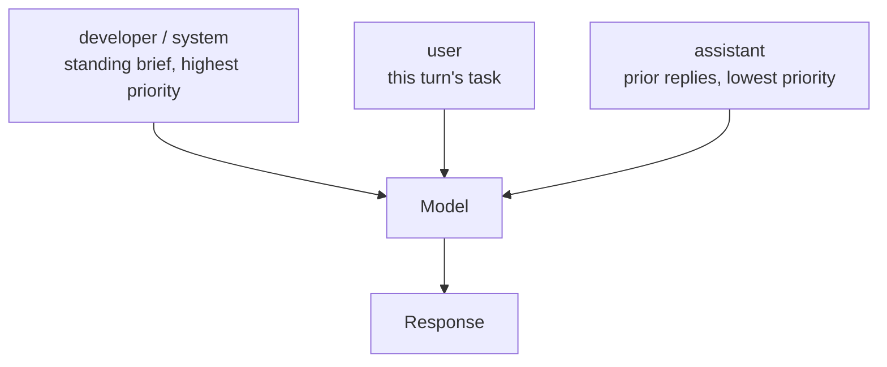

<LevelBadge level="intermediate" />

<Callout type="objectives" items={["Einen System-Prompt auf allen vier Oberflächen korrekt setzen — Anthropics system-Parameter, OpenAIs developer-Rolle, Geminis system_instruction und die fünf Flags von Claude Code", "Wissen, was in das ständige Briefing gehört und was draußen bleiben muss", "Nicht über das Ziel hinausschießen: warum „CRITICAL: you MUST“ bei aktuellen Modellen nach hinten losgeht", "Den System-Prompt dorthin legen, wo der Prompt-Cache ihn wiederverwenden kann, und den volatilen Teil abspalten", "Zwischen Anhängen an und Ersetzen des Standard-Prompts von Claude Code wählen — und verstehen, was beim Ersetzen wegfällt"]} />

Jedes Modell hat eine Schicht, die das gesamte Gespräch rahmt. Sie ist der günstigste Hebel, den du besitzt — einmal gesetzt, gilt für jeden Turn — und sie ist die, die die meisten Leute mit dem falschen Material füllen. [Rollen](/docs/foundations/roles) behandelt, *warum* sie wichtig ist. Diese Lektion ist die Operator-Fassung: exakte Parameternamen, wie stark du drücken solltest und wo das Ganze mit Caching zusammenspielt.

## Eine Idee, vier Oberflächen

Das Konzept lässt sich überall übertragen. Die Verkabelung nicht.

| Oberfläche | So setzt du es | Form |
|---|---|---|
| **Anthropic Messages API** | `system` — ein **Top-Level-Request-Parameter**, kein Eintrag in `messages` | String oder ein Array von Content-Blöcken |
| **OpenAI Responses API** | der Parameter `instructions` oder eine Message mit der Rolle **`developer`** | Gilt für den aktuellen Request; `instructions` wird nicht übernommen, wenn du mit `previous_response_id` verkettest |
| **Google Gemini API** | `system_instruction` am Request (`systemInstruction` in Java, `SystemInstruction` in Go) | Pro Interaktion gesetzt |
| **Claude Code** | fünf CLI-Flags (unten), plus [`CLAUDE.md`](/docs/claude-code/claude-md) und [Output Styles](/docs/claude-code/output-styles) | Ersetzen oder anhängen |
| **Chat-Apps** | [Custom Instructions](/docs/claude-app/custom-instructions) in deinem Account | Über Chats hinweg persistent |

<VerifyNote lastVerified="2026-09-30" source="https://platform.claude.com/docs/en/build-with-claude/prompt-engineering/claude-prompting-best-practices">
Parameternamen geprüft gegen Anthropics Referenz zu Prompting-Best-Practices, [OpenAIs Text-Generation-Guide](https://developers.openai.com/api/docs/guides/text) (die `developer`-Rolle und der Parameter `instructions`) und [Googles Gemini-Text-Generation-Guide](https://ai.google.dev/gemini-api/docs/text-generation) (`system_instruction`). API-Oberflächen der Anbieter verändern sich — prüfe gegen die verlinkten Docs, bevor du ausrollst.
</VerifyNote>

Der häufigste Portierungsfehler ist, Anthropics `system` als Message zu behandeln. Das ist es nicht: es steht neben `messages`, nicht darin. In die andere Richtung ist OpenAIs Hierarchie explizit — **Developer-Anweisungen stehen über User-Anweisungen, und die stehen über den eigenen vorherigen Turns des Assistants.** Ihre eigene Analogie: die Developer-Message ist die Funktionsdefinition, die User-Message sind die Argumente, die du ihr übergibst.

<PromptCard title="Anthropic: system ist ein Top-Level-Parameter">{`curl https://api.anthropic.com/v1/messages \\
  -H "content-type: application/json" \\
  -H "x-api-key: $ANTHROPIC_API_KEY" \\
  -H "anthropic-version: 2023-06-01" \\
  -d '{
    "model": "claude-sonnet-5-5",
    "max_tokens": 1024,
    "system": "You are a precise financial analyst. Show your assumptions. Never invent numbers.",
    "messages": [{"role": "user", "content": "Summarize this filing."}]
  }'`}</PromptCard>

## Was hineingehört

Sortiere jede Zeile deines Prompts danach, **wie oft sie sich ändert**. Was für das ganze Gespräch gilt, wandert nach oben in das ständige Briefing. Was sich pro Turn ändert, bleibt im User-Turn.

<Steps items={[
  {title: "Identität und Geltungsbereich — ja", body: "Ein Satz zur Rolle genügt, um Ton und Fokus zu verschieben. Anthropics Docs sagen ausdrücklich, dass schon ein einzelner Satz einen Unterschied macht; sie warnen aber auch davor, die Rolle zu stark einzuengen, weil aktuelle Modelle kein schweres Persona-Scaffolding brauchen."},
  {title: "Harte Regeln und Verweigerungsgrenzen — ja", body: "Was das Modell niemals tun darf, was es immer einschließen muss, was es bei Unsicherheit tun soll. Gib ihm die ausdrückliche Erlaubnis, „Ich weiß es nicht“ zu sagen — diese eine Zeile reduziert messbar erfundene Antworten."},
  {title: "Output-Kontrakt — ja", body: "Die Form einer gültigen Antwort: Abschnitte, Länge, Sprache, ob eine Einleitung erlaubt ist. „Antworte direkt, ohne Präambel“ gehört hierher, nicht in jeden User-Turn."},
  {title: "Tool-Policy — ja", body: "Wann zu einem Tool gegriffen wird und wann direkt geantwortet wird. Hier stellst du die Eagerness ein (siehe unten)."},
  {title: "Volatile Fakten — nein", body: "Die Daten von heute, die aktuelle Datei, abgerufene Dokumente, Live-Zustand. Das gehört in den User-Turn oder in den Retrieval-Kontext. Begräbst du es im System-Prompt, invalidierst du deinen Cache und bringst dem Modell veraltete Fakten bei."},
  {title: "Langes Referenzmaterial — nein", body: "Große Dokumente gehören an den Anfang des User-Turns, über die Frage. Siehe /docs/prompting/long-context."}
]} />

## Wie stark du drücken solltest

Hier schaden Prompts, die für ältere Modelle geschrieben wurden, aktiv. Anthropics Leitlinie für die Generation Opus 4.5/4.6 und später ist unmissverständlich: diese Modelle **reagieren stärker auf den System-Prompt als ihre Vorgänger**, also lassen Prompts, die gegen ein Modell gehärtet wurden, das Tools früher *zu selten* auslöste, es jetzt *zu oft* auslösen. Die Lösung ist, die Lautstärke herunterzudrehen — `Use this tool when…` statt `CRITICAL: you MUST use this tool when…`.

<Callout type="warning" items={["GROSSBUCHSTABEN, „CRITICAL“, „you MUST“ und Drohframing sind ein Erbe von Modellen, die sanfte Anweisungen ignorierten. Bei aktuellen Modellen führen sie zu Overtriggering und übereifrigen Tool-Aufrufen.", "Zu stark eingeengte Personas („du bist ein Weltklasse-10x-Experte, der niemals Fehler macht“) kosten Tokens und bringen nichts. Frage stattdessen nach der Perspektive, die du tatsächlich willst.", "Widersprüchliche Schichten sind schlimmer als ein dünnes Briefing. Wenn der System-Prompt „sei knapp“ sagt und eine Skill „erkläre immer dein Reasoning“, muss das Modell raten.", "Alle Techniken gleichzeitig zu stapeln — Rolle, XML, Few-Shot, Chain-of-Thought, Output-Schema — ist die häufigste Form von Over-Engineering. Füge eine hinzu, messe, behalte sie nur, wenn sie geholfen hat."]} />

Eagerness ist ein Regler, keine feste Eigenschaft, und der System-Prompt ist der Ort, an dem du ihn einstellst. Verpacke die Policy in ein benanntes Tag, damit du sie später findest und bearbeiten kannst:

<PromptCard title="In Richtung Handeln drücken">{`<default_to_action>
Implement changes rather than only proposing them. If intent is ambiguous, infer the
most useful action and proceed, using tools to find the details you are missing instead
of guessing.
</default_to_action>`}</PromptCard>

<PromptCard title="In Richtung vorher fragen drücken">{`<do_not_act_before_instructions>
Do not modify files or start an implementation unless you are clearly asked to. When
intent is ambiguous, research and recommend instead of acting. Make changes only on an
explicit request.
</do_not_act_before_instructions>`}</PromptCard>

<VerifyNote lastVerified="2026-09-30" source="https://platform.claude.com/docs/en/build-with-claude/prompt-engineering/claude-prompting-best-practices">
Die Leitlinie zum Overtriggering und die zwei Eagerness-Muster folgen Anthropics Tool-Use-Abschnitt für die Generation Opus 4.5/4.6 und später. Modellspezifisches Verhalten ändert sich mit jedem Release — prüfe die modellspezifische Leitlinie am Anfang jener Seite erneut.
</VerifyNote>

## Der System-Prompt ist dein Cache-Präfix

Das ist der Teil, der auf der Rechnung auftaucht. Anthropic baut das cachebare Präfix in einer festen Reihenfolge — **`tools`, dann `system`, dann `messages`** — und Caching umfasst alles bis einschließlich des Blocks, den du markierst. Der System-Prompt sitzt damit an der wertvollsten Cache-Position im gesamten Request: stabil, bei jedem Aufruf wiederverwendet und vor dem Gespräch.

Zwei Konsequenzen:

- **Halte den System-Prompt byte-stabil.** Ein Timestamp, ein Benutzername oder eine Session-ID, die hineininterpoliert wird, verändert das Präfix und verfehlt den Cache bei jedem einzelnen Request.
- **Wenn ein Teil davon variieren muss, stelle den stabilen Teil nach vorne** und brich den Cache danach, sodass der variierende Schwanz das Einzige ist, was neu gelesen wird.

Die minimalen cachebaren Längen unterscheiden sich je Modell — manche aktuellen Modelle cachen ab 512 Tokens, ältere brauchen bis zu 4.096 — und ein Prompt unter der Schwelle wird stillschweigend ohne Cache verarbeitet, ohne Fehler. Prüfe die aktuelle Tabelle, bevor du dich darauf verlässt.

<VerifyNote lastVerified="2026-09-30" source="https://platform.claude.com/docs/en/build-with-claude/prompt-caching">
Die Präfix-Reihenfolge (`tools`, `system`, `messages`) und die modellspezifischen minimalen cachebaren Längen stammen aus Anthropics Prompt-Caching-Docs; die Minima sind modellspezifisch und ändern sich mit jedem Release. Siehe auch [Prompt Caching](/docs/api/prompt-caching) und [Modelle & Preise](/docs/whats-new/models-and-pricing).
</VerifyNote>

Claude Code liefert eine speziell dafür gebaute Variante dieser Trennung mit. Wenn dein Ersatz-Prompt feste Anweisungen mit Kontext pro Lauf mischt, setze eine Zeile, die nur `__SYSTEM_PROMPT_DYNAMIC_BOUNDARY__` enthält, dazwischen: Claude Code trennt an der ersten solchen Zeile und verwirft sie, hält alles darüber gecacht, während sich der Teil darunter ändert (v2.1.275+). Für skriptgesteuerte Multi-User-Läufe verschiebt `--exclude-dynamic-system-prompt-sections` den Kontext pro Benutzer aus dem Prompt heraus in die erste User-Message, sodass mehrere Maschinen ein gemeinsames gecachtes Präfix nutzen.

## Claude Code: anhängen oder ersetzen

Fünf Flags setzen den Prompt. Vier davon setzen Text; das fünfte steuert, ob ein Gespräch den Text behält, mit dem es gestartet ist.

| Flag | Was es tut |
|---|---|
| `--system-prompt` | Ersetzt den gesamten Standard-Prompt durch deinen Text |
| `--system-prompt-file` | Ersetzt ihn durch den Inhalt einer Datei |
| `--append-system-prompt` | Hängt deinen Text an den Standard-Prompt an |
| `--append-system-prompt-file` | Hängt den Inhalt einer Datei an den Standard-Prompt an |
| `--system-prompt-snapshot` | `off` baut den Prompt bei jedem Request neu, statt den beim ersten Request aufgezeichneten wiederzuverwenden |

`--system-prompt` und `--system-prompt-file` schließen sich gegenseitig aus; jedes Append-Flag lässt sich mit jedem Ersetzungs-Flag kombinieren.

Die Entscheidungsregel dreht sich darum, **wofür du die Verantwortung übernehmen willst**:

<Steps items={[
  {title: "Anhängen, wenn Claude ein Coding-Assistent bleiben soll", body: "Anhängen erhält die Standard-Tool-Leitlinien, Sicherheitsanweisungen und Coding-Konventionen, sodass du nur lieferst, was abweicht — Regeln pro Aufruf, Ausgabeformat, Domänenkontext für ein -p-Skript."},
  {title: "Ersetzen, wenn Identität oder Berechtigungsmodell wirklich anders sind", body: "Etwa ein Nicht-Coding-Agent in einer unbeaufsichtigten Pipeline. Ersetzen verwirft den gesamten Standard-Prompt — inklusive Tool-Leitlinien und Sicherheitsanweisungen — sodass alles, was deine Aufgabe weiterhin braucht, jetzt deine Verantwortung ist."},
  {title: "Greife zuerst zum richtigen Hebel", body: "Projektkonventionen, die Claude immer befolgen soll, gehören in CLAUDE.md. Eine Persona, zwischen denen du wechselst und die du teilst, gehört in einen Output Style. Ein Flag gilt für einen Aufruf."}
]} />

<PromptCard title="Eine Regel für einen einzelnen Headless-Lauf anhängen">{`claude -p --append-system-prompt "Cite file:line for every claim." "audit the auth flow"`}</PromptCard>

Eine Falle, die echte Debugging-Zeit kostet: standardmäßig baut Claude Code den System-Prompt **einmal**, beim ersten Request eines Gesprächs, und zeichnet ihn auf. Jeder spätere Request in diesem Gespräch verwendet den aufgezeichneten Prompt wieder — auch nach `--resume` oder `--continue`. Ändere den Flag-Text bei einem späteren Start, und nichts passiert, bis das Gespräch kompaktiert wird oder du ein neues beginnst. Solange du an der Formulierung feilst, übergib `--system-prompt-snapshot off` (v2.1.257+), um ihn bei jedem Request neu zu bauen.

<VerifyNote lastVerified="2026-09-30" source="https://code.claude.com/docs/en/cli-reference">
Die fünf System-Prompt-Flags, die Leitlinie Anhängen-vs-Ersetzen, der Marker `__SYSTEM_PROMPT_DYNAMIC_BOUNDARY__` (v2.1.275+) und das Verhalten der Snapshot-Aufzeichnung (v2.1.257+) stammen aus der Claude Code CLI-Referenz. Versionsabhängiges Verhalten ändert sich häufig — prüfe das [Changelog](https://code.claude.com/docs/en/changelog).
</VerifyNote>

## Ein durchgerechnetes Vorher/Nachher

**Vorher** — alles auf maximaler Lautstärke, volatile Fakten eingebacken, kein Output-Kontrakt:

<PromptCard title="Übersteuert und cache-feindlich">{`You are THE BEST code reviewer in the world. You are a 10x engineer.
CRITICAL: You MUST ALWAYS use the search tool before answering. NEVER skip this.
IT IS EXTREMELY IMPORTANT that you are thorough.
The current date is 2026-09-30 and the user is reviewing PR #4412 on branch fix/auth-race.`}</PromptCard>

Vier separate Probleme: die Superlative bringen nichts, das Schreien wird das Modell seine Tools zu oft aufrufen lassen, es gibt keine Definition einer gültigen Antwort, und die letzte Zeile ändert sich bei jedem Lauf, sodass das Präfix niemals cacht.

**Nachher** — ein Satz zur Rolle, ein echter Output-Kontrakt, ein Notausgang für Unsicherheit, volatile Fakten in den User-Turn verschoben:

<PromptCard title="Ruhig, Kontrakt zuerst, cachebar">{`You are a code reviewer for a TypeScript monorepo.

Rules:
- Search the codebase before claiming a symbol is unused.
- If you cannot verify a claim from the diff or the code, say so instead of guessing.

Output: a Summary section, then Risks, then Suggested changes. No preamble.`}</PromptCard>

Das Datum, die PR-Nummer und der Branch gehen in den User-Turn, wo sie hingehören. Gleiches Verhalten, ein stabiles Cache-Präfix und etwa ein Drittel der Tokens.

## Was du nicht mehr verwenden solltest

Prefilling — den Assistant-Turn selbst zu beginnen, damit das Modell in deinem Format fortfährt — war früher der Standardweg, um JSON zu erzwingen oder eine Präambel zu überspringen. **Bei Claude 4.6 und später gibt ein vorgefüllter letzter Assistant-Turn einen 400er-Fehler zurück.** Die Ersatzlösungen leben alle im System-Prompt oder direkt daneben: eine direkte Anweisung „antworte ohne Präambel“, [Structured Outputs](/docs/api/structured-output) oder ein Tool mit einem Enum-Feld für die Klassifikation. Assistant-Messages *an anderen Stellen* im Gespräch sind nicht betroffen, also funktionieren [Few-Shot-Beispiele](/docs/prompting/few-shot) weiterhin genau wie vorher.

<VerifyNote lastVerified="2026-09-30" source="https://platform.claude.com/docs/en/build-with-claude/prompt-engineering/claude-prompting-best-practices">
Anthropics Prompting-Referenz besagt, dass vorgefüllte Antworten im letzten Assistant-Turn ab den Claude-4.6-Modellen nicht mehr unterstützt werden, dass solche Requests einen 400er-Fehler zurückgeben und dass frühere Modelle Prefills weiterhin akzeptieren. Siehe auch [Prompts über Modelle hinweg portieren](/docs/models/porting-prompts-across-models).
</VerifyNote>

<Flashcards title="System-Prompt-Schnellreferenz" cards={[
  {front: "Anthropic: wohin gehört der System-Prompt?", back: "In den Top-Level-Request-Parameter `system` — neben `messages`, niemals darin. Nimmt einen String oder ein Array von Content-Blöcken."},
  {front: "OpenAI: Rollenname und Parameter?", back: "Die Rolle `developer` (nicht `system`) für Messages oder der Parameter `instructions` auf der Responses API. `instructions` gilt nur für den aktuellen Request."},
  {front: "Gemini: Parametername?", back: "`system_instruction` am Request — `systemInstruction` in Java, `SystemInstruction` in Go."},
  {front: "Anweisungshierarchie", back: "Developer/System steht über User, und das steht über den vorherigen Turns des Assistants. OpenAIs Analogie: Developer-Message = Funktionsdefinition, User-Message = Argumente."},
  {front: "Reihenfolge des Cache-Präfix", back: "`tools`, dann `system`, dann `messages`. Der System-Prompt ist die wertvollste Cache-Position im Request — halte ihn byte-stabil."},
  {front: "Anhängen vs. Ersetzen in Claude Code", back: "Anhängen behält die Standard-Tool-Leitlinien und Sicherheitsanweisungen. Ersetzen verwirft alles davon, sodass alles, was deine Aufgabe braucht, zu deiner Verantwortung wird."},
  {front: "Warum „CRITICAL: you MUST“ nach hinten losgeht", back: "Aktuelle Modelle reagieren stärker auf den System-Prompt als jene, für die dieser Prompt-Stil geschrieben wurde, also führt gehärtete Sprache jetzt zu Overtriggering. Nutze normale Formulierungen."},
  {front: "Prefilling des letzten Assistant-Turns", back: "Gibt bei Claude 4.6 und später einen 400er zurück. Nutze stattdessen eine Anweisung „keine Präambel“, Structured Outputs oder ein Tool mit einem Enum."}
]} />

<Callout type="takeaways" items={["Gleiches Konzept, andere Verkabelung: Anthropics `system`-Parameter, OpenAIs `developer`-Rolle / `instructions`, Geminis `system_instruction`, die fünf Flags von Claude Code.", "Sortiere nach Änderungsrate — dauerhafte Regeln gehören in das ständige Briefing, volatile Fakten in den User-Turn.", "Dreh die Lautstärke herunter. Aktuelle Modelle triggern zu oft bei Prompts, die für Modelle gehärtet wurden, die früher zu selten triggerten.", "Der System-Prompt sitzt im Cache-Präfix (tools → system → messages): halte ihn byte-stabil und spalte den variierenden Schwanz ab.", "In Claude Code erhält Anhängen die Standard-Sicherheits- und Tool-Leitlinien; Ersetzen übergibt dir die gesamte Verantwortung.", "Vorgefüllte letzte Assistant-Turns sind ein 400er bei Claude 4.6+ — nutze einen Output-Kontrakt, Structured Outputs oder Tools."]} />

<Quiz title="Teste dich selbst" questions={[
  {q: "Wo lebt der System-Prompt in der Anthropic Messages API?", options: ["Als erster Eintrag im `messages`-Array mit der Rolle `system`", "Als Top-Level-Request-Parameter `system`, neben `messages`", "Als Message mit der Rolle `developer`", "Im Parameter `instructions`"], answer: 1, explain: "Anthropics `system` ist ein Top-Level-Request-Parameter, keine Message. Ihn als Eintrag in `messages` zu behandeln, ist der häufigste Portierungsfehler."},
  {q: "Dein Prompt sagt „CRITICAL: You MUST ALWAYS call the search tool.“ Was ist bei einem aktuellen Claude-Modell der wahrscheinliche Effekt?", options: ["Nichts — Betonung wird ignoriert", "Das Modell ruft das Tool öfter auf, als du willst, weil es stärker auf den System-Prompt reagiert als ältere Modelle", "Der Request wird abgelehnt", "Das Modell verweigert die Aufgabe"], answer: 1, explain: "Anthropics Leitlinie für die Generation Opus 4.5/4.6 und später lautet, aggressive Sprache zurückzunehmen: diese Modelle reagieren stärker auf den System-Prompt, also triggern Prompts, die gegen Undertriggering geschrieben wurden, jetzt zu oft."},
  {q: "Warum kostet es Geld, den aktuellen Timestamp in deinen System-Prompt zu interpolieren?", options: ["Timestamps verbrauchen zusätzliche Output-Tokens", "Es verändert das cachebare Präfix, sodass jeder Request den Prompt-Cache verfehlt", "Die API lehnt nicht-statische System-Prompts ab", "Es zwingt das Modell in Extended Thinking"], answer: 1, explain: "Das Cache-Präfix wird als tools → system → messages gebaut. Jede Änderung am System-Text invalidiert es, ein Timestamp pro Request bedeutet also, dass du bei jedem Aufruf den vollen Input-Preis zahlst."},
  {q: "Du übergibst in Claude Code `--system-prompt` statt `--append-system-prompt`. Was hast du damit gerade aufgegeben?", options: ["Nichts, die Flags sind gleichwertig", "Die Tool-Leitlinien und Sicherheitsanweisungen des Standard-Prompts, die du jetzt selbst liefern musst", "Die Möglichkeit, CLAUDE.md zu nutzen", "Prompt Caching"], answer: 1, explain: "Ersetzen verwirft den gesamten Standard-Prompt, inklusive Tool-Leitlinien und Sicherheitsanweisungen. Anhängen behält sie und ergänzt nur, was abweicht."}
]} />

## Weiter

- [Prompting speziell für Claude](/docs/prompting/prompting-claude)
- [Prompting für langen Kontext](/docs/prompting/long-context)
- [Prompt Caching](/docs/api/prompt-caching)
