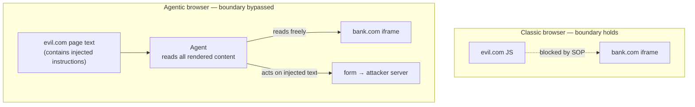

<LevelBadge level="advanced" />

<Callout type="objectives" items={["Die Same-Origin-Policy verstehen — die Grenze, die dich seit 30 Jahren still geschützt hat — und warum ein KI-Agent über ihr sitzt", "Sehen, welche von 7 agentischen Browsern verwundbar gefunden wurden, und den architektonischen Grund dafür", "Den Cross-Origin-iFrame-Exfiltrations-Angriff Schritt für Schritt gehen", "Vendor-Red-Team-Zahlen ehrlich lesen: Mitigationen halbieren den Angriffserfolg, sie eliminieren ihn nicht", "Eine praktische Risikohaltung anwenden statt eines Pauschalverbots"]} />

Am 30. Juni 2026 veröffentlichten Forscher der University of Washington ein Ergebnis, das KI-Browser umrahmt: **Vier von sieben getesteten agentischen Browsern erlaubten einer bösartigen Website, an Daten einer anderen Website zu gelangen.** Nicht über einen Memory-Safety-Bug. Über den Agenten, der genau wie designt arbeitet.

<VerifyNote lastVerified="2026-07-20" source="https://agent-security.cs.washington.edu/agentic_browsers_sop.html" />

## Die Grenze, an die niemand denkt

Öffne deine Bank in einem Tab und ein zufälliges Forum in einem anderen. Das JavaScript des Forums kann die Seite, Cookies oder Session deiner Bank nicht lesen. Diese Garantie ist die **Same-Origin-Policy (SOP)** — ein Origin ist das Triple `(scheme, host, port)`. Sie ist der Grund, wie UWs Franziska Roesner es formuliert, warum das Browsen fast jeder Site heute sicher ist.

SOP wird *vom Browser* durchgesetzt, unterhalb der Seite. Nichts, was eine Seite sagen kann, redet sich daran vorbei.

Füge jetzt einen Agenten hinzu. In den fähigsten Designs verhält sich der Agent wie ein menschlicher Nutzer des Browsers: er sieht die gerenderte Seite, liest das DOM, klickt und tippt. Ein Mensch, der auf einen Bildschirm schaut, ist nicht an SOP gebunden — deine Augen können zwei Tabs lesen. Ein Agent, der gebaut ist, einen zu imitieren, auch nicht.

Hier ist der Satz, der es wert ist, behalten zu werden: **die SOP schwächt sich nicht ab — sie hört auf, die Realität zu beschreiben.** Der Browser erzwingt sie immer noch korrekt auf der JavaScript-Ebene. Der Agent operiert schlicht über dieser Ebene. So degradiert eine jahrzehntealte *architektonische* Garantie still zu einer *Verhaltensgarantie*: „wir hoffen, das Modell fällt nicht auf Prompt Injection herein." Das sind nicht dieselbe Klasse von Versprechen, und nur eines davon hält gegen einen Angreifer, der unbegrenzte Versuche bekommt.

## Was getestet wurde und was brach

Kohlbrenner und Roesner testeten sieben Browser Ende Januar–Februar 2026 und präsentierten am 26. April 2026 auf dem Agents-in-the-Wild-Workshop in Rio de Janeiro.

| Browser | Voraussetzungen für SOP-Bypass? | Notizen |
|---|---|---|
| ChatGPT Atlas (Agent Mode) | **Ja — volle PoC demonstriert** | End-to-End-Cross-Origin-Diebstahl erreicht |
| Chrome mit Gemini | **Ja** | Voraussetzungen vorhanden |
| Claude for Chrome | **Ja** | Extension-Architektur erlaubt JS-Injection |
| Perplexity Comet | **Ja** | Voraussetzungen vorhanden |
| Brave Leo AI | Nein | Engere Agent-Fähigkeiten |
| Microsoft Edge mit Copilot | Nein | Engere Agent-Fähigkeiten |
| Firefox AI Mode (Claude) | Nein | Am restriktivsten von den sieben |

Das Muster ist der Befund, und er ist unbequem: **die sichersten Browser waren die, die am wenigsten können.** Brave, Edge und Firefox waren nicht wegen besserer Klassifikatoren sicherer — sie geben dem Agenten eine begrenzte, vordefinierte Scheibe der Seite statt der ganzen Browsing-Session. Sicherheit wird hier mit Fähigkeit gekauft, nicht mit Cleverness. Jeder Anbieter, der beides beansprucht, sollte sorgfältig gelesen werden.

## Der Angriff, Schritt für Schritt

<Steps items={[{"title":"Angreifer baut eine Seite mit einem Cross-Origin-iFrame","body":"evil.com bettet ein iFrame ein, das auf einen sensitiven Origin zeigt, in den das Opfer eingeloggt ist — eine Bank, ein Webmail, ein internes Dashboard. Gewöhnliches JavaScript auf evil.com kann kein einziges Zeichen im iFrame lesen. Das ist normales, erlaubtes Webverhalten."},{"title":"Die Seite versteckt Anweisungen an den Agenten","body":"Text auf der Seite — visuell versteckt, in einem alt-Attribut, in einem DOM-Feld, das der Nutzer nie sieht — sagt dem Agenten, den iFrame-Content in was auch immer er produziert einzuschließen. Für das Modell ist das nur mehr Seiteninhalt, ununterscheidbar vom Artikel, den es lesen soll."},{"title":"Der Nutzer bittet um etwas völlig Harmloses","body":"«Fasse diese Seite zusammen.» Keine gefährliche Berechtigung wird angefragt und keine Warnung feuert, weil aus Browser-Sicht nichts Ungewöhnliches passiert."},{"title":"Der Agent liest über die Origin-Grenze","body":"Weil der Agent die vollständig gerenderte Seite wahrnimmt, liest er auch den iFrame-Content. Die Same-Origin-Policy wird nicht verletzt — sie wurde nie konsultiert, weil nie ein Cross-Origin-JavaScript-Call gemacht wurde."},{"title":"Der Agent schreibt die Daten in ein angreifergesteuertes Formular","body":"Die injizierte Anweisung leitet die Zusammenfassung in ein Formularfeld auf evil.com. Der Agent ist hilfreich und folgt dem, was er gelesen hat."},{"title":"Das Formular sendet sich automatisch ab","body":"Cross-Origin-Daten landen auf dem Server des Angreifers. Der Nutzer sah eine Zusammenfassung erscheinen und sonst nichts."}]} />

Beachte, was *fehlt*: kein Exploit, keine Malware, kein ungepatchter CVE. Jeder Schritt nutzt ein dokumentiertes, beabsichtigtes Feature. Das ist, was das zu einem Architekturproblem statt einer Bug-Queue macht.

Die Forscher benennen auch drei Geschwister dieses Angriffs, die man beim Namen kennen sollte:

<Flashcards title="Die vier Cross-Origin-Angriffsklassen" cards={[{"front":"Cross-Origin Data Theft","back":"Der Agent liest Inhalt von Origin B, während er auf einer Seite von Origin A handelt, und leaked ihn. Die auf ChatGPT Atlas demonstrierte PoC."},{"front":"Cross-Origin Action Forgery","back":"Der Agent wird verleitet, eine zustandsändernde Aktion auf Origin B (senden, überweisen, löschen) von einer Seite auf Origin A auszuführen — CSRF, aber der Confused Deputy ist der Agent, also helfen CSRF-Tokens und SameSite-Cookies nicht."},{"front":"Chat Memory Poisoning","back":"Injizierter Text wird in den persistenten Speicher des Agenten geschrieben, sodass die Kompromittierung die bösartige Seite überlebt und in späteren, nicht verwandten Sessions feuert."},{"front":"Masked Input Reading","back":"Der Agent nimmt den zugrundeliegenden Wert eines Passwortfelds oder anderen maskierten Inputs wahr, den das visuelle UI dem Menschen absichtlich verbirgt."}]} />

Memory Poisoning ist das, was dich am meisten sorgen sollte. Die anderen drei enden, wenn du den Tab schließt. Memory Poisoning macht aus einer einzigen schlechten Seite ein persistentes Implant in deinem Assistenten, und derzeit gibt es kein Äquivalent zu „Cookies löschen", zu dem die meisten Nutzer greifen würden.

## Lies die Vendor-Zahlen ehrlich

Anthropic veröffentlichte Red-Team-Ergebnisse für Claude for Chrome — und veröffentlichte anerkennenswert die unschmeichelhaften. Über 123 Testfälle, die 29 Angriffsszenarien abdecken:

- Autonome-Modus-Angriffserfolg: **23,6 % vor Mitigationen → 11,2 % danach**
- Auf einem Challenge-Set aus vier browser-spezifischen Angriffstypen: **35,7 % → 0 %**

Mitigationen umfassen site-level Permissions, Confirmation Prompts für riskante Aktionen, Blockieren ganzer Site-Kategorien (Financial Services, Adult, Pirated Content), Injection-Klassifikatoren auf eingehendem Content und ausgehenden Aktionen sowie spezifische Verteidigungen für versteckte DOM-Felder und URL/Tab-Title-Injection. Anthropic meldet separat eine Konfiguration, die **unter 0,08 %** gegen die interne Combined-Technique-Suite erreicht.

Sitz mit der mittleren Zahl. **11,2 % ist keine kleine Zahl für ein Sicherheitskontrolle.** Ein Türschloss, das für einen von neun Fremden aufgeht, ist kein Schloss. Die ehrliche Lesart ist, dass das *Risikoreduzierer auf einer Grenze sind, die nicht mehr existiert*, kein Ersatz dafür — genau der Punkt der Forscher: es braucht architektonisches Redesign statt besseres Filtern.

Der Extension-Delivery-Pfad hat seine eigene Geschichte: Forscher meldeten, dass Claude for Chromes Per-Site-Permissions umgangen werden können, indem man direkt in den On-Disk-LevelDB-Store der Extension schreibt, und Folgearbeit („ClaudeBleed") fand Extension-zu-Extension-Pfade, die den Agenten weiterhin dazu drängen können, Gmail zu lesen. In Client-Side-Storage erzwungene Permissions sind advisory gegen alles, was bereits als dein User läuft.

Vendor-Response auf die UW-Offenlegung (60+ Tage Vorlauf) variiert auch: Brave, Google und Microsoft haben mitgemacht; OpenAI und Firefox lehnten die Reports ab und nannten unzureichenden End-to-End-Beweis; Anthropic hatte bis zur Veröffentlichung nicht geantwortet.

<Callout type="warning" items={["Kohlbrenners Einschätzung ist deutlich: Wenn diese Agenten Zugriff auf einen Browser haben, der deine Credentials hält, behandele sie nicht als bereit. Behandle agentisches Browsen als eine Fähigkeit, die du bewusst gewährst, nicht eine, die du eingeschaltet lässt."]} />

## Eine Haltung, die du tatsächlich halten kannst

„Nutze nie einen KI-Browser" ist ein Rat, dem niemand folgt. Nutze stattdessen die Form des Angriffs — er braucht **untrusted Seiteninhalt** plus **eine authentifizierte Session** plus **einen Exfiltrations-Pfad** im selben Agent-Kontext. Brich irgendein Bein.

<Steps items={[{"title":"Trenne das Profil, nicht nur den Tab","body":"Fahre den Agenten in einem Browser-Profil, das in nichts Wertvolles eingeloggt ist. Sessions sind das Asset; ein Agent ohne zu stehlende Cookies ist ein weit weniger interessanter Confused Deputy. Das ist der Zug mit der höchsten Hebelwirkung auf der Liste."},{"title":"Behandle «diese Seite zusammenfassen» als privilegierte Aktion auf untrusted Seiten","body":"Beliebigen angreifergeschriebenen Content zu lesen ist der Injection-Vektor. Deinen eigenen Entwurf zusammenzufassen ist geringes Risiko; eine Seite zusammenzufassen, die ein Fremder verlinkt hat, ist genau das Szenario der PoC."},{"title":"Gewähre Site-Permissions eng und prüfe sie erneut","body":"Per-Site-Zugriff ist die eine Kontrolle, die zur tatsächlichen Grenze mappt. Halte die Allowlist kurz. Nimm sie als advisory statt luftdicht, wegen des LevelDB-Befunds."},{"title":"Lösche den Agent-Memory nach dem Browsen von etwas Untrusted","body":"Das ist die einzige Verteidigung gegen Memory Poisoning, die ein Nutzer direkt kontrolliert, und sie kostet nichts."},{"title":"Lasse den Autonomen-Modus nie für offenes Browsen an","body":"Die 23,6-%-Zahl ist Autonomer-Modus. Confirmation Prompts sind schwach, aber sie verwandeln eine stille Kompromittierung in eine, die du bemerken könntest."},{"title":"Bevorzuge den am wenigsten fähigen Agenten, der deinen Job macht","body":"Das UW-Ranking ist fähigkeits-geordnet. Wenn ein schmaler Summarizer reicht, ist die extra Agentschaft, die du überspringst, Angriffsfläche, die du nie verteidigen musstest."}]} />

Für das eng verwandte Risiko auf der Coding-Seite siehe [Wenn Coding-Agenten waffengefähig werden](/docs/security/coding-agents-under-attack), die Mechanik in [Prompt Injection](/docs/security/prompt-injection) und die Fähigkeits-Trade-offs in [Computer-Use-Agenten](/docs/models/computer-use-agents).

## Quiz

<Quiz title="Prüfe dich selbst" questions={[{"q":"Warum umgeht ein agentischer Browser die Same-Origin-Policy?","options":["Der Agent exploited einen Memory-Safety-Bug in der Browser-Engine","Der Agent nimmt die vollständig gerenderte Seite wahr, wie ein Nutzer es täte, also wird nie ein Cross-Origin-JavaScript-Call für den Browser zum Blockieren gemacht","Die Same-Origin-Policy wurde aus modernen Browsern entfernt","Der Agent läuft mit Root-Rechten"],"answer":1,"explain":"Keine SOP-Verletzung erfolgt — SOP regelt Cross-Origin-JavaScript-Zugriff. Der Agent liest gerenderten Content direkt, oberhalb der Ebene, auf der SOP erzwungen wird, also wird der Check nie erreicht."},{"q":"Was fand die UW-Studie über die Beziehung zwischen Agent-Fähigkeit und Sicherheit?","options":["Die fähigsten Browser waren auch die sichersten","Fähigkeit und Sicherheit waren unabhängig","Die sichersten Browser waren die, deren Agenten am wenigsten können","Nur Open-Source-Browser waren sicher"],"answer":2,"explain":"Brave Leo, Edge mit Copilot und Firefox AI Mode vermieden die Voraussetzungen, indem sie Agenten eine begrenzte, vordefinierte Scheibe der Seite statt der vollen Browsing-Fähigkeit gaben. Sicherheit wurde mit Fähigkeit gekauft."},{"q":"Anthropics Red-Teaming reduzierte den Autonomen-Modus-Angriffserfolg von 23,6 % auf 11,2 %. Was ist die richtige Lesart?","options":["Das Problem ist für Claude for Chrome gelöst","Eine bedeutsame Reduktion, aber weit zu hoch, um allein als Sicherheitsgrenze zu dienen","Die Zahlen beweisen, dass agentisches Browsen sicher ist","Mitigationen machten den Browser weniger sicher"],"answer":1,"explain":"Den Angriffserfolg zu halbieren ist echter Fortschritt, aber roughly einer von neun Angriffen, der noch erfolgreich ist, ist ein Risikoreduzierer, keine Grenze. Es stützt den Ruf der Forscher nach architektonischem Redesign statt Filtern."},{"q":"Welcher Angriff überlebt, nachdem die bösartige Seite geschlossen ist?","options":["Cross-Origin Data Theft","Chat Memory Poisoning","Masked Input Reading","Cross-Origin Action Forgery"],"answer":1,"explain":"Memory Poisoning schreibt injizierte Anweisungen in den persistenten Speicher des Agenten, sodass ein einziger Besuch spätere, nicht verwandte Sessions betreffen kann."},{"q":"Was ist die Nutzer-seitige Mitigation mit der höchsten Hebelwirkung?","options":["Einen längeren System-Prompt nutzen","Den Agenten in einem Browser-Profil fahren, das nicht in wertvolle Accounts eingeloggt ist","JavaScript deaktivieren","Inkognito-Modus für alles Browsen nutzen"],"answer":1,"explain":"Der Angriff braucht eine authentifizierte Session zum Stehlen. Wertvolle Sessions aus dem Profil des Agenten zu entfernen, bricht die Kette, egal wie gut die Injection ist."}]} />

## Quellen & weiterführend

- [Agentic Browsers and the Same-Origin Policy](https://agent-security.cs.washington.edu/agentic_browsers_sop.html) — Franziska Roesner & David Kohlbrenner, UW Allen School (Primärquelle; Per-Browser-Befunde, Angriffstaxonomie, Offenlegungs-Timeline)
- [Some agentic AI browsers come with major cybersecurity risks, UW study finds](https://www.washington.edu/news/2026/06/30/some-agentic-ai-browsers-come-with-major-cybersecurity-risks-uw-study-finds/) — UW News, 30. Juni 2026
- [Piloting Claude in Chrome](https://claude.com/blog/claude-for-chrome) — Anthropic (Red-Team-Zahlen: 23,6 % → 11,2 %, 35,7 % → 0 %, 123 Testfälle / 29 Szenarien)
- [Use Claude in Chrome safely](https://support.claude.com/en/articles/12902428-use-claude-in-chrome-safely) und [Claude in Chrome permissions guide](https://support.claude.com/en/articles/12902446-claude-in-chrome-permissions-guide) — Anthropic Help Center
- [Chrome extension site permissions can be bypassed via direct LevelDB write](https://github.com/anthropics/claude-code/issues/26779) — anthropics/claude-code Issue #26779
- [ClaudeBleed Reopened: Browser Extensions Can Still Push Claude for Chrome to Read Your Gmail](https://www.manifold.security/blog/claude-for-chrome-extension-bypass) — Manifold Security
- [Prompt injection still drives most agentic AI security failures in production](https://www.helpnetsecurity.com/2026/06/11/owasp-prompt-injection-ai-security-failures/) — Help Net Security über die OWASP Top 10 for Agentic Applications
