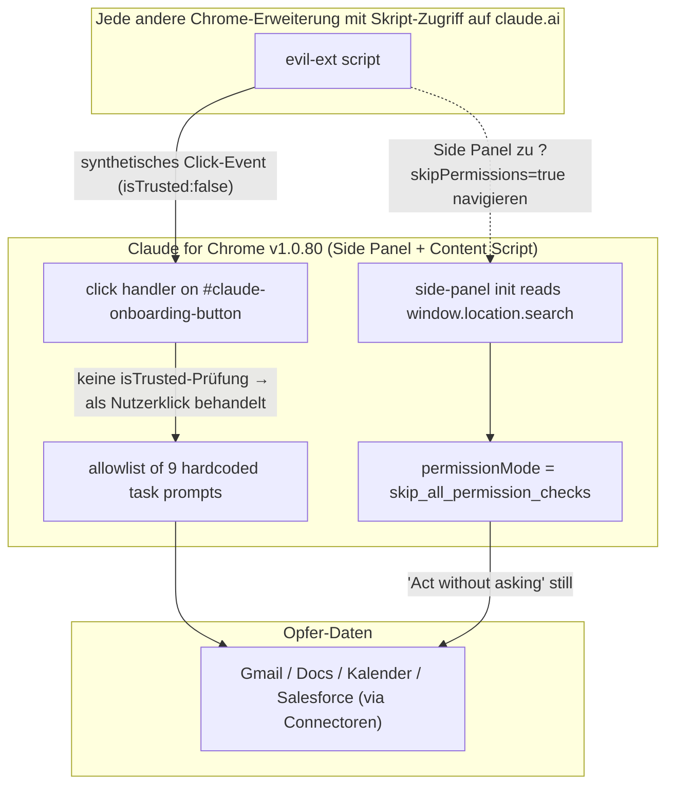

<LevelBadge level="advanced" />

<Callout type="objectives" items={["Die beiden Bypässe in Claude for Chrome verstehen — eine fehlende event.isTrusted-Prüfung und ein URL-Parameter, der das Side Panel selbst eskaliert", "Sehen, warum Anthropic das Ticket vor dem 9. Juni \"Resolved\" markierte und dann acht weitere Releases (v1.0.73 → v1.0.80) unverändert auslieferte — das ist die eigentliche Geschichte", "Das allgemeine Verteidigungsmuster lernen: clientseitige Allowlists sind keine Sicherheitsgrenze, wenn eine andere Erweiterung deinen Origin teilt", "Drei konkrete Maßnahmen, die du in unter zwei Minuten jetzt sofort anwenden kannst"]} />

Am **7. Juli 2026** veröffentlichte Anthropic **Claude for Chrome v1.0.80**. Manifold Security testete es am selben Tag und stellte fest, dass ihre beiden Bug-Reports aus dem Mai Byte für Byte gegenüber v1.0.72 immer noch reproduzierbar waren. Jede andere Erweiterung in deinem Browser mit Skript-Zugriff auf `claude.ai` — eine Berechtigung, die Tausende Chrome-Erweiterungen anfordern — kann Claude still anweisen, Gmail zu öffnen, eine Nachricht zu lesen und darauf zu handeln. Kein Bestätigungsdialog. Keine Nutzeraktion.

<VerifyNote lastVerified="2026-07-22" source="https://www.manifold.security/blog/claude-for-chrome-extension-bypass" />

Die Geschichte ist nicht "eine Erweiterung hatte einen Bug". Chrome-Erweiterungen schippern ständig Bugs. Die Geschichte ist, dass ein ausgeliefertes agentisches Browser-Produkt, nach neun Monaten Prüfung und einem öffentlichen "ClaudeBleed"-Vorfall im Rücken, sein Berechtigungsmodell immer noch an einem Ort durchsetzt, den ein Angreifer vollständig kontrolliert — dem Client — und das Tracking-Issue **Resolved** markiert, ohne dass sich der Code ändert.

## Die beiden Fehler in einem Bild

Zwei unabhängige Bugs. **Jeder alleine** reicht, um jede hartkodierte Aufgabe auszulösen. Zusammen liefert einer den Trigger (gefälschter Klick), der andere die stille Ausführung (Auto-Eskalation).

## Fehler #1 — die fehlende `isTrusted`-Prüfung

Jedes Event, das ein Browser dispatched, hat einen `isTrusted`-Boolean. Echte Nutzeraktionen — ein physischer Klick, ein Tastendruck, ein Touch — kommen mit `isTrusted: true` an. Alles, was JavaScript per `dispatchEvent(new MouseEvent(...))` synthetisiert, kommt mit `isTrusted: false` an. Es ist das einzig zuverlässige *User-vs-Code*-Signal des Browsers, und es existiert genau, damit sicherheitskritische Handler sie unterscheiden können.

Das Content Script von Claude for Chrome lauscht auf Klicks auf das Element mit der ID `#claude-onboarding-button` und leitet, wenn der Klick zu einer von neun allowlisteten Task-IDs passt (`usecase-gmail`, `usecase-gdocs`, `usecase-calendar`, `usecase-salesforce`, plus DoorDash, Zillow und drei Onboarding-Challenges), den passenden Prompt an Claudes Side Panel zur Ausführung weiter.

Der Handler prüft `event.isTrusted` nie. In den Worten der Forscher: aus Sicht der Erweiterung ist ein gefälschter Klick von einem echten nicht unterscheidbar.

Das ist relevant wegen eines leicht übersehenen Architekturpunkts: **jede andere installierte Chrome-Erweiterung mit `content_scripts`, die auf `https://claude.ai/*` matchen, teilt aus Chromes Sicht Claudes Origin und kann ein Skript in die Seite injizieren.** Diese Berechtigung ist nicht exotisch — Passwort-Manager, Notiz-Clipper, Übersetzungstools, Ad-Blocker und unzählige "Produktivitäts"-Erweiterungen fordern sie routinemäßig an. Sobald ein Skript in dieser Seite läuft, ist das Dispatchen eines synthetischen Klicks auf `#claude-onboarding-button` etwa sechs Zeilen Code. Manifolds Report nennt genau diese Größe, um einen Punkt zu machen: der Fix ist ein `if`-Statement, der Exploit ist ein Dispatch-Aufruf.

Die Neun-Prompt-Allowlist war Anthropics *frühere* Milderung für ClaudeBleed — die Idee war "selbst wenn ein Klick gefälscht ist, kann nur eine feste Liste sicherer Tasks laufen". Dieses Modell zerbricht in dem Moment, wo "Gmail-Integration ausführen" auf der Liste steht. Gmail lesen und darauf handeln ist keine sichere Aufgabe.

<Callout type="tip" items={["Die Lektion ist nicht \"isTrusted hinzufügen\" — sondern die dahinterliegende: eine Allowlist \"sicherer\" Agent-Tasks ist nur so sicher wie die unsicherste Aufgabe darauf. Feingranulare per-Integration-Nutzerzustimmung gehört an jeden dieser Trigger, nicht nur an die untrusted freeform ones."]} />

## Fehler #2 — `?skipPermissions=true` in der Panel-URL

Chrome-Extension-Side-Panels haben ihre eigene URL, und deren Query-String ist im Panel per `window.location.search` lesbar. Claudes Side Panel liest einen `skipPermissions`-Parameter. Ist er `"true"`, initialisiert das Panel mit `permissionMode = "skip_all_permission_checks"` — derselbe interne Modus wie wenn ein Nutzer manuell *Act without asking* aktiviert.

Das ist clientseitige, selbstbediente Privilege-Escalation. Das Panel fragt sich selbst um Erlaubnis und antwortet mit ja, basierend auf einem Wert, den das Panel selbst in seiner URL bekam — den alles, was `chrome.sidePanel.open({...})` aufrufen oder das Panel navigieren kann, liefern kann.

Manifold bewertet dieses Szenario mit **CVSS 9.6 Critical**, weil es in diesem Modus keinen Bestätigungsdialog gibt: die neun allowlisteten Prompts führen still aus. Der synthetische-Klick-Fehler allein (mit dem normalen Bestätigungsdialog noch sichtbar) wird mit 7.7 High bewertet, weil ein Nutzer den Dialog prinzipiell noch bemerken könnte, bevor er Enter drückt.

Die richtige Form des Fixes ist nicht "URL-Parameter sanitizen". Es ist, dass Übergänge zwischen Berechtigungsmodi eine explizite, `isTrusted`-Nutzeraktion auf einem echten UI-Element erfordern sollten, nachdem das Panel geladen ist — nie einen Wert, den das Panel aus seiner eigenen URL, seinem eigenen Storage oder einem Message-Channel liest, auf dem eine andere Erweiterung senden kann. Das ist dieselbe architektonische Einschränkung, die Browser bereits auf Fullscreen-, Kamera- und Clipboard-Berechtigungen anwenden, und aus demselben Grund.

## Warum "Resolved" ≠ gepatcht — das Prozessversagen

Die Timeline ist, was das zu einer Governance-Geschichte macht, nicht nur zu einer Code-Geschichte:

<Steps items={[
{ "title": "21. Mai 2026 — Manifold meldet beide Issues", "body": "Zwei separate Bug-Reports bei Anthropic gegen v1.0.72 eingereicht." },
{ "title": "22. Mai — bestätigt und geschlossen", "body": "Anthropic bestätigte beide. Report #1 wurde als Duplikat eines existierenden Trackers geschlossen; Report #2 als \"informational\" abgetan mit der Argumentation, der URL-Parameter sei \"nur von der Erweiterung selbst genutzt\" — genau die Annahme, die der Bug verletzt." },
{ "title": "Vor dem 9. Juni — interner Tracker als \"Resolved\" markiert", "body": "Das umfassende \"ClaudeBleed\"-Issue wurde in Anthropics internem Tracking auf Resolved geflippt — offenbar auf der Stärke der Neun-Prompt-Allowlist-Milderung, nicht auf einem Fix für die beiden zugrundeliegenden Bugs." },
{ "title": "7. Juli — v1.0.80 wird ausgeliefert, Code Byte-identisch", "body": "Acht Releases (v1.0.73 → v1.0.80) gingen zwischen Report und jetzt raus. Forscher re-verifizierten: der Click-Handler und die Panel-Init sind unverändert gegenüber der Version, die sie ursprünglich testeten." },
{ "title": "14. Juli — öffentliche Offenlegung", "body": "Kein CVE. Kein Anthropic-Advisory. Öffentlicher Blogpost + Hacker News + Branchenberichte. Stand dieser Seite: immer noch ungepatcht." }
]} />

Zwei Failure-Modes, die es sich zu verinnerlichen lohnt, weil sie außerhalb dieser Geschichte üblich sind:

1. **Mitigation Collapse.** Eine Milderung, die die Form eines Exploits ändert ("du musst jetzt einen von neun Buttons klicken"), wird als Fix behandelt. Wenn der Trigger für diese Buttons selbst fälschbar ist, fügt die Milderung keine Sicherheit hinzu — sie ändert nur das Angriffsrezept.
2. **"Resolved by design"-Drift.** Bug #2 wurde geschlossen unter der Theorie, dass nur die Erweiterung selbst `skipPermissions` setzt. Das ist eine Beschreibung der *Absicht*, nicht der *tatsächlichen Durchsetzung des Browsers*. Alles mit `sidePanel`-Zugriff oder einer Umleitung durch die Panel-URL kann es auch setzen.

Beide Muster stehen aus einem Grund auf Security-Review-Anti-Pattern-Listen. Achte auf sie in deinem eigenen Code.

## Was läuft, und welche Daten es erreichen kann

Die neun hartkodierten Task-IDs aus Manifolds Report:

| Kategorie | Task-IDs | Was der Prompt Claude ungefähr sagt |
| --- | --- | --- |
| Google | `usecase-gmail`, `usecase-gdocs`, `usecase-calendar` | Gmail lesen (inkl. eines "unsubscribe from promo emails"-Flows, der die Inbox iteriert), Google-Docs-Kommentare lesen, Kalender-Verfügbarkeit lesen und Meetings erstellen |
| CRM / Commerce | `usecase-salesforce`, `usecase-doordash`, `usecase-zillow` | Salesforce-Leads lesen und in Opportunities konvertieren; DoorDash-/Zillow-Flows durchgehen |
| Onboarding | drei Onboarding-Challenges | Geführte-Tour-Prompts |

Die Reichweite hängt davon ab, welche Connectoren das Opfer aktiviert hat. Ist Gmail verbunden, liest `usecase-gmail` Gmail. Ist Salesforce verbunden, berührt `usecase-salesforce` das CRM. Das Panel tut, was ein Nutzer bat — nur nicht *dieser* Nutzer und nicht jetzt.

<Callout type="warning" items={["\"Act without asking\" ist kein spezieller Entwicklermodus. Es ist eine Checkbox in den Claude-for-Chrome-Einstellungen. Ist sie an, löst Fehler #1 allein echte Gmail-/Docs-/Kalender-/Salesforce-Reads aus. Ist sie aus, kann Fehler #2 (?skipPermissions=true) sie still für die Lebensdauer des Panels wieder aktivieren."]} />

## Drei Dinge, die du jetzt tun solltest (zwei Minuten)

<Steps items={[
{ "title": "Schalte Act without asking aus", "body": "Claude-for-Chrome-Einstellungen → \"Act without asking\" deaktivieren. Bestätigungs-Prompts sind nervig, aber sie sind das einzige nutzersichtbare Signal, das Fehler #1 allein dir lässt." },
{ "title": "Prüfe, welche Erweiterungen claude.ai anfassen können", "body": "chrome://extensions → Details auf jeder → Site access. Alles, was auf All sites gesetzt ist oder claude.ai listet, kann ein Content Script in die Claude-Seite injizieren. Downgrade oder entferne die, denen du nicht aktiv vertraust. Passwort-Manager und Notiz-Clipper sind die zwei Kategorien, die doppelt geprüft werden sollten." },
{ "title": "Trenne Connectoren, die du nicht nutzt", "body": "In Claude → Einstellungen → Connectoren, trenne Gmail-/Docs-/Kalender-/Salesforce-Integrationen, auf die du nicht angewiesen bist. Die neun hartkodierten Tasks sind nur gegen tatsächlich verbundene Connectoren gefährlich." }
]} />

Wenn du agentische Erweiterungen für ein ganzes Team betreibst, füge ein viertes hinzu: **Laufzeit-Beobachtung dessen, was Agenten tatsächlich ausführen** — nicht nur welche Berechtigungen sie halten. Beide Fehler bestehen einen Berechtigungs-Audit und scheitern an einer Verhaltensbeobachtung, weil sie den Agenten dazu bringen, Dinge zu *tun*, um die der Nutzer nie bat. Diese Lücke ist, wo Manifolds eigene Empfehlung landet, und sie generalisiert weit über dieses eine Produkt hinaus.

<PromptCard title="Chrome-Extension-Audit-Prompt für Claude">
{`Here is my current chrome://extensions export (or a list I'll paste): {LIST}.

For each extension:
1. Is its "site access" set to "All sites" or does it match claude.ai? Flag those.
2. From its Chrome Web Store description, what content_scripts permissions does it plausibly require? Is claude.ai a required domain for its stated function?
3. Rate each on a "trust to run a script inside my Claude tab" scale from 1 (dedicated password manager from a known vendor) to 5 (random productivity extension with <10k installs).
4. Give me a two-column recommendation: KEEP AS-IS / RESTRICT TO SPECIFIC SITES / REMOVE — with a one-line reason per row.

Do not soften. If something looks sketchy, say sketchy.`}
</PromptCard>

## Das größere Muster — clientseitige Allowlists, agentischer Scope

Zoom aus Claude for Chrome heraus. Dieselbe Form zeigt sich in einer wachsenden Zahl agentischer Produkte:

- Ein vertrauenswürdiges UI (Erweiterung, Desktop-App, IDE-Plugin) exponiert einen Agenten, der echte Aktionen auf Nutzerdaten ausführen kann.
- Um das Risiko einzuschränken, fügt der Anbieter eine **Allowlist** von Tasks/Prompts/Tools hinzu, die der Agent ohne Bestätigung ausführen darf.
- Der **Trigger** für Einträge auf der Allowlist bleibt *innerhalb des Clients* — ein Klick, eine URL, eine gespeicherte Einstellung, eine Nachricht auf einem Channel, den andere Komponenten teilen.
- Jeglicher anderer Code in derselben Trust-Zone (derselbe Extension-Host, derselbe Origin, derselbe IPC-Bus) kann den Trigger fälschen.

Die Lektion, die jede Runde lehrt, ist dieselbe. Vgl. auch `docs/security/agentic-browsers-same-origin.mdx` (Agent-Reads-über-SOP), `docs/security/coding-agents-under-attack.mdx` (Auto-Approve als neue Angriffsfläche) und `docs/security/prompt-injection.mdx` (untrusted Content wird zu untrusted Instruktionen). Jede davon ist ein Fall von *die Grenze wird gezogen, wo der Angreifer bereits steht*.

Zwei Invarianten, die es wert sind, auf einen Post-it zu schreiben:

1. **Eine Berechtigungsprüfung, die der Angreifer aufrufen kann, ist keine Berechtigungsprüfung.** Wenn irgendetwas von "jedes Skript auf dieser Seite", "jeder URL-Parameter", "jeder Storage-Wert" oder "jede postMessage von unbekanntem Origin" deinen Agenten von *ask* zu *act* flippen kann, gehört dieser Flip hinter eine `isTrusted`-Aktion auf einem echten DOM-Element, das du gerendert hast.
2. **Allowlists sind kein Ersatz für Zustimmung.** Wenn irgendeine einzelne Aufgabe auf der Liste den Nutzer bei ungeforderter Ausführung überraschen würde (`read my Gmail` qualifiziert), reduziert die Allowlist Angreiferwahl, nicht Angreiferwirkung.

## Schnellcheck

<Quiz questions={[
  {
    "q": "Warum reicht in Claude for Chrome v1.0.80 eine gewöhnliche Chrome-Erweiterung mit Skript-Zugriff auf claude.ai aus, um die neun allowlisteten Tasks auszulösen?",
    "options": [
      "Weil die Erweiterung die Claude-API direkt mit dem Session-Cookie des Nutzers aufrufen kann.",
      "Weil der Click-Handler auf #claude-onboarding-button event.isTrusted nicht verifiziert, sodass ein synthetischer Klick aus einem beliebigen Skript in der Seite als Nutzereingabe behandelt wird.",
      "Weil Chrome den Private Key der Erweiterung an Same-Origin-Skripte exponiert.",
      "Weil Claude den Code der Angreifer-Erweiterung in seinen eigenen Prozess side-loadet."
    ],
    "answer": 1,
    "explain": "Der Bug ist die fehlende isTrusted-Prüfung. Ein synthetisches MouseEvent, dispatched von einem beliebigen in der Claude-Seite laufenden Skript, passiert den Handler, als hätte der Nutzer geklickt. Keine API-Key-Exposition oder Prozessgrenz-Überschreitung notwendig — nur Skript-Zugriff auf die Seite."
  },
  {
    "q": "Was ist der tatsächliche Mechanismus des ?skipPermissions=true-Bypasses?",
    "options": [
      "Der URL-Parameter wird an Anthropics Server geschickt, der ein Admin-Token zurückgibt.",
      "Das Side Panel liest window.location.search selbst und setzt, wenn skipPermissions gleich \"true\" ist, seinen permissionMode lokal auf skip_all_permission_checks — kein Server beteiligt.",
      "Es deaktiviert Chromes Same-Origin-Policy für das Panel.",
      "Es gewährt dem Panel Chromes Debugger-Berechtigung."
    ],
    "answer": 1,
    "explain": "Es ist clientseitige, selbstbediente Privilege-Escalation. Das Panel fragt sich selbst um erhöhte Berechtigung und liest die Antwort aus seiner eigenen URL — die alles kontrolliert, was das Panel öffnen oder navigieren kann."
  },
  {
    "q": "Anthropic markierte den zugrundeliegenden Tracker vor dem 9. Juni 2026 als \"Resolved\", doch v1.0.80 (7. Juli) ist byte-identisch mit v1.0.72. Welchen Failure-Mode illustriert das am besten?",
    "options": [
      "Eine Supply-Chain-Kompromittierung der Build-Pipeline der Erweiterung.",
      "Mitigation Collapse: die Neun-Prompt-Allowlist wurde als Fix behandelt, aber der Trigger für diese Prompts ist selbst fälschbar, sodass die Allowlist die Form des Exploits ändert, ohne seine Wirkung zu reduzieren.",
      "Ein Bug in Chromes Manifest-v3-Berechtigungsmodell.",
      "Anthropic widerruft Manifolds Offenlegungsvereinbarung."
    ],
    "answer": 1,
    "explain": "Die Allowlist war Anthropics frühere ClaudeBleed-Milderung. Sie hilft nur, wenn der Trigger zur Auswahl eines Eintrags vertrauenswürdig ist. Die fehlende isTrusted-Prüfung macht den Trigger fälschbar, sodass die Milderung Angreiferwahl reduziert, nicht Angreiferwirkung — der Tracker wurde aber geschlossen, als wäre sie ein Fix."
  },
  {
    "q": "Welche davon ist die stärkste einzelne Milderung, die ein Claude-for-Chrome-Nutzer jetzt sofort anwenden kann?",
    "options": [
      "JavaScript auf claude.ai deaktivieren.",
      "Google Chrome deinstallieren.",
      "\"Act without asking\" deaktivieren und prüfen, welche anderen Erweiterungen Skript-Zugriff auf claude.ai haben.",
      "Den Anthropic-API-Key rotieren."
    ],
    "answer": 2,
    "explain": "\"Act without asking\" zu deaktivieren stellt den Bestätigungs-Prompt wieder her (sodass Fehler #1 allein nutzersichtbar wird), und das Prunen von Erweiterungen mit claude.ai-Skript-Zugriff entfernt die Partei, die den synthetischen Klick überhaupt dispatchen kann. Einen API-Key zu rotieren tut hier nichts — der Angriff reitet auf der UI-Session des Nutzers, nicht auf einem API-Credential."
  }
]}/>

<Callout type="takeaways" items={["v1.0.80 von Claude for Chrome (7. Jul. 2026) ist immer noch anfällig für die beiden Manifold-Bugs, die erstmals gegen v1.0.72 im Mai gemeldet wurden — synthetischer-Klick-Bypass der Neun-Prompt-Allowlist und Selbst-Eskalation via ?skipPermissions=true in der Panel-URL.", "Beide Bugs sind clientseitige Berechtigungsprüfungen. \"Resolved\" im Tracker bezog sich auf eine Milderung (die Allowlist), nicht auf die zugrundeliegenden Durchsetzungslücken.", "Jetzt: Act without asking ausschalten, prüfen, welche anderen Chrome-Erweiterungen Skripte in claude.ai injizieren können, und Connectoren trennen, die du nicht nutzt.", "Allgemeine Regel: eine Berechtigungsprüfung, die jedes Skript auf der Seite aufrufen kann, ist keine Berechtigungsprüfung. Modus-Übergänge müssen auf einer isTrusted-Aktion auf einem echten UI-Element reiten, nicht auf einem URL-/Storage-/Message-Wert."]} />

## Quellen & weiterführende Lektüre

- Manifold Security — [ClaudeBleed Reopened: browser extensions can still push Claude for Chrome to read your Gmail](https://www.manifold.security/blog/claude-for-chrome-extension-bypass) (primäres technisches Write-up; Timeline, CVSS-Bewertungen, die Byte-identisch-Code-Beobachtung)
- The Hacker News — [Researchers Say Claude for Chrome Flaw Lets Rogue Extensions Trigger Gmail Reads](https://thehackernews.com/2026/07/claude-for-chrome-flaw-lets-other.html) (Branchenberichterstattung; Anthropics öffentliche Antwort)
- BleepingComputer — [Claude Chrome extension flaw lets malicious extensions trigger AI actions](https://www.bleepingcomputer.com/news/security/claude-chrome-extension-flaw-lets-malicious-extensions-trigger-ai-actions/) (Angriffsfläche, Berechtigungsanforderungen)
- TechRadar — [The bypass is still six lines of JavaScript](https://www.techradar.com/pro/the-bypass-is-still-six-lines-of-javascript-security-experts-warn-that-claude-for-chrome-browser-extension-could-be-hijacked-despite-it-alerting-anthropic-several-times-that-something-was-wrong) (Kontext, warum der Fix ein einzelnes Conditional ist)
- Verwandt auf AILmanac: [Agentic Browsers Break the Same-Origin Policy](/docs/security/agentic-browsers-same-origin), [When Coding Agents Get Weaponized](/docs/security/coding-agents-under-attack), [Prompt Injection: the safety model you can't ignore](/docs/security/prompt-injection)
- OWASP — [Top 10 for LLM Applications](https://genai.owasp.org/llm-top-10/) (LLM01 Prompt Injection & LLM06 Excessive Agency sind die beiden Kategorien, auf die diese Bugs mappen)
