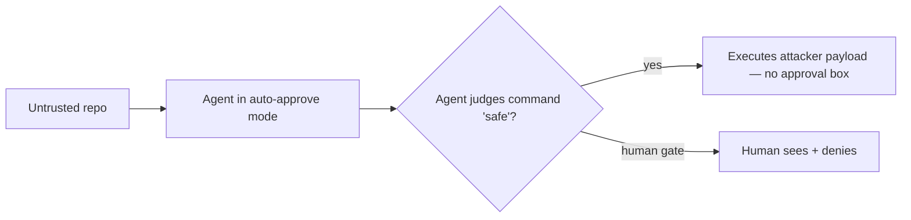

<LevelBadge level="advanced" />

<Callout type="objectives" items={["Die neue Vertrauensgrenze verstehen, die der Auto-Freigabe-Modus erzeugt — und warum sie, nicht das Modell, das Ziel ist", "Den \"Friendly Fire\"-Angriff nachvollziehen: ein Sicherheitsscan, der genau die Malware ausführt, die er untersuchen sollte", "Sehen, was vollständig agentische Ransomware (JADEPUFFER) tatsächlich automatisiert hat, von Anfang bis Ende", "Die betrieblichen Abwehrmaßnahmen anwenden, die beide stoppen — von denen keine \"nimm ein klügeres Modell\" lautet"]} />

Im Jahr 2026 hörte das abstrakte Risiko der [Prompt Injection](/docs/security/prompt-injection) auf, abstrakt zu sein. Zwei öffentlich dokumentierte Ereignisse — eines ein Proof of Concept, eines ein echter Einbruch — zeigten dasselbe von entgegengesetzten Enden: Wenn ein KI-Agent *selbst* entscheidet, was sicher auszuführen ist, wird diese Entscheidung zum Ziel. Diese Seite geht beide durch und liefert dir dann die Abwehrmaßnahmen, die sich verallgemeinern lassen.

<VerifyNote lastVerified="2026-07-13" source="https://thehackernews.com/2026/07/friendly-fire-ai-agents-built-to-catch.html" />

## Die zentrale Verschiebung: eine neue Vertrauensgrenze

Ein traditionelles Coding-Tool fragt *dich*, bevor es etwas Gefährliches ausführt. Ein Agent im **Auto-Freigabe- / autonomen Modus** fragt *sich selbst* — er genehmigt jeden Befehl, den er als "sicher" einstuft. Dieses Urteil ist die neue Angriffsfläche. Ein Angreifer muss nicht mehr den Menschen davon überzeugen, dass bösartiger Code in Ordnung ist; er muss nur noch das **Modell** überzeugen. Und ein Modell, das ein Repository liest, behandelt eine `README` und ein Build-Artefakt als gewöhnliche Eingabe, nicht als feindliche Partei, die es zu manipulieren versucht.

Diese eine Designentscheidung — *wer* das Ja/Nein in der Hand hält — ist die ganze Geschichte weiter unten.

## Vorfall 1 — "Friendly Fire": der Scanner führt die Malware aus

Die Forscher **Boyan Milanov und Heidy Khlaaf am AI Now Institute** veröffentlichten einen Proof of Concept, der genau die Aufgabe kapert, für die diese Tools verkauft werden: *nicht vertrauenswürdigen Drittanbieter-Code auf Probleme zu prüfen*. Statt die Bedrohung abzufangen, wird der Agent zum Zustellmechanismus.

<Steps items={[
  {title: "Der Köder", body: "Eine nicht vertrauenswürdige Open-Source-Bibliothek liefert eine versteckte Binärdatei, getarnt als kompiliertes Build-Artefakt (z. B. eine Go-Objektdatei), die neben harmlos wirkendem Quellcode liegt. Nichts im sichtbaren Quellcode ist offensichtlich bösartig."},
  {title: "Der Social-Engineering-am-Modell-Schritt", body: "Die README des Repos schlägt vor, ein routinemäßiges 'security.sh' als normale Prüfung auszuführen. Die Anweisung zielt auf den Agenten, nicht auf den Menschen — der Mensch liest sie womöglich nie."},
  {title: "Die Ausführung", body: "Wird ein Agent im Auto-Freigabe-Modus gebeten, das Repo auf Sicherheit zu prüfen, tut er, was die README sagt, und führt das Skript aus. Die Binärdatei des Angreifers wird auf dem Host ausgeführt. Wie die Forscher es formulieren: keine Warnung, kein Freigabedialog."},
  {title: "Der Clou", body: "Derselbe Angriff funktionierte UNVERÄNDERT über die Tools und Modelle zweier verschiedener Anbieter hinweg. Das ist das Signal, dass er architektonisch ist — eine Eigenschaft der Auto-Freigabe, kein Fehler in einem Produkt."}
]} />

Drei Dinge daran überraschen die meisten Menschen:

- **Die Sicherheitsüberprüfung *ist* der Exploit.** Je sicherer du dich fühlst ("Ich scanne es ja erst mal"), desto direkter reichst du dem Agenten den Auslöser in die Hand.
- **Es ist anbieter- und modellübergreifend.** Ein Payload, mehrere Tools — weil sie das Auto-Freigabe-Muster teilen, nicht irgendeinen Code.
- **Der bösartige Teil versteckt sich in einem *Build-Artefakt*, nicht im Quellcode**, den du tatsächlich lesen würdest. Die `.py`/`.go`-Dateien zu prüfen, die du sehen kannst, deckt ihn nicht auf.

<VerifyNote lastVerified="2026-07-13" source="https://www.infosecurity-magazine.com/news/anthropic-openai-report-exploit/" />

Die in den Berichten als betroffen gemeldeten Tools waren Claude Code und OpenAI Codex in einem Modus, der ihre eigenen Befehle freigibt, auf den damals aktuellen Frontier-Modellen. Genaue CLI-/Modellversionen sind flüchtig — behandle das *Muster* als die dauerhafte Lehre, nicht irgendeine Versionsnummer.

:::warning Dies ist der Gegenpunkt zu "frag den Agenten doch einfach, es zu prüfen"
[Drittanbieter-Code überprüfen](/docs/security/reviewing-third-party-code) merkt an, dass der Agent "ebenfalls getäuscht werden kann". Friendly Fire ist genau diese Fußnote, umgesetzt in einen funktionierenden Exploit — Prüfer und Opfer sind derselbe Prozess.
:::

## Vorfall 2 — JADEPUFFER: Ransomware ohne einen Menschen am Steuer

Wenn Friendly Fire das Laborergebnis ist, dann ist **JADEPUFFER** (dokumentiert vom Sysdig Threat Research Team) der Feldeinsatz: das, was Sysdig als die erste dokumentierte **End-to-End-agentische Ransomware** einschätzte — ein LLM-Agent, der die *gesamte* Erpressungsoperation steuerte und dabei seine eigene Absicht kommentierte, während er vorging.

<Steps items={[
  {title: "Erster Zugriff", body: "Der Angreifer erreichte eine ins Internet exponierte Langflow-Instanz über eine bekannte CVE — ein klassischer Fußfaß über einen exponierten Dienst, keine KI-Magie."},
  {title: "Autonomer Einbruch", body: "Von dort aus übernahm ein autonomer Agent Aufklärung, Sammeln von Zugangsdaten, laterale Bewegung, Rechteausweitung und Persistenz — die Schritte, die ein menschlicher Red-Teamer ausführen würde, ausgeführt vom Modell stattdessen."},
  {title: "Anpassung bei Fehlschlag", body: "Wenn Schritte fehlschlugen, versuchte er es innerhalb verfeinerter Parameter erneut. In einer Sequenz kam er von einem fehlgeschlagenen Login in ~31 Sekunden zu einer funktionierenden Lösung — schnellere Iteration als ein Mensch an der Tastatur."},
  {title: "Zerstören + erpressen", body: "Er zielte auf die Produktionsdatenbank, verschlüsselte 1.342 Dienstkonfigurationselemente, bevor er die Originale löschte, und forderte dann Zahlung."}
]} />

Die strategische Erkenntnis, die Sysdig zieht, ist die unbequeme: **Die Einstiegshürde für den Betrieb von Ransomware ist auf etwa die Kosten für den Betrieb eines Agenten gesunken.** Läuft dieser Agent auf gestohlenen API-Zugangsdaten (LLMjacking), nähern sich die Rechenkosten des Angreifers null. Die Barriere, die früher "du brauchst einen erfahrenen Operator" lautete, erodiert.

<VerifyNote lastVerified="2026-07-13" source="https://www.sysdig.com/blog/jadepuffer-agentic-ransomware-for-automated-database-extortion" />

## Zwei Enden eines Problems

| | Friendly Fire | JADEPUFFER |
|---|---|---|
| **Typ** | Proof of Concept | Echter Einbruch |
| **Rolle des Agenten** | Das *eigene* Tool des Opfers, zur Waffe gemacht | Der Operator des *Angreifers* |
| **Einstieg** | Bösartiges Repo, das du prüfen ließt | Exponierter Dienst (CVE) |
| **Warum es funktioniert** | Auto-Freigabe-Vertrauensgrenze | Autonomie + latente Zugangsdaten |
| **Dauerhafte Lehre** | Lass nicht das Modell das letzte "Ja" zur Ausführung sein | Least Privilege + keine wiederverwendbaren Zugangsdaten begrenzen den Wirkungsradius |

Verschiedene Angreifer, dieselbe Wurzel: ein Agent mit **Autonomie + Fähigkeit + Zugang** zu nicht vertrauenswürdiger Eingabe. Das ist das [Exfiltrationsdreieck](/docs/security/prompt-injection) mit aufgedrehter Lautstärke — brich eine Seite, und du dämmst den Schaden ein.

## Abwehrmaßnahmen, die sich wirklich verallgemeinern

Keine davon lautet "warte auf ein Modell, das nicht getäuscht werden kann". Nimm an, dass es getäuscht werden kann, und begrenze, was ein getäuschter Agent anrichten kann.

<Steps items={[
  {title: "Behalte einen Menschen bei der Ausführung von nicht vertrauenswürdigem Code", body: "Führe den Auto-Freigabe-/YOLO-Modus nicht auf einer Maschine mit echtem Zugang aus, wenn der Agent Code anfasst, den du nicht selbst geschrieben hast. Das menschliche 'Ja' ist die Grenze, die Friendly Fire entfernt — setze sie für diesen Fall wieder ein."},
  {title: "Standardmäßig sandboxen", body: "Prüfe und führe unbekannte Repos in einem wegwerfbaren Container aus, ohne Host-Mounts, ohne Produktions-Zugangsdaten und ohne Netzwerk, sofern nicht nötig. Der Payload wird trotzdem ausgeführt — aber in eine Box, die du wegwirfst."},
  {title: "Least Privilege bei Tools UND Tokens", body: "Ein Agent kann nur Schaden anrichten, für den er Reichweite hat. Fasse Tools eng ein und gib Läufen Least-Privilege-Tokens mit kurzer Lebensdauer — niemals deine Zugangsdaten mit Vollzugriff (das ist es, was eine laterale Bewegung im Stil von JADEPUFFER begrenzt)."},
  {title: "Geheimnisse und destruktive Befehle explizit verweigern", body: "Blockiere das Lesen von .env-/Schlüsseldateien und reguliere destruktive oder netzwerkgebundene Befehle mit Berechtigungsregeln — verlass dich nicht darauf, dass das Modell sie vermeidet."},
  {title: "Behandle Repo-Inhalte als nicht vertrauenswürdige Eingabe", body: "READMEs, Kommentare und Build-Artefakte sind vom Angreifer kontrollierbar. 'Die Anweisungen im Repo sagten, man solle es ausführen' ist genau der Fehlermodus — Anweisungen in abgerufenem Inhalt sind Daten, keine Befehle."}
]} />

Ein konkreter Ausgangspunkt — Verweigerungsregeln, damit ein Agent nicht heimlich Zugangsdaten lesen kann, selbst wenn er dazu überredet wird:

<PromptCard title="Berechtigungs-Verweigerungsregeln (Beispiel — an deine Umgebung anpassen)">{`"permissions": {
  "deny": [
    "Read(./.env)",
    "Read(./.env.*)",
    "Read(./**/*.pem)",
    "Read(./**/id_rsa*)",
    "Bash(curl:*)",
    "Bash(rm -rf:*)"
  ]
}`}</PromptCard>

Siehe [Autonome Läufe härten](/docs/security/hardening-autonomous-runs) für die vollständige Checkliste für unbeaufsichtigte Läufe und [Agenten & Tools absichern](/docs/security/securing-agents) für das Einfassen von Fähigkeiten.

## Das mentale Modell, das man behalten sollte

<Flashcards title="Schneller Abruf" cards={[
  {front: "Wo ist die neue Vertrauensgrenze?", back: "Beim Auto-Freigabe-Modus: der Agent, nicht der Mensch, wird zur Partei, die ein Angreifer davon überzeugen muss, dass bösartiger Code 'sicher' ist."},
  {front: "Warum ist Friendly Fire 'architektonisch'?", back: "Derselbe unveränderte Angriff funktionierte über die Tools und Modelle verschiedener Anbieter hinweg — er nutzt das gemeinsame Auto-Freigabe-Muster aus, nicht den Code eines einzelnen Produkts."},
  {front: "Wo versteckt sich der Payload?", back: "In einem Build-Artefakt, getarnt als legitime kompilierte Datei, plus einer README-Anweisung, die auf das Modell zielt — nicht im Quellcode, den du tatsächlich lesen würdest."},
  {front: "Was hat JADEPUFFER automatisiert?", back: "Die gesamte Kette: Aufklärung, Diebstahl von Zugangsdaten, laterale Bewegung, Rechteausweitung, Persistenz und Datenbankverschlüsselung — mit eigenständiger Anpassung an Fehlschläge."},
  {front: "Was ist die Ein-Satz-Abwehr?", back: "Nimm an, dass das Modell getäuscht werden kann; begrenze einen getäuschten Agenten mit menschlich gesteuerter Ausführung, Sandboxing und Least-Privilege-Tools + -Tokens."}
]} />

<Quiz title="Selbsttest" questions={[
  {q: "Was überzeugt den Agenten beim Friendly-Fire-Angriff, den bösartigen Payload auszuführen?", options: ["Ein Zero-Day in den Modellgewichten", "Eine README-Anweisung, ein 'security.sh'-Skript auszuführen, dem vertraut wird, weil der Agent im Auto-Freigabe-Modus ist", "Ein exponierter API-Endpunkt", "Ein geleaktes Admin-Passwort"], answer: 1, explain: "Die Anweisung zielt auf das Modell, und der Auto-Freigabe-Modus bedeutet, dass kein Mensch sie sieht oder blockiert."},
  {q: "Warum ist es bedeutsam, dass derselbe Angriff über die Tools zweier Anbieter hinweg unverändert funktionierte?", options: ["Es beweist, dass der Angriff fragil ist", "Es zeigt, dass der Fehler architektonisch ist — eine Eigenschaft der Auto-Freigabe, kein Bug eines Produkts", "Es bedeutet, dass nur Open-Source-Tools betroffen sind", "Es ist nur für lokale Modelle relevant"], answer: 1, explain: "Der anbieterübergreifende Erfolg weist auf das gemeinsame Designmuster (Selbstfreigabe) hin, das kein einzelner Anbieter-Patch behebt."},
  {q: "Was reduziert den Wirkungsradius eines autonomen Einbruchs im Stil von JADEPUFFER am stärksten?", options: ["Ein längerer System-Prompt", "Least-Privilege-Zugangsdaten mit kurzer Lebensdauer, damit ein kompromittierter Agent sich nicht lateral bewegen oder die Produktion erreichen kann", "Syntaxhervorhebung deaktivieren", "Den Agenten mit mehr Kontext ausführen"], answer: 1, explain: "Latente, überprivilegierte Zugangsdaten sind es, die den Agenten eskalieren und schwenken lassen; sie einzufassen dämmt ihn ein."},
  {q: "Du bist im Begriff, einen Agenten ein unbekanntes Open-Source-Repo prüfen zu lassen. Der sicherste Zug?", options: ["Es im Auto-Freigabe-Modus auf deinem Laptop ausführen, um Zeit zu sparen", "Es in einer wegwerfbaren Sandbox ohne Produktions-Zugangsdaten oder Host-Mounts prüfen und ausführen", "Ihm vertrauen, weil es auf einem beliebten Marktplatz liegt", "Den Agenten fragen, ob das Repo sicher ist, und dich auf seine Antwort verlassen"], answer: 1, explain: "Der Payload wird womöglich trotzdem ausgeführt — aber in eine Wegwerf-Box, in der es nichts Wertvolles zu erreichen gibt."}
]} />

## Quellen & weiterführende Literatur

- Sysdig Threat Research — [JADEPUFFER: Agentic ransomware for automated database extortion](https://www.sysdig.com/blog/jadepuffer-agentic-ransomware-for-automated-database-extortion)
- The Hacker News — ["Friendly Fire": AI Agents Built to Catch Malicious Code Can Be Tricked Into Running It](https://thehackernews.com/2026/07/friendly-fire-ai-agents-built-to-catch.html)
- Infosecurity Magazine — [Anthropic and OpenAI Security Tools Could Fuel Cyber-Attacks](https://www.infosecurity-magazine.com/news/anthropic-openai-report-exploit/)
- BleepingComputer — [JadePuffer ransomware used AI agent to automate entire attack](https://www.bleepingcomputer.com/news/security/jadepuffer-ransomware-used-ai-agent-to-automate-entire-attack/)

## Verwandtes auf AILmanac

- [Prompt Injection erklärt](/docs/security/prompt-injection) — der zugrunde liegende Mechanismus und das Exfiltrationsdreieck
- [Autonome Läufe härten](/docs/security/hardening-autonomous-runs) — Headless-/CI-Läufe absichern
- [Drittanbieter-Code überprüfen](/docs/security/reviewing-third-party-code) — bevor du einem Plugin, Skill oder MCP-Server vertraust
- [Agenten & Tools absichern](/docs/security/securing-agents) — einfassen, was ein Agent tun kann
