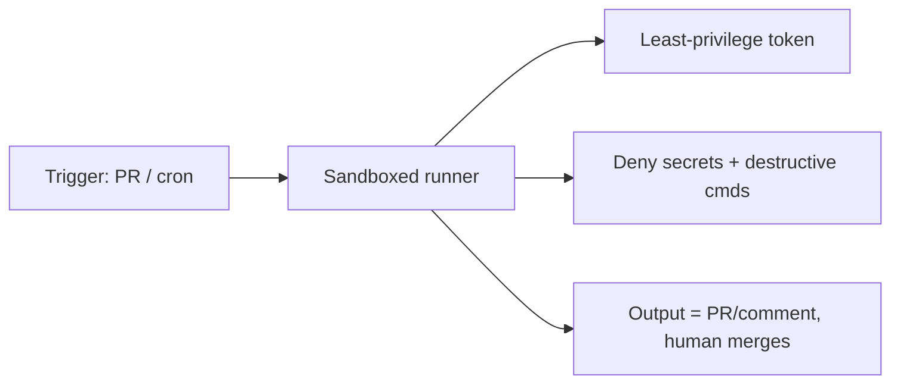

<LevelBadge level="advanced" />

Claude [headless](/docs/claude-code/headless-and-agent-sdk) oder nach einem [Zeitplan](/docs/claude-code/background-tasks) laufen zu lassen — in CI, einem Cronjob, einem Pre-Commit-Hook — entfernt den Menschen, der normalerweise eine schlechte Aktion abfangen würde. Genau dieser Komfort ist der Grund, warum solche Läufe die strengsten Schutzvorkehrungen brauchen.

## Die Risiken, die unbeaufsichtigten Läufen eigen sind

- **Niemand sagt „nein"** zu einem riskanten Werkzeugaufruf im entscheidenden Moment.
- **Umgebungs-Credentials.** CI verfügt oft über mächtige Tokens (Deploy, Package-Registry, Cloud). Ein Agent dort erbt sie.
- **Nicht vertrauenswürdige Eingaben.** Ein durch einen PR oder ein Issue ausgelöster Lauf kann von Angreifern verfasste Inhalte verarbeiten ([Injection](/docs/security/prompt-injection)).

## Eine Härtungs-Checkliste

- **Geheimnisse explizit verweigern.** Blockiere das Lesen von `.env`, Schlüsseldateien und Credential-Pfaden über [Deny-Regeln für Berechtigungen](/docs/claude-code/permissions). Verlass dich nicht darauf, dass das Modell sie meidet.
- **Niemals den Bypass-/Yolo-Modus auf einer Maschine mit echtem Zugriff verwenden.** Behalte „alle Abfragen überspringen" für Wegwerf-Sandboxes vor.
- **Den Token begrenzen.** Gib dem Lauf einen Token mit geringstmöglichen Rechten (wo möglich nur Lesezugriff), nicht deine Credentials mit Vollzugriff.
- **Sandbox & flüchtig.** Lass es in einem Container laufen, der danach zerstört wird; kein dauerhafter Zugriff auf die Produktion.
- **Befehle und Domains per Allowlist freigeben.** Erlaube deine Test-/Lint-/Build-Befehle; verweigere vernetzte oder destruktive.
- **Deckle es.** Maximale Iterationen, Zeitbudget, Token-/Kostenbudget — damit eine Schleife oder ein manipulierter Agent nicht außer Kontrolle gerät.
- **Mach Ausgaben überprüfbar, nicht automatisch angewendet.** Bevorzuge „einen PR öffnen / einen Kommentar posten" gegenüber „auf main pushen". Ein Mensch führt den Merge durch.

## Beispiel: ein sicherer CI-Reviewer

Ein PR-Review-Bot sollte: den Code schreibgeschützt auschecken, **keinen** Deploy-/Geheimnis-Zugriff haben, in einem Container laufen und seine Erkenntnisse **kommentieren** — niemals geschützte Branches verändern. Siehe die [Schritt-für-Schritt-Anleitung zum PR-Review](/docs/walkthroughs/pr-review-action).

## Weiter

- [Berechtigungen & Berechtigungsmodi](/docs/claude-code/permissions)
- [Agenten & Werkzeuge absichern](/docs/security/securing-agents)
- [Headless-Modus & das Agent SDK](/docs/claude-code/headless-and-agent-sdk)
